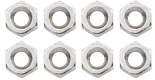

产品介绍
========

首先感谢选择keyes产品,

我们将继续为你提供好的产品和服务!

**关于keyes**

Keyes是KEYES
Corporation旗下最畅销的品牌，我们的产品包括Arduino开发板、扩展板、传感器模块；树莓派、micro：bit扩展板和智能小车；以及为各阶段客户设计的完整入门套件。这些入门套件旨在为任何水平的客户学习Arduino、树莓派、micro：bit相关知识。

我们所有产品，均符合国际质量标准，在世界各地不同市场中，得到了极大的赞赏。

欢迎从我们的官方网站查看更多内容：\ http://www.keyes-robot.com

**售后服务**

1. 如果发现某些东西丢失或损坏，或者学习套件时遇到一些困难，keyes会提供免费和快速的支持。如果您有任何疑问，请联系我们我们客服或工作人员。

2. 欢迎提出建议和反馈，我们会根据您的反馈不断更新套件和教程，以使其更好。谢谢！

**产品安全**

1.本产品内含细小的零件（螺丝，铜柱等），请放在儿童接触不到的地方，防止划伤或误食。8岁及以下儿童使用，请在大人监督下使用。

2.本产品包含导电部件(控制板和电子模块），请按照本教程的要求进行操作，不当的操作可能导致过热并且损害零件，请勿触摸并立即断开电路电源（请按照正确的方式安装电池）。

**版权**

keyes商标和徽标是KEYES DIY ROBOT
co.,LTD的版权,任何人和公司在没有授权的情况下，不得复制，售卖，转卖，keyes品牌的产品。如果您有兴趣在当地售卖我们的产品，请联系我们专业的批发销售人员。

KEYES 4WD Micro:bit麦克纳姆轮智能小车学习

**1. 套装的介绍：**

|Img|

Micro:bit是一款由英国BBC 设计的ARM架构的单片机。它仅有信用卡一半大小，板载蓝牙，加速度计，电子罗盘，三个按钮，5 x 5 LED点阵，麦克风等，主要用于青少年的编程教育。

为了方便学习Micro: bit，我们团队特别研发了这个KEYES 4WD
Micro:bit麦克纳姆轮智能小车，它由具有扩展功能的车体，集成电机驱动等传感器的PCB底板，4个减速直流马达，麦克纳姆车轮，传感器以及亚克力等组成，这样就可以轻松地组装出一台酷炫的麦克纳姆轮4WD智能车。

我们针对这个车做了两个教程，一个是使用图形化编程的Make Code教程，另一个是使用Mu软件来编写的MicroPython教程。在体验安装和编程的过程中，增强动手能力，学习编程技巧。Python
语言算是一个热门的编程语言，在机器学习中，Python
语言的易用性和便捷性给机器学习带来了很大的便利。MicroPython
是针对Python编程语言的重新实现，针对微控制器和嵌入式系统，而图形化编程能让我们更好的理解代码。

此外，如果你对本教程和工具包有任何困难或问题，你可以随时向我们咨询。

**2. 产品说明：**

本产品集成了七彩灯，RGB2812灯珠、舵机、超声波功能、循迹功能、红外控制功能和蓝牙控制功能。其中七彩灯、RGB2812灯、电机驱动、三路巡线传感器，红外接收器（为了接收准确，我们在头尾各放置了一个）全部集成到了底板，为我们的安装提供了很大的便利；4个WS2812
RGB灯，可以显示不同颜色；2个七彩灯，可以使用它作为小车的2个方向灯。电机速度是可以通过PWM值调节的。
本产品使用2节18650锂电池串联供电，安装和拆装电池时，注意电池的正负极，务必不要把电池的正负极接反。

**3. 产品的特点：**

（1）易于安装

（2）外观精美

（3）扩展性强：配置了Micro:bit
扩展板，留有很多引脚，可以扩展其他的传感器和模块。

（4）多种控制：红外控制，手机APP蓝牙控制（苹果和安卓手机/平板都可）等。

（5）学习基础编程：MakeCode图形化编程和MicroPython语言编程，可以接触底层代码。

**4. 规格参数：**

底板连接器端口输入：DC 6V---9V

驱动板系统运行电压：5V

标准运行功耗：约为2.2W

最大功率：最大输出功率为12W

电机转速：200RPM

工作温度范围：0-50℃

尺寸：120×120×120mm

环保属性：ROHS

备注：micro:bit主板的系统运行电压为3.3V，驱动板集成3.3V/5V通信电平转换电路。

**5. 套装的清单：**

当你收到这个KEYES 4WD
Micro:bit麦克纳姆轮智能小车学习套装的时候，请跟着下面的清单一起清点一下，确保产品完整，如果发现有配件遗漏，请第一时间联系我们的销售人员。（KE3062带Micro:bit主板、KE3063不带Micro:bit主板）

==== ================================ ==== =========
序号 规格                             数量 图片
==== ================================ ==== =========
1    Micro:bit主板+官方彩盒包装       1    |image1|
2    Micro：bit 扩展板                1    |image2|
3    超声波固定亚克力折弯板           1    |image3|
4    乐高孔位亚克力舵机固定平台       1    |image4|
5    电机垫板                         4    |image5|
6    电机+线材                        4    |image6|
7    固定块                           4    |image7|
8    180度舵机                        1    |image8|
9    麦克纳姆轮全向轮方向A            2    |image9|
10   麦克纳姆轮全向轮方向B            2    |image10|
11   麦克纳姆轮小车下板（带电机驱动） 1    |image11|
12   六角铜柱双通                     4    |image12|
13   4265c 十字轴套                   4    |image13|
14   43093 半摩擦销                   4    |image14|
15   乐高摩擦销用亚克力垫片           6    |image15|
16   M3*6MM 平头 十字螺钉             8    |image16|
17   HC-SR04超声波传感器              1    |image17|
18   M3*8MM 平头 十字螺钉             8    |image18|
19   M3 螺母                          8    |image19|
20   M3*30MM 圆头 十字螺钉            8    |image20|
21   M2螺母                           2    |image21|
22   M2*8MM 圆头 十字螺钉             2    |image22|
23   M1.4 螺母                        4    |image23|
24   M1.4*10MM 圆头 十字 螺钉         4    |image24|
25   M2.3*16MM 圆头十字 自攻 螺钉     4    |image25|
26   M1.2*5MM 圆头 十字 自攻螺钉      4    |image26|
27   遥控器                           1    |image27|
28   扎带                             5    |image28|
29   连接线2P两端反向红黑             1    |image29|
30   USB线                            1    |image30|
31   连接线5P两端反向白黄红黑         1    |image31|
32   连接线4P两端反向白黄红黑         1    |image32|
33   4P转杜邦母单绿蓝红黑线           1    |image33|
34   连接线3P两端反向黄红黑           2    |image34|
35   十字螺丝刀                       1    |image35|
36   3D打印TT联轴器白色               4    |image36|
==== ================================ ==== =========

.. |image2| image:: ./media/img-20230426104303.png
.. |image3| image:: ./media/img-20230426103511.png
.. |image4| image:: ./media/img-20230426103545.png
.. |image5| image:: ./media/img-20230426103834.png
.. |image6| image:: ./media/img-20230426103944.png

.. |image8| image:: ./media/img-20230329095649.png
.. |image9| image:: ./media/img-20230426104729.png
.. |image10| image:: ./media/img-20230426104828.png
.. |image11| image:: ./media/img-20230426104912.png

.. |image16| image:: ./media/img-20230426105306.png
.. |image17| image:: ./media/img-20230426105612.png

.. |image25| image:: ./media/img-20230426110910.png

.. |image29| image:: ./media/img-20230426111314.png
.. |image30| image:: ./media/img-20230323170244.png
.. |image31| image:: ./media/img-20230426111706.png
.. |image32| image:: ./media/img-20230426111758.png

.. |image35| image:: ./media/img-20230426112020.png
.. |image36| image:: ./media/img-20230426112332.png
