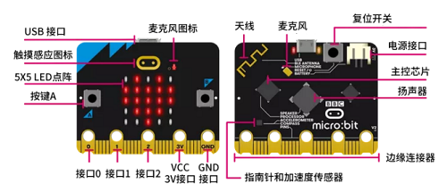
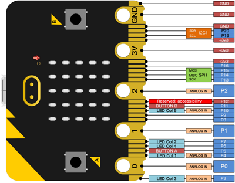

.. _microbit-v22-主板:

Micro：bit V2.2 主板
====================

**1. Micro:bit V2.2主板的介绍**

Micro:bit主板是英国广播公司设计的，旨在帮助7年级（11-12岁）及以上的孩子更好地学习编程。Micro:bit主板拥有丰富的板资源，包括一个5*5
LED点阵、2个可编程按钮、指南针、Micro
USB端口、蓝牙模块等。它只有信用卡一半大小(4cm×5cm)，但功能非常强大。它可以用于编写电子游戏，声光互动，机器人控制，科学实验，可穿戴装置开发等，可以实现任何酷炫的小发明，无论是机器人还是乐器，没有做不到只有想不到。

新款的Micro:bit
V2.2主板上有一个可触摸感应的Logo和MEMS麦克风。背面还添加了一个蜂鸣器，这样就可以在没有外部设备的情况下播放各种声音。底部的金手指加上齿轮设计，方便用户更好地固定鳄鱼夹。此外，Micro:bit
V2.2主板还支持休眠模式，用户可以长按Micro:bit
V2.2主板后面的复位&电源按钮，使其进入睡眠模式，降低电池功耗。最重要的特点是Micro:bit
V2.2主板的CPU性能比V1.5版本好得多，外加更多的RAM。所以Micro:bit
V2.2允许用户扩展更多的功能，创造更多的创意作品。

**2. Micro:bit V2.2主板硬件分布图介绍：**

|Img|

有关更多内容，请参阅：\ https://tech.microbit.org/hardware/

https://microbit.org/new-microbit/

https://www.microbit.org/get-started/user-guide/overview/

https://microbit.org/get-started/user-guide/features-in-depth/

**3. Micro:bit V2.2主板引脚配置介绍**

如下图所示：

|image1|

Micro:bit V2.2主板引出的引脚中，其引脚功能分类如下表所示：

+---------------+-----------------------------------------------------+
| GPIO          | P0，P1，P2，P3，P4，P5，P6，P7，                    |
|               | P8，P9，P10，P11，P12，P13，P14，P15，P16，P19，P20 |
+===============+=====================================================+
| ADC/DAC       | P0，P1，P2，P3，P4，P10                             |
+---------------+-----------------------------------------------------+
| IIC           | P19（SCL），P20（SDA）                              |
+---------------+-----------------------------------------------------+
| SPI           | P13（SCK），P14（MISO），P15（MOSI）                |
+---------------+-----------------------------------------------------+
| PWM（常用     | P0，P1，P2，P3，P4，P10                             |
+---------------+-----------------------------------------------------+
| PWM（不常用） | P5、P6、                                            |
|               | P7、P8、P9、P11、P12、P13、P14、P15、P16、P19、P20  |
+---------------+-----------------------------------------------------+
| 已占用        | P3(LED Col3)，P4(LED Col1)，P5(Button A)，P6(LED    |
|               | Col4)，P7(LED Col2)，P10(LED Col5)，P11(Button B)   |
+---------------+-----------------------------------------------------+

详细信息请参考官方网站：\ https://tech.microbit.org/hardware/edgeconnector/

https://microbit.org/guide/hardware/pins/

**4.新款Micro:bit V2.2主板使用注意事项：**

a. Micro:bit
V2.2主板上有很多精密的电子元件，建议戴上硅胶保护套进行使用，防止短路。

b. Micro:bit
V2.2主板的IO口驱动能力很弱，IO口电流不足300mA，请勿接大电流器件（例如大舵机MG995、直流电机），否则会烧坏Micro:bit
V2.2主板，使用前必须完全了解清楚你所使用的器件电流情况，一般建议配搭Micro:bit扩展板进行使用。

c. 供电建议从Micro:bit V2.2主板的USB口进行供电，或者Micro:bit
V2.2主板上的3V电池座接口。Micro:bit
V2.2主板本身IO口是3V电平，所以是不支持5V传感器的，如需支持5V传感器需要使用
Micro:bit扩展板。

d. 使用与Micro:bit
V2.2主板LED点阵的共用引脚（如P3、P4、P6、P7、P10），记得在代码中把LED点阵禁用掉，否则会有LED点阵显示杂乱和可能让所接传感器数据出错的现象。

e. 3V电池座接口上不能使用超过3.3V电池，否则很容易会把Micro:bit
V2.2主板烧坏。

f. 禁止放在金属制品上使用，以免发生短路。

\**总结：\**Micro:bit
V2.2主板就像是一台微型计算机，它使编程变得有形，并促进数字创造力。关于编程环境，BBC提供了一个在线编程网站：\ https://microbit.org/code/
，该网站有一个易于使用的图形化程序MakeCode。

