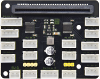
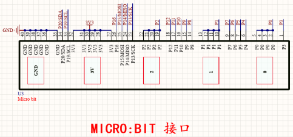
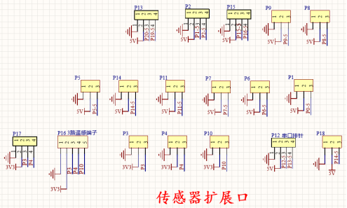
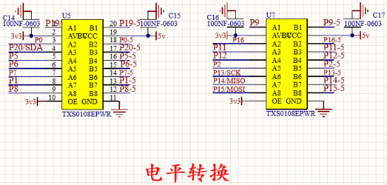
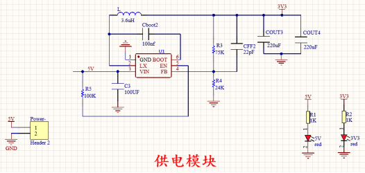
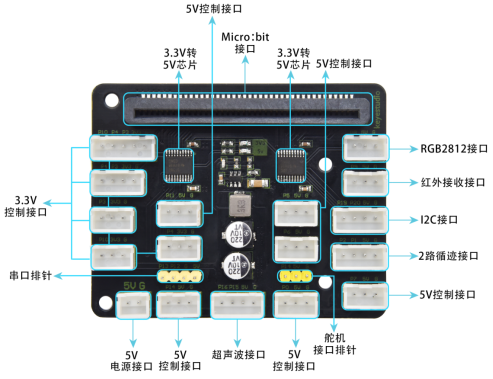

Micro：bit 扩展板
=================

|Img|

**1. 说明:**

当我们在做DIY实验时，我们经常会利用Microbit控制板和其他传感器模块搭配使用。为了方便接线，Microbit扩展板把控制板上的针脚引出来，方便我们扩展驱动连接电机、舵机和其他传感器等其他扩展功能，省去了繁琐的鳄鱼夹插接和接面包板的步骤，由于是防反接口，线序固定，将不会再出现控制板连接传感器/模块时，因线序接反，导致烧坏传感器/模块现象。

扩展板使用间距为2.54mm防反接口，接口都带有丝印，板载PH2.54锂电池盒和micro
USB两种供电，供电电压3.3~5V，满足多种电压驱动的传感器。
模块自带4个直径为3mm的定位孔，方便你将模块固定在其他设备。

特别注意：一般舵机的空载电流为220mA左右，Micro USB
能承受的最大电流为2A， 如果利用Micro
USB接口供电，我们就不能同时驱动16个舵机了。

**2. 技术参数:**

- 工作电压：3.3V~5V
- 电流：500mA
- 最大功率：2.5W
- 重量：25.1g
- 工作温度范围: 0~50
- 接口：间距为2.54mm防反接口
- 尺寸：70.2 X 56 X 1.6mm
- 安装孔直径：3mm

**3. 原理图：**

|image1|

|image2|

|image3|

|image4|

**4.接口说明：**

|image5|

