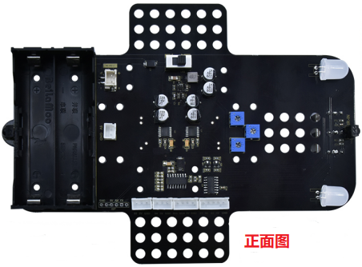
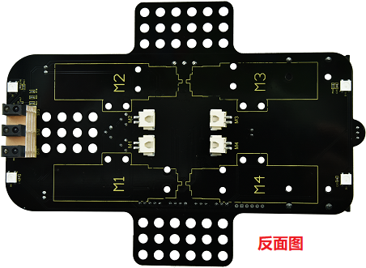
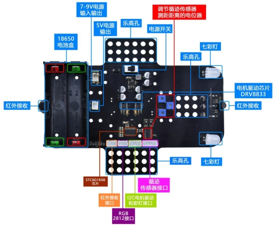
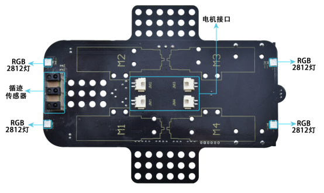
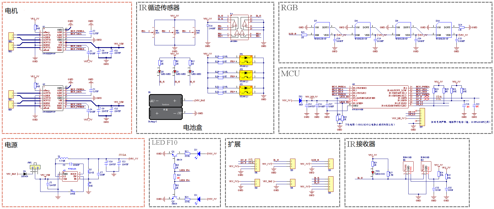

麦克纳姆轮小车下板(带电机驱动)
==============================

|Img|

|image1|

**1. 产品描述:**

麦克纳姆轮小车下板(带电机驱动)板上包含STC8芯片和DRV8833芯片等，为了节约IO口资源，我们使用STC8芯片部分引脚来控制DRV8833电机驱动芯片，并且HR8833电机芯片是用来控制4个直流减速电机的转动方向和速度。STC8相当于一个8路pwm输出（寄存器0x1
~ 8），2路数字信号输出（寄存器0x9 ~
A）的IIC从设备，我们向它对应的寄存器写入对应的值，芯片将会从对应的引脚输出对应的信号。

该驱动底板还上配有3路循迹传感器、首尾各一个红外接收头、四个WS2812灯、两个七彩灯、4个直流减速电机（两个七彩灯已经与STC8芯片引脚相连，4个电机通过DRV8833驱动芯片也已经与STC8相连，其余传感器实验我们的控制板引脚控制），即齿轮减速电机，是在普通直流电机的基础上，加上配套齿轮减速箱。齿轮减速箱的作用是，提供较低的转速，较大的力矩。同时，齿轮箱不同的减速比可以提供不同的转速和力矩。这大大提高了，直流电机在自动化行业中的使用率。减速电机是指减速机和电机（马达）的集成体。这种集成体通常也可称为齿轮马达或齿轮电机。减速电机广泛应用于钢铁行业、机械行业等。使用减速电机的优点是简化设计、节省空间。我们来看一下麦克纳姆轮小车下板(带电机驱动)参数以及正反面的示意图和底板的电路图：

**2. 规格参数：**

- 电压：电路5V,电池供电7-9V
- 电流：最大为5A（其中单块电机驱动IC最大为1.5A）
- 最大功率：最大功率37W(其中单块电机驱动IC最大为13.5W)
- 工作温度范围：-10~50摄氏度
- 尺寸：134×181×75mm
- 重量：90g
- 环保属性：ROHS

**3. 正反面的示意图：**

|image2|

正面

|image3|

反面

**4. 电路图：**

|image4|

