开发环境配置
============

**1.安装 IDE**

Micro:bit是一款无需安装IDE产品，只需要在网页上进行编程下载即可。网址：\ https://makecode.microbit.org/

当然如果需要离线版本，请参考“离线版 Makecode”文件夹。 |Img|

**2.Micro:bit驱动安装说明：**

Micro:bit是可以免安装USB驱动的。如果你的电脑识别不了Micro:bit主板，则需要安装一下Micro:bit驱动，我们提供有Micro:bit
驱动文件\ |image1|\ 和安装Micro:bit驱动说明书，你可以进入相关文件夹中根据安装说明书进行安装。

|image2|

**3.快速开始**

以下的步骤说明基于Windows操作系统，如果你使用的是其他操作系统，可以将其作为参考。

**（1）代码与编程**

本节介绍如何为Micro:bit编写程序以及如何将其下载到Micro:bit主板。
Micro:bit官方网站上有非常详细的教程，
您可以参考：Https://microbit.org/guide/quick/

步骤 1: 连接Micro:bit主板

通过Micro USB线将Micro:bit主板连接到电脑，

|image3|

|image4|

Micro:bit主板背后的红色LED点亮，表明Micro:bit主板有电了。

Micro:bit
将在您的电脑上显示为一个名为'MICROBIT'的驱动器。但请注意，它不是普通的USB磁盘！如下图：

|image5|

步骤 2: 编写程序

在浏览器中访问链接：\ https://makecode.microbit.org/
，然后单击“\ **新建项目**\ ”，出现“\ **创建项目**\ ”对话框，在对话框中输入“\ **心跳**\ ”，单击“\ **创建**\ ”并开始编程。

（以下是以Google Chrome为例，其他浏览器类似）

|image6|

|image7|

|image8|

①使用MakeCode编辑器，写一个Micro:bit代码。
例如，从模块区拖放一些指令方块放入代码编辑区。
下一节将进一步介绍MakeCode。

|image9|

②点击“JS JavaScript”，你可以看到对应的JavaScript语言代码程序，如下图：

|image10|

③你还可以点击“JS JavaScript
”，再点击下拉按钮选择“Python”，你还可以看到对应的Python语言代码程序，如下图：

|image11|

步骤 3: 下载代码

单击编辑器中的“\ **下载**\ ”按钮。
这将下载一个“hex”文件，该文件是Micro:bit主板可以读取的紧凑程序格式。
十六进制文件下载后，将其复制到你的Micro:bit主板，就像将文件复制到USB驱动器一样。
在Windows上，你还可以右键单击并选择“发送到→MICROBIT（E）”将“hex”文件拷贝到Micro:bit主板。

|image12|

也可以将“.hex”文件直接拖入MICROBIT（E）磁盘中。

|image13|

|image14|

将下载好的“hex”文件拷贝到Micro:bit主板过程中，Micro:bit主板背面的黄色信号灯会闪烁，当拷贝完成后黄色信号灯停止闪烁，保持长亮。

步骤Step 4: 运行程序

代码程序上传Micro: bit 主板后，通过Micro USB线或外接电源给Micro:
bit主板供电，Micro: bit 主板上的5 x 5 LED点阵显示心跳的图案。

|image15|

micro USB线供电

|image16|

外接电源供电（3.3V）

每次编程时，MICROBIT驱动器都会自动弹出并返回，但是你的hex文件将会消失。
Micro: bit主板只能接收.hex文件，不会存储任何其他文件！

步骤5：掌握

本小节向你展示了如何开始使用Micro:bit，但是除了MakeCode之外，您还可以使用Python语言和基于文本的JavaScript语言来编写Micro:bit。转到：\ https://microbit.org/code/
查看不同的语言，或查看：\ https://microbit.org/projects/
，了解你可能想要尝试的一些内容。

\*\*（2）Makecode \*\*

在Google Chrome访问链接：\ https://makecode.microbit.org/\ ，
打开MakeCode在线版本

|image17|

点击
“\ **新建项目**\ ”,出现“\ **创建项目**\ ”对话框，在对话框中输入“\ **心跳**\ ”，单击“\ **创建**\ ”进入MakeCode
编译器，MakeCode 编译器如下:

|image18|

在代码编辑区中，有两个固定的指令方块“\ **当开机时**\ ”和“\ **无限循环**\ ”。

上电或复位后，“\ **当开机时**\ ”指令方块中的代码将仅执行一次；并且“\ **无限循环**\ ”指令方块中的代码将循环执行。

\*\*（3）快速下载 \*\*

使用MakeCode的浏览器版本下载编写好的代码程序可能需要更多步骤。
但是，如果您将Google Chrome 用于Android，ChromeOS，Linux，macOS和Windows
10系统，则可以实现快速下载功能。

在这里，我们使用Chrome的webUSB功能，该功能允许网页访问您的Micro
USB硬件设备。 我们将按照以下步骤完成Micro：bit设备与网页的连接和配对。

**配对装置：**

用Micro USB线连接电脑和Micro: bit主板。

单击“\ **下载**\ ”后面的“\ **...**\ ”，然后单击“\ **连接设备**\ ”。

|image19|

然后继续单击“\ **下一步**\ ”按钮。

|image20|

再继续单击“\ **下一步**\ ”按钮。

|image21|

在弹出窗口中选中对应的“\ **设备**\ ”，然后单击“\ **连接**\ ”按钮。
如果弹出窗口中没有设备，请参考以下内容：\ https://makecode.microbit.org/device/usb/webusb/troubleshoot

当然，如果你不想点击链接进入相关页面中查看，你也可以在本教程的“相关资料”文件夹中直接阅读“\ **用WebUSB排除下载过程中的故障**\ ”文件。

如果你的Micro:bit主板出现问题是需要更新Micro:bit的固件，在本教程的“相关资料”文件夹中的“\ **如何更新micro:bit主板的固件**\ ”文件介绍了如何更新Micro:bit的固件，其内容来自：\ https://microbit.org/guide/firmware/

|image22|

单击“\ **完成**\ ”，设备连接成功。

|image23|

|image24|

**程序下载：**

设备连接成功后，单击“\ **下载**\ ”按钮，程序将直接下载到Micro:bit主板。

注意：有的系统不支持快速下载方式，比如在电脑的设备管理器中可以看到在线驱动CMSIS-DAP安装不成功就不支持快速下载；需要选择其它程序上传方式。比如：\ **右键单击并选择“发送到→MICROBIT（E）”将“hex”文件拷贝到Micro:bit主板。**
等程序上传方式。

|image25|

**4.MakeCode扩展库：**

为了轻松使用Mecanum Robot Car V2.0，我们为Mecanum Robot Car
V2.0制作了一个MakeCode扩展库。

\*\*（1）添加Mecanum Robot Car V2.0扩展库： \*\*

您可以通过以下方法添加Mecanum Robot Car V2.0扩展库文件。

打开MakeCode，先点击右上角的齿轮图标\ |image26|\ （设置），再点击“扩展”。

|image27|

或者单击“\ **高级**\ ”上的“\ **扩展**\ ”。

|image28|

在搜索框中输入链接：\ ``https://github.com/keyestudio2019/mecanum_robot_v2.git``\ ，然后单击搜索。

单击搜索结果MecanumRobotV2以下载并安装。 该过程可能需要几秒钟。

|image29|

安装完成后，你可以在左侧找到MecanumRobotV2的扩展库。

|image30|

注意：添加到项目中的扩展库仅对该项目有效，而不会出现在其他项目中。
因此，当你创建新项目代码时，需要再次添加MecanumRobotV2扩展库。

\*\*（2）更新或删除MecanumRobotV2扩展库： \*\*

如果您需要更新或删除MecanumRobotV2扩展库文件，请按照以下说明进行操作。

点击 "Js JavaScript" 按钮切换到文本代码。

|image31|

点击左边的“\ **资源管理器**\ ”.

|image32|

在扩展列表中找到扩展库文件。单击垃圾箱图标以删除MecanumRobotV2扩展库文件。单击刷新图标以更新MecanumRobotV2扩展库文件。

|image33|

**5.导入代码：**

我们为每个项目提供十六进制代码文件（项目文件）。十六进制代码文件包含项目的所有内容，可以直接导入，你也可以手动拖动代码块来完成每个项目的代码程序。如果选择通过手动拖动代码块来完成项目代码，则可能需要添加必要的扩展库。

对于简单项目，建议通过拖动代码块来完成项目。

对于复杂的项目，建议通过导入我们提供的十六进制代码文件来完成项目.

接下来，我们以“ 心跳”项目为例，介绍如何加载代码。

打开Web版本Makecode或离线版本Makecode，单击“\ **导入**\ ”。

|image34|

在弹出的对话框中，单击“\ **导入文件**\ ”。

|image35|

|image36|

选择文件“ ..\\4. MakeCode 教程\\3. 项目课程\\Microbit 基础课程\\第01课
心跳\\第1课：心跳.hex”。 然后点击“继续！√”

|image37|

|image38|

除了上述将提供的项目代码程序文件直接导入到Makecode编译器中的方法之外，也可以将我们提供的项目代码程序文件直接拖入到Makecode编译器中的代码编辑区，如下图所示：

|image39|

几秒钟后，项目成功加载。

|image40|

注意：如果你的电脑系统是Windows7/8而不是Windows 10，则在Google
Chrome中是无法进行设备配对，从而读取不了一些传感器/模块的数字信号或模拟信号，可是又需要读取相应的传感器/模块的数字信号或模拟信号，那怎么办呢？这里就可以使用CoolTerm软件来读取串口数据的，下面是CoolTerm安装方法。

**6.CoolTerm软件安装方法：**

这里需要安装CoolTerm程序软件，CoolTerm程序软件是用来在下面的一些实验中读取串口通讯的，这里我们提供了CoolTerm程序软件的下载链接：\ ``https://freeware.the-meiers.org/``

（1）现在，让我们来安装CoolTerm程序软件，这里我们是以PC
Windows系统为例，选择下载安装CoolTerm Win，下载后解压并打开。（Mac系统和
Linux系统也类似）

|image41|

|image42|

（2）左键双击程序文件\ |image43|\ 。（注意：必须保证micro:bit驱动已安装和micro:bit主板连接到电脑上）

|image44|

工具栏上每个按钮的功能如下所示：

========= ==========================
|image45| 打开一个新的终端机
========= ==========================
|image46| 打开保存好的连接
|image47| 保存
|image48| 打开串行连接
|image49| 关闭串行连接
|image50| 清除接收到的数据
|image51| 打开“连接选项”对话框
|image52| 以十六进制格式显示终端数据
|image53| 帮助
========= ==========================

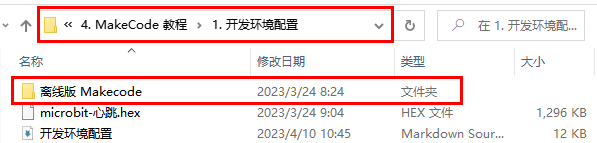
.. |image1| image:: ./media/img-20230324085252.png
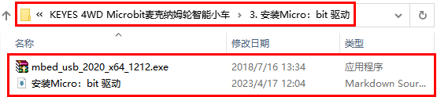
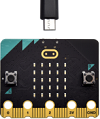
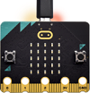
.. |image5| image:: ./media/img-20230324093731.png
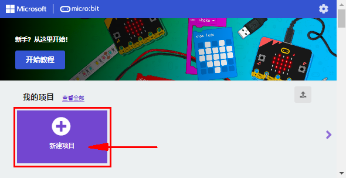
.. |image7| image:: ./media/img-20230417113405.png
.. |image8| image:: ./media/img-20230417113436.png
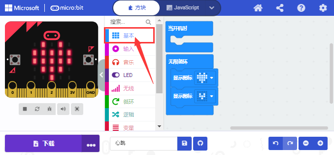
.. |image10| image:: ./media/img-20230417113820.png
.. |image11| image:: ./media/img-20230417113900.png
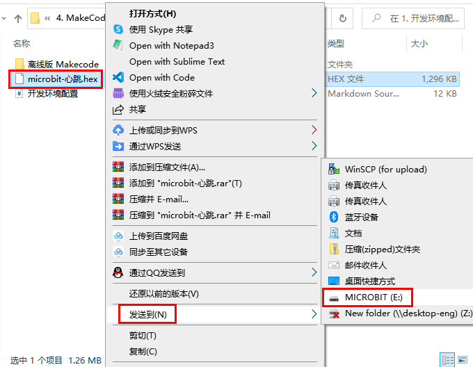
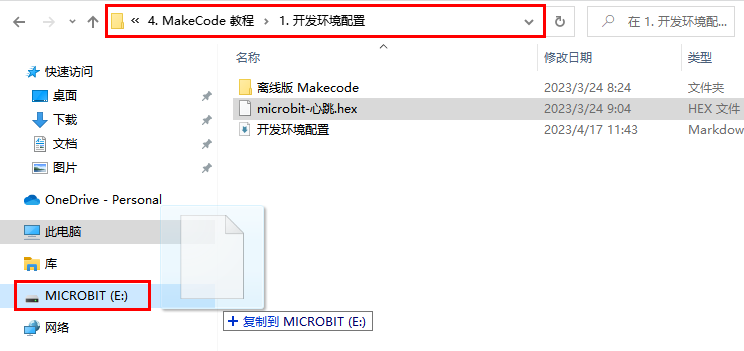
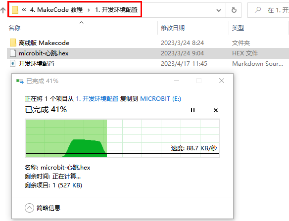
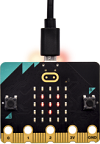
.. |image16| image:: ./media/img-20230324100258.png

.. |image18| image:: ./media/img-20230417115412.png
.. |image19| image:: ./media/img-20230417120802.png
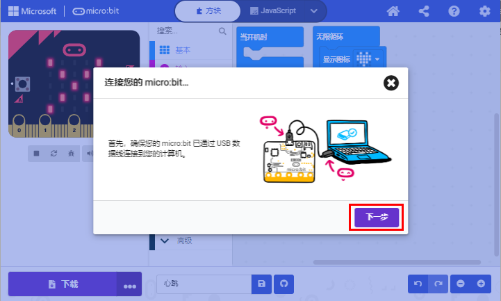
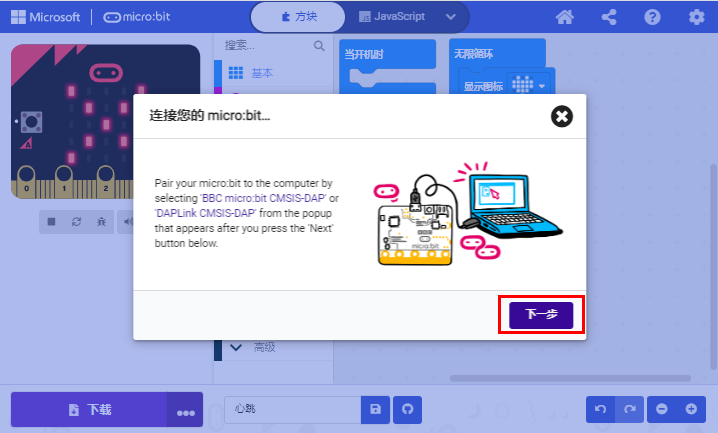
.. |image22| image:: ./media/img-20230417121112.png

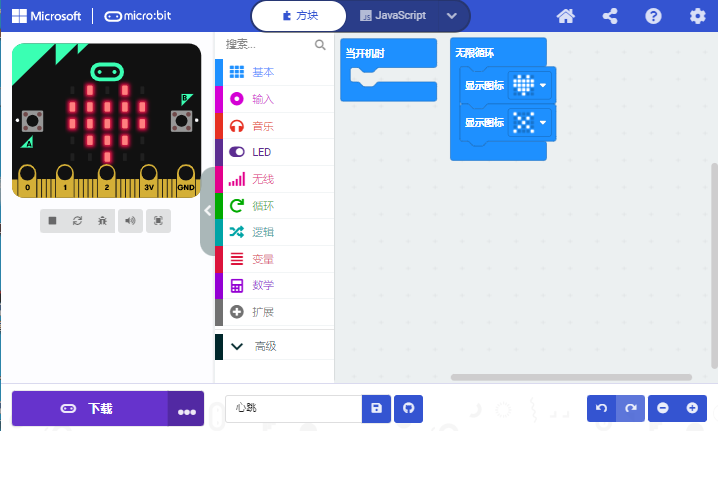
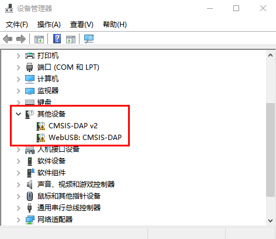
.. |image26| image:: ./media/img-20230324110032.png
.. |image27| image:: ./media/img-20230417131743.png
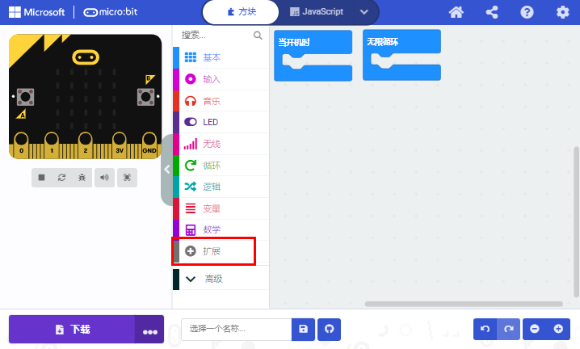
.. |image29| image:: ./media/img-20230426114703.png
.. |image30| image:: ./media/img-20230426115107.png
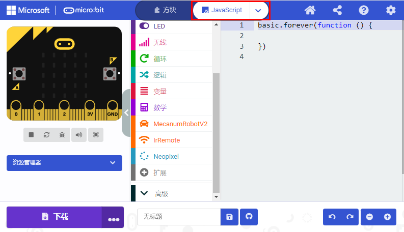
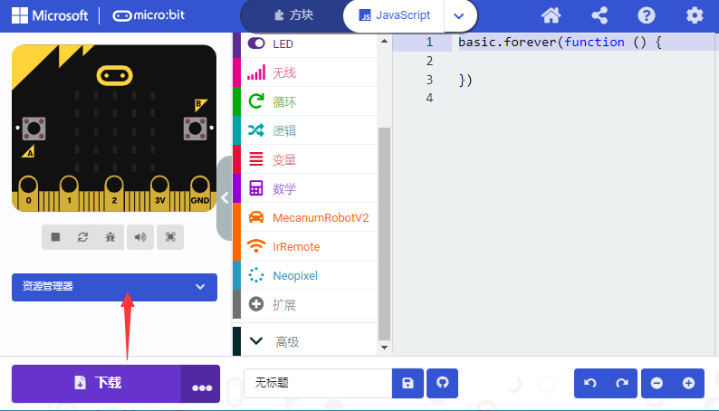
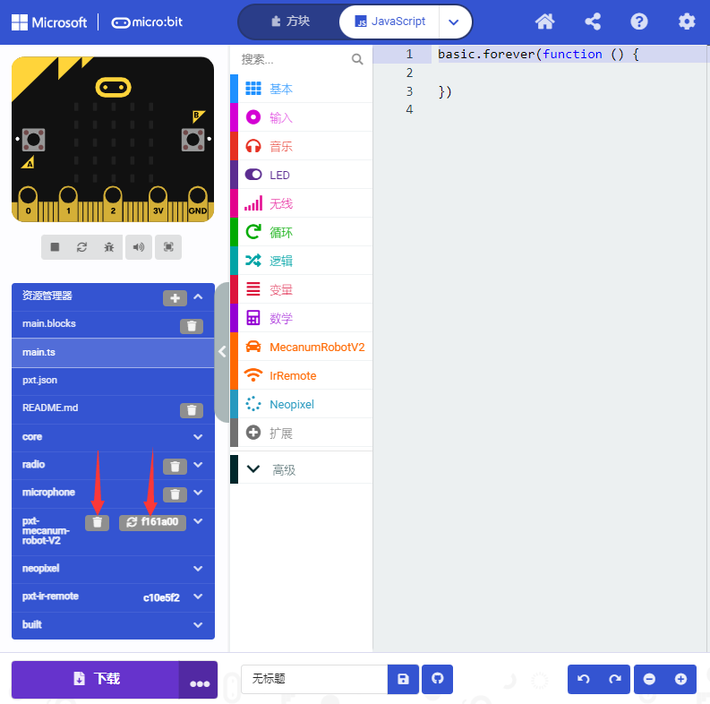
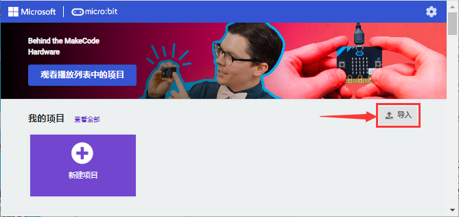
.. |image35| image:: ./media/img-20230417132446.png
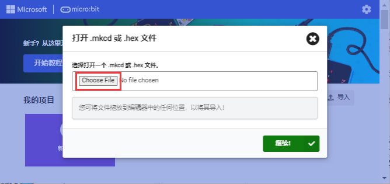
.. |image37| image:: ./media/img-20230417132809.png
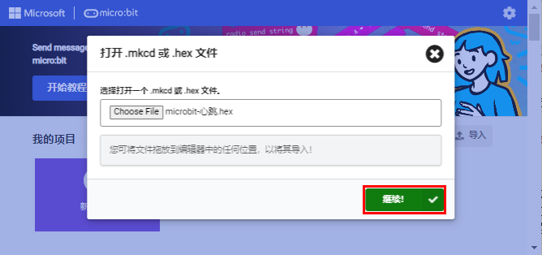
.. |image39| image:: ./media/img-20230417133238.png

.. |image41| image:: ./media/img-20230324113112.png
.. |image42| image:: ./media/img-20230417162747.png
.. |image43| image:: ./media/img-20230324113421.png
.. |image44| image:: ./media/img-20230417162945.png
.. |image45| image:: ./media/img-20230324113604.png
.. |image46| image:: ./media/img-20230324113641.png

.. |image50| image:: ./media/img-20230324113941.png
.. |image51| image:: ./media/img-20230324114008.png
.. |image52| image:: ./media/img-20230324114023.png

