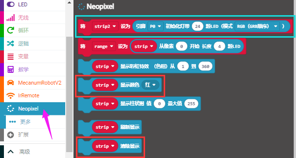
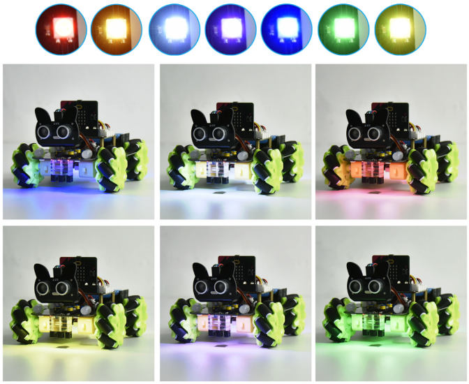
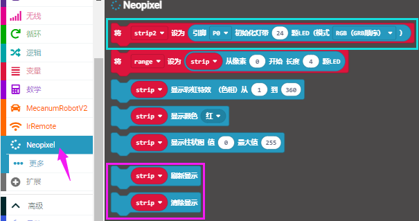
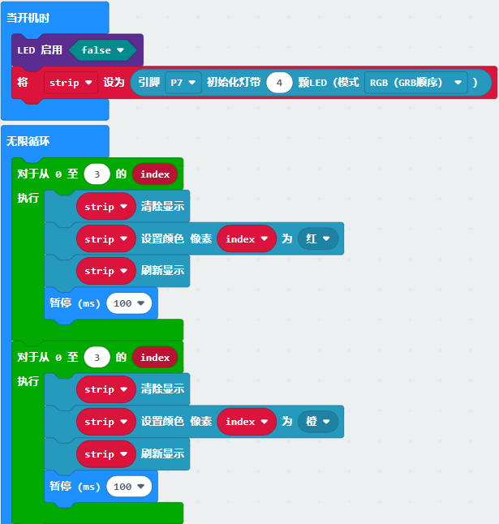
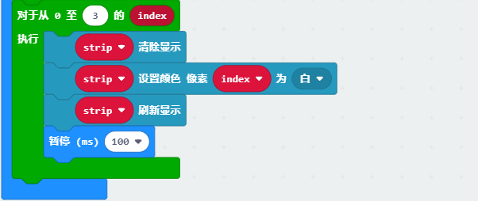
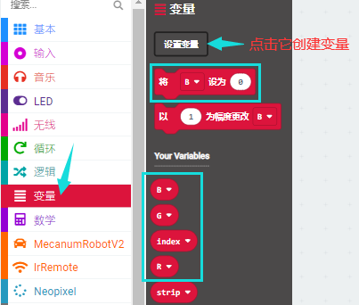

第14课 WS2812RGB
================

|Img|

.. _1实验说明:

1.实验说明：
------------

在前一个项目中，我们详细的介绍了通过代码控制七彩LED闪烁。这节课我们使用WS2812灯珠来显示真正的多彩灯，理论上我们可以通过编程实现我们想要显示的任意的颜色。
但是这个2812 RGB
驱动原理与我们前面学习过的七彩LED不相同，但是也只需要一个引脚就能控制，这是一个集控制电路与发光电路于一体的智能外控LED光源。每个LED原件其外型与一个5050LED灯珠相同，每个元件即为一个像素点，我们这个电机驱动板上有四个灯珠即四个像素。在本项目中我们利用Micro：bit的P7控制端控制4个WS2812
RGB灯显示不同的状态。

.. _2元件知识:

2.元件知识：
------------

|image1|

这四个像素点灯珠都是串联起来的，其实不论多少个，我们都可以用一个引脚（控制引脚为micro
bit的P7）控制任意一个灯，并且让它显示任一种颜色。像素点内部包含了智能数字接口数据锁存信号整形放大驱动电路，还包含有高精度的内部振荡器和12V高压可编程定电流控制部分，有效保证了像素点光的颜色高度一致。数据协议采用单线归零码的通讯方式，像素点在上电复位以后，S端接受从控制器传输过来的数据，首先送过来的24bit数据被第一个像素点提取后，送到像素点内部的数据锁存器。这个2812RGB通讯协议与驱动已经在底层封装好了，我们直接调用函数的接口就可以使用。

.. _3实验准备:

3.实验准备：
------------

（1）将micro：bit主板正确插入4WD Micro:bit麦克纳姆轮智能小车。

（2）将电池装入4WD Micro:bit麦克纳姆轮智能小车。

（3）将电机驱动底板上的电源拨码开关拨到ON一端，开启电源。

（4）通过micro USB线连接micro:bit主板和电脑。

（5）打开离线版本或Web版本的Makecode。

**如果选择通过导入Hex文件来加载项目，则无需手动添加MecanumRobotV2扩展库。**
如果选择手动拖动代码，则首先需要添加MecanumRobotV2扩展库（详细步骤请参考“\ **开发环境配置**\ ”文件）。

.. _4添加库文件:

4.添加库文件：
--------------

打开MakeCode，先点击右上角的齿轮图标\ |image2|\ （设置），再点击“扩展”。

|image3|

或者单击“\ **高级**\ ”上的“\ **扩展**\ ”。

|image4|

在搜索框中输入链接：\ ``https://github.com/keyestudio2019/mecanum_robot_v2.git``\ ，然后单击搜索。

单击搜索结果MecanumRobotV2以下载并安装。 该过程可能需要几秒钟。

|image5|

安装完成后，你可以在左侧找到MecanumRobotV2的扩展库。

|image6|

注意：添加到项目中的扩展库仅对该项目有效，而不会出现在其他项目中。
因此，当你创建新项目代码时，需要再次添加MecanumRobotV2扩展库。

.. _5实验代码1:

5.实验代码1：
-------------

可以直接加载我们提供的程序，也可以自己通过拖动程序块来编写程序程序，操作步骤如下：

**（1）寻找代码块**

|image7|

|image8|

|image9|

**（2）完整代码程序**

|image10|

.. _6实验结果1:

6.实验结果1：
-------------

确定已经将电机驱动底板上的电源拨码开关拨到ON一端，按照之前的方式将代码1下载到micro：bit主板。这样，micro:bit电机驱动底板上的4个WS2812RGB灯全亮，一种颜色变化，一直循环。

|image11|

.. _7实验代码2:

7.实验代码2：
-------------

可以直接加载我们提供的程序，也可以自己通过拖动程序块来编写程序程序，操作步骤如下：

**（1）寻找代码块**

|image12|

|image13|

|image14|

|image15|

|image16|

|image17|

**（2）完整代码程序**

|image18|

|image19|

|image20|

|image21|

|image22|

.. _8实验结果2:

8.实验结果2：
-------------

确定已经将电机驱动底板上的电源拨码开关拨到ON一端，按照之前的方式将代码2下载到micro：bit主板。这样，micro:bit电机驱动底板上的4个WS2812RGB灯以流水灯的形式点亮，一直循环。

|image23|

.. _9实验代码3:

9.实验代码3：
-------------

可以直接加载我们提供的程序，也可以自己通过拖动程序块来编写程序程序，操作步骤如下：

**（1）寻找代码块**

|image24|

|image25|

|image26|

|image27|

|image28|

|image29|

|image30|

**（2）完整代码程序**

|image31|

.. _10实验结果3:

10.实验结果3：
--------------

确定已经将电机驱动底板上的电源拨码开关拨到ON一端，按照之前的方式将代码3下载到micro：bit主板。这样，micro:bit电机驱动底板上的4个WS2812RGB灯以流水灯的形式点亮，每个灯亮起都是一种随机颜色，一直循环。

.. |Img| image:: ./media/img-20230426145214.png
.. |image1| image:: ./media/img-20230426144639.png
.. |image2| image:: ./media/img-20230324110032.png
.. |image3| image:: ./media/img-20230417131743.png
.. |image4| image:: ./media/img-20230417131804.png
.. |image5| image:: ./media/img-20230426114703.png
.. |image6| image:: ./media/img-20230426115107.png
.. |image7| image:: ./media/img-20230417135305.png

.. |image9| image:: ./media/img-20230417135353.png
.. |image10| image:: ./media/img-20230426145430.png

.. |image12| image:: ./media/img-20230417135305.png

.. |image14| image:: ./media/img-20230426152029.png
.. |image15| image:: ./media/img-20230417135353.png
.. |image16| image:: ./media/img-20230426151829.png
.. |image17| image:: ./media/img-20230426152152.png

.. |image19| image:: ./media/img-20230426151137.png
.. |image20| image:: ./media/img-20230426151212.png

.. |image22| image:: ./media/img-20230426151429.png
.. |image23| image:: ./media/img-20230504103911.png
.. |image24| image:: ./media/img-20230417135305.png

.. |image27| image:: ./media/img-20230417135353.png
.. |image28| image:: ./media/img-20230426151829.png
.. |image29| image:: ./media/img-20230426153012.png
.. |image30| image:: ./media/img-20230426153159.png
.. |image31| image:: ./media/img-20230426152448.png
