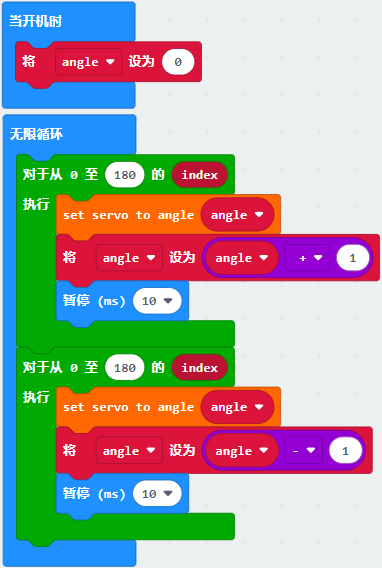

第15课 舵机转动
===============

.. _1实验说明:

1.实验说明：
------------

在前面的4WD
Microbit麦克纳姆轮智能小车安装步骤文档中，我们已经设置了舵机角度。舵机是一种可以非常精确地旋转的电机。目前已广泛应用于玩具车、遥控直升机、飞机、机器人等领域。在这个项目中，我们将来学习有关舵机转动。

.. _2元件知识:

2.元件知识：
------------

|Img|

**舵机：**
舵机是一种位置伺服的驱动器，主要是由外壳、电路板、无核心马达、齿轮与位置检测器所构成。其工作原理是由接收机或者单片机发出信号给舵机，其内部有一个基准电路，产生周期为20ms，宽度为1.5ms
的基准信号，将获得的直流偏置电压与电位器的电压比较，获得电压差输出。经由电路板上的IC
判断转动方向，再驱动无核心马达开始转动，透过减速齿轮将动力传至摆臂，同时由位置检测器送回信号，判断是否已经到达定位。适用于那些需要角度不断变化并可以保持的控制系统。当电机转速一定时，通过级联减速齿轮带动电位器旋转，使得电压差为0，电机停止转动。

舵机有多种规格，但它们都有三根连接线，分别是棕色、红色、橙色(不同品牌可能有不同的颜色)。棕色为GND，红色为电源正极，橙色为信号线

|image1|

舵机的伺服系统由可变宽度的脉冲来进行控制，橙色的控制线是用来传送脉冲的。一般而言，PWM控制舵机的基准信号周期为20ms（50Hz），理论上脉宽应在1ms到2ms之间，对应控制舵机角度是0°～180°。但是，实际上更多控制舵机的脉宽范围是0.5ms
到2.5ms，具体需要自己实际调试下。

|image2|

经过实测，舵机的脉冲范围为0.65ms~2.5ms。180度舵机，对应的控制关系是这样的：

========== ======== ==========================
高电平时间 舵机角度 基准信号周期时间（20ms）
========== ======== ==========================
0.65ms     0度      0.65ms高电平+19.35ms低电平
1.5ms      90度     1.5ms高电平+18.5ms低电平
2.5ms      180度    2.5ms高电平+17.5ms低电平
========== ======== ==========================

舵机的规格参数：

+------------------+----------------------------------------------------------+
| 工作电压：       | DC 4.8V〜6V                                              |
+==================+==========================================================+
| 可操作角度范围： | 可操作角度范围：                                         |
+------------------+----------------------------------------------------------+
| 脉波宽度范围：   | 500→2500 μsec                                            |
+------------------+----------------------------------------------------------+
| 外观尺寸：       | 22.9\ *12.2*\ 30mm                                       |
+------------------+----------------------------------------------------------+
| 空载转速：       | 0.12±0.01 sec/60度（DC 4.8V） 0.1±0.01 sec/60度（DC 6V） |
+------------------+----------------------------------------------------------+
| 空载电流：       | 200±20mA（DC 4.8V） 220±20mA（DC 6V）                    |
+------------------+----------------------------------------------------------+
| 停止扭力：       | 1.3±0.01kg·cm（DC 4.8V） 1.5±0.1kg·cm（DC 6V）           |
+------------------+----------------------------------------------------------+
| 停止电流：       | ≦850mA（DC 4.8V） ≦1000mA（DC 6V）                       |
+------------------+----------------------------------------------------------+
| 待机电流：       | 3±1mA（DC 4.8V） 4±1mA（DC 6V）                          |
+------------------+----------------------------------------------------------+
| 重量:            | 9±1g (不带舵机轴)                                        |
+------------------+----------------------------------------------------------+
| 使用温度：       | -30℃~60℃                                                 |
+------------------+----------------------------------------------------------+

这里要注意，不要使用电脑和USB数据线供电，因为如果电流需求大于500mA，会有烧坏舵机的可能，推荐使用电池外置供电。

.. _3实验准备:

3.实验准备：
------------

（1）将micro：bit主板正确插入4WD Micro:bit麦克纳姆轮智能小车。

（2）将电池装入4WD Micro:bit麦克纳姆轮智能小车。

（3）将电机驱动底板上的电源拨码开关拨到ON一端，开启电源。

（4）通过micro USB线连接micro:bit主板和电脑。

（5）打开离线版本或Web版本的Makecode。

**如果选择通过导入Hex文件来加载项目，则无需手动添加MecanumRobotV2扩展库。**
如果选择手动拖动代码，则首先需要添加MecanumRobotV2扩展库（详细步骤请参考“\ **开发环境配置**\ ”文件）。

.. _4添加库文件:

4.添加库文件：
--------------

打开MakeCode，先点击右上角的齿轮图标\ |image3|\ （设置），再点击“扩展”。

|image4|

或者单击“\ **高级**\ ”上的“\ **扩展**\ ”。

|image5|

在搜索框中输入链接：\ ``https://github.com/keyestudio2019/mecanum_robot_v2.git``\ ，然后单击搜索。

单击搜索结果MecanumRobotV2以下载并安装。 该过程可能需要几秒钟。

|image6|

安装完成后，你可以在左侧找到MecanumRobotV2的扩展库。

|image7|

注意：添加到项目中的扩展库仅对该项目有效，而不会出现在其他项目中。
因此，当你创建新项目代码时，需要再次添加MecanumRobotV2扩展库。

.. _5实验代码:

5.实验代码：
------------

| 可以直接加载我们提供的程序，也可以自己通过拖动程序块来编写程序程序，操作步骤如下：
| **（1）寻找代码块**

|image8|

|image9|

|image10|

|image11|

|image12|

**（2）完整代码程序**

|image13|

.. _6实验结果:

6.实验结果：
------------

确定已经将电机驱动底板上的电源拨码开关拨到ON一端，按照之前的方式将代码下载到micro：bit主板。这样，我们将看到舵机在0到180度之间来回转动。当我们想让它转动得慢一点的话，把延时10ms加大就可以了。

.. |Img| image:: ./media/img-20230329095649.png
.. |image1| image:: ./media/img-20230324190535.png
.. |image2| image:: ./media/img-20230324190601.png
.. |image3| image:: ./media/img-20230324110032.png
.. |image4| image:: ./media/img-20230417131743.png
.. |image5| image:: ./media/img-20230417131804.png
.. |image6| image:: ./media/img-20230426114703.png
.. |image7| image:: ./media/img-20230426115107.png
.. |image8| image:: ./media/img-20230417135305.png
.. |image9| image:: ./media/img-20230426151829.png
.. |image10| image:: ./media/img-20230426155807.png
.. |image11| image:: ./media/img-20230426155903.png
.. |image12| image:: ./media/img-20230417135353.png

