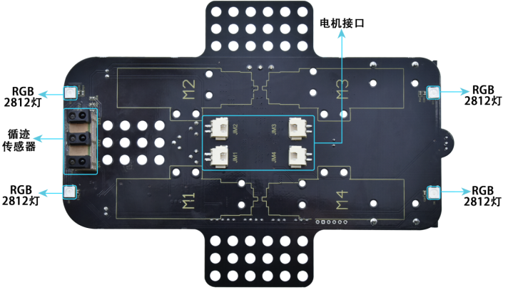
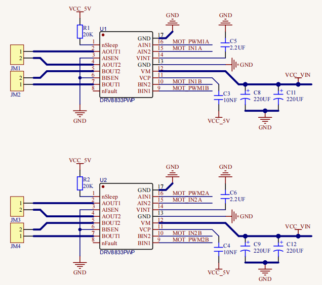
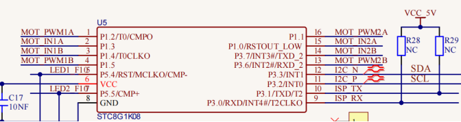
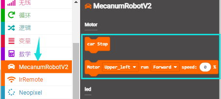
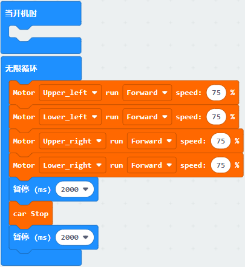
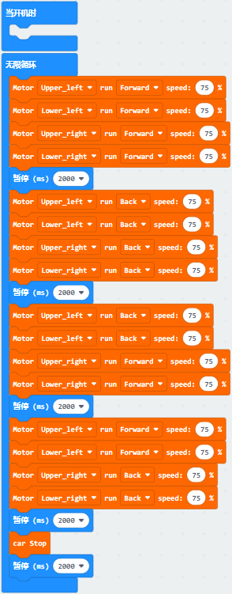

第16课 电机控制
===============

|Img|

.. _1实验说明:

1.实验说明：
------------

要想让小车跑起来那必须要有电机，然后搭配车轮就可以了。我们这个套件上配有4个直流减速电机，即齿轮减速电机，是在普通直流电机的基础上，加上配套齿轮减速箱。齿轮减速箱的作用是，提供较低的转速，较大的力矩。同时，齿轮箱不同的减速比可以提供不同的转速和力矩。这大大提高了直流电机在自动化行业中的使用率，减速电机是指减速机和电机（马达）的集成体，这种集成体通常也可称为齿轮马达或齿轮电机。减速电机广泛应用于钢铁行业、机械行业等。使用减速电机的优点是简化设计、节省空间。

电机的驱动不比LED，它要求的电流比较大，如果我们使用IO口强制驱动电机，要么电机不转动，要么烧坏单片机，所以我们需要一个电机驱动芯片。在电机驱动底板板上已经包含了DRV8833电机驱动芯片，用来控制4个直流减速电机的转动方向和转动速度。下面也有电机驱动底板两个芯片的电路原理图。

.. _2相关知识:

2.相关知识：
------------

|image1|

|image2|

|image3|

|image4|

每个芯片控制4个引脚，每两个引脚控制一个电机，这样就使用了8个引脚控制了4个电机了。我们可以看到电机驱动与STC的接线图，我们驱动电机的时候使用IIC协议往STC这个芯片对应的寄存器地址写入脉宽值就可以输出pwm信号给电机驱动芯片了，我们已经写好了电机驱动的库文件，使用的时候只需要调用API函数就可以让小车走了，非常简单。

.. _3实验准备:

3.实验准备：
------------

（1）将micro：bit主板正确插入4WD Micro:bit麦克纳姆轮智能小车。

（2）将电池装入4WD Micro:bit麦克纳姆轮智能小车。

（3）将电机驱动底板上的电源拨码开关拨到ON一端，开启电源。

（4）通过micro USB线连接micro:bit主板和电脑。

（5）打开离线版本或Web版本的Makecode。

**如果选择通过导入Hex文件来加载项目，则无需手动添加MecanumRobotV2扩展库。**
如果选择手动拖动代码，则首先需要添加MecanumRobotV2扩展库（详细步骤请参考“\ **开发环境配置**\ ”文件）。

.. _4添加库文件:

4.添加库文件：
--------------

打开MakeCode，先点击右上角的齿轮图标\ |image5|\ （设置），再点击“扩展”。

|image6|

或者单击“\ **高级**\ ”上的“\ **扩展**\ ”。

|image7|

在搜索框中输入链接：\ ``https://github.com/keyestudio2019/mecanum_robot_v2.git``\ ，然后单击搜索。

单击搜索结果MecanumRobotV2以下载并安装。 该过程可能需要几秒钟。

|image8|

安装完成后，你可以在左侧找到MecanumRobotV2的扩展库。

|image9|

注意：添加到项目中的扩展库仅对该项目有效，而不会出现在其他项目中。
因此，当你创建新项目代码时，需要再次添加MecanumRobotV2扩展库。

.. _5实验代码1:

5.实验代码1：
-------------

**智能小车向前行走**

可以直接加载我们提供的程序，也可以自己通过拖动程序块来编写程序程序，操作步骤如下：

**（1）寻找代码块**

|image10|

|image11|

**（2）完整代码程序**

|image12|

.. _6实验结果1:

6.实验结果1：
-------------

确定已经将电机驱动底板上的电源拨码开关拨到ON一端，按照之前的方式将代码1下载到micro：bit主板。这样，我们可以看到小车四个轮子都正转，即前进2s，停止2s，一直循环。

.. _7实验代码2:

7.实验代码2：
-------------

**智能小车前后左右行走**

可以直接加载我们提供的程序，也可以自己通过拖动程序块来编写程序程序，操作步骤如下：

**（1）寻找代码块**

|image13|

|image14|

**（2）完整代码程序**

|image15|

.. _8实验结果2:

8.实验结果2：
-------------

确定已经将电机驱动底板上的电源拨码开关拨到ON一端，按照之前的方式将代码2下载到micro：bit主板。这样，小车将前进2秒，后退2秒，左转2秒，右转2秒，再停止2秒
........；保持循环处于这种状态。

.. |Img| image:: ./media/img-20230426164441.png
.. |image1| image:: ./media/img-20230426160942.png

.. |image5| image:: ./media/img-20230324110032.png
.. |image6| image:: ./media/img-20230417131743.png
.. |image7| image:: ./media/img-20230417131804.png
.. |image8| image:: ./media/img-20230426114703.png
.. |image9| image:: ./media/img-20230426115107.png

.. |image11| image:: ./media/img-20230417135353.png

.. |image14| image:: ./media/img-20230417135353.png

