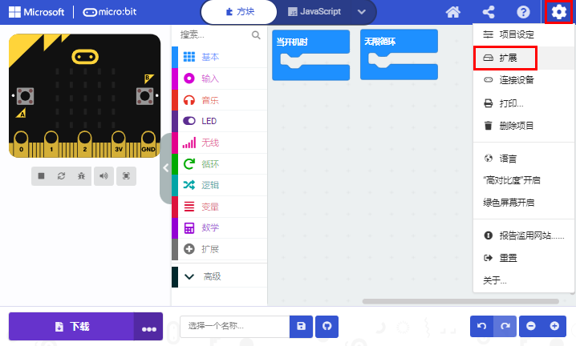

第18课 循迹智能车
=================

|Img|

.. _1实验说明:

1.实验说明：
------------

前面我们学习了循迹传感器和电机驱动的原理和应用，下面我们要结合循迹传感器和电机驱动来做一款循迹小车。

循迹，意思就是循着轨迹，也就是我们经常会看到的走黑线的循迹小车，原理是利用循迹传感器对路面黑色轨迹进行检测，并将路面检测信号反馈给控制主板。控制板对采集到的信号予以分析判断，及时控制驱动电机以调整小车转向，从而使小车能够沿着黑色轨迹自动行驶，实现循迹小车自动寻迹的目的，我们来看看下面的流程图就清晰了：

.. _2实验原理:

2.实验原理：
------------

================ ================== ================ ============ ======
左红外循迹传感器 中间红外循迹传感器 右红外循迹传感器 值（二进制） 状态
================ ================== ================ ============ ======
0                0                  0                000          停止
0                0                  1                001          向右转
0                1                  0                010          直走
0                1                  1                011          向右转
1                0                  0                100          向左转
1                0                  1                101          停止
1                1                  0                110          向左转
1                1                  1                111          直走
================ ================== ================ ============ ======

|image1|

.. _3实验流程图:

3.实验流程图：
--------------

|image2|

.. _4实验准备:

4.实验准备：
------------

（1）将micro：bit主板正确插入4WD Micro:bit麦克纳姆轮智能小车。

（2）将电池装入4WD Micro:bit麦克纳姆轮智能小车。

（3）将电机驱动底板上的电源拨码开关拨到ON一端，开启电源。

（4）通过micro USB线连接micro:bit主板和电脑。

（5）打开离线版本或Web版本的Makecode。

警告：3路循迹传感器应避免在阳光等有红外干扰的环境中使用。阳光中含有大量的不可见光，如红外线和紫外线。在阳光强烈的环境下，3路循迹传感器不能正常工作。

**如果选择通过导入Hex文件来加载项目，则无需手动添加MecanumRobotV2扩展库。**
如果选择手动拖动代码，则首先需要添加MecanumRobotV2扩展库（详细步骤请参考“\ **开发环境配置**\ ”文件）。

.. _5添加库文件:

5.添加库文件：
--------------

打开MakeCode，先点击右上角的齿轮图标\ |image3|\ （设置），再点击“扩展”。

|image4|

或者单击“\ **高级**\ ”上的“\ **扩展**\ ”。

|image5|

在搜索框中输入链接：\ ``https://github.com/keyestudio2019/mecanum_robot_v2.git``\ ，然后单击搜索。

单击搜索结果MecanumRobotV2以下载并安装。 该过程可能需要几秒钟。

|image6|

安装完成后，你可以在左侧找到MecanumRobotV2的扩展库。

|image7|

注意：添加到项目中的扩展库仅对该项目有效，而不会出现在其他项目中。
因此，当你创建新项目代码时，需要再次添加MecanumRobotV2扩展库。

.. _6实验代码:

6.实验代码：
------------

可以直接加载我们提供的程序，也可以自己通过拖动程序块来编写程序程序，操作步骤如下：

**（1）寻找代码块**

|image8|

|image9|

|image10|

|image11|

|image12|

**（2）完整代码程序**

|image13|

|image14|

.. _7实验结果:

7.实验结果：
------------

确定已经将电机驱动底板上的电源拨码开关拨到ON一端，按照之前的方式将代码下载到micro：bit主板。这样，循迹小车能随着黑色轨迹前行。

特别注意：

（1）小车循迹轨道，黑线的宽度必须大于等于3路循迹传感器模块的宽度，小车速度尽量应调低一些。

（2）测试小车时，不要在阳光明媚的太阳底下测试。测试过程中，如果出现问题，可在暗一点的环境中测试。

.. |Img| image:: ./media/img-20230426170747.png
.. |image1| image:: ./media/img-20230523171931.png
.. |image2| image:: ./media/img-20230426171120.png
.. |image3| image:: ./media/img-20230324110032.png

.. |image5| image:: ./media/img-20230417131804.png
.. |image6| image:: ./media/img-20230426114703.png
.. |image7| image:: ./media/img-20230426115107.png
.. |image8| image:: ./media/img-20230417135305.png

.. |image10| image:: ./media/img-20230426171717.png

.. |image12| image:: ./media/img-20230426172330.png

