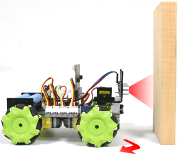
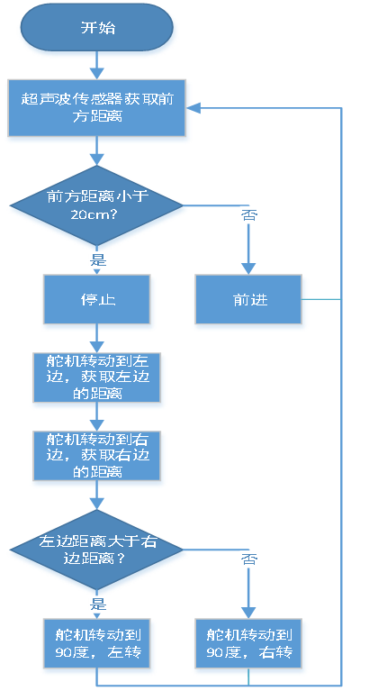
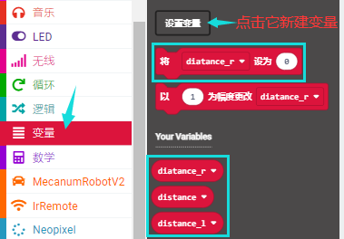

第21课 超声波避障智能小车
=========================

|Img|

.. _1实验说明:

1.实验说明：
------------

在上个项目中，我们制作了一个超声波跟随智能车。实际上，利用同样的硬件，同样的接线方法，我们只需要更改一个测试代码就可以将跟随智能车变为避障智能车。超声波避障智能车，就是通过超声波传感器检测前方障碍物的距离，然后舵机云台转动检测到左右两边的距离，然后根据这一个数据控制四个电机的转动，从而控制智能车的运动状态，从而实现避障。

我们来看看下面的程序流程图就很清晰了：

.. _2实验流程图:

2.实验流程图：
--------------

|image1|

.. _3实验准备:

3.实验准备：
------------

（1）将micro：bit主板正确插入4WD Micro:bit麦克纳姆轮智能小车。

（2）将电池装入4WD Micro:bit麦克纳姆轮智能小车。

（3）将电机驱动底板上的电源拨码开关拨到ON一端，开启电源。

（4）通过micro USB线连接micro:bit主板和电脑。

（5）打开离线版本或Web版本的Makecode。

**如果选择通过导入Hex文件来加载项目，则无需手动添加MecanumRobotV2扩展库。**
如果选择手动拖动代码，则首先需要添加MecanumRobotV2扩展库（详细步骤请参考“\ **开发环境配置**\ ”文件）。

.. _4添加库文件:

4.添加库文件：
--------------

打开MakeCode，先点击右上角的齿轮图标\ |image2|\ （设置），再点击“扩展”。

|image3|

或者单击“\ **高级**\ ”上的“\ **扩展**\ ”。

|image4|

在搜索框中输入链接：\ ``https://github.com/keyestudio2019/mecanum_robot_v2.git``\ ，然后单击搜索。

单击搜索结果MecanumRobotV2以下载并安装。 该过程可能需要几秒钟。

|image5|

安装完成后，你可以在左侧找到MecanumRobotV2的扩展库。

|image6|

注意：添加到项目中的扩展库仅对该项目有效，而不会出现在其他项目中。
因此，当你创建新项目代码时，需要再次添加MecanumRobotV2扩展库。

.. _5实验代码:

5.实验代码：
------------

可以直接加载我们提供的程序，也可以自己通过拖动程序块来编写程序程序，操作步骤如下：

**（1）寻找代码块**

|image7|

|image8|

|image9|

|image10|

|image11|

**（2）完整代码程序**

|image12|

.. _6实验结果:

6.实验结果：
------------

确定已经将电机驱动底板上的电源拨码开关拨到ON一端，按照之前的方式将代码下载到micro：bit主板。这样，Microbit
4WD麦克纳姆轮智能小车在离前方障碍物的距离大于等于20cm时，Microbit
4WD麦克纳姆轮智能小车向前走；反之，超声波先转动到左边，测得左边的距离，然后转动到右边，测得右边的距离，左边距离大于右边时，Microbit
4WD 麦克纳姆轮智能小车向左转，左边距离小于右边时，Microbit
4WD 麦克纳姆轮智能小车向右转。

.. |image2| image:: ./media/img-20230324110032.png
.. |image3| image:: ./media/img-20230417131743.png
.. |image4| image:: ./media/img-20230417131804.png
.. |image5| image:: ./media/img-20230426114703.png
.. |image6| image:: ./media/img-20230426115107.png

.. |image9| image:: ./media/img-20230426172330.png

