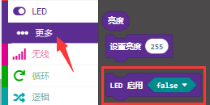
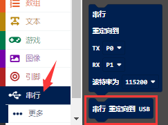

第22课 红外遥控的原理
=====================

.. _1实验简介:

1.实验简介：
------------

红外遥控在日常生活中随处可见，它被用来控制各种家电，如电视、音响、录影机和卫星信号接收器。红外遥控是由红外发射和红外接收系统组成的，也就是一个红外遥控器、红外接收器和一个能解码的单片机组成的，小车上有个红外接收器。

在本实验中，使用红外接收器和红外遥控器相结合，读取红外遥控器上的按键值并将按键值打印在串口监视器上。

.. _2元件知识:

2.元件知识：
------------

**红外(IR)遥控器：**
是一种具有一定数量按钮的设备。按下不同的按钮会使位于遥控器前端的红外发射管以不同的编码发送红外信号。红外遥控技术应用广泛，如电视、空调等。因此，在当今科技发达社会，红外遥控技术使你切换电视节目和调节空调温度都很方便。

我们使用的遥控器如下所示：

该红外遥控器采用NEC编码，信号周期为110ms。

|Img|

**红外(IR)接收器：**
它是一种元件，可以接收红外光，所以可以用它来检测红外遥控器发出的红外光信号。红外接收器解调接收到的红外光信号，并将其转换回二进制，然后将信息传递给微控制器。

红外信号调制过程图：

|image1|

.. _3实验准备:

3.实验准备：
------------

（1）将micro：bit主板正确插入4WD Micro:bit麦克纳姆轮智能小车。

（2）将电池装入4WD Micro:bit麦克纳姆轮智能小车。

（3）将电机驱动底板上的电源拨码开关拨到ON一端，开启电源。

（4）通过micro USB线连接micro:bit主板和电脑。

（5）打开离线版本或Web版本的Makecode。

**如果选择通过导入Hex文件来加载项目，则无需手动添加MecanumRobotV2扩展库。**
如果选择手动拖动代码，则首先需要添加MecanumRobotV2扩展库（详细步骤请参考“\ **开发环境配置**\ ”文件）。

.. _4添加库文件:

4.添加库文件：
--------------

打开MakeCode，先点击右上角的齿轮图标\ |image2|\ （设置），再点击“扩展”。

|image3|

或者单击“\ **高级**\ ”上的“\ **扩展**\ ”。

|image4|

在搜索框中输入链接：\ ``https://github.com/keyestudio2019/mecanum_robot_v2.git``\ ，然后单击搜索。

单击搜索结果MecanumRobotV2以下载并安装。 该过程可能需要几秒钟。

|image5|

安装完成后，你可以在左侧找到MecanumRobotV2的扩展库。

|image6|

注意：添加到项目中的扩展库仅对该项目有效，而不会出现在其他项目中。
因此，当你创建新项目代码时，需要再次添加MecanumRobotV2扩展库。

.. _5实验代码:

5.实验代码：
------------

可以直接加载我们提供的程序，也可以自己通过拖动程序块来编写程序程序，操作步骤如下：

**（1）寻找代码块**

|image7|

|image8|

|image9|

|image10|

|image11|

|image12|

**（2）完整代码程序**

|image13|

代码说明：没有按下红外遥控器上的按键时，串口监视器不断地刷新显示数字0。当按下红外遥控器上的按键时，串口监视器中显示出对应的按键键值。

特别注意：

（1）有些红外遥控不带电池，需要自己配置，电池型号为CR2025。

（2）测试前需要确保红外遥控是OK的，有一个小诀窍测试红外遥控是否OK。打开手机摄像头拍照，红外遥控多准手机摄像头按下按键。如果在手机上看到有紫光闪烁，就代表红外遥控是OK的。

.. _6实验结果:

6.实验结果：
------------

确定已经将电机驱动底板上的电源拨码开关拨到ON一端，按照之前的方式将代码下载到micro：bit主板，micro
USB线不要从micro：bit上拔下来，利用micro USB线上电。

打开CoolTerm，点击Options，选择SerialPort，设置COM口和波特率，波特率设置为115200（经过测试，micro:bit的USB串口通讯波特率是115200），点击OK后，最后点击Connect。这样，CoolTerm串口监视器显示对应按键的键值，显示如下图。

|image14|

我们通过得出的数值，做了一个红外遥控器按键值表，方便以后使用。

|image15|

.. |Img| image:: ./media/img-20230330135918.png
.. |image1| image:: ./media/img-20230510103937.png

.. |image3| image:: ./media/img-20230417131743.png
.. |image4| image:: ./media/img-20230417131804.png
.. |image5| image:: ./media/img-20230426114703.png
.. |image6| image:: ./media/img-20230426115107.png

.. |image9| image:: ./media/img-20230417141126.png
.. |image10| image:: ./media/img-20230427103207.png
.. |image11| image:: ./media/img-20230417135353.png

