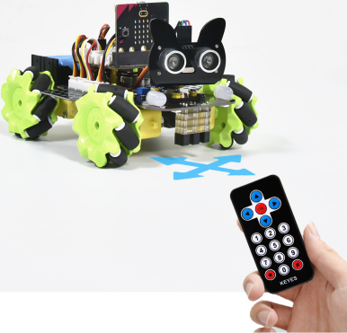
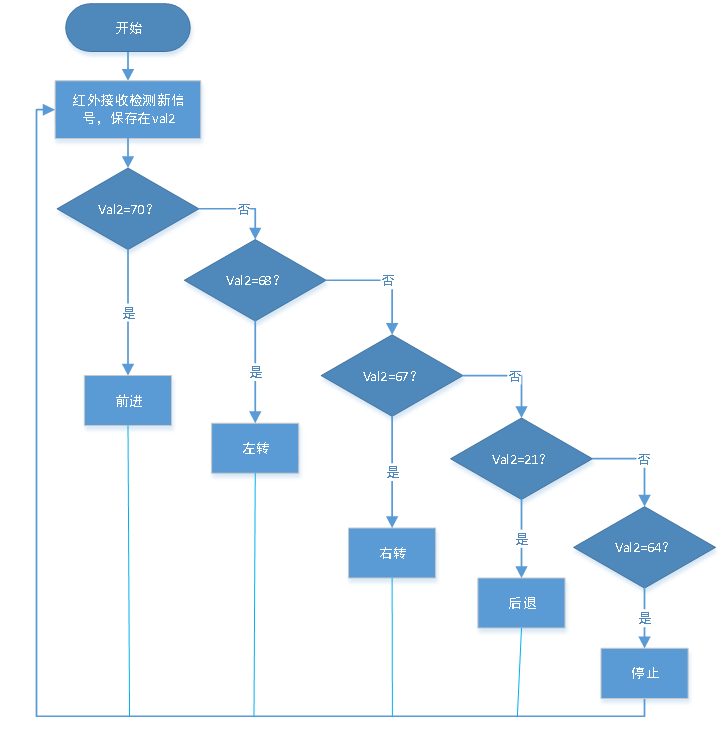
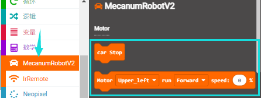
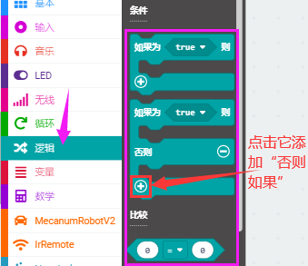
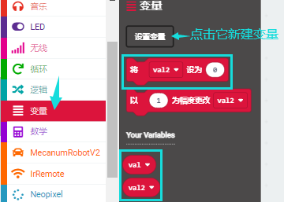
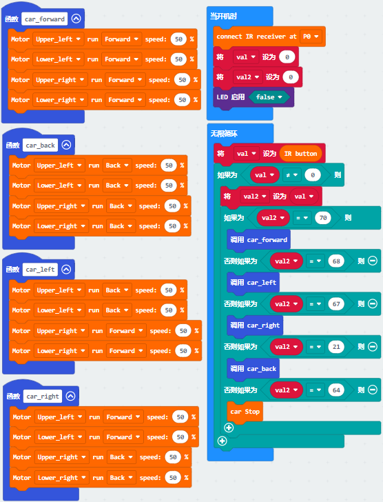

第23课 红外遥控智能车
=====================

|Img|

.. _1实验说明:

1.实验说明：
------------

前面我们已经测试出红外遥控器各个按键对应的键值，这个项目我们就是使用红外遥控器来控制小车了，我们可以通过代码设置（键值），让对应的按键控制智能车对应的运动状态。

.. _2实验流程图:

2.实验流程图：
--------------

|image1|

.. _3实验准备:

3.实验准备：
------------

（1）将micro：bit主板正确插入4WD Micro:bit麦克纳姆轮智能小车。

（2）将电池装入4WD Micro:bit麦克纳姆轮智能小车。

（3）将电机驱动底板上的电源拨码开关拨到ON一端，开启电源。

（4）通过micro USB线连接micro:bit主板和电脑。

（5）打开离线版本或Web版本的Makecode。

**如果选择通过导入Hex文件来加载项目，则无需手动添加MecanumRobotV2扩展库。**
如果选择手动拖动代码，则首先需要添加MecanumRobotV2扩展库（详细步骤请参考“\ **开发环境配置**\ ”文件）。

.. _4添加库文件:

4.添加库文件：
--------------

打开MakeCode，先点击右上角的齿轮图标\ |image2|\ （设置），再点击“扩展”。

|image3|

或者单击“\ **高级**\ ”上的“\ **扩展**\ ”。

|image4|

在搜索框中输入链接：\ ``https://github.com/keyestudio2019/mecanum_robot_v2.git``\ ，然后单击搜索。

单击搜索结果MecanumRobotV2以下载并安装。 该过程可能需要几秒钟。

|image5|

安装完成后，你可以在左侧找到MecanumRobotV2的扩展库。

|image6|

注意：添加到项目中的扩展库仅对该项目有效，而不会出现在其他项目中。
因此，当你创建新项目代码时，需要再次添加MecanumRobotV2扩展库。

.. _5实验代码:

5.实验代码：
------------

可以直接加载我们提供的程序，也可以自己通过拖动程序块来编写程序程序，操作步骤如下：

**（1）寻找代码块**

|image7|

|image8|

|image9|

|image10|

|image11|

**（2）完整代码程序**

|image12|

.. _6实验结果:

6.实验结果：
------------

确定已经将电机驱动底板上的电源拨码开关拨到ON一端，按照之前的方式将代码下载到micro：bit主板。这样，红外遥控对准扩展板的红外接收头，按下按键，即可控制小车运动。其中，\ |image13|\ 按键控制小车前进，\ |image14|\ 按键控制小车向左转，\ |image15|\ 按键控制小车向右转，\ |image16|\ 按键控制小车后退，\ |image17|\ 按键控制小车停止。

注意：测试时，红外遥控需正对小车扩展板后面的红外接收头，距离最好不超过5米左右，我们在车底板前后各使用一个红外接收，使得更容易接收到正确信号。

.. |image2| image:: ./media/img-20230324110032.png
.. |image3| image:: ./media/img-20230417131743.png
.. |image4| image:: ./media/img-20230417131804.png
.. |image5| image:: ./media/img-20230426114703.png
.. |image6| image:: ./media/img-20230426115107.png
.. |image7| image:: ./media/img-20230417135305.png
.. |image8| image:: ./media/img-20230427110737.png

.. |image13| image:: ./media/img-20230427111749.png
.. |image14| image:: ./media/img-20230427111839.png

.. |image17| image:: ./media/img-20230427111925.png
