第18课 读取蓝牙数据
===================

|Img|

.. _1实验说明:

1.实验说明：
------------

Micro:bit控制板上自带有蓝牙，可以通过蓝牙方式与Micro:bit通讯，即可以用蓝牙控制Micro:bit主板，或者Micro:bit主板通过蓝牙把信号传回手机或者电脑，我们可以利用Micro:bit主板上自带的蓝牙和手机蓝牙APP通信，利用蓝牙手机APP控制Micro:bit外接设备工作。Micro:bit上自带的蓝牙既支持安卓系统手机，也支持IOS系统设备（手机或iPad）。我们为您提供两种蓝牙APP，适用于安卓系和IOS系统。这两种APP连接Micro:bit蓝牙的方法是类似的。在这一课程中，我们主要介绍蓝牙APP的使用和APP界面上各按钮的功能，并且通过蓝牙APP连接Micro:bit上的蓝牙来读取了APP界面上各按钮发送的控制字符。

.. _2安装android或ios手机平板蓝牙app:

2.安装Android（或iOS）手机/平板蓝牙APP
--------------------------------------

我们设计控制4WD Micro:bit麦克纳姆轮智能小车的APP控件如下图所示：

|image1|

当Micro:bit主板上的蓝牙模块与Android（或iOS）系统手机/平板上的蓝牙APP通过蓝牙连接好后，按下控制键，Android（或iOS）系统手机/平板上的APP通过蓝牙就会发送相应的数值。编程时，可以为控制键设置相应的值。所以在实验中，我们会对每个控制键进行测试，在串口监视器中得到相应的值。

**Android系统APP安装步骤：**

1.下载mecanum_robot.apk文件

A. 我们资料包中有提供Android apk安装包，在下图位置：

|image2|

现将文件夹中的keyes arm.apk文件转移到安卓系统手机或平板电脑上。

B.或者，使用浏览器的扫码功能对着二维码扫描识别或者输入网址：\ http://8.210.52.206/mecanum_robot.apk
进行下载，识别成功后就可以进入下载mecanum_robot.apk页面，点击“\ **下载**\ ”下载mecanum_robot应用程序。

|image3|

2.点击“\ **允许**\ ”进入安装界面，点击“\**继续安装”\**就可以安装好mecanum_robot应用程序。

|image4|

|image5|

|image6|

3.点击“\ **打开**\ ”或点击手机桌面上的应用程序mecanum_robot\ |image7|\ 就可以打开APP，界面如下所示：

|image8|

4.先开启手机/平板的蓝牙，再打开App，点击APP界面右上角的\ |image9|\ 按钮（控件）进行蓝牙搜索，在搜索结果中寻找“BCC
micro:bit”对话框，在“BCC
micro:bit”对话框中点击“connect”即可连接蓝牙。当对话框的“connect”变成“is
connected”，说明蓝牙连接成功。

|image10|

|image11|

**IOS系统APP安装步骤：**

a.打开App Store。

|image12|

b.在搜索框输入“mecanum_robot”，点击搜索，再点击“\ |image13|\ ”，就可以下载mecanum_robot的蓝牙APP。

c.下载安装完APP后，点击“\ **打开**\ ”或点击手机桌面上的应用程序mecanum_robot\ |image14|\ 就可以打开APP，界面如下所示：

|image15|

接下来连接蓝牙，其步骤和上面的Android系统APP类似。

.. _3-准备:

3. 准备：
---------

（1）将micro：bit主板正确插入4WD Micro:bit麦克纳姆轮智能小车。

（2）将电池装入4WD Micro:bit麦克纳姆轮智能小车。

（3）将电机驱动底板上的电源拨码开关拨到ON一端，开启电源。

（4）通过micro USB线连接micro:bit主板和电脑。

（5）打开离线版本或Web版本的Makecode。

如果选择通过导入 .Hex文件来加载项目，则无需手动添加蓝牙扩展库。

如果选择手动拖动代码，则首先需要添加蓝牙扩展库。

点击右上角的齿轮图标（设置）\ |image16|\ ，接着点击“\ **扩展**\ ”。进入库文件选择页面，在文本框输入“\ **bluetooth**\ ”并点击搜索，出现“\ **bluetooth**\ ”扩展库并点击“\ **bluetooth**\ ”扩展库（如果界面有，就不需要通过搜索Bluetooth来找到），如下图所示：

|image17|

|image18|

由于micro:bit的硬件原因，蓝牙和无线电不能同时工作，所以它们的扩展库互不兼容。安装蓝牙扩展库时，系统将提示您删除无线电扩展。只需确认移除就行。

|image19|

|image20|

.. _4实验代码:

4.实验代码：
------------

可以直接加载我们提供的程序，也可以自己通过拖动程序块来编写程序程序，操作步骤如下：

**（1）寻找代码块**

|image21|

|image22|

|image23|

|image24|

|image25|

|image26|

|image27|

|image28|

**（2）完整代码程序**

|image29|

.. _4实验结果:

4.实验结果：
------------

（1）实验代码编完之后需要设置，先点击右上角的齿轮图标\ |image30|\ （设置），再单击“\ **项目设定**\ ”，在文本框中输入“\ **第24课：读取蓝牙数据**\ ”后，将“\ **无需配对**\ ”设置为“\ **打开**\ ”状态。（如果是直接导入实验代码的就不需要此操作，而自己拖动代码块编写实验代码的就需要此操作）

|image31|

|image32|

|image33|

（2）设置完之后，按照之前的方式将实验代码下载到Micro:bit主板上，Micro
USB线不要从Micro:bit主板上拔下来，利用Micro
USB线上电确定已经将电机驱动底板上的电源拨码开关拨到ON一端。重新连接上microbit的蓝牙。

（3）由于实验代码原因，在MakeCode编辑器中不会出现的“显示控制台设备”，所以读取不了APP界面上各按钮发送的控制字符。这里需要使用CoolTerm程序来读取APP界面上各按钮发送的控制字符。打开CoolTerm，点击Options，选择SerialPort，设置COM口和波特率，波特率设置为115200（经过测试，micro:bit的USB串口通讯波特率是115200），点击OK后，最后点击Connect。这样，对准micro：bit主板按下Android（或iOS）系统手机/平板上APP界面上的各按钮（控件），可以看到CoolTerm串口监视器显示出蓝牙APP界面上各按钮（控件）对应的控制字符，如下图。

|image34|

.. |Img| image:: ./media/img-20230327111612.png
.. |image1| image:: ./media/img-20230427115820.png
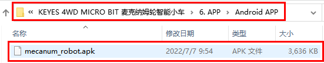
.. |image3| image:: ./media/img-20230427120307.png
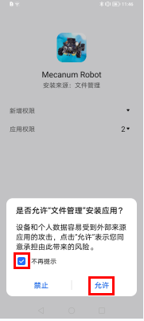
.. |image5| image:: ./media/img-20230427131537.png
.. |image6| image:: ./media/img-20230427131604.png
.. |image7| image:: ./media/img-20230427115929.png
.. |image8| image:: ./media/img-20230427115820.png
.. |image9| image:: ./media/img-20230427132215.png
.. |image10| image:: ./media/img-20230427132531.png
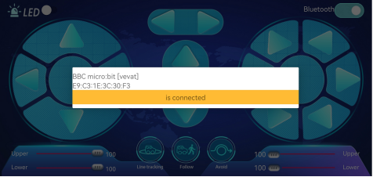
.. |image12| image:: ./media/img-20230327112927.png
.. |image13| image:: ./media/img-20230427135000.png
.. |image14| image:: ./media/img-20230427115929.png
.. |image15| image:: ./media/img-20230427115820.png
.. |image16| image:: ./media/img-20230324110032.png
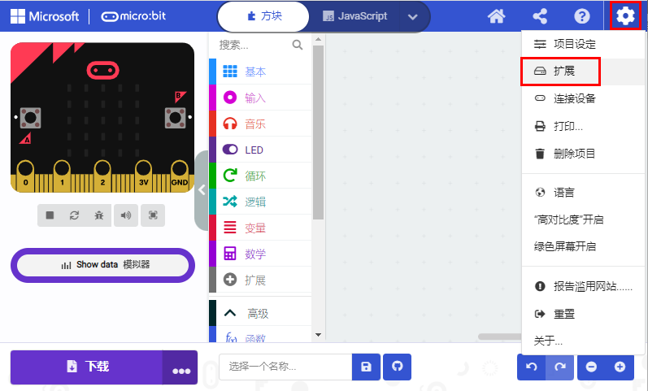
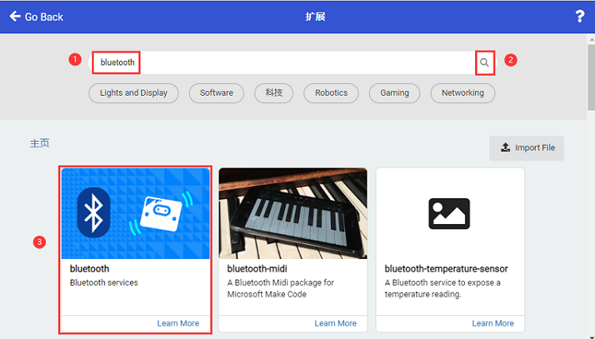
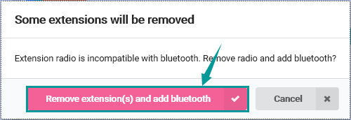
.. |image20| image:: ./media/img-20230327132938.png
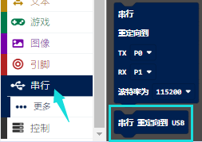
.. |image22| image:: ./media/img-20230417134857.png
.. |image23| image:: ./media/img-20230417161351.png
.. |image24| image:: ./media/img-20230417161504.png
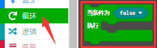
.. |image26| image:: ./media/img-20230417161651.png
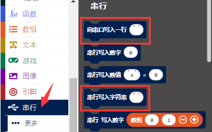
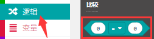
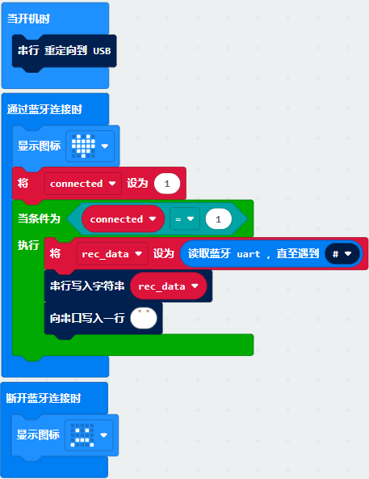
.. |image30| image:: ./media/img-20230327133237.png
.. |image31| image:: ./media/img-20230327114851.png
.. |image32| image:: ./media/img-20230327114939.png
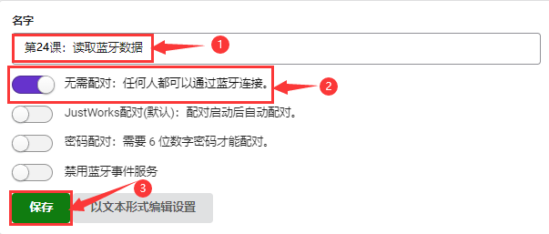
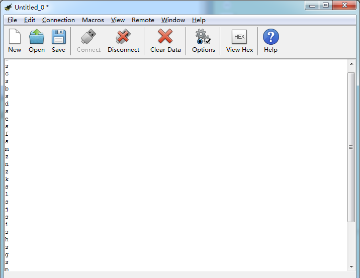
