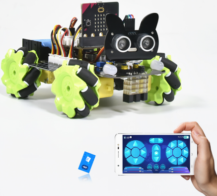
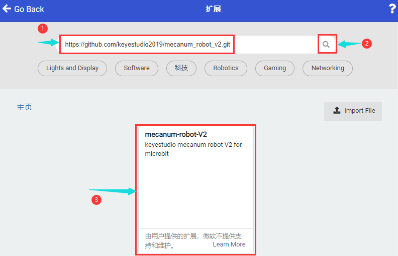
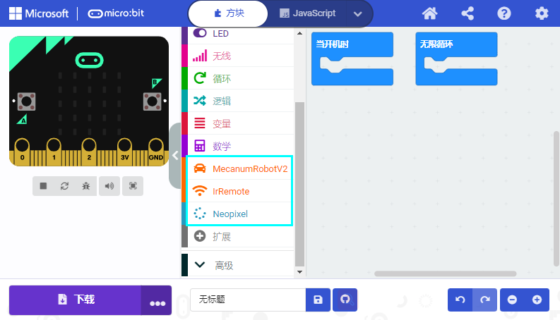
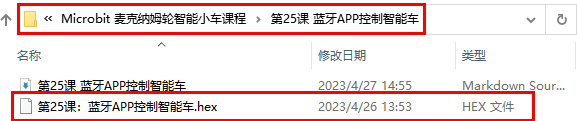
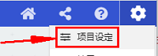
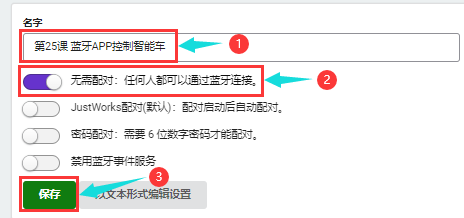
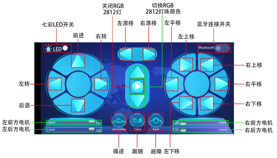

第25课 蓝牙APP控制智能车
========================

|Img|

.. _1实验说明:

1.实验说明：
------------

在上一课程中，我们已经介绍了蓝牙APP的使用和各按钮的功能，并且通过蓝牙APP连接Micro:bit上的蓝牙来读取了APP界面上各按钮发送的控制字符，在本课程中，主要是通过蓝牙APP连接Micro:bit上的蓝牙实现APP控制4WD智能车的多种功能。

.. _2-准备:

2. 准备：
---------

（1）将micro：bit主板正确插入4WD Micro:bit麦克纳姆轮智能小车。

（2）将电池装入4WD Micro:bit麦克纳姆轮智能小车。

（3）将电机驱动底板上的电源拨码开关拨到ON一端，开启电源。

（4）通过micro USB线连接micro:bit主板和电脑。

（5）打开离线版本或Web版本的Makecode。

如果选择通过导入 .Hex文件来加载项目，则无需手动添加蓝牙扩展库。

如果选择手动拖动代码，则首先需要添加蓝牙扩展库和MecanumRobotV2扩展库（详细步骤请参考“\ **开发环境配置**\ ”文件）。

.. _3添加库文件:

3.添加库文件：
--------------

打开MakeCode，先点击右上角的齿轮图标\ |image1|\ （设置），再点击“扩展”。

|image2|

或者单击“\ **高级**\ ”上的“\ **扩展**\ ”。

|image3|

进入库文件选择页面，在文本框输入“\ **bluetooth**\ ”并点击搜索，出现“\ **bluetooth**\ ”扩展库并点击“\ **bluetooth**\ ”扩展库（如果界面有，就不需要通过搜索Bluetooth来找到），如下图所示：

|image4|

由于micro:bit的硬件原因，蓝牙和无线电不能同时工作，所以它们的扩展库互不兼容。安装蓝牙扩展库时，系统将提示您删除无线电扩展。只需确认移除就行。

|image5|

|image6|

这样，蓝牙扩展库就添加好了，接着添加MecanumRobotV2扩展库。

打开MakeCode，先点击右上角的齿轮图标\ |image7|\ （设置），再点击“扩展”。

|image8|

或者单击“\ **高级**\ ”上的“\ **扩展**\ ”。

|image9|

在搜索框中输入链接：\ ``https://github.com/keyestudio2019/mecanum_robot_v2.git``\ ，然后单击搜索。

单击搜索结果MecanumRobotV2以下载并安装。 该过程可能需要几秒钟。

|image10|

安装完成后，你可以在左侧找到MecanumRobotV2的扩展库。

|image11|

注意：添加到项目中的扩展库仅对该项目有效，而不会出现在其他项目中。
因此，当你创建新项目代码时，需要再次添加MecanumRobotV2扩展库。

.. _4实验代码:

4.实验代码：
------------

由于这个代码程序比较复杂，步骤比较多，这里我们就不提供编写代码程序的详细操作步骤，如果你自己有兴趣的话，可以自己拖动代码块来操作下。

我们提供编写好的代码程序，请打开我们提供的示例代码“\ **第25课：蓝牙APP控制智能车.hex**\ ”查看，如下图位置：

|image12|

.. _5实验结果:

5.实验结果：
------------

（1）实验代码编完之后需要设置，先点击右上角的齿轮图标\ |image13|\ （设置），再单击“\ **项目设定**\ ”，在文本框中输入“\ **第25课：蓝牙APP控制智能车**\ ”后，将“\ **无需配对**\ ”设置为“\ **打开**\ ”状态。（如果是直接导入实验代码的就不需要此操作，而自己拖动代码块编写实验代码的就需要此操作）

|image14|

|image15|

|image16|

（2）设置完之后，确定已经将电机驱动底板上的电源拨码开关拨到ON一端，按照之前的方式将实验代码下载到micro：bit主板。这样，下载之后打开手机/ipad应用程序mecanum_robot，然后按照前面的方法完成蓝牙连接，那你就可以操作mecanum_robot蓝牙APP页面上的按钮（控件）来控制4WD智能车自由工作，具体玩法如下：（有关APP的具体下载安装方法及使用方法，请参考\ **第24课
读取蓝牙数据** ）

（1）点击\ |image17|\ 开启七彩灯，再次点击这个按钮七彩灯就会关闭。

（2）点击\ |image18|\ 会进入循迹模式，当想退出该模式时，再次点击该按钮。

（3）点击\ |image19|\ 会进入跟随模式、当想退出该模式时，再次点击该按钮。

（4）点击\ |image20|\ 会进入避障模式，当想退出该模式时，再次点击该按钮。

（5）\ |image21|\ 拉动这两个条幅回改变左边两个电机的速度，右边也是相同的操作方法。

注意：\ |image22|\ 是用来进行调速的，当进行调速时，应该拖动拉条\ |image23|\ ；不能点击\ |image24|\ ，如果点击的话可能调速不成功。

（6）\ |image25|\ 这几个按钮是用来切换底板下面4个2812灯珠颜色的，中间按钮为关闭功能。

（7）剩下其他的按钮全都是用来操控小车行驶的，跟其他按钮不同的是，这些按钮当我们按下时小车行驶，松开按钮时小车停止。

|image26|

.. |image1| image:: ./media/img-20230324110032.png
.. |image2| image:: ./media/img-20230417131743.png
.. |image3| image:: ./media/img-20230417131804.png
.. |image4| image:: ./media/img-20230327120744.png
.. |image5| image:: ./media/img-20230427143817.png
.. |image6| image:: ./media/img-20230327132950.png
.. |image7| image:: ./media/img-20230324110032.png
.. |image8| image:: ./media/img-20230417131743.png
.. |image9| image:: ./media/img-20230417131804.png

.. |image13| image:: ./media/img-20230327133237.png

.. |image20| image:: ./media/img-20230510152720.png
.. |image21| image:: ./media/img-20230510152728.png

.. |image23| image:: ./media/img-20230427150352.png

