MakeCode 教程
=============

开发环境配置
------------

**1.安装 IDE**

Micro:bit是一款无需安装IDE产品，只需要在网页上进行编程下载即可。网址：\ https://makecode.microbit.org/

**2.Micro:bit驱动安装说明：**

Micro:bit是可以免安装USB驱动的。如果你的电脑识别不了Micro:bit主板，则需要安装一下Micro:bit驱动，我们提供有Micro:bit
驱动文件\ |Img|\ ，你可以进入以下路径中中找到。

|image1|

如果你的电脑已经安装过micro:bit
驱动，就不需要再次安装micro:bit驱动。假如你是首次使用micro:bit主板，则你的电脑需要安装micro:bit驱动。

下面给出Micro:bit主板安装驱动的步骤：

首先将Micro:bit主板用Micro
USB数据线连接到电脑上，然后鼠标左键双击驱动文件，出现如下页面再点击“\ **下一页**\ ”。

|image2|

先点击“\ **安装**\ ”，几秒种后，安装完成，再点击“\ **完成**\ ”。这样，驱动安装完成。

|image3|

|image4|

安装完成后，点击“\ **我的电脑**\ ” —>“\ **属性**\ ”—>
“\ **设备管理器**\ ”, 我们可以看到下图。

|image5|

**3.快速开始**

以下的步骤说明基于Windows操作系统，如果你使用的是其他操作系统，可以将其作为参考。

**（1）代码与编程**

本节介绍如何为Micro:bit编写程序以及如何将其下载到Micro:bit主板。
Micro:bit官方网站上有非常详细的教程，
您可以参考：Https://microbit.org/guide/quick/

步骤 1: 连接Micro:bit主板

通过Micro USB线将Micro:bit主板连接到电脑，

|image6|

|image7|

Micro:bit主板背后的红色LED点亮，表明Micro:bit主板有电了。

Micro:bit
将在您的电脑上显示为一个名为'MICROBIT'的驱动器。但请注意，它不是普通的USB磁盘！如下图：

|image8|

步骤 2: 编写程序

在浏览器中访问链接：\ https://makecode.microbit.org/
，然后单击“\ **新建项目**\ ”，出现“\ **创建项目**\ ”对话框，在对话框中输入“\ **心跳**\ ”，单击“\ **创建**\ ”并开始编程。

（以下是以Google Chrome为例，其他浏览器类似）

|image9|

|image10|

|image11|

①使用MakeCode编辑器，写一个Micro:bit代码。
例如，从模块区拖放一些指令方块放入代码编辑区。

下一节将进一步介绍MakeCode。

|image12|

②点击“JS JavaScript”，你可以看到对应的JavaScript语言代码程序，如下图：

|image13|

③你还可以点击“JS JavaScript
”，再点击下拉按钮选择“Python”，你还可以看到对应的Python语言代码程序，如下图：

|image14|

步骤 3: 下载代码

单击编辑器中的“\ **下载**\ ”按钮。
这将下载一个“hex”文件，该文件是Micro:bit主板可以读取的紧凑程序格式。
十六进制文件下载后，将其复制到你的Micro:bit主板，就像将文件复制到USB驱动器一样。
在Windows上，你还可以右键单击并选择“发送到→MICROBIT（E）”将“hex”文件拷贝到Micro:bit主板。

|image15|

也可以将“.hex”文件直接拖入MICROBIT（E）磁盘中。

|image16|

|image17|

将下载好的“hex”文件拷贝到Micro:bit主板过程中，Micro:bit主板背面的黄色信号灯会闪烁，当拷贝完成后黄色信号灯停止闪烁，保持长亮。

步骤Step 4: 运行程序

代码程序上传Micro: bit 主板后，通过Micro USB线或外接电源给Micro:
bit主板供电，Micro: bit 主板上的5 x 5 LED点阵显示心跳的图案。

|image18|

micro USB线供电

|image19|

外接电源供电（3.3V）

每次编程时，MICROBIT驱动器都会自动弹出并返回，但是你的hex文件将会消失。
Micro: bit主板只能接收.hex文件，不会存储任何其他文件！

步骤5：掌握

本小节向你展示了如何开始使用Micro:bit，但是除了MakeCode之外，您还可以使用Python语言和基于文本的JavaScript语言来编写Micro:bit。转到：\ https://microbit.org/code/
查看不同的语言，或查看：\ https://microbit.org/projects/
，了解你可能想要尝试的一些内容。

**（2）Makecode**

在Google Chrome访问链接：\ https://makecode.microbit.org/\ ，
打开MakeCode在线版本

|image20|

点击
“\ **新建项目**\ ”,出现“\ **创建项目**\ ”对话框，在对话框中输入“\ **心跳**\ ”，单击“\ **创建**\ ”进入MakeCode
编译器，MakeCode 编译器如下:

|image21|

在代码编辑区中，有两个固定的指令方块“\ **当开机时**\ ”和“\ **无限循环**\ ”。

上电或复位后，“\ **当开机时**\ ”指令方块中的代码将仅执行一次；并且“\ **无限循环**\ ”指令方块中的代码将循环执行。

**（3）快速下载**

使用MakeCode的浏览器版本下载编写好的代码程序可能需要更多步骤。
但是，如果您将Google Chrome 用于Android，ChromeOS，Linux，macOS和Windows
10系统，则可以实现快速下载功能。

在这里，我们使用Chrome的webUSB功能，该功能允许网页访问您的Micro
USB硬件设备。 我们将按照以下步骤完成Micro：bit设备与网页的连接和配对。

**配对装置：**

用Micro USB线连接电脑和Micro: bit主板。

单击“\ **下载**\ ”后面的“\ **...**\ ”，然后单击“\ **连接设备**\ ”。

|image22|

然后继续单击“\ **下一步**\ ”按钮。

|image23|

再继续单击“\ **下一步**\ ”按钮。

|image24|

在弹出窗口中选中对应的“\ **设备**\ ”，然后单击“\ **连接**\ ”按钮。
如果弹出窗口中没有设备，请参考以下内容：\ https://makecode.microbit.org/device/usb/webusb/troubleshoot

如果你的Micro:bit主板出现问题是需要更新Micro:bit的固件，其内容来自：\ https://microbit.org/guide/firmware/

|image25|

单击“\ **完成**\ ”，设备连接成功。

|image26|

|image27|

**程序下载：**

设备连接成功后，单击“\ **下载**\ ”按钮，程序将直接下载到Micro:bit主板。

注意：有的系统不支持快速下载方式，比如在电脑的设备管理器中可以看到在线驱动CMSIS-DAP安装不成功就不支持快速下载；需要选择其它程序上传方式。比如：\ **右键单击并选择“发送到→MICROBIT（E）”将“hex”文件拷贝到Micro:bit主板。**
等程序上传方式。

|image28|

**4.MakeCode扩展库：**

为了轻松使用Mecanum Robot Car V2.0，我们为Mecanum Robot Car
V2.0制作了一个MakeCode扩展库。

**（1）添加Mecanum Robot Car V2.0扩展库：**

您可以通过以下方法添加Mecanum Robot Car V2.0扩展库文件。

打开MakeCode，先点击右上角的齿轮图标\ |image29|\ （设置），再点击“扩展”。

|image30|

或者单击“\ **高级**\ ”上的“\ **扩展**\ ”。

|image31|

在搜索框中输入链接：\ ``https://github.com/keyestudio2019/mecanum_robot_v2.git``\ ，然后单击搜索。

单击搜索结果MecanumRobotV2以下载并安装。 该过程可能需要几秒钟。

|image32|

安装完成后，你可以在左侧找到MecanumRobotV2的扩展库。

|image33|

注意：添加到项目中的扩展库仅对该项目有效，而不会出现在其他项目中。
因此，当你创建新项目代码时，需要再次添加MecanumRobotV2扩展库。

（2）更新或删除MecanumRobotV2扩展库：

如果您需要更新或删除MecanumRobotV2扩展库文件，请按照以下说明进行操作。

点击 "Js JavaScript" 按钮切换到文本代码。

|image34|

点击左边的“\ **资源管理器**\ ”.

|image35|

在扩展列表中找到扩展库文件。单击垃圾箱图标以删除MecanumRobotV2扩展库文件。单击刷新图标以更新MecanumRobotV2扩展库文件。

|image36|

**5.导入代码：**

我们为每个项目提供十六进制代码文件（项目文件）。十六进制代码文件包含项目的所有内容，可以直接导入，你也可以手动拖动代码块来完成每个项目的代码程序。如果选择通过手动拖动代码块来完成项目代码，则可能需要添加必要的扩展库。

对于简单项目，建议通过拖动代码块来完成项目。

对于复杂的项目，建议通过导入我们提供的十六进制代码文件来完成项目.

接下来，我们以“ 心跳”项目为例，介绍如何加载代码。

打开Web版本Makecode或离线版本Makecode，单击“\ **导入**\ ”。

|image37|

在弹出的对话框中，单击“\ **导入文件**\ ”。

|image38|

|image39|

选择文件“ ..\\4. MakeCode 教程\\3. 项目课程\\Microbit 基础课程\\第01课
心跳\\第1课：心跳.hex”。 然后点击“继续！√”

|image40|

|image41|

除了上述将提供的项目代码程序文件直接导入到Makecode编译器中的方法之外，也可以将我们提供的项目代码程序文件直接拖入到Makecode编译器中的代码编辑区，如下图所示：

|image42|

几秒钟后，项目成功加载。

|image43|

注意：如果你的电脑系统是Windows7/8而不是Windows 10，则在Google
Chrome中是无法进行设备配对，从而读取不了一些传感器/模块的数字信号或模拟信号，可是又需要读取相应的传感器/模块的数字信号或模拟信号，那怎么办呢？这里就可以使用CoolTerm软件来读取串口数据的，下面是CoolTerm安装方法。

**6.CoolTerm软件安装方法：**

这里需要安装CoolTerm程序软件，CoolTerm程序软件是用来在下面的一些实验中读取串口通讯的，这里我们提供了CoolTerm程序软件的下载链接：\ https://freeware.the-meiers.org/

（1）现在，让我们来安装CoolTerm程序软件，这里我们是以PC
Windows系统为例，选择下载安装CoolTerm Win，下载后解压并打开。（Mac系统和
Linux系统也类似）

|image44|

|image45|

（2）左键双击程序文件\ |image46|\ 。（注意：必须保证micro:bit驱动已安装和micro:bit主板连接到电脑上）

|image47|

工具栏上每个按钮的功能如下所示：

========= ==========================
|image48| 打开一个新的终端机
========= ==========================
|image49| 打开保存好的连接
|image50| 保存
|image51| 打开串行连接
|image52| 关闭串行连接
|image53| 清除接收到的数据
|image54| 打开“连接选项”对话框
|image55| 以十六进制格式显示终端数据
|image56| 帮助
========= ==========================

.. _4wd-microbit麦克纳姆轮智能小车的安装步骤:

4WD Microbit麦克纳姆轮智能小车的安装步骤
----------------------------------------

**安装1**

安装所需零件:

|image57|

安装:

|image58|

完成:

|image59|

**安装2**

安装所需零件:

|image60|

安装:

|image61|

完成:

|image62|

**安装3**

安装所需零件：

|image63|

安装：

|image64|

完成：

|image65|

**安装4**

**舵机初始化：**

安装前需要先设置舵机角度为90°。设置舵机角度时，将舵机连接在Microbit扩展板的G、V、P14，在Microbit主控板上上传对应代码，外接电源供电后，按下Microbit主控板上的复位按键，舵机就转到90°的位置。

==== ==============
舵机 Microbit扩展板
==== ==============
棕线 G
红线 V
橙线 P14
==== ==============

|image66|

|image67|

我们提供的舵机初始化角度的代码位置如下图：

|image68|

安装所需零件：

|image69|

安装：

(注意安装方向)

|image70|

完成：

|image71|

**安装5**

安装所需零件：

|image72|

安装：

|image73|

完成：

|image74|

**安装6**

安装所需零件：

|image75|

安装：

|image76|

完成：

|image77|

**安装7**

安装所需零件：

|image78|

安装：

（注意电机安装方向，线材方向朝内）

|image79|

完成：

|image80|

**安装8**

安装所需零件：

|image81|

安装：

|image82|

完成：

|image83|

**安装9**

安装所需零件：

|image84|

安装：

|image85|

完成：

|image86|

**安装10**

安装准备零件：

|image87|

安装：

|image88|

完成：

|image89|

**接线**

舵机接线：

==== ==============
舵机 Microbit扩展板
==== ==============
棕线 G
红线 V
橙线 P14
==== ==============

|image90|

|image91|

超声波模块接线：

========== ==============
超声波模块 Microbit扩展板
========== ==============
Vcc        5V
Trig       P15
Echo       P16
Gnd        G
========== ==============

|image92|

|image93|

控制红外模块接线：

====== ==============
驱动板 Microbit扩展板
====== ==============
GND    G
5V     5V
S5     P0
====== ==============

|image94|

|image95|

控制WS2812RGB接线：

====== ==============
驱动板 Microbit扩展板
====== ==============
GND    G
5V     5V
S4     P7
====== ==============

|image96|

|image97|

控制电机和七彩灯接线:

====== ==============
驱动板 Microbit扩展板
====== ==============
SCL    P19
SDA    P20
5V     5V
GND    G
====== ==============

|image98|

|image99|

控制三路循迹模块接线:

====== ==============
驱动板 Microbit扩展板
====== ==============
S1     P10
S2     P4
S3     P3
\      
GND    G
====== ==============

|image100|

|image101|

电源接线:

|image102|

电机接到对应的接口上:

|image103|

电池安装示范:

|image104|

项目课程
--------

Microbit 基础课程
~~~~~~~~~~~~~~~~~

第01课 心跳
^^^^^^^^^^^

Micro:bit 基础课程是使用Micro:bit主板自带的传感器模块和LED点阵。

|image105|

1.实验说明：

首先先来练习一个不需要其他辅助元件，只需要一块Micro:bit主板，一根Micro
USB数据线与一台计算机的简单实验，让Micro:bit主板上的点阵显示“心跳”，这是一个让Micro:bit主板和计算机通信的实验，这也是一个入门实验，希望可以带领大家进入Micro:bit的魔幻世界。

2.准备：

（1）通过Micro USB线连接Micro:bit主板和电脑。

|image106|

（2）打开离线版本或Web版本的MakeCode。

|image107|

如果是选择通过导入Hex文件来加载项目，请单击“导入”。(方法请参照“\ **开发环境设置**\ ”文档)

|image108|

如果要一一拖动代码块，请单击“\ **新建项目**\ ”。

|image109|

3.实验代码：

可以直接加载我们提供的程序，也可以自己通过拖动代码块来编写代码程序，操作步骤如下：

**（1）寻找代码块**

|image110|

**（2）完整的代码程序**

|image111|

4.实验结果:

按照之前的方式将代码下载到Micro:bit主板，Micro
USB数据线不要拔下来，利用Micro
USB数据线上电，Micro:bit主板上的LED点阵屏切换显示“❤”图案和“\ |image112|\ ”图案，循环进行。

如果存在下载问题，请断开Micro
USB线和Micro:bit主板，然后重新连接它们并重新打开MakeCode编辑器，以尝试再次下载。

|image113|

|image114|

第02课 LED点阵中单个LED显示
^^^^^^^^^^^^^^^^^^^^^^^^^^^

|image115|

1.实验说明：

Micro:bit主板的LED点阵共由25个发光二极管组成，5个一组，分别对应X和Y方向，形成一个5×5的矩阵，且每个发光二极管是放置在行线（X）和列线（Y）的交叉点上，我们可以通过设置坐标点来实现对25个LED中某一个LED的控制。例如，想要LED点阵中第1行第1个LED点亮，可以设置坐标点为（0，0）；第1行第3个LED点亮，可以设置坐标点为（2，0）；第1列第5个LED点亮，可以设置坐标点为（0，4）；第3列第2个LED点亮，可以设置坐标点为（2，1），依此类推。

|image116|

2.准备：

（1）通过Micro USB线连接Micro:bit主板和电脑。

|image117|

（2）打开离线版本或Web版本的MakeCode。

|image118|

如果是选择通过导入Hex文件来加载项目，请单击“导入”。(方法请参照“\ **开发环境设置**\ ”文档)

|image119|

如果要一一拖动代码块，请单击“\ **新建项目**\ ”。

|image120|

3.实验代码：

可以直接加载我们提供的程序，也可以自己通过拖动代码块来编写代码程序，操作步骤如下：

**（1）寻找代码块**

|image121|

|image122|

|image123|

**（2）完整的代码程序：**

|image124|

4.实验结果：

按照之前的方式将代码下载到Micro:bit主板，Micro
USB数据线不要拔下来，利用Micro
USB数据线上电，我们就可以看到切换坐标点(1,0)的LED的亮灭状态，持续0.5s，再次切换坐标点(1,0)的LED的亮灭状态，持续0.5s；点亮坐标点(3,4)的LED，持续0.5s，熄灭坐标点(3,4)的LED，持续0.5s。循环进行。

|image125|

|image126|

第03课 5 x 5 LED点阵图案显示
^^^^^^^^^^^^^^^^^^^^^^^^^^^^

|image127|

1.实验说明：

点阵在我们生活中很常见，很多都有用到它，比如LED广告显示屏，电梯显示楼层，公交车报站等等。

Micro:bit主板的LED点阵共由25个发光二极管组成，上一课我们已经讲过通过设置坐标点来实现对LED点阵的25个LED中的某个LED的控制，这样可以通过设置多个坐标点控制多个LED的亮灭使得LED点阵能够显示图案、数字、字符串。我们也可以在特定代码中通过点击
LED点阵的灰白色小正方形点亮
LED点阵对应的LED来实现LED点阵显示图案、数字、字符串。除了上述方法还可以使用自定义图案使LED点阵显示图案。

2.准备：

（1）通过Micro USB线连接Micro:bit主板和电脑。

|image128|

（2）打开离线版本或Web版本的MakeCode。

|image129|

如果是选择通过导入Hex文件来加载项目，请单击“导入”。(方法请参照“\ **开发环境设置**\ ”文档)

|image130|

如果要一一拖动代码块，请单击“\ **新建项目**\ ”。

|image131|

3.实验程序1：

可以直接加载我们提供的程序，也可以自己通过拖动代码块来编写代码程序，操作步骤如下：

**（1）寻找代码块**

|image132|

|image133|

**（2）完整的代码程序：**

|image134|

4.实验结果1：

按照之前的方式将代码1下载到Micro:bit主板，Micro
USB数据线不要拔下来，利用Micro
USB数据线上电，我们就可以看到Micro:bit主板的5×5
LED点阵显示“向下”图案\ |image135|\ 。

5.实验程序2：

可以直接加载我们提供的程序，也可以自己通过拖动代码块来编写代码程序，操作步骤如下：

**（1）寻找代码块**

|image136|

|image137|

**（2）完整的代码程序**

|image138|

6.实验结果2：

用同样的方法将代码2下载到Micro:bit主板，Micro
USB数据线不要拔下来，利用Micro
USB数据线上电，我们就可以看到Micro:bit主板的5×5
LED点阵开始显示数字1、2、3、4、5，然后循环显示“向下”图案\ |image139|\ 、字符串“Hello!”、“心”图案\ |image140|\ 、“东北”方向图案\ |image141|\ 、“东南”方向图案\ |image142|\ 、“西南”方向图案\ |image143|\ 和“西北”方向图案\ |image144|\ 。

第04课 可编程按键
^^^^^^^^^^^^^^^^^

|image145|

1.实验说明：

|image146|

按键可以控制电路的通断，把按键接入电路中，不按下按键的时候电路是断开的，一按下按键电路就通啦，但是松开之后就又断了。可是为什么按下才通电呢？这得从按键的内部构造说起。没按下之前，电流从按键的一端过不去另一端，按键的两端就像两座山，中间隔着一条河，我们在这座山过不去另一座山；按下的时候，按键内部的金属片把两边连接起来让电流通过，就像搭了一座桥，把两座山连接起来。

按键内部结构如图：\ |image147|\ ，未按下按键之前，1、2就是导通的，3、4也是导通的，但是1、3或1、4或2、3或2、4是断开（不通）的；只有按下按键时，1、3或1、4或2、3或2、4才是导通的。

Micro:bit主板有三个按键，反面的是复位按钮，正面的是两个可编程按键，通过对两个可编程按键组合可以有三种组合，作为输入元件。我们结合上节课的LED点阵，一起来学习按键吧。我们做一个按键三连，分别按A、B和AB同时按，对应显示屏分别显示A、B和AB。

2.准备：

（1）通过Micro USB线连接Micro:bit主板和电脑。

|image148|

（2）打开离线版本或Web版本的MakeCode。

|image149|

如果是选择通过导入Hex文件来加载项目，请单击“导入”。(方法请参照“\ **开发环境设置**\ ”文档)

|image150|

如果要一一拖动代码块，请单击“\ **新建项目**\ ”。

|image151|

3.实验程序1：

按下Micro:bit主板上的按键A，按键B和按键A+B，让Micro:bit上LED点阵显示字符串。

可以直接加载我们提供的程序，也可以自己通过拖动程序块来编写程序程序，操作步骤如下：

**（1）寻找代码块**

|image152|

|image153|

**（2）完整的程序程序**

|image154|

4.实验结果1：

按照之前的方式将程序1下载到Micro:bit主板，Micro
USB数据线不要拔下来，利用Micro
USB数据线上电，按下Micro:bit主板上按键A，我们可以看到5×5
LED点阵显示字符“A”；按下Micro:bit主板上按键B，我们可以看到5×5
LED点阵显示字符“B”，同时按下Micro:bit主板上按键A+B，我们就可以看到5×5
LED点阵显示字符“AB”。

5.实验程序2：

按下Micro:bit主板上按键A和按键B，对应的增加和减少条形图高度，表现为LED点阵亮的行数对应的增加和减少。

可以直接加载我们提供的程序，也可以自己通过拖动代码块来编写代码程序，操作步骤如下：

**（1）创建变量item**

|image155|

|image156|

|image157|

**（2）寻找代码块**

|image158|

|image159|

|image160|

|image161|

|image162|

**（3）完整的代码程序**

|image163|

6.实验结果2：

用同样的方式将程序2下载到Micro:bit主板，Micro
USB数据线不要拔下来，利用Micro
USB数据线上电，按下Micro:bit主板主板上按键A，条形图高度值增加5，表现为LED点阵亮的行数增加；按下按键B，减少条形图高度，表现为LED点阵亮的行数减少。

第05课 学习测温度
^^^^^^^^^^^^^^^^^

1.实验说明：

Micro:bit主板实际上并不带温度传感器，而是采用nRF52833芯片内置的温度传感器进行温度检测，所以检测的温度更接近芯片的温度，可能与周围环境温度存在一定的误差。在这一课程中，我们先利用该传感器测试当前环境中的温度，并将测试结果在显示数据(设备)中显示，再通过设置该传感器检测的温度范围来控制LED点阵显示不同的图案。

注意：Micro:bit主板的温度传感器在这里： |image164|

2.准备：

（1）通过Micro USB线连接Micro:bit主板和电脑。

|image165|

（2）打开离线版本或Web版本的MakeCode。

|image166|

如果是选择通过导入Hex文件来加载项目，请单击“导入”。(方法请参照“\ **开发环境设置**\ ”文档)

|image167|

如果要一一拖动代码块，请单击“\ **新建项目**\ ”。

|image168|

3.实验程序1：

Micro:bit检测温度

可以直接加载我们提供的程序，也可以自己通过拖动程序块来编写程序程序，操作步骤如下：

**（1）寻找代码块**

|image169|

|image170|

|image171|

|image172|

**（2）完整代码程序**

|image173|

4.实验结果1:

按照之前的方式将程序1下载至Micro: bit主板，Micro
USB数据线不要拔下来，利用Micro USB数据线上电。

打开CoolTerm
软件，点击Options，选择串行Port，设置COM口和波特率，波特率设置为115200（经过测试，Micro:bit的USB串口通讯波特率是115200），点击OK后，最后点击Connect。CoolTerm的串口监视器显示当前环境中的温度值，如下图：

|image174|

|image175|

|image176|

5.实验程序2：

通过温度控制Micro:bit主板上点阵显示不同图案（注意：程序中的温度值可以根据当地环境适当的调整）

可以直接加载我们提供的程序，也可以自己通过拖动程序块来编写程序程序，操作步骤如下：（这里设置的温度值可以根据实际情况重新设置）

**（1）寻找代码块**

|image177|

|image178|

|image179|

|image180|

|image181|

**（2）完整的代码程序**

|image182|

6.实验结果2：

按照之前的方式将程序2下载到Micro:bit主板，Micro
USB数据线不要拔下来，利用Micro
USB数据线上电，外界环境中的温度小于35℃时，Micro:bit主板的5×5LED点阵中显示图案\ |image183|\ ，用手按住Micro:bit主板的温度传感器，温度大于等于35℃时，5×5LED点阵中显示图案\ |image184|\ 。

第06课 地磁传感器
^^^^^^^^^^^^^^^^^

|image185|

1.实验说明：

本实验项目主要介绍Micro:bit地磁传感器的使用，地磁传感器除了检测地磁场强度外，还能当作指南针确定方向，同时也是航姿参考系统(AHRS)的重要组成部分。Micro:bit
V2主板采用的是LSM303AGR 地磁传感器，磁场动态范围为±50 gauss。在micro:bit
V2主板中，磁力检测、指南针积木块均用到了磁力计栏，本实验中，将先介绍指南针，然后查看磁力计原始数据。常见的指南针主要部件是一根磁针，在地磁场的作用下可以转动并指向地磁北极（地磁北极是在地理南极附近），用来辨别方向。

micro:bit内部的一个地磁传感器（磁力计、指南针），我们可以读取这个磁力计的读数来判断方位，得到相对于北磁极的数值。返回值是0到360之间的数值，在磁力计首次开始工作（带到新位置后）时系统会自动要求我们对micro:bit主板校准，正确的校准方式是旋转micro:bit主板。需要注意的是，附近要是有金属物件可能会影响读数和校准准确性。

2.准备：

（1）通过Micro USB线连接Micro:bit主板和电脑。

|image186|

（2）打开离线版本或Web版本的MakeCode。

|image187|

如果是选择通过导入Hex文件来加载项目，请单击“导入”。(方法请参照“\ **开发环境设置**\ ”文档)

|image188|

如果要一一拖动代码块，请单击“\ **新建项目**\ ”。

|image189|

3.实验程序1：

按下按键A的时候，可以在屏幕上显示磁力计的读数。

可以直接加载我们提供的程序，也可以自己通过拖动程序块来编写程序程序，操作步骤如下：

**（1）寻找代码块**

|image190|

|image191|

|image192|

|image193|

**（2）完整代码程序**

|image194|

程序说明：首先必须对Micro:bit进行校准，因为每个地方地磁场不同，对结果有比较大的的影响，如果是第一次使用指南针，Micro:bit会自动提示需要校准。

4.实验结果1:

按照之前的方式将程序1下载至Micro: bit主板，micro
USB数据线不要拔下来，利用Micro
USB数据线上电，按下Micro:bit主板上正面按键A时，Micro:bit主板首先提示校准，屏幕(LED点阵)提示:“TILT
TO FILL
SCREEN”,然后进入校准界面，校准方式为：旋转Micro:bit主板，使得屏幕(LED点阵)画一个封闭的正方形（25个LED都点亮），如下图所示：

|image195|

当封闭的正方形画好后，会显示一个“笑脸”图案\ |image196|\ ，表示校准完成。

校准完成后，当每次按下按键A的时候，直接在屏幕上显示磁力计读数，北、东、南、西对应0°、90°、180°、270°。

5.实验程序2：

朝不同的方向旋转磁力计，LED点阵显示对应的方向图案。

|image197|

该代码块是可以持续磁力计的读数来确定方向，并让箭头指向当前的磁北极。

|image198|

如上图所示，如果读数在292.5和337.5之间，就让显示屏显示一个指向右上方的箭头，由于程序里不能输入0.5，所以取的判断数值是293和338。之后再加入其它逻辑判断条件，就得到了完整的程序。

可以直接加载我们提供的程序，也可以自己通过拖动程序块来编写程序程序，操作步骤如下：

**（1）寻找代码块**

|image199|

|image200|

|image201|

|image202|

|image203|

**（2）完整的代码程序**

|image204|

|image205|

|image206|

6.实验结果2：

按照之前的方式将程序2下载到Micro:bit主板，Micro
USB数据线不要拔下来，利用Micro
USB数据线上电，提示校准（校准方法请参考:上面程序1部分），校准完成后，旋转移动Micro:bit主板，可以看到Micro:bit主板上LED点阵显示各方向图案。

第07课 加速度传感器
^^^^^^^^^^^^^^^^^^^

|image207|

1.实验说明：

Micro:bit V2主板内置有LSM303AGR
重力加速度传感器（加速度计），其具有8/10/12
bits的分辨率，程序可设置量程为1g、2g、4g,、8g。

我们常使用加速度计来检测机器的姿态。

在本实验项目中，将介绍加速度传感器（加速度计）对几个特殊姿态的检测，之后来查看加速度传感器输出的三轴原始数据。

2.准备：

（1）通过Micro USB线连接Micro:bit主板和电脑。

|image208|

（2）打开离线版本或Web版本的MakeCode。

|image209|

如果是选择通过导入Hex文件来加载项目，请单击“导入”。(方法请参照“\ **开发环境设置**\ ”文档)

|image210|

如果要一一拖动代码块，请单击“\ **新建项目**\ ”。

|image211|

3.实验程序1：

对Micro:bit不同的操作，LED点阵显示对应的数字。

可以直接加载我们提供的程序，也可以自己通过拖动程序块来编写程序，操作步骤如下：

**（1）寻找代码块**

|image212|

|image213|

**（2）完整代码程序**

|image214|

4.实验结果1:

按照之前的方式将程序1下载到Micro:bit主板，利用Micro
USB数据线上电，将Micro:bit主板晃动，则可见Micro:bit显示数字1（表明只要有晃动，无论朝哪个方向晃动，该条件都将满足）。

当Micro:bit主板的Logo朝上时，LED点阵显示数字2，Logo朝上示意图如下所示：

|image215|

同理，Micro:bit主板的Logo朝上时，LED点阵显示数字3(倒立的3)，Logo朝下示意图如下所示：

|image216|

当屏幕朝上（指的是LED点阵朝上）时，LED点阵显示数字4。如下图所示：

|image217|

同理，当屏幕朝下（指的是LED点阵朝下）时，LED点阵显示数字5。

当Micro:bit
主板向左倾斜（是指LED点阵先朝上，然后再往左边倾斜）时，LED点阵显示数字6。如下图所示：

|image218|

同理，当Micro:bit主板向右倾斜（是指LED点阵先朝上，然后再往右边倾斜）时，LED点阵显示数字7。如下图所示：

|image219|

当不小心碰到Micro:bit主板使其从桌面掉落，则为做自由落体运动，此时，Micro:bit主板满足自由落体的条件，则LED点阵显示数字8。（注意：此方法操作时，很容易把micro:bit主板摔坏，不建议操作）

注意：（3g、6g、8g，
如果需要满足此条件，则需要达到3倍，6倍，8倍重力加速度甩动Micro:bit主板。如果你们有兴趣的话，这部分程序可以自己添加）

5.实验程序2：

检测加速度在X轴，Y轴，Z轴的不同的值

可以直接加载我们提供的程序，也可以自己通过拖动程序块来编写程序，操作步骤如下：

**（1）寻找代码块**

|image220|

|image221|

|image222|

|image223|

**（2）完整的代码程序**

|image224|

6.实验结果2：

按照之前的方式将程序2下载到Micro:bit主板，Micro
USB数据线不要拔下来，利用Micro USB数据线上电。
打开CoolTerm，点击Options，选择串行Port，设置COM口和波特率，波特率设置为115200（经过测试，Micro:bit的USB串口通讯波特率是115200），点击OK后，最后点击Connect。CoolTerm串口监视器分别显示了加速度在X轴、Y轴、Z轴的分解，以及加速度的合成(重力加速度及其它外力作用的加速度合成)，先将加速计Z轴朝上，然后再将加速计X轴朝上，最后将加速计Z轴朝上,可得数据变化如下图：

|image225|

第08课 光照强度检测
^^^^^^^^^^^^^^^^^^^

|image226|

1.实验说明：

本实验将介绍Micro:bit对外界光照强度的检测，由于Micro:bit并不自带光敏传感器，对外界光照强度的检测是通过LED矩阵进行的，LED矩阵被用来感知周围的光，并反复地将LED转换成输入，并采样电压衰减时间。这样检测出来的光照强度是一个相对值。

2.准备：

（1）通过Micro USB线连接Micro:bit主板和电脑。

|image227|

（2）打开离线版本或Web版本的MakeCode。

|image228|

如果是选择通过导入Hex文件来加载项目，请单击“导入”。(方法请参照“\ **开发环境设置**\ ”文档)

|image229|

如果要一一拖动代码块，请单击“\ **新建项目**\ ”。

|image230|

3.实验程序：

可以直接加载我们提供的程序，也可以自己通过拖动程序块来编写程序，操作步骤如下：

**（1）寻找代码块**

|image231|

|image232|

|image233|

|image234|

**（2）完整代码程序**

|image235|

4.实验结果：

按照之前的方式将代码下载到Micro:bit主板，Micro
USB数据线不要拔下来，利用Micro USB数据线上电。

打开CoolTerm，点击Options，选择串行Port，设置COM口和波特率，波特率设置为115200（经过测试，micro:bit的USB串口通讯波特率是115200），点击OK后，最后点击Connect。这样，CoolTerm串口监视器显示光线亮度级别值。

|image236|

第09课 扬声器
^^^^^^^^^^^^^

|image237|

1.实验说明：

Micro:bit主板有内置扬声器，这使得在你的项目中添加声音变得非常容易。通过编程使扬声器发出各种各样的音调，例如编写一首歌曲：《欢乐颂》，让扬声器播放出来。

2.准备：

（1）通过Micro USB线连接Micro:bit主板和电脑。

|image238|

（2）打开离线版本或Web版本的MakeCode。

|image239|

如果是选择通过导入Hex文件来加载项目，请单击“导入”。(方法请参照“\ **开发环境设置**\ ”文档)

|image240|

如果要一一拖动代码块，请单击“\ **新建项目**\ ”。

|image241|

3.实验程序1：

发出声音

可以直接加载我们提供的程序，也可以自己通过拖动程序块来编写程序，操作步骤如下：

**（1）寻找代码块**

|image242|

|image243|

|image244|

**（2）完整代码程序**

|image245|

4.实验现象1:

按照之前的方式将实验程序2下载到Micro:bit主板，利用Micro
USB数据线上电，Micro:bit主板上的扬声器发出声音且LED点阵显示音乐标志图案。

5.实验程序2：

演奏一首《欢乐颂》歌曲

歌曲《欢乐颂》的简谱如下：

|image246|

可以直接加载我们提供的程序，也可以自己通过拖动程序块来编写程序，操作步骤如下：

**（1）寻找代码块**

|image247|

|image248|

**（2）完整代码程序**

|image249|

|image250|

|image251|

|image252|

|image253|

|image254|

|image255|

|image256|

6.实验现象2:

按照之前的方式将实验程序2下载到Micro:bit主板，利用Micro
USB数据线上电，Micro:bit主板上的扬声器播放一首《欢乐颂》歌曲。

第10课 触摸感应logo
^^^^^^^^^^^^^^^^^^^

|image257|

1.实验说明：

如果你有了Micro:bit主板，你可以在你的项目中使用金色的触摸感应logo作为另一个输入，这就像多了一个按钮。触摸感应采用的是电容式触摸传感器，当你手指按下（或触摸）它时，它就能感应到电场的微小变化----就像你的手机或平板电脑屏幕一样。当你触摸它，能控制Micro:bit板实现某个功能。

2.准备：

（1）通过Micro USB线连接Micro:bit主板和电脑。

|image258|

（2）打开离线版本或Web版本的MakeCode。

|image259|

如果是选择通过导入Hex文件来加载项目，请单击“导入”。(方法请参照“\ **开发环境设置**\ ”文档)

|image260|

如果要一一拖动代码块，请单击“\ **新建项目**\ ”。

|image261|

3.实验代码：

可以直接加载我们提供的程序，也可以自己通过拖动程序块来编写程序，操作步骤如下：

**（1）寻找代码块**

|image262|

|image263|

|image264|

|image265|

|image266|

**（2）完整代码程序**

|image267|

4.实验现象：

按照之前的方式将实验代码下载到Micro:bit板，利用Micro
USB数据线上电，手指按住Micro:bit主板上“Logo”标志处，Micro:bit主板上的LED点阵显示“❤”图案；手指松开Micro:bit主板上“Logo”标志处，会出现数字。

第11课 麦克风
^^^^^^^^^^^^^

|image268|

|image269|

1.实验说明：

Micro:bit
主板有一个内置麦克风，可以测量环境的声音程度。你可以使用它作为一个简单的输入---当你鼓掌时，Micro:bit主板上前面内置麦克风LED指示灯会被打开。它还可以测量声音的强度，所以你可以制作一个噪音等级表或与音乐合拍的迪斯科灯光。麦克风是在Micro:bit
主板的背面，而在前面，你会发现一个内置麦克风LED指示灯，还有紧挨着让声音进入麦克风的孔。当你Micro:bit主板在测量声音级别时，它就会亮起来。

2.准备：

（1）通过Micro USB线连接Micro:bit主板和电脑。

|image270|

（2）打开离线版本或Web版本的MakeCode。

|image271|

如果是选择通过导入Hex文件来加载项目，请单击“导入”。(方法请参照“\ **开发环境设置**\ ”文档)

|image272|

如果要一一拖动代码块，请单击“\ **新建项目**\ ”。

|image273|

3.实验程序1：

可以直接加载我们提供的程序，也可以自己通过拖动程序块来编写程序，操作步骤如下：

**（1）寻找代码块**

|image274|

|image275|

**（2）完整代码程序**

|image276|

4.实验结果1:

按照之前的方式将实验程序1下载到Micro:bit板，利用Micro
USB数据线上电，当你鼓掌时，Micro:bit
主板上的LED点阵显示“❤”图案；当外界环境安静时，Micro:bit
主板上的LED点阵显示“\ |image277|\ ”图案。

5.实验程序2：

可以直接加载我们提供的程序，也可以自己通过拖动程序块来编写程序，操作步骤如下：

**（1）寻找代码块**

|image278|

|image279|

|image280|

|image281|

|image282|

|image283|

**（2）完整代码程序**

|image284|

6.实验结果2：

按照之前的方式将实验程序2下载到Micro:bit主板，利用Micro USB数据线上电。

打开CoolTerm，点击Options，选择串行Port，设置COM口和波特率，波特率设置为115200（经过测试，Micro:bit的USB串口通讯波特率是115200），点击OK后，最后点击Connect。CoolTerm串口监视器显示了声音强度值。

|image285|

第12课 Microbit 蓝牙无线通信
^^^^^^^^^^^^^^^^^^^^^^^^^^^^

|image286|

1.实验说明：

Micro:bit主板了处理器内置蓝牙5.1低功耗的BLE(蓝牙 Low
Energy)设备）以及2.4GHz天线，可进行蓝牙无线通信和2.4GHz无线通信。使得Micro:bit主板可以与各种蓝牙设备进行通信，包括智能手机和平板电脑。
在本实验中，主要讲解新款的Micro:bit主板实现蓝牙无线通信功能，我们可以通过连接蓝牙，实现无线传输代码（信号）功能。我们利用一个苹果系统设备（手机/iPad）和Micro:bit
主板连接，实现无线传输功能。设置安卓系统手机实现无线传输方法和苹果系统设备（手机/iPad）类似，这里就不一一介绍了。

2.准备：

（1）通过Micro USB线连接Micro:bit主板和电脑。

|image287|

（2）苹果系统设备（手机/iPad）或安卓系统手机。

3.实验步骤：

App下载链接：\ https://microbit.org/get-started/user-guide/mobile/
（安卓系统下载参考链接）

我们以苹果系统设备为例：

（1）如果你的智能手机/iPad是苹果系统的，需要先在电脑上进入网页：\ https://www.microbit.org/get-started/user-guide/ble-ios/
，往下翻点击“Download pairing HEX
file”下载micro:bit的固件到创建的文件夹中或电脑桌面上，并将下载好的Micro:bit固件烧入Micro:bit主板中。（这一步只针对于苹果系统的智能手机/iPad，安卓系统智能手机/不需要这一步）

|image288|

|image289|

（2）在苹果系统设备（手机/iPad）上打开\ |image290|\ ，在App
Store的搜索框中输入“micro bit”，然后选中micro:bit
选项，会出现下载界面（如下图所示：），点击“\ |image291|\ ”，就可以下载安装对应的APP。

|image292|

（3）苹果系统设备（手机/iPad）和Micro:bit主板配对连接。

a.APP安装成功后，打开苹果系统设备（手机/iPad）上的蓝牙。

|image293|

b.点击\ |image294|\ 打开APP，先确定Micro
USB数据线已经将Micro:bit主板和电脑连接上，再点击APP的第一项“\ **Choose
micro:bit**\ ”，开始配对蓝牙。

|image295|

c.点击“\ **Pair a new micro:bit**\ ”，开始配对。

|image296|

d.根据提示，首先同时按住micro:bit主板上的按键A和B，然后按下micro:bit主板后面的复位&电源按钮几秒钟（按键A和B不能松开），再松开复位&电源按钮，micro:bit主板上LED点阵会显示一个密码图案。最后松开micro:bit主板上的按键A和B，接着点击“\ **Next**\ ”。

|image297|

|image298|

e.在苹果系统手机/iPad上设置密码图案，使图案和micro:bit主板上显示的密码图案一样，点击“\ **Next**\ ”。

|image299|

f.点击“\ **Next**\ ”，出现对话框，在对话框中点击“\ **Pair**\ ”。几秒钟后，配对成功，同时Micro:bit主板上的LED点阵显示“√”图案。

|image300|

|image301|

|image302|

|image303|

（4）蓝牙配对成功后，开始利用APP编写代码，并上传代码。

a.点击第二项“Create Code”，进入编程界面，开始编写代码程序。

|image304|

|image305|

|image306|

|image307|

b.
将代码程序项目名称设置为“1”，点击保存图案“\ |image308|\ ”，保存代码程序。

|image309|

c.项目代码程序保存成功后，点击第三项“\ **Flash**\ ”进入上传代码程序界面。默认选择代码程序是刚刚保存的项目名称为“\ **1**\ ”的代码程序，然后点击“\ **Flash**\ ”上传代码程序“\ **1**\ ”。

|image310|

|image311|

|image312|

d.几秒钟后，代码程序“\ **1**\ ”上传成功，会显示如下图。然后micro:bit主板上的LED点阵显示跳跃的“\ **心**\ ”对应图案。

|image313|

Microbit 麦克纳姆轮智能小车课程
~~~~~~~~~~~~~~~~~~~~~~~~~~~~~~~

第13课 七彩灯闪烁
^^^^^^^^^^^^^^^^^

|image314|

1.实验说明：

这是一个常用的LED，它是一个七彩LED，它采用7彩自动闪烁LED（外观白色，显示七彩）元件。七色LED模块可自动闪烁内置颜色。可以用来制作相当迷人的灯光效果。这个模块与普通LED驱动相同，当我们给它输入高电平时将自动闪烁七种颜色，而输入低电平时将停止闪烁。

我们已经将7彩LED集成到电机驱动底板，在这个项目中，我们用两个最基本的实验代码分别来控制这个七彩LED。LED模块信号端S为高电平时七彩LED开始自动闪烁，S为低电平时七彩LED熄灭不再闪烁。

2. 相关知识：

|image315|

|image316|

两个七彩灯分别通过三极管来控制，信号端分别接到了P5.4和P5.5，所以我们只要控制这两个引脚输出高低电平即可控制两个七彩灯。

3.实验准备：

（1）将micro：bit主板正确插入4WD Micro:bit麦克纳姆轮智能小车。

（2）将电池装入4WD Micro:bit麦克纳姆轮智能小车。

（3）将电机驱动底板上的电源拨码开关拨到ON一端，开启电源。

（4）通过micro USB线连接micro:bit主板和电脑。

（5）打开离线版本或Web版本的Makecode。

**如果选择通过导入Hex文件来加载项目，则无需手动添加MecanumRobotV2扩展库。**
如果选择手动拖动代码，则首先需要添加MecanumRobotV2扩展库（详细步骤请参考“\ **开发环境配置**\ ”文件）。

4.添加库文件：

打开MakeCode，先点击右上角的齿轮图标\ |image317|\ （设置），再点击“扩展”。

|image318|

或者单击“\ **高级**\ ”上的“\ **扩展**\ ”。

|image319|

在搜索框中输入链接：\ ``https://github.com/keyestudio2019/mecanum_robot_v2.git``\ ，然后单击搜索。

单击搜索结果MecanumRobotV2以下载并安装。 该过程可能需要几秒钟。

|image320|

安装完成后，你可以在左侧找到MecanumRobotV2的扩展库。

|image321|

注意：添加到项目中的扩展库仅对该项目有效，而不会出现在其他项目中。
因此，当你创建新项目代码时，需要再次添加MecanumRobotV2扩展库。

5.实验代码1：

**RGB灯循环亮起7种颜色光**

可以直接加载我们提供的程序，也可以自己通过拖动程序块来编写程序程序，操作步骤如下：

**（1）寻找代码块**

|image322|

**（2）完整代码程序**

|image323|

6.实验结果1：

确定已经将电机驱动底板上的电源拨码开关拨到ON一端，按照之前的方式将代码1下载到micro：bit主板。这样，麦克纳姆车上2个七彩灯自动闪烁红、绿、蓝、青、深红、黄、白7种颜色灯光。

|image324|

7.实验代码2：

**七彩灯1秒间断闪烁**

可以直接加载我们提供的程序，也可以自己通过拖动程序块来编写程序程序，操作步骤如下：

**（1）寻找代码块**

|image325|

**（2）完整代码程序**

|image326|

8.实验结果2：

确定已经将电机驱动底板上的电源拨码开关拨到ON一端，按照之前的方式将代码2下载到micro：bit主板。这样，麦克纳姆车上2个七彩灯闪烁1秒然后停止闪烁1秒，循环交替。

|image327|

第14课 WS2812RGB
^^^^^^^^^^^^^^^^

|image328|

1.实验说明：

在前一个项目中，我们详细的介绍了通过代码控制七彩LED闪烁。这节课我们使用WS2812灯珠来显示真正的多彩灯，理论上我们可以通过编程实现我们想要显示的任意的颜色。

但是这个2812 RGB
驱动原理与我们前面学习过的七彩LED不相同，但是也只需要一个引脚就能控制，这是一个集控制电路与发光电路于一体的智能外控LED光源。每个LED原件其外型与一个5050LED灯珠相同，每个元件即为一个像素点，我们这个电机驱动板上有四个灯珠即四个像素。在本项目中我们利用Micro：bit的P7控制端控制4个WS2812
RGB灯显示不同的状态。

2.元件知识：

|image329|

这四个像素点灯珠都是串联起来的，其实不论多少个，我们都可以用一个引脚（控制引脚为micro
bit的P7）控制任意一个灯，并且让它显示任一种颜色。像素点内部包含了智能数字接口数据锁存信号整形放大驱动电路，还包含有高精度的内部振荡器和12V高压可编程定电流控制部分，有效保证了像素点光的颜色高度一致。数据协议采用单线归零码的通讯方式，像素点在上电复位以后，S端接受从控制器传输过来的数据，首先送过来的24bit数据被第一个像素点提取后，送到像素点内部的数据锁存器。这个2812RGB通讯协议与驱动已经在底层封装好了，我们直接调用函数的接口就可以使用。

3.实验准备：

（1）将micro：bit主板正确插入4WD Micro:bit麦克纳姆轮智能小车。

（2）将电池装入4WD Micro:bit麦克纳姆轮智能小车。

（3）将电机驱动底板上的电源拨码开关拨到ON一端，开启电源。

（4）通过micro USB线连接micro:bit主板和电脑。

（5）打开离线版本或Web版本的Makecode。

**如果选择通过导入Hex文件来加载项目，则无需手动添加MecanumRobotV2扩展库。**
如果选择手动拖动代码，则首先需要添加MecanumRobotV2扩展库（详细步骤请参考“\ **开发环境配置**\ ”文件）。

4.添加库文件：

打开MakeCode，先点击右上角的齿轮图标\ |image330|\ （设置），再点击“扩展”。

|image331|

或者单击“\ **高级**\ ”上的“\ **扩展**\ ”。

|image332|

在搜索框中输入链接：\ ``https://github.com/keyestudio2019/mecanum_robot_v2.git``\ ，然后单击搜索。

单击搜索结果MecanumRobotV2以下载并安装。 该过程可能需要几秒钟。

|image333|

安装完成后，你可以在左侧找到MecanumRobotV2的扩展库。

|image334|

注意：添加到项目中的扩展库仅对该项目有效，而不会出现在其他项目中。
因此，当你创建新项目代码时，需要再次添加MecanumRobotV2扩展库。

5.实验代码1：

可以直接加载我们提供的程序，也可以自己通过拖动程序块来编写程序程序，操作步骤如下：

**（1）寻找代码块**

|image335|

|image336|

|image337|

**（2）完整代码程序**

|image338|

6.实验结果1：

确定已经将电机驱动底板上的电源拨码开关拨到ON一端，按照之前的方式将代码1下载到micro：bit主板。这样，micro:bit电机驱动底板上的4个WS2812RGB灯全亮，一种颜色变化，一直循环。

|image339|

7.实验代码2：

可以直接加载我们提供的程序，也可以自己通过拖动程序块来编写程序程序，操作步骤如下：

**（1）寻找代码块**

|image340|

|image341|

|image342|

|image343|

|image344|

|image345|

**（2）完整代码程序**

|image346|

|image347|

|image348|

|image349|

|image350|

8.实验结果2：

确定已经将电机驱动底板上的电源拨码开关拨到ON一端，按照之前的方式将代码2下载到micro：bit主板。这样，micro:bit电机驱动底板上的4个WS2812RGB灯以流水灯的形式点亮，一直循环。

|image351|

9.实验代码3：

可以直接加载我们提供的程序，也可以自己通过拖动程序块来编写程序程序，操作步骤如下：

**（1）寻找代码块**

|image352|

|image353|

|image354|

|image355|

|image356|

|image357|

|image358|

**（2）完整代码程序**

|image359|

10.实验结果3：

确定已经将电机驱动底板上的电源拨码开关拨到ON一端，按照之前的方式将代码3下载到micro：bit主板。这样，micro:bit电机驱动底板上的4个WS2812RGB灯以流水灯的形式点亮，每个灯亮起都是一种随机颜色，一直循环。

第15课 舵机转动
^^^^^^^^^^^^^^^

1.实验说明：

在前面的4WD
Microbit麦克纳姆轮智能小车安装步骤文档中，我们已经设置了舵机角度。舵机是一种可以非常精确地旋转的电机。目前已广泛应用于玩具车、遥控直升机、飞机、机器人等领域。在这个项目中，我们将来学习有关舵机转动。

2.元件知识：

|image360|

**舵机：**
舵机是一种位置伺服的驱动器，主要是由外壳、电路板、无核心马达、齿轮与位置检测器所构成。其工作原理是由接收机或者单片机发出信号给舵机，其内部有一个基准电路，产生周期为20ms，宽度为1.5ms
的基准信号，将获得的直流偏置电压与电位器的电压比较，获得电压差输出。经由电路板上的IC
判断转动方向，再驱动无核心马达开始转动，透过减速齿轮将动力传至摆臂，同时由位置检测器送回信号，判断是否已经到达定位。适用于那些需要角度不断变化并可以保持的控制系统。当电机转速一定时，通过级联减速齿轮带动电位器旋转，使得电压差为0，电机停止转动。

舵机有多种规格，但它们都有三根连接线，分别是棕色、红色、橙色(不同品牌可能有不同的颜色)。棕色为GND，红色为电源正极，橙色为信号线

|image361|

舵机的伺服系统由可变宽度的脉冲来进行控制，橙色的控制线是用来传送脉冲的。一般而言，PWM控制舵机的基准信号周期为20ms（50Hz），理论上脉宽应在1ms到2ms之间，对应控制舵机角度是0°～180°。但是，实际上更多控制舵机的脉宽范围是0.5ms
到2.5ms，具体需要自己实际调试下。

|image362|

经过实测，舵机的脉冲范围为0.65ms~2.5ms。180度舵机，对应的控制关系是这样的：

========== ======== ==========================
高电平时间 舵机角度 基准信号周期时间（20ms）
========== ======== ==========================
0.65ms     0度      0.65ms高电平+19.35ms低电平
1.5ms      90度     1.5ms高电平+18.5ms低电平
2.5ms      180度    2.5ms高电平+17.5ms低电平
========== ======== ==========================

舵机的规格参数：

+------------------+----------------------------------------------------------+
| 工作电压：       | DC 4.8V〜6V                                              |
+==================+==========================================================+
| 可操作角度范围： | 可操作角度范围：                                         |
+------------------+----------------------------------------------------------+
| 脉波宽度范围：   | 500→2500 μsec                                            |
+------------------+----------------------------------------------------------+
| 外观尺寸：       | 22.9\ *12.2*\ 30mm                                       |
+------------------+----------------------------------------------------------+
| 空载转速：       | 0.12±0.01 sec/60度（DC 4.8V） 0.1±0.01 sec/60度（DC 6V） |
+------------------+----------------------------------------------------------+
| 空载电流：       | 200±20mA（DC 4.8V） 220±20mA（DC 6V）                    |
+------------------+----------------------------------------------------------+
| 停止扭力：       | 1.3±0.01kg·cm（DC 4.8V） 1.5±0.1kg·cm（DC 6V）           |
+------------------+----------------------------------------------------------+
| 停止电流：       | ≦850mA（DC 4.8V） ≦1000mA（DC 6V）                       |
+------------------+----------------------------------------------------------+
| 待机电流：       | 3±1mA（DC 4.8V） 4±1mA（DC 6V）                          |
+------------------+----------------------------------------------------------+
| 重量:            | 9±1g (不带舵机轴)                                        |
+------------------+----------------------------------------------------------+
| 使用温度：       | -30℃~60℃                                                 |
+------------------+----------------------------------------------------------+

这里要注意，不要使用电脑和USB数据线供电，因为如果电流需求大于500mA，会有烧坏舵机的可能，推荐使用电池外置供电。

3.实验准备：

（1）将micro：bit主板正确插入4WD Micro:bit麦克纳姆轮智能小车。

（2）将电池装入4WD Micro:bit麦克纳姆轮智能小车。

（3）将电机驱动底板上的电源拨码开关拨到ON一端，开启电源。

（4）通过micro USB线连接micro:bit主板和电脑。

（5）打开离线版本或Web版本的Makecode。

**如果选择通过导入Hex文件来加载项目，则无需手动添加MecanumRobotV2扩展库。**
如果选择手动拖动代码，则首先需要添加MecanumRobotV2扩展库（详细步骤请参考“\ **开发环境配置**\ ”文件）。

4.添加库文件：

打开MakeCode，先点击右上角的齿轮图标\ |image363|\ （设置），再点击“扩展”。

|image364|

或者单击“\ **高级**\ ”上的“\ **扩展**\ ”。

|image365|

在搜索框中输入链接：\ ``https://github.com/keyestudio2019/mecanum_robot_v2.git``\ ，然后单击搜索。

单击搜索结果MecanumRobotV2以下载并安装。 该过程可能需要几秒钟。

|image366|

安装完成后，你可以在左侧找到MecanumRobotV2的扩展库。

|image367|

注意：添加到项目中的扩展库仅对该项目有效，而不会出现在其他项目中。
因此，当你创建新项目代码时，需要再次添加MecanumRobotV2扩展库。

5.实验代码：

| 可以直接加载我们提供的程序，也可以自己通过拖动程序块来编写程序程序，操作步骤如下：
| **（1）寻找代码块**

|image368|

|image369|

|image370|

|image371|

|image372|

**（2）完整代码程序**

|image373|

6.实验结果：

确定已经将电机驱动底板上的电源拨码开关拨到ON一端，按照之前的方式将代码下载到micro：bit主板。这样，我们将看到舵机在0到180度之间来回转动。当我们想让它转动得慢一点的话，把延时10ms加大就可以了。

第16课 电机控制
^^^^^^^^^^^^^^^

|image374|

1.实验说明：

要想让小车跑起来那必须要有电机，然后搭配车轮就可以了。我们这个套件上配有4个直流减速电机，即齿轮减速电机，是在普通直流电机的基础上，加上配套齿轮减速箱。齿轮减速箱的作用是，提供较低的转速，较大的力矩。同时，齿轮箱不同的减速比可以提供不同的转速和力矩。这大大提高了直流电机在自动化行业中的使用率，减速电机是指减速机和电机（马达）的集成体，这种集成体通常也可称为齿轮马达或齿轮电机。减速电机广泛应用于钢铁行业、机械行业等。使用减速电机的优点是简化设计、节省空间。

电机的驱动不比LED，它要求的电流比较大，如果我们使用IO口强制驱动电机，要么电机不转动，要么烧坏单片机，所以我们需要一个电机驱动芯片。在电机驱动底板板上已经包含了DRV8833电机驱动芯片，用来控制4个直流减速电机的转动方向和转动速度。下面也有电机驱动底板两个芯片的电路原理图。

2.相关知识：

|image375|

|image376|

|image377|

|image378|

每个芯片控制4个引脚，每两个引脚控制一个电机，这样就使用了8个引脚控制了4个电机了。我们可以看到电机驱动与STC的接线图，我们驱动电机的时候使用IIC协议往STC这个芯片对应的寄存器地址写入脉宽值就可以输出pwm信号给电机驱动芯片了，我们已经写好了电机驱动的库文件，使用的时候只需要调用API函数就可以让小车走了，非常简单。

3.实验准备：

（1）将micro：bit主板正确插入4WD Micro:bit麦克纳姆轮智能小车。

（2）将电池装入4WD Micro:bit麦克纳姆轮智能小车。

（3）将电机驱动底板上的电源拨码开关拨到ON一端，开启电源。

（4）通过micro USB线连接micro:bit主板和电脑。

（5）打开离线版本或Web版本的Makecode。

**如果选择通过导入Hex文件来加载项目，则无需手动添加MecanumRobotV2扩展库。**
如果选择手动拖动代码，则首先需要添加MecanumRobotV2扩展库（详细步骤请参考“\ **开发环境配置**\ ”文件）。

4.添加库文件：

打开MakeCode，先点击右上角的齿轮图标\ |image379|\ （设置），再点击“扩展”。

|image380|

或者单击“\ **高级**\ ”上的“\ **扩展**\ ”。

|image381|

在搜索框中输入链接：\ ``https://github.com/keyestudio2019/mecanum_robot_v2.git``\ ，然后单击搜索。

单击搜索结果MecanumRobotV2以下载并安装。 该过程可能需要几秒钟。

|image382|

安装完成后，你可以在左侧找到MecanumRobotV2的扩展库。

|image383|

注意：添加到项目中的扩展库仅对该项目有效，而不会出现在其他项目中。
因此，当你创建新项目代码时，需要再次添加MecanumRobotV2扩展库。

5.实验代码1：

**智能小车向前行走**

可以直接加载我们提供的程序，也可以自己通过拖动程序块来编写程序程序，操作步骤如下：

**（1）寻找代码块**

|image384|

|image385|

**（2）完整代码程序**

|image386|

6.实验结果1：

确定已经将电机驱动底板上的电源拨码开关拨到ON一端，按照之前的方式将代码1下载到micro：bit主板。这样，我们可以看到小车四个轮子都正转，即前进2s，停止2s，一直循环。

7.实验代码2：

**智能小车前后左右行走**

可以直接加载我们提供的程序，也可以自己通过拖动程序块来编写程序程序，操作步骤如下：

**（1）寻找代码块**

|image387|

|image388|

**（2）完整代码程序**

|image389|

8.实验结果2：

确定已经将电机驱动底板上的电源拨码开关拨到ON一端，按照之前的方式将代码2下载到micro：bit主板。这样，小车将前进2秒，后退2秒，左转2秒，右转2秒，再停止2秒
........；保持循环处于这种状态。

第17课 循迹传感器
^^^^^^^^^^^^^^^^^

|image390|

1.实验说明：

循迹传感器实际上是红外传感器。
在小车驱动底板的前面有3路巡线，此处使用的组件是TCRT5000红外灯管。
其工作原理是利用红外光对颜色的不同反射率，然后将反射信号的强度转换为电流信号。
在检测过程中，黑色在高电平时处于活动状态，而白色在低电平时处于活动状态，即检测到黑色时或者近距离没有检测到物体时输出高电平，检测到白色或者光滑易反射光的物体时输出低电平。
检测高度为0-3厘米。
底板上方还有3个蓝色旋转电位器，通过旋转这些电位器，可以调节传感器的检测灵敏度。

2.相关知识：

- 工作电压: 3.3-5V (DC)
- 接口: 5PIN接口(我们接到了P10,P4,P3,3V3,G)
- 输出信号: 数字信号
- 检测高度: 0-3 cm

**红外循迹传感器：**
红外循迹传感器的红外对管分为两部分，一部分是红外发射端，另一部分是红外接收端。

|image391|

黑线或黑色物体对红外线有很好的吸收效果。当红外循迹发射端向黑线发射时，发射的红外线被吸收而未形成反射信号，红外循迹接收端未接收到信号，这样红外循迹输出高电平(1);白线或白色物体对红外线没有吸收作用，红外循迹发射端的红外信号会反射回接收端，这样红外循迹输出低电平(0)。

下表给出了小车底板上的红外循迹传感器检测不同颜色物体的所有情况下的数值。其中检测到黑线、黑色物体或无物体代表1，检测到白线或白色物体代表0。

|image392|

================ ================== ================ ============
左红外循迹传感器 中间红外循迹传感器 右红外循迹传感器 值（二进制）
================ ================== ================ ============
0                0                  0                000
0                0                  1                001
0                1                  0                010
0                1                  1                011
1                0                  0                100
1                0                  1                101
1                1                  0                110
1                1                  1                111
================ ================== ================ ============

警告：反射式光学传感器(包括红外循迹)应避免在阳光等有红外干扰的环境中使用。阳光中含有许多不可见光，如红外线和紫外线。在强光环境下，反射式光学传感器不能正常工作。

3.实验准备：

（1）将micro：bit主板正确插入4WD Micro:bit麦克纳姆轮智能小车。

（2）将电池装入4WD Micro:bit麦克纳姆轮智能小车。

（3）将电机驱动底板上的电源拨码开关拨到ON一端，开启电源。

（4）通过micro USB线连接micro:bit主板和电脑。

（5）打开离线版本或Web版本的Makecode。

**如果选择通过导入Hex文件来加载项目，则无需手动添加MecanumRobotV2扩展库。**
如果选择手动拖动代码，则首先需要添加MecanumRobotV2扩展库（详细步骤请参考“\ **开发环境配置**\ ”文件）。

4.添加库文件：

打开MakeCode，先点击右上角的齿轮图标\ |image393|\ （设置），再点击“扩展”。

|image394|

或者单击“\ **高级**\ ”上的“\ **扩展**\ ”。

|image395|

在搜索框中输入链接：\ ``https://github.com/keyestudio2019/mecanum_robot_v2.git``\ ，然后单击搜索。

单击搜索结果MecanumRobotV2以下载并安装。 该过程可能需要几秒钟。

|image396|

安装完成后，你可以在左侧找到MecanumRobotV2的扩展库。

|image397|

注意：添加到项目中的扩展库仅对该项目有效，而不会出现在其他项目中。
因此，当你创建新项目代码时，需要再次添加MecanumRobotV2扩展库。

5.实验代码：

可以直接加载我们提供的程序，也可以自己通过拖动程序块来编写程序程序，操作步骤如下：

**（1）寻找代码块**

|image398|

|image399|

|image400|

|image401|

**（2）完整代码程序**

|image402|

6.实验结果：

确定已经将电机驱动底板上的电源拨码开关拨到ON一端，按照之前的方式将代码下载到micro：bit主板，Micro
USB数据线不要拔下来，利用Micro USB数据线上电。

打开CoolTerm，点击Options，选择串行Port，设置COM口和波特率，波特率设置为115200（经过测试，micro:bit的USB串口通讯波特率是115200），点击OK后，最后点击Connect。这样，CoolTerm串口监视器显示出3路循迹传感器上左边，中间和右边TCRT5000红外对管读取的数字信号。如下图：

|image403|

第18课 循迹智能车
^^^^^^^^^^^^^^^^^

|image404|

1.实验说明：

前面我们学习了循迹传感器和电机驱动的原理和应用，下面我们要结合循迹传感器和电机驱动来做一款循迹小车。

循迹，意思就是循着轨迹，也就是我们经常会看到的走黑线的循迹小车，原理是利用循迹传感器对路面黑色轨迹进行检测，并将路面检测信号反馈给控制主板。控制板对采集到的信号予以分析判断，及时控制驱动电机以调整小车转向，从而使小车能够沿着黑色轨迹自动行驶，实现循迹小车自动寻迹的目的，我们来看看下面的流程图就清晰了：

2.实验原理：

================ ================== ================ ============ ======
左红外循迹传感器 中间红外循迹传感器 右红外循迹传感器 值（二进制） 状态
================ ================== ================ ============ ======
0                0                  0                000          停止
0                0                  1                001          向右转
0                1                  0                010          直走
0                1                  1                011          向右转
1                0                  0                100          向左转
1                0                  1                101          停止
1                1                  0                110          向左转
1                1                  1                111          直走
================ ================== ================ ============ ======

|image405|

3.实验流程图：

|image406|

4.实验准备：

（1）将micro：bit主板正确插入4WD Micro:bit麦克纳姆轮智能小车。

（2）将电池装入4WD Micro:bit麦克纳姆轮智能小车。

（3）将电机驱动底板上的电源拨码开关拨到ON一端，开启电源。

（4）通过micro USB线连接micro:bit主板和电脑。

（5）打开离线版本或Web版本的Makecode。

警告：3路循迹传感器应避免在阳光等有红外干扰的环境中使用。阳光中含有大量的不可见光，如红外线和紫外线。在阳光强烈的环境下，3路循迹传感器不能正常工作。

**如果选择通过导入Hex文件来加载项目，则无需手动添加MecanumRobotV2扩展库。**
如果选择手动拖动代码，则首先需要添加MecanumRobotV2扩展库（详细步骤请参考“\ **开发环境配置**\ ”文件）。

5.添加库文件：

打开MakeCode，先点击右上角的齿轮图标\ |image407|\ （设置），再点击“扩展”。

|image408|

或者单击“\ **高级**\ ”上的“\ **扩展**\ ”。

|image409|

在搜索框中输入链接：\ ``https://github.com/keyestudio2019/mecanum_robot_v2.git``\ ，然后单击搜索。

单击搜索结果MecanumRobotV2以下载并安装。 该过程可能需要几秒钟。

|image410|

安装完成后，你可以在左侧找到MecanumRobotV2的扩展库。

|image411|

注意：添加到项目中的扩展库仅对该项目有效，而不会出现在其他项目中。
因此，当你创建新项目代码时，需要再次添加MecanumRobotV2扩展库。

6.实验代码：

可以直接加载我们提供的程序，也可以自己通过拖动程序块来编写程序程序，操作步骤如下：

**（1）寻找代码块**

|image412|

|image413|

|image414|

|image415|

|image416|

**（2）完整代码程序**

|image417|

|image418|

7.实验结果：

确定已经将电机驱动底板上的电源拨码开关拨到ON一端，按照之前的方式将代码下载到micro：bit主板。这样，循迹小车能随着黑色轨迹前行。

特别注意：

（1）小车循迹轨道，黑线的宽度必须大于等于3路循迹传感器模块的宽度，小车速度尽量应调低一些。

（2）测试小车时，不要在阳光明媚的太阳底下测试。测试过程中，如果出现问题，可在暗一点的环境中测试。

第19课 超声波传感器
^^^^^^^^^^^^^^^^^^^

1. 实验说明：

小车上有个超声波传感器，超声波传感器是一种非常实惠的距离传感器，它可以检测前方是否存在障碍物，并且检测出传感器与障碍物的详细距离。

|image419|

它的原理和蝙蝠飞行的原理一样，就是超声波传感器发送出一种频率很高的超声波信号，通常正常人耳朵的听力的声波范围是20Hz~20kHz，人类无法听到。这些超声波的信号若是碰到障碍物，就会立刻反射回来，在接收到返回的信息之后，通过判断发射信号和接收信号的时间差，计算出传感器和障碍物的距离。超声波传感器主要用于各种机器人项目中的物体躲避和测距，也常被用于水位传感，甚至作为一个停车传感器。

在本实验中，我们使用超声波传感器来测量距离，并将数据打印在串口监视器上。根据前面的接线图可知，超声波传感器模块集成端口是接在电机驱动底板上5V
G P15
P16集合端口，Trig（T）引脚对应的是micro:bit的P15控制的；Echo（E）引脚对应的是micro:bit的P16控制的。

2.元件知识：

**HC-SR04超声波传感器：**
像蝙蝠一样使用声纳来确定与物体的距离，它提供了精准的非接触范围检测，高精度和稳定的读数。它的操作不受阳光或黑色材料的影响，就像精密的照相机(在声学上像布料这样比较软的材料很难被探测到)。它带有超声波信号发射端和信号接收端。

我们看下超声波传感器模块的图片，两个像眼睛一样的东西，一个就是信号发射端（TRIG），一个就是信号接收端（ECHO）。

|image420|

**参数：**

- 工作电压:+5V DC
- 静态电流: <2mA
- 工作电流: 15mA
- 有效角度: <15°
- 距离范围: 2cm – 400 cm
- 精度: 0.3 cm
- 测量角度: 30 degree
- 触发输入脉宽: 10us

**原理：**

最常用的超声测距的方法是回声探测法，如图：

|image421|

超声波发射器向某一方向发射超声波，在发射时刻的同时计数器开始计时，超声波在空气中传播，途中碰到障碍物面阻挡就立即反射回来，超声波接收器收到反射回的超声波就立即停止计时。超声波也是一种声波，其声速V与温度有关。一般情况下超声波在空气中的传播速度为340m/s，根据计时器记录的时间t，就可以计算出发射点距障碍物面的距离s，即：s=340t/2：

(1)采用IO口TRIG触发测距，给至少10us的高电平信号;

(2)模块自动发送8个40khz的方波，自动检测是否有信号返回；

(3)有信号返回，通过ECHO输出一个高电平，单片机读取到高电平持续的时间就是超声波从发射到返回的时间。

|image422|

超声波模块的电路图：

|image423|

3.实验准备：

（1）将micro：bit主板正确插入4WD Micro:bit麦克纳姆轮智能小车。

（2）将电池装入4WD Micro:bit麦克纳姆轮智能小车。

（3）将电机驱动底板上的电源拨码开关拨到ON一端，开启电源。

（4）通过micro USB线连接micro:bit主板和电脑。

（5）打开离线版本或Web版本的Makecode。

**如果选择通过导入Hex文件来加载项目，则无需手动添加MecanumRobotV2扩展库。**
如果选择手动拖动代码，则首先需要添加MecanumRobotV2扩展库（详细步骤请参考“\ **开发环境配置**\ ”文件）。

4.添加库文件：

打开MakeCode，先点击右上角的齿轮图标\ |image424|\ （设置），再点击“扩展”。

|image425|

或者单击“\ **高级**\ ”上的“\ **扩展**\ ”。

|image426|

在搜索框中输入链接：\ ``https://github.com/keyestudio2019/mecanum_robot_v2.git``\ ，然后单击搜索。

单击搜索结果MecanumRobotV2以下载并安装。 该过程可能需要几秒钟。

|image427|

安装完成后，你可以在左侧找到MecanumRobotV2的扩展库。

|image428|

注意：添加到项目中的扩展库仅对该项目有效，而不会出现在其他项目中。
因此，当你创建新项目代码时，需要再次添加MecanumRobotV2扩展库。

5.实验代码：

可以直接加载我们提供的程序，也可以自己通过拖动程序块来编写程序程序，操作步骤如下：

**（1）寻找代码块**

|image429|

|image430|

|image431|

|image432|

**（2）完整代码程序**

|image433|

6.实验结果：

确定已经将电机驱动底板上的电源拨码开关拨到ON一端，按照之前的方式将代码下载到micro：bit主板，micro
USB线不要从micro：bit上拔下来，利用micro USB线上电。

打开CoolTerm，点击Options，选择SerialPort，设置COM口和波特率，波特率设置为115200（经过测试，micro:bit的USB串口通讯波特率是115200），点击OK后，最后点击Connect。这样，CoolTerm串口监视器显示结果，显示如下图：

|image434|

第20课 超声波跟随智能小车
^^^^^^^^^^^^^^^^^^^^^^^^^

|image435|

1.实验说明：

前面我们学习了使用循迹传感器和电机来制作了一个自动巡线智能小车，这节课我们使用超声波传感器和电机来制作一个自动跟随智能小车，我们通过超声波传感器检测智能车和前方障碍物的距离，然后根据这一个数据控制两个电机的转动，从而控制智能车的运动状态，我们来看看下面的程序流程图就很清晰了：

2.实验流程图：

|image436|

3.实验准备：

（1）将micro：bit主板正确插入4WD Micro:bit麦克纳姆轮智能小车。

（2）将电池装入4WD Micro:bit麦克纳姆轮智能小车。

（3）将电机驱动底板上的电源拨码开关拨到ON一端，开启电源。

（4）通过micro USB线连接micro:bit主板和电脑。

（5）打开离线版本或Web版本的Makecode。

**如果选择通过导入Hex文件来加载项目，则无需手动添加MecanumRobotV2扩展库。**
如果选择手动拖动代码，则首先需要添加MecanumRobotV2扩展库（详细步骤请参考“\ **开发环境配置**\ ”文件）。

4.添加库文件：

打开MakeCode，先点击右上角的齿轮图标\ |image437|\ （设置），再点击“扩展”。

|image438|

或者单击“\ **高级**\ ”上的“\ **扩展**\ ”。

|image439|

在搜索框中输入链接：\ ``https://github.com/keyestudio2019/mecanum_robot_v2.git``\ ，然后单击搜索。

单击搜索结果MecanumRobotV2以下载并安装。 该过程可能需要几秒钟。

|image440|

安装完成后，你可以在左侧找到MecanumRobotV2的扩展库。

|image441|

注意：添加到项目中的扩展库仅对该项目有效，而不会出现在其他项目中。
因此，当你创建新项目代码时，需要再次添加MecanumRobotV2扩展库。

5.实验代码：

可以直接加载我们提供的程序，也可以自己通过拖动程序块来编写程序程序，操作步骤如下：

**（1）寻找代码块**

|image442|

|image443|

|image444|

|image445|

|image446|

**（2）完整代码程序**

|image447|

6.实验结果：

确定已经将电机驱动底板上的电源拨码开关拨到ON一端，按照之前的方式将代码下载到micro：bit主板。这样，小车可以跟随前方障碍物的移动而移动。

注意：障碍物只能在小车的正前方移动，不能拐弯。

第21课 超声波避障智能小车
^^^^^^^^^^^^^^^^^^^^^^^^^

|image448|

1.实验说明：

在上个项目中，我们制作了一个超声波跟随智能车。实际上，利用同样的硬件，同样的接线方法，我们只需要更改一个测试代码就可以将跟随智能车变为避障智能车。超声波避障智能车，就是通过超声波传感器检测前方障碍物的距离，然后舵机云台转动检测到左右两边的距离，然后根据这一个数据控制四个电机的转动，从而控制智能车的运动状态，从而实现避障。

我们来看看下面的程序流程图就很清晰了：

2.实验流程图：

|image449|

3.实验准备：

（1）将micro：bit主板正确插入4WD Micro:bit麦克纳姆轮智能小车。

（2）将电池装入4WD Micro:bit麦克纳姆轮智能小车。

（3）将电机驱动底板上的电源拨码开关拨到ON一端，开启电源。

（4）通过micro USB线连接micro:bit主板和电脑。

（5）打开离线版本或Web版本的Makecode。

**如果选择通过导入Hex文件来加载项目，则无需手动添加MecanumRobotV2扩展库。**
如果选择手动拖动代码，则首先需要添加MecanumRobotV2扩展库（详细步骤请参考“\ **开发环境配置**\ ”文件）。

4.添加库文件：

打开MakeCode，先点击右上角的齿轮图标\ |image450|\ （设置），再点击“扩展”。

|image451|

或者单击“\ **高级**\ ”上的“\ **扩展**\ ”。

|image452|

在搜索框中输入链接：\ ``https://github.com/keyestudio2019/mecanum_robot_v2.git``\ ，然后单击搜索。

单击搜索结果MecanumRobotV2以下载并安装。 该过程可能需要几秒钟。

|image453|

安装完成后，你可以在左侧找到MecanumRobotV2的扩展库。

|image454|

注意：添加到项目中的扩展库仅对该项目有效，而不会出现在其他项目中。
因此，当你创建新项目代码时，需要再次添加MecanumRobotV2扩展库。

5.实验代码：

可以直接加载我们提供的程序，也可以自己通过拖动程序块来编写程序程序，操作步骤如下：

**（1）寻找代码块**

|image455|

|image456|

|image457|

|image458|

|image459|

**（2）完整代码程序**

|image460|

6.实验结果：

确定已经将电机驱动底板上的电源拨码开关拨到ON一端，按照之前的方式将代码下载到micro：bit主板。这样，Microbit
4WD麦克纳姆轮智能小车在离前方障碍物的距离大于等于20cm时，Microbit
4WD麦克纳姆轮智能小车向前走；反之，超声波先转动到左边，测得左边的距离，然后转动到右边，测得右边的距离，左边距离大于右边时，Microbit
4WD 麦克纳姆轮智能小车向左转，左边距离小于右边时，Microbit
4WD 麦克纳姆轮智能小车向右转。

第22课 红外遥控的原理
^^^^^^^^^^^^^^^^^^^^^

1.实验简介：

红外遥控在日常生活中随处可见，它被用来控制各种家电，如电视、音响、录影机和卫星信号接收器。红外遥控是由红外发射和红外接收系统组成的，也就是一个红外遥控器、红外接收器和一个能解码的单片机组成的，小车上有个红外接收器。

在本实验中，使用红外接收器和红外遥控器相结合，读取红外遥控器上的按键值并将按键值打印在串口监视器上。

2.元件知识：

**红外(IR)遥控器：**
是一种具有一定数量按钮的设备。按下不同的按钮会使位于遥控器前端的红外发射管以不同的编码发送红外信号。红外遥控技术应用广泛，如电视、空调等。因此，在当今科技发达社会，红外遥控技术使你切换电视节目和调节空调温度都很方便。

我们使用的遥控器如下所示：

该红外遥控器采用NEC编码，信号周期为110ms。

|image461|

**红外(IR)接收器：**
它是一种元件，可以接收红外光，所以可以用它来检测红外遥控器发出的红外光信号。红外接收器解调接收到的红外光信号，并将其转换回二进制，然后将信息传递给微控制器。
红外信号调制过程图：

|image462|

3.实验准备：

（1）将micro：bit主板正确插入4WD Micro:bit麦克纳姆轮智能小车。

（2）将电池装入4WD Micro:bit麦克纳姆轮智能小车。

（3）将电机驱动底板上的电源拨码开关拨到ON一端，开启电源。

（4）通过micro USB线连接micro:bit主板和电脑。

（5）打开离线版本或Web版本的Makecode。

**如果选择通过导入Hex文件来加载项目，则无需手动添加MecanumRobotV2扩展库。**
如果选择手动拖动代码，则首先需要添加MecanumRobotV2扩展库（详细步骤请参考“\ **开发环境配置**\ ”文件）。

4.添加库文件：

打开MakeCode，先点击右上角的齿轮图标\ |image463|\ （设置），再点击“扩展”。

|image464|

或者单击“\ **高级**\ ”上的“\ **扩展**\ ”。

|image465|

在搜索框中输入链接：\ ``https://github.com/keyestudio2019/mecanum_robot_v2.git``\ ，然后单击搜索。

单击搜索结果MecanumRobotV2以下载并安装。 该过程可能需要几秒钟。

|image466|

安装完成后，你可以在左侧找到MecanumRobotV2的扩展库。

|image467|

注意：添加到项目中的扩展库仅对该项目有效，而不会出现在其他项目中。
因此，当你创建新项目代码时，需要再次添加MecanumRobotV2扩展库。

5.实验代码：

可以直接加载我们提供的程序，也可以自己通过拖动程序块来编写程序程序，操作步骤如下：

**（1）寻找代码块**

|image468|

|image469|

|image470|

|image471|

|image472|

|image473|

**（2）完整代码程序**

|image474|

代码说明：没有按下红外遥控器上的按键时，串口监视器不断地刷新显示数字0。当按下红外遥控器上的按键时，串口监视器中显示出对应的按键键值。

特别注意：

（1）有些红外遥控不带电池，需要自己配置，电池型号为CR2025。

（2）测试前需要确保红外遥控是OK的，有一个小诀窍测试红外遥控是否OK。打开手机摄像头拍照，红外遥控多准手机摄像头按下按键。如果在手机上看到有紫光闪烁，就代表红外遥控是OK的。

6.实验结果：

确定已经将电机驱动底板上的电源拨码开关拨到ON一端，按照之前的方式将代码下载到micro：bit主板，micro
USB线不要从micro：bit上拔下来，利用micro USB线上电。

打开CoolTerm，点击Options，选择SerialPort，设置COM口和波特率，波特率设置为115200（经过测试，micro:bit的USB串口通讯波特率是115200），点击OK后，最后点击Connect。这样，CoolTerm串口监视器显示对应按键的键值，显示如下图。

|image475|

我们通过得出的数值，做了一个红外遥控器按键值表，方便以后使用。

|image476|

第23课 红外遥控智能车
^^^^^^^^^^^^^^^^^^^^^

|image477|

1.实验说明：

前面我们已经测试出红外遥控器各个按键对应的键值，这个项目我们就是使用红外遥控器来控制小车了，我们可以通过代码设置（键值），让对应的按键控制智能车对应的运动状态。

2.实验流程图：

|image478|

3.实验准备：

（1）将micro：bit主板正确插入4WD Micro:bit麦克纳姆轮智能小车。

（2）将电池装入4WD Micro:bit麦克纳姆轮智能小车。

（3）将电机驱动底板上的电源拨码开关拨到ON一端，开启电源。

（4）通过micro USB线连接micro:bit主板和电脑。

（5）打开离线版本或Web版本的Makecode。

**如果选择通过导入Hex文件来加载项目，则无需手动添加MecanumRobotV2扩展库。**
如果选择手动拖动代码，则首先需要添加MecanumRobotV2扩展库（详细步骤请参考“\ **开发环境配置**\ ”文件）。

4.添加库文件：

打开MakeCode，先点击右上角的齿轮图标\ |image479|\ （设置），再点击“扩展”。

|image480|

或者单击“\ **高级**\ ”上的“\ **扩展**\ ”。

|image481|

在搜索框中输入链接：\ ``https://github.com/keyestudio2019/mecanum_robot_v2.git``\ ，然后单击搜索。

单击搜索结果MecanumRobotV2以下载并安装。 该过程可能需要几秒钟。

|image482|

安装完成后，你可以在左侧找到MecanumRobotV2的扩展库。

|image483|

注意：添加到项目中的扩展库仅对该项目有效，而不会出现在其他项目中。
因此，当你创建新项目代码时，需要再次添加MecanumRobotV2扩展库。

5.实验代码：

可以直接加载我们提供的程序，也可以自己通过拖动程序块来编写程序程序，操作步骤如下：

**（1）寻找代码块**

|image484|

|image485|

|image486|

|image487|

|image488|

**（2）完整代码程序**

|image489|

6.实验结果：

确定已经将电机驱动底板上的电源拨码开关拨到ON一端，按照之前的方式将代码下载到micro：bit主板。这样，红外遥控对准扩展板的红外接收头，按下按键，即可控制小车运动。其中，\ |image490|\ 按键控制小车前进，\ |image491|\ 按键控制小车向左转，\ |image492|\ 按键控制小车向右转，\ |image493|\ 按键控制小车后退，\ |image494|\ 按键控制小车停止。

注意：测试时，红外遥控需正对小车扩展板后面的红外接收头，距离最好不超过5米左右，我们在车底板前后各使用一个红外接收，使得更容易接收到正确信号。

第18课 读取蓝牙数据
^^^^^^^^^^^^^^^^^^^

|image495|

1.实验说明：

Micro:bit控制板上自带有蓝牙，可以通过蓝牙方式与Micro:bit通讯，即可以用蓝牙控制Micro:bit主板，或者Micro:bit主板通过蓝牙把信号传回手机或者电脑，我们可以利用Micro:bit主板上自带的蓝牙和手机蓝牙APP通信，利用蓝牙手机APP控制Micro:bit外接设备工作。Micro:bit上自带的蓝牙既支持安卓系统手机，也支持IOS系统设备（手机或iPad）。我们为您提供两种蓝牙APP，适用于安卓系和IOS系统。这两种APP连接Micro:bit蓝牙的方法是类似的。在这一课程中，我们主要介绍蓝牙APP的使用和APP界面上各按钮的功能，并且通过蓝牙APP连接Micro:bit上的蓝牙来读取了APP界面上各按钮发送的控制字符。

2.安装Android（或iOS）手机/平板蓝牙APP

我们设计控制4WD Micro:bit麦克纳姆轮智能小车的APP控件如下图所示：

|image496|

当Micro:bit主板上的蓝牙模块与Android（或iOS）系统手机/平板上的蓝牙APP通过蓝牙连接好后，按下控制键，Android（或iOS）系统手机/平板上的APP通过蓝牙就会发送相应的数值。编程时，可以为控制键设置相应的值。所以在实验中，我们会对每个控制键进行测试，在串口监视器中得到相应的值。

**Android系统APP安装步骤：**

1.下载mecanum_robot.apk文件

A. 我们资料包中有提供Android apk安装包，在下图位置：

|image497|

现将文件夹中的keyes arm.apk文件转移到安卓系统手机或平板电脑上。

B.或者，使用浏览器的扫码功能对着二维码扫描识别或者输入网址：\ http://8.210.52.206/mecanum_robot.apk
进行下载，识别成功后就可以进入下载mecanum_robot.apk页面，点击“\ **下载**\ ”下载mecanum_robot应用程序。

|image498|

2.点击“\ **允许**\ ”进入安装界面，点击“\**继续安装”\**就可以安装好mecanum_robot应用程序。

|image499|

|image500|

|image501|

3.点击“\ **打开**\ ”或点击手机桌面上的应用程序mecanum_robot\ |image502|\ 就可以打开APP，界面如下所示：

|image503|

4.先开启手机/平板的蓝牙，再打开App，点击APP界面右上角的\ |image504|\ 按钮（控件）进行蓝牙搜索，在搜索结果中寻找“BCC
micro:bit”对话框，在“BCC
micro:bit”对话框中点击“connect”即可连接蓝牙。当对话框的“connect”变成“is
connected”，说明蓝牙连接成功。

|image505|

|image506|

**IOS系统APP安装步骤：**

a.打开App Store。

|image507|

b.在搜索框输入“mecanum_robot”，点击搜索，再点击“\ |image508|\ ”，就可以下载mecanum_robot的蓝牙APP。

c.下载安装完APP后，点击“\ **打开**\ ”或点击手机桌面上的应用程序mecanum_robot\ |image509|\ 就可以打开APP，界面如下所示：

|image510|

接下来连接蓝牙，其步骤和上面的Android系统APP类似。

3. 准备：
4. 

（1）将micro：bit主板正确插入4WD Micro:bit麦克纳姆轮智能小车。

（2）将电池装入4WD Micro:bit麦克纳姆轮智能小车。

（3）将电机驱动底板上的电源拨码开关拨到ON一端，开启电源。

（4）通过micro USB线连接micro:bit主板和电脑。

（5）打开离线版本或Web版本的Makecode。

如果选择通过导入 .Hex文件来加载项目，则无需手动添加蓝牙扩展库。

如果选择手动拖动代码，则首先需要添加蓝牙扩展库。

点击右上角的齿轮图标（设置）\ |image511|\ ，接着点击“\ **扩展**\ ”。进入库文件选择页面，在文本框输入“\ **bluetooth**\ ”并点击搜索，出现“\ **bluetooth**\ ”扩展库并点击“\ **bluetooth**\ ”扩展库（如果界面有，就不需要通过搜索Bluetooth来找到），如下图所示：

|image512|

|image513|

由于micro:bit的硬件原因，蓝牙和无线电不能同时工作，所以它们的扩展库互不兼容。安装蓝牙扩展库时，系统将提示您删除无线电扩展。只需确认移除就行。

|image514|

|image515|

4.实验代码：

可以直接加载我们提供的程序，也可以自己通过拖动程序块来编写程序程序，操作步骤如下：

**（1）寻找代码块**

|image516|

|image517|

|image518|

|image519|

|image520|

|image521|

|image522|

|image523|

**（2）完整代码程序**

|image524|

4.实验结果：

（1）实验代码编完之后需要设置，先点击右上角的齿轮图标\ |image525|\ （设置），再单击“\ **项目设定**\ ”，在文本框中输入“\ **第24课：读取蓝牙数据**\ ”后，将“\ **无需配对**\ ”设置为“\ **打开**\ ”状态。（如果是直接导入实验代码的就不需要此操作，而自己拖动代码块编写实验代码的就需要此操作）

|image526|

|image527|

|image528|

（2）设置完之后，按照之前的方式将实验代码下载到Micro:bit主板上，Micro
USB线不要从Micro:bit主板上拔下来，利用Micro
USB线上电确定已经将电机驱动底板上的电源拨码开关拨到ON一端。重新连接上microbit的蓝牙。

（3）由于实验代码原因，在MakeCode编辑器中不会出现的“显示控制台设备”，所以读取不了APP界面上各按钮发送的控制字符。这里需要使用CoolTerm程序来读取APP界面上各按钮发送的控制字符。打开CoolTerm，点击Options，选择SerialPort，设置COM口和波特率，波特率设置为115200（经过测试，micro:bit的USB串口通讯波特率是115200），点击OK后，最后点击Connect。这样，对准micro：bit主板按下Android（或iOS）系统手机/平板上APP界面上的各按钮（控件），可以看到CoolTerm串口监视器显示出蓝牙APP界面上各按钮（控件）对应的控制字符，如下图。

|image529|

第25课 蓝牙APP控制智能车
^^^^^^^^^^^^^^^^^^^^^^^^

|image530|

1.实验说明：

在上一课程中，我们已经介绍了蓝牙APP的使用和各按钮的功能，并且通过蓝牙APP连接Micro:bit上的蓝牙来读取了APP界面上各按钮发送的控制字符，在本课程中，主要是通过蓝牙APP连接Micro:bit上的蓝牙实现APP控制4WD智能车的多种功能。

2. 准备：

（1）将micro：bit主板正确插入4WD Micro:bit麦克纳姆轮智能小车。

（2）将电池装入4WD Micro:bit麦克纳姆轮智能小车。

（3）将电机驱动底板上的电源拨码开关拨到ON一端，开启电源。

（4）通过micro USB线连接micro:bit主板和电脑。

（5）打开离线版本或Web版本的Makecode。

如果选择通过导入 .Hex文件来加载项目，则无需手动添加蓝牙扩展库。

如果选择手动拖动代码，则首先需要添加蓝牙扩展库和MecanumRobotV2扩展库（详细步骤请参考“\ **开发环境配置**\ ”文件）。

3.添加库文件：

打开MakeCode，先点击右上角的齿轮图标\ |image531|\ （设置），再点击“扩展”。

|image532|

或者单击“\ **高级**\ ”上的“\ **扩展**\ ”。

|image533|

进入库文件选择页面，在文本框输入“\ **bluetooth**\ ”并点击搜索，出现“\ **bluetooth**\ ”扩展库并点击“\ **bluetooth**\ ”扩展库（如果界面有，就不需要通过搜索Bluetooth来找到），如下图所示：

|image534|

由于micro:bit的硬件原因，蓝牙和无线电不能同时工作，所以它们的扩展库互不兼容。安装蓝牙扩展库时，系统将提示您删除无线电扩展。只需确认移除就行。

|image535|

|image536|

这样，蓝牙扩展库就添加好了，接着添加MecanumRobotV2扩展库。

打开MakeCode，先点击右上角的齿轮图标\ |image537|\ （设置），再点击“扩展”。
|image538|

或者单击“\ **高级**\ ”上的“\ **扩展**\ ”。

|image539|

在搜索框中输入链接：\ ``https://github.com/keyestudio2019/mecanum_robot_v2.git``\ ，然后单击搜索。

单击搜索结果MecanumRobotV2以下载并安装。 该过程可能需要几秒钟。

|image540|

安装完成后，你可以在左侧找到MecanumRobotV2的扩展库。

|image541|

注意：添加到项目中的扩展库仅对该项目有效，而不会出现在其他项目中。
因此，当你创建新项目代码时，需要再次添加MecanumRobotV2扩展库。

4.实验代码：

由于这个代码程序比较复杂，步骤比较多，这里我们就不提供编写代码程序的详细操作步骤，如果你自己有兴趣的话，可以自己拖动代码块来操作下。

我们提供编写好的代码程序，请打开我们提供的示例代码“\ **第25课：蓝牙APP控制智能车.hex**\ ”查看，如下图位置：

|image542|

5.实验结果：

（1）实验代码编完之后需要设置，先点击右上角的齿轮图标\ |image543|\ （设置），再单击“\ **项目设定**\ ”，在文本框中输入“\ **第25课：蓝牙APP控制智能车**\ ”后，将“\ **无需配对**\ ”设置为“\ **打开**\ ”状态。（如果是直接导入实验代码的就不需要此操作，而自己拖动代码块编写实验代码的就需要此操作）

|image544|

|image545|

|image546|

（2）设置完之后，确定已经将电机驱动底板上的电源拨码开关拨到ON一端，按照之前的方式将实验代码下载到micro：bit主板。这样，下载之后打开手机/ipad应用程序mecanum_robot，然后按照前面的方法完成蓝牙连接，那你就可以操作mecanum_robot蓝牙APP页面上的按钮（控件）来控制4WD智能车自由工作，具体玩法如下：（有关APP的具体下载安装方法及使用方法，请参考\ **第24课
读取蓝牙数据** ）

（1）点击\ |image547|\ 开启七彩灯，再次点击这个按钮七彩灯就会关闭。

（2）点击\ |image548|\ 会进入循迹模式，当想退出该模式时，再次点击该按钮。

（3）点击\ |image549|\ 会进入跟随模式、当想退出该模式时，再次点击该按钮。

（4）点击\ |image550|\ 会进入避障模式，当想退出该模式时，再次点击该按钮。

（5）\ |image551|\ 拉动这两个条幅回改变左边两个电机的速度，右边也是相同的操作方法。

注意：\ |image552|\ 是用来进行调速的，当进行调速时，应该拖动拉条\ |image553|\ ；不能点击\ |image554|\ ，如果点击的话可能调速不成功。

（6）\ |image555|\ 这几个按钮是用来切换底板下面4个2812灯珠颜色的，中间按钮为关闭功能。

（7）剩下其他的按钮全都是用来操控小车行驶的，跟其他按钮不同的是，这些按钮当我们按下时小车行驶，松开按钮时小车停止。

|image556|

.. |Img| image:: ./media/img-20230324085252.png

.. |image2| image:: ./media/img-20230417120359.png
.. |image3| image:: ./media/img-20230324081533.png

.. |image5| image:: ./media/img-20230324082110.png
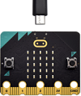
.. |image7| image:: ./media/img-20230324093541.png
.. |image8| image:: ./media/img-20230324093731.png
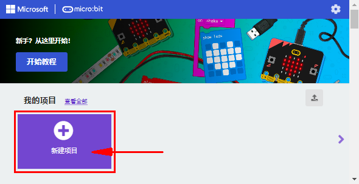
.. |image10| image:: ./media/img-20230417113405.png

.. |image12| image:: ./media/img-20230417113729.png
.. |image13| image:: ./media/img-20230417113820.png
.. |image14| image:: ./media/img-20230417113900.png

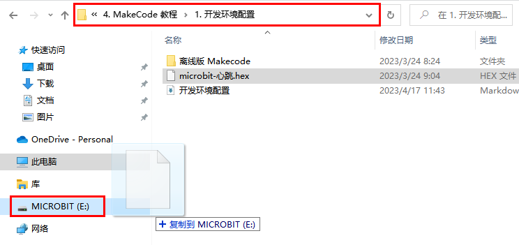
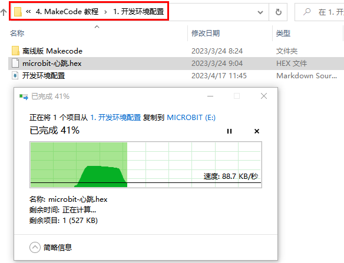
.. |image18| image:: ./media/img-20230324100241.png
.. |image19| image:: ./media/img-20230324100258.png

.. |image21| image:: ./media/img-20230417115412.png
.. |image22| image:: ./media/img-20230417120802.png
.. |image23| image:: ./media/img-20230417120826.png
.. |image24| image:: ./media/img-20230417120843.png

.. |image26| image:: ./media/img-20230417131207.png
.. |image27| image:: ./media/img-20230417131528.png
.. |image28| image:: ./media/img-20230417131647.png
.. |image29| image:: ./media/img-20230324110032.png
.. |image30| image:: ./media/img-20230417131743.png
.. |image31| image:: ./media/img-20230417131804.png
.. |image32| image:: ./media/img-20230426114703.png
.. |image33| image:: ./media/img-20230426115107.png

.. |image35| image:: ./media/img-20230426115247.png
.. |image36| image:: ./media/img-20230426115408.png
.. |image37| image:: ./media/img-20230417132422.png

.. |image39| image:: ./media/img-20230417132535.png

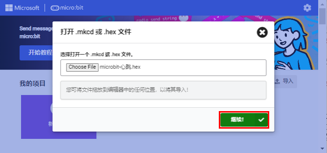

.. |image43| image:: ./media/img-20230417131528.png
.. |image44| image:: ./media/img-20230324113112.png
.. |image45| image:: ./media/img-20230417162747.png

.. |image47| image:: ./media/img-20230417162945.png
.. |image48| image:: ./media/img-20230324113604.png
.. |image49| image:: ./media/img-20230324113641.png

.. |image51| image:: ./media/img-20230324113915.png
.. |image52| image:: ./media/img-20230324113929.png
.. |image53| image:: ./media/img-20230324113941.png

.. |image57| image:: ./media/img-20230428160048.png
.. |image58| image:: ./media/img-20230428160108.png

.. |image60| image:: ./media/img-20230428160132.png
.. |image61| image:: ./media/img-20230428160143.png

.. |image63| image:: ./media/img-20230428160244.png
.. |image64| image:: ./media/img-20230428160254.png
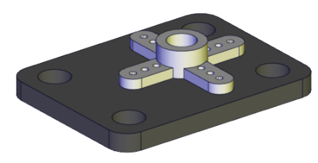
.. |image66| image:: ./media/img-20230523113829.png
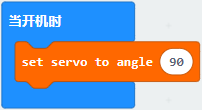

.. |image69| image:: ./media/img-20230428163728.png
.. |image70| image:: ./media/img-20230428163800.png
.. |image71| image:: ./media/img-20230428163827.png
.. |image72| image:: ./media/img-20230428163859.png
.. |image73| image:: ./media/img-20230428163917.png
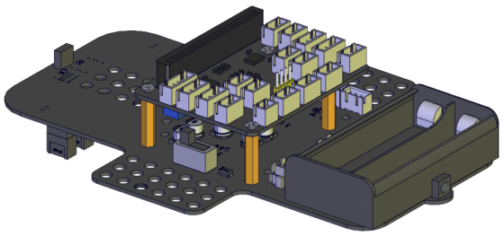
.. |image75| image:: ./media/img-20230428164033.png
.. |image76| image:: ./media/img-20230428164040.png

.. |image78| image:: ./media/img-20230428164114.png
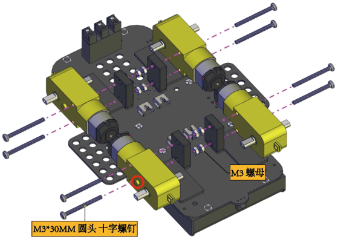
.. |image80| image:: ./media/img-20230428164226.png

.. |image83| image:: ./media/img-20230428164459.png
.. |image84| image:: ./media/img-20230428164516.png
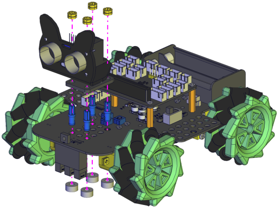
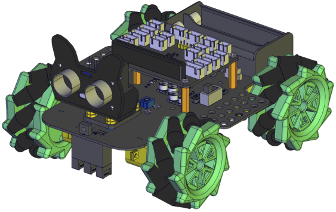
.. |image87| image:: ./media/img-20230428164604.png
.. |image88| image:: ./media/img-20230428164612.png
.. |image89| image:: ./media/img-20230428164627.png
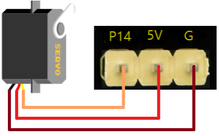
.. |image91| image:: ./media/img-20230504084018.png
.. |image92| image:: ./media/img-20230523115314.png
.. |image93| image:: ./media/img-20230504083927.png
.. |image94| image:: ./media/img-20230523132234.png

.. |image96| image:: ./media/img-20230523133024.png
.. |image97| image:: ./media/img-20230504085601.png
.. |image98| image:: ./media/img-20230523133904.png
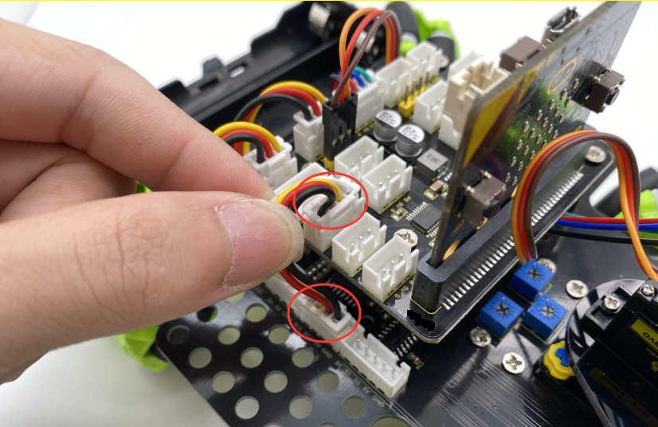
.. |image100| image:: ./media/img-20230523134552.png
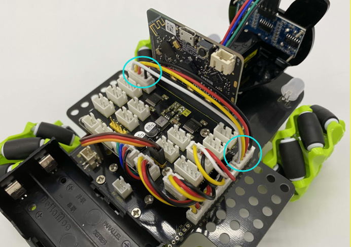
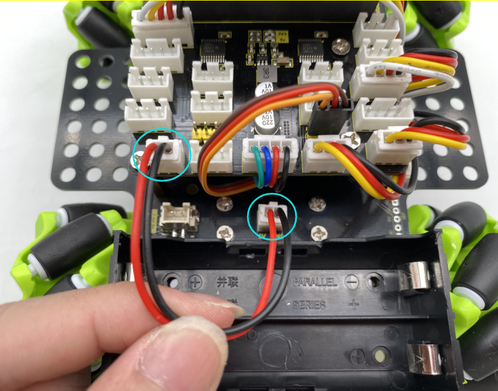
.. |image103| image:: ./media/img-20230504091336.png

.. |image105| image:: ./media/img-20230324144645.png
.. |image106| image:: ./media/img-20230324143645.png
.. |image107| image:: ./media/img-20230417133819.png
.. |image108| image:: ./media/img-20230417133846.png
.. |image109| image:: ./media/img-20230417133911.png
.. |image110| image:: ./media/img-20230417134857.png
.. |image111| image:: ./media/img-20230417134941.png
.. |image112| image:: ./media/img-20230324144355.png
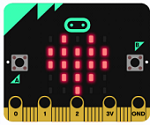
.. |image114| image:: ./media/img-20230324144431.png
.. |image115| image:: ./media/img-20230324144711.png
.. |image116| image:: ./media/img-20230324144720.png
.. |image117| image:: ./media/img-20230324143645.png
.. |image118| image:: ./media/img-20230417133819.png
.. |image119| image:: ./media/img-20230417133846.png
.. |image120| image:: ./media/img-20230417133911.png
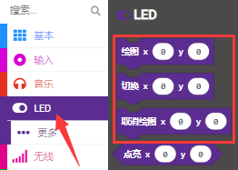
.. |image122| image:: ./media/img-20230417135305.png
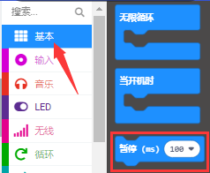
.. |image124| image:: ./media/img-20230417135426.png
.. |image125| image:: ./media/img-20230327160717.png
.. |image126| image:: ./media/img-20230327160721.png
.. |image127| image:: ./media/img-20230324145330.png
.. |image128| image:: ./media/img-20230324143645.png
.. |image129| image:: ./media/img-20230417133819.png
.. |image130| image:: ./media/img-20230417133846.png
.. |image131| image:: ./media/img-20230417133911.png

.. |image133| image:: ./media/img-20230417135305.png
.. |image134| image:: ./media/img-20230417135752.png
.. |image135| image:: ./media/img-20230324145654.png
.. |image136| image:: ./media/img-20230417135925.png
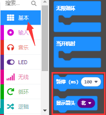
.. |image138| image:: ./media/img-20230417135836.png
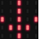

.. |image141| image:: ./media/img-20230324145958.png

.. |image143| image:: ./media/img-20230324150010.png
.. |image144| image:: ./media/img-20230324150016.png

.. |image146| image:: ./media/img-20230324150336.png
.. |image147| image:: ./media/img-20230324150353.png
.. |image148| image:: ./media/img-20230324143645.png
.. |image149| image:: ./media/img-20230417133819.png
.. |image150| image:: ./media/img-20230417133846.png
.. |image151| image:: ./media/img-20230417133911.png

.. |image153| image:: ./media/img-20230417140225.png
.. |image154| image:: ./media/img-20230417140310.png
.. |image155| image:: ./media/img-20230324150936.png
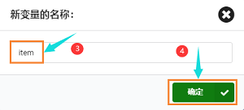
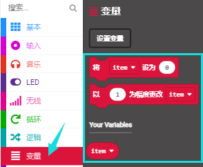
.. |image158| image:: ./media/img-20230417140535.png
.. |image159| image:: ./media/img-20230417135305.png

.. |image163| image:: ./media/img-20230417140855.png
.. |image164| image:: ./media/img-20230324151954.png
.. |image165| image:: ./media/img-20230324143645.png
.. |image166| image:: ./media/img-20230417133819.png
.. |image167| image:: ./media/img-20230417133846.png
.. |image168| image:: ./media/img-20230417133911.png
.. |image169| image:: ./media/img-20230417141032.png
.. |image170| image:: ./media/img-20230417141126.png
.. |image171| image:: ./media/img-20230417141213.png

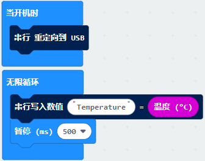

.. |image175| image:: ./media/img-20230324152631.png

.. |image177| image:: ./media/img-20230417135305.png
.. |image178| image:: ./media/img-20230417141457.png
.. |image179| image:: ./media/img-20230417134857.png
.. |image180| image:: ./media/img-20230324144227.png
.. |image181| image:: ./media/img-20230417141213.png
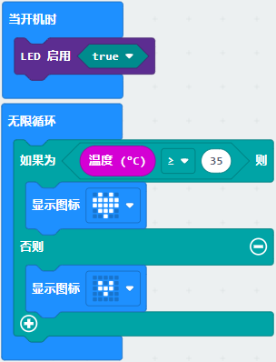
.. |image183| image:: ./media/img-20230324153310.png
.. |image184| image:: ./media/img-20230324153316.png

.. |image186| image:: ./media/img-20230324143645.png
.. |image187| image:: ./media/img-20230417133819.png
.. |image188| image:: ./media/img-20230417133846.png
.. |image189| image:: ./media/img-20230417133911.png
.. |image190| image:: ./media/img-20230417141741.png

.. |image193| image:: ./media/img-20230417142021.png
.. |image194| image:: ./media/img-20230417142054.png
.. |image195| image:: ./media/img-20230324154743.png
.. |image196| image:: ./media/img-20230324154807.png

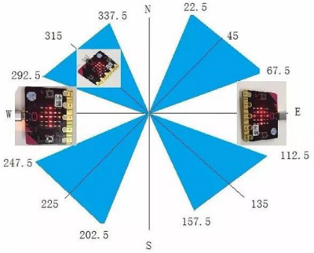
.. |image199| image:: ./media/img-20230417141741.png
.. |image200| image:: ./media/img-20230417142021.png
.. |image201| image:: ./media/img-20230417142447.png
.. |image202| image:: ./media/img-20230417142521.png
.. |image203| image:: ./media/img-20230417142731.png
.. |image204| image:: ./media/img-20230417142833.png
.. |image205| image:: ./media/img-20230417142901.png
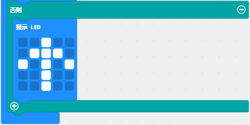
.. |image207| image:: ./media/img-20230324161826.png
.. |image208| image:: ./media/img-20230324143645.png
.. |image209| image:: ./media/img-20230417133819.png
.. |image210| image:: ./media/img-20230417133846.png
.. |image211| image:: ./media/img-20230417133911.png
.. |image212| image:: ./media/img-20230417143105.png

.. |image214| image:: ./media/img-20230324162147.png
.. |image215| image:: ./media/img-20230324162218.png
.. |image216| image:: ./media/img-20230324162231.png
.. |image217| image:: ./media/img-20230324162247.png
.. |image218| image:: ./media/img-20230324162345.png
.. |image219| image:: ./media/img-20230324162407.png
.. |image220| image:: ./media/img-20230417141032.png
.. |image221| image:: ./media/img-20230417141126.png

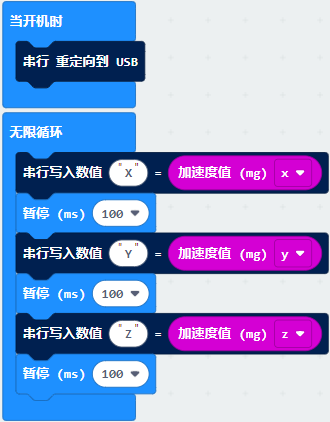
.. |image225| image:: ./media/img-20230324162952.png
.. |image226| image:: ./media/img-20230324163527.png
.. |image227| image:: ./media/img-20230324143645.png
.. |image228| image:: ./media/img-20230417133819.png
.. |image229| image:: ./media/img-20230417133846.png
.. |image230| image:: ./media/img-20230417133911.png
.. |image231| image:: ./media/img-20230417141032.png
.. |image232| image:: ./media/img-20230417141126.png
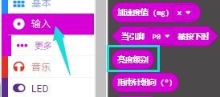

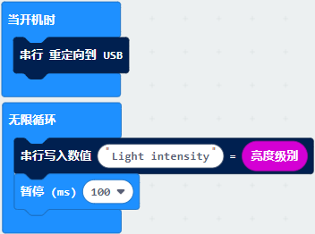
.. |image236| image:: ./media/img-20230324163857.png
.. |image237| image:: ./media/img-20230324163955.png
.. |image238| image:: ./media/img-20230324143645.png
.. |image239| image:: ./media/img-20230417133819.png
.. |image240| image:: ./media/img-20230417133846.png
.. |image241| image:: ./media/img-20230417133911.png
.. |image242| image:: ./media/img-20230417134857.png
.. |image243| image:: ./media/img-20230417143912.png

.. |image245| image:: ./media/img-20230417143959.png

.. |image247| image:: ./media/img-20230417134857.png

.. |image249| image:: ./media/img-20230324165622.png
.. |image250| image:: ./media/img-20230324165628.png

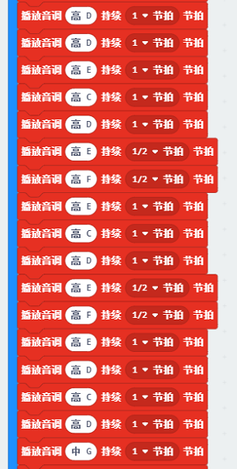

.. |image255| image:: ./media/img-20230324165650.png
.. |image256| image:: ./media/img-20230324165654.png
.. |image257| image:: ./media/img-20230324171739.png
.. |image258| image:: ./media/img-20230324143645.png
.. |image259| image:: ./media/img-20230417133819.png
.. |image260| image:: ./media/img-20230417133846.png
.. |image261| image:: ./media/img-20230417133911.png
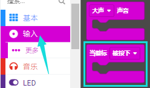
.. |image263| image:: ./media/img-20230417145942.png
.. |image264| image:: ./media/img-20230417150031.png

.. |image266| image:: ./media/img-20230417150441.png
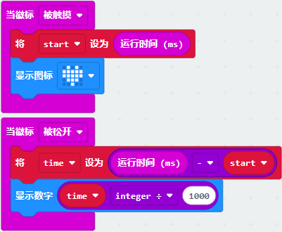
.. |image268| image:: ./media/img-20230324172906.png
.. |image269| image:: ./media/img-20230324172909.png
.. |image270| image:: ./media/img-20230324143645.png
.. |image271| image:: ./media/img-20230417133819.png
.. |image272| image:: ./media/img-20230417133846.png
.. |image273| image:: ./media/img-20230417133911.png
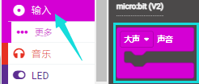
.. |image275| image:: ./media/img-20230417134857.png
.. |image276| image:: ./media/img-20230417150611.png
.. |image277| image:: ./media/img-20230324173138.png
.. |image278| image:: ./media/img-20230417141032.png
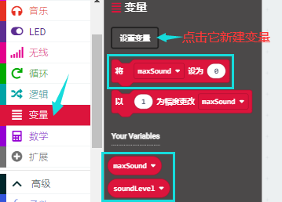

.. |image281| image:: ./media/img-20230417151135.png
.. |image282| image:: ./media/img-20230417135305.png
.. |image283| image:: ./media/img-20230417151311.png

.. |image285| image:: ./media/img-20230324174735.png
.. |image286| image:: ./media/img-20230324175005.png
.. |image287| image:: ./media/img-20230324143645.png
.. |image288| image:: ./media/img-20230324175202.png
.. |image289| image:: ./media/img-20230417134619.png
.. |image290| image:: ./media/img-20230324183401.png
.. |image291| image:: ./media/img-20230324183420.png
.. |image292| image:: ./media/img-20230327095921.png
.. |image293| image:: ./media/img-20230327100009.png
.. |image294| image:: ./media/img-20230327094835.png

.. |image296| image:: ./media/img-20230327095558.png
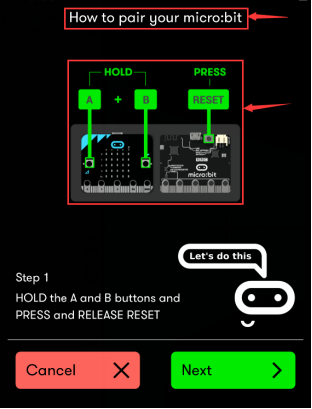
.. |image298| image:: ./media/img-20230327095542.png
.. |image299| image:: ./media/img-20230327095530.png

.. |image302| image:: ./media/img-20230327095511.png
.. |image303| image:: ./media/img-20230327095515.png
.. |image304| image:: ./media/img-20230327100357.png
.. |image305| image:: ./media/img-20230327100352.png
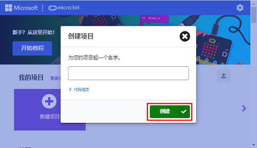
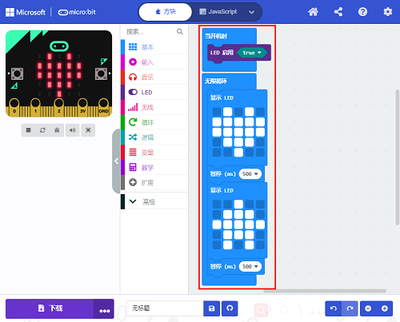
.. |image308| image:: ./media/img-20230327100833.png

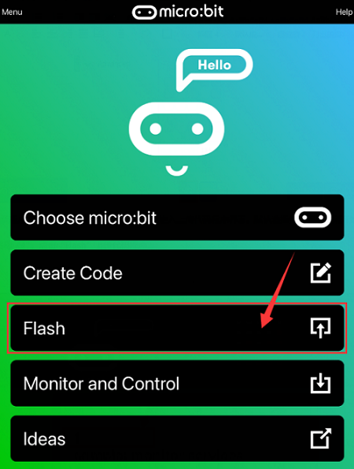

.. |image312| image:: ./media/img-20230327095439.png
.. |image313| image:: ./media/img-20230327095246.png
.. |image314| image:: ./media/img-20230426135820.png
.. |image315| image:: ./media/img-20230426143818.png
.. |image316| image:: ./media/img-20230426143829.png
.. |image317| image:: ./media/img-20230324110032.png
.. |image318| image:: ./media/img-20230417131743.png
.. |image319| image:: ./media/img-20230417131804.png
.. |image320| image:: ./media/img-20230426114703.png
.. |image321| image:: ./media/img-20230426115107.png

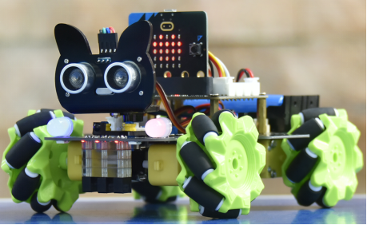

.. |image326| image:: ./media/img-20230426142142.png

.. |image328| image:: ./media/img-20230426145214.png
.. |image329| image:: ./media/img-20230426144639.png
.. |image330| image:: ./media/img-20230324110032.png
.. |image331| image:: ./media/img-20230417131743.png
.. |image332| image:: ./media/img-20230417131804.png
.. |image333| image:: ./media/img-20230426114703.png
.. |image334| image:: ./media/img-20230426115107.png
.. |image335| image:: ./media/img-20230417135305.png
.. |image336| image:: ./media/img-20230426150602.png

.. |image339| image:: ./media/img-20230504103905.png
.. |image340| image:: ./media/img-20230417135305.png
.. |image341| image:: ./media/img-20230426151925.png
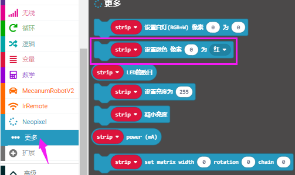

.. |image344| image:: ./media/img-20230426151829.png

.. |image346| image:: ./media/img-20230426151056.png
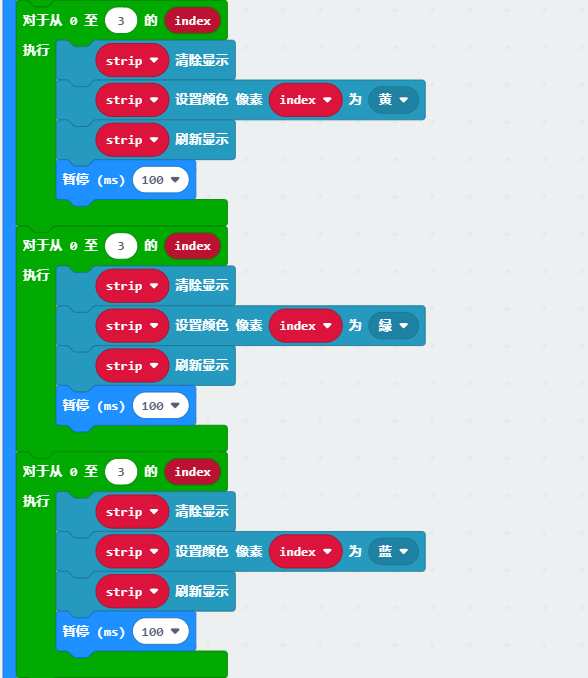
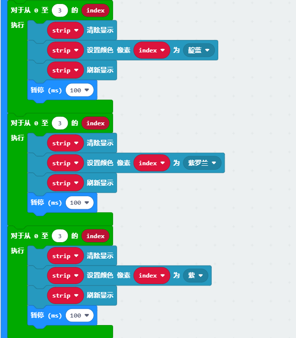
.. |image349| image:: ./media/img-20230426151231.png

.. |image351| image:: ./media/img-20230504103911.png
.. |image352| image:: ./media/img-20230417135305.png
.. |image353| image:: ./media/img-20230426151925.png
.. |image354| image:: ./media/img-20230426152743.png

.. |image356| image:: ./media/img-20230426151829.png

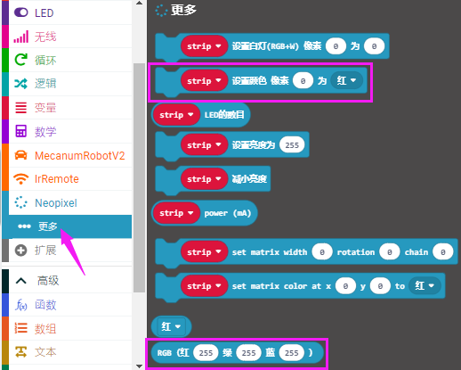

.. |image360| image:: ./media/img-20230329095649.png
.. |image361| image:: ./media/img-20230324190535.png
.. |image362| image:: ./media/img-20230324190601.png
.. |image363| image:: ./media/img-20230324110032.png
.. |image364| image:: ./media/img-20230417131743.png
.. |image365| image:: ./media/img-20230417131804.png
.. |image366| image:: ./media/img-20230426114703.png
.. |image367| image:: ./media/img-20230426115107.png
.. |image368| image:: ./media/img-20230417135305.png
.. |image369| image:: ./media/img-20230426151829.png

.. |image373| image:: ./media/img-20230426155300.png
.. |image374| image:: ./media/img-20230426164441.png
.. |image375| image:: ./media/img-20230426160942.png
.. |image376| image:: ./media/img-20230426160947.png
.. |image377| image:: ./media/img-20230426160700.png
.. |image378| image:: ./media/img-20230426160709.png
.. |image379| image:: ./media/img-20230324110032.png
.. |image380| image:: ./media/img-20230417131743.png
.. |image381| image:: ./media/img-20230417131804.png
.. |image382| image:: ./media/img-20230426114703.png
.. |image383| image:: ./media/img-20230426115107.png
.. |image384| image:: ./media/img-20230426163316.png

.. |image387| image:: ./media/img-20230426163316.png

.. |image390| image:: ./media/img-20230426164533.png
.. |image391| image:: ./media/img-20230522172021.png
.. |image392| image:: ./media/img-20230523170452.png
.. |image393| image:: ./media/img-20230324110032.png
.. |image394| image:: ./media/img-20230417131743.png
.. |image395| image:: ./media/img-20230417131804.png
.. |image396| image:: ./media/img-20230426114703.png
.. |image397| image:: ./media/img-20230426115107.png
.. |image398| image:: ./media/img-20230417141032.png

.. |image400| image:: ./media/img-20230417135305.png

.. |image402| image:: ./media/img-20230426165533.png

.. |image404| image:: ./media/img-20230426170747.png
.. |image405| image:: ./media/img-20230523171931.png

.. |image407| image:: ./media/img-20230324110032.png
.. |image408| image:: ./media/img-20230417131743.png
.. |image409| image:: ./media/img-20230417131804.png
.. |image410| image:: ./media/img-20230426114703.png
.. |image411| image:: ./media/img-20230426115107.png
.. |image412| image:: ./media/img-20230417135305.png
.. |image413| image:: ./media/img-20230426171843.png

.. |image415| image:: ./media/img-20230426172211.png
.. |image416| image:: ./media/img-20230426172330.png
.. |image417| image:: ./media/img-20230523163626.png
.. |image418| image:: ./media/img-20230426171435.png
.. |image419| image:: ./media/img-20230427084139.png
.. |image420| image:: ./media/img-20230426105612.png
.. |image421| image:: ./media/img-20230427084201.png
.. |image422| image:: ./media/img-20230330112930.png
.. |image423| image:: ./media/img-20230330112940.png
.. |image424| image:: ./media/img-20230324110032.png
.. |image425| image:: ./media/img-20230417131743.png
.. |image426| image:: ./media/img-20230417131804.png
.. |image427| image:: ./media/img-20230426114703.png
.. |image428| image:: ./media/img-20230426115107.png
.. |image429| image:: ./media/img-20230417141032.png
.. |image430| image:: ./media/img-20230417141126.png
.. |image431| image:: ./media/img-20230427085358.png

.. |image437| image:: ./media/img-20230324110032.png
.. |image438| image:: ./media/img-20230417131743.png
.. |image439| image:: ./media/img-20230417131804.png
.. |image440| image:: ./media/img-20230426114703.png
.. |image441| image:: ./media/img-20230426115107.png

.. |image444| image:: ./media/img-20230426172330.png

.. |image448| image:: ./media/img-20230427092934.png
.. |image449| image:: ./media/img-20230427093132.png
.. |image450| image:: ./media/img-20230324110032.png
.. |image451| image:: ./media/img-20230417131743.png
.. |image452| image:: ./media/img-20230417131804.png
.. |image453| image:: ./media/img-20230426114703.png
.. |image454| image:: ./media/img-20230426115107.png

.. |image456| image:: ./media/img-20230427091303.png
.. |image457| image:: ./media/img-20230426172330.png

.. |image461| image:: ./media/img-20230330135918.png

.. |image463| image:: ./media/img-20230324110032.png
.. |image464| image:: ./media/img-20230417131743.png
.. |image465| image:: ./media/img-20230417131804.png
.. |image466| image:: ./media/img-20230426114703.png
.. |image467| image:: ./media/img-20230426115107.png
.. |image468| image:: ./media/img-20230417135305.png
.. |image469| image:: ./media/img-20230417141032.png
.. |image470| image:: ./media/img-20230417141126.png

.. |image473| image:: ./media/img-20230427103501.png
.. |image474| image:: ./media/img-20230427102955.png
.. |image475| image:: ./media/img-20230427103605.png
.. |image476| image:: ./media/img-20230427104928.png
.. |image477| image:: ./media/img-20230427152437.png
.. |image478| image:: ./media/img-20230427105913.png
.. |image479| image:: ./media/img-20230324110032.png
.. |image480| image:: ./media/img-20230417131743.png
.. |image481| image:: ./media/img-20230417131804.png
.. |image482| image:: ./media/img-20230426114703.png
.. |image483| image:: ./media/img-20230426115107.png
.. |image484| image:: ./media/img-20230417135305.png

.. |image486| image:: ./media/img-20230427110810.png
.. |image487| image:: ./media/img-20230427111245.png
.. |image488| image:: ./media/img-20230427111508.png
.. |image489| image:: ./media/img-20230427110240.png

.. |image491| image:: ./media/img-20230427111839.png
.. |image492| image:: ./media/img-20230427111854.png
.. |image493| image:: ./media/img-20230427111911.png
.. |image494| image:: ./media/img-20230427111925.png

.. |image496| image:: ./media/img-20230427115820.png

.. |image498| image:: ./media/img-20230427120307.png
.. |image499| image:: ./media/img-20230427131144.png
.. |image500| image:: ./media/img-20230427131537.png
.. |image501| image:: ./media/img-20230427131604.png

.. |image503| image:: ./media/img-20230427115820.png
.. |image504| image:: ./media/img-20230427132215.png
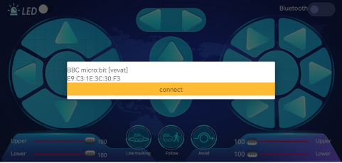
.. |image506| image:: ./media/img-20230427132537.png
.. |image507| image:: ./media/img-20230327112927.png
.. |image508| image:: ./media/img-20230427135000.png

.. |image510| image:: ./media/img-20230427115820.png
.. |image511| image:: ./media/img-20230324110032.png
.. |image512| image:: ./media/img-20230327120628.png
.. |image513| image:: ./media/img-20230327120744.png
.. |image514| image:: ./media/img-20230427143817.png

.. |image516| image:: ./media/img-20230417161246.png
.. |image517| image:: ./media/img-20230417134857.png
.. |image518| image:: ./media/img-20230417161351.png

.. |image520| image:: ./media/img-20230417161553.png
.. |image521| image:: ./media/img-20230417161651.png
.. |image522| image:: ./media/img-20230417161800.png
.. |image523| image:: ./media/img-20230417161843.png
.. |image524| image:: ./media/img-20230427140059.png
.. |image525| image:: ./media/img-20230327133237.png
.. |image526| image:: ./media/img-20230327114851.png
.. |image527| image:: ./media/img-20230327114939.png
.. |image528| image:: ./media/img-20230327114829.png
.. |image529| image:: ./media/img-20230427114220.png
.. |image530| image:: ./media/img-20230427141651.png
.. |image531| image:: ./media/img-20230324110032.png
.. |image532| image:: ./media/img-20230417131743.png
.. |image533| image:: ./media/img-20230417131804.png
.. |image534| image:: ./media/img-20230327120744.png
.. |image535| image:: ./media/img-20230427143817.png
.. |image536| image:: ./media/img-20230327132950.png
.. |image537| image:: ./media/img-20230324110032.png
.. |image538| image:: ./media/img-20230417131743.png
.. |image539| image:: ./media/img-20230417131804.png
.. |image540| image:: ./media/img-20230426114703.png
.. |image541| image:: ./media/img-20230426115107.png
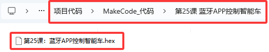
.. |image543| image:: ./media/img-20230327133237.png
.. |image544| image:: ./media/img-20230327114851.png
.. |image545| image:: ./media/img-20230327114939.png
.. |image546| image:: ./media/img-20230427150110.png
.. |image547| image:: ./media/img-20230510152657.png
.. |image548| image:: ./media/img-20230510152706.png
.. |image549| image:: ./media/img-20230510152713.png
.. |image550| image:: ./media/img-20230510152720.png
.. |image551| image:: ./media/img-20230510152728.png
.. |image552| image:: ./media/img-20230427150339.png

.. |image554| image:: ./media/img-20230427150356.png
.. |image555| image:: ./media/img-20230510152755.png
.. |image556| image:: ./media/img-20230510152840.png
