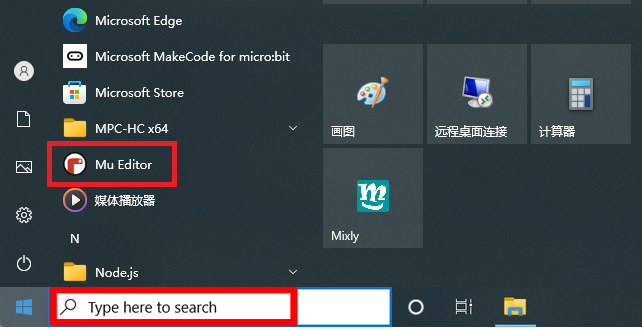
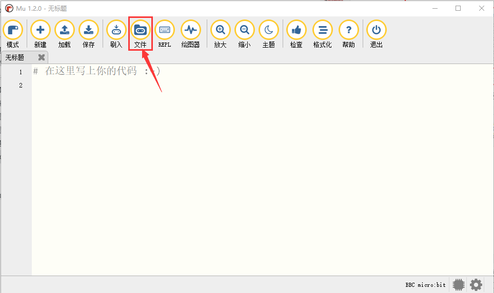
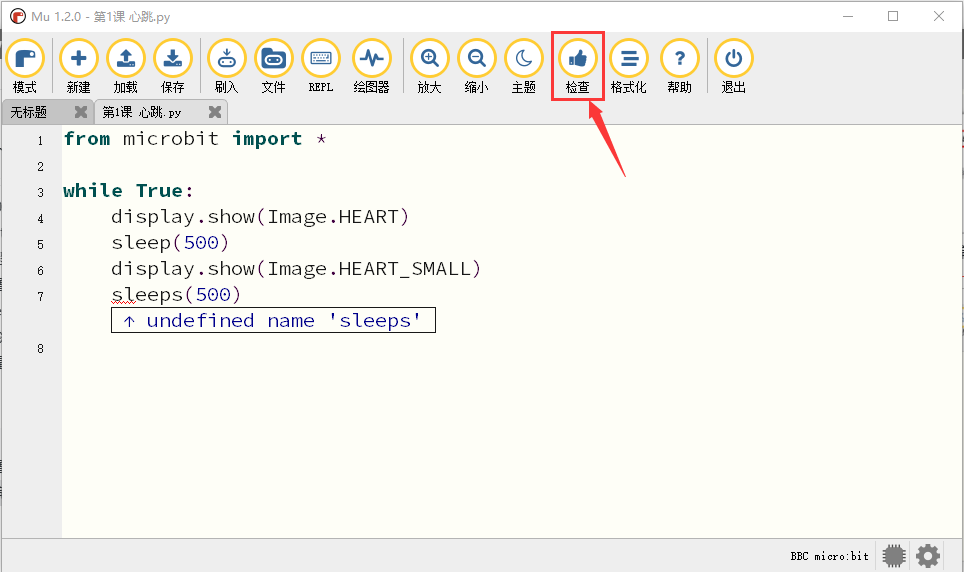

Mu Editor 编译器教程
--------------------

1. 安装 IDE
   **Mu** Mu的官方网站：\ https://codewith.mu/
   Mu是一个面向初学者程序员的Python代码编辑器，它基于教师和学生。获得Mu最简单和最容易的方法是通过Windows或Mac
   OSX的官方安装程序(Mu不再支持32位Windows)。目前推荐的版本是Mu
   1.2.0。建议你们通过每个支持的操作系统的链接更新到这个版本.

**步骤1-确定版本并且下载Mu安装程序：**
先了解您的计算机是Windows系统还是Mac
OSX系统；再打开资源管理器，鼠标右键点击”此电脑”，并选择属性，了解您的Windows系统是32位还是64位。
|Img|

查看系统类别，类型将显示在操作系统下，64位系统或者32位系统： |image1|
打开链接：\ https://codewith.mu/en/download 下载对应的Mu软件版本。
|image2|

**步骤2-运行安装程序：**
找到你刚刚下载的安装程序（它可能在你的下载文件夹中），双击打开安装程序文件。
|image3|

这里我们概述了在Windows 系统上安装Mu所需的步骤。 Mac
OSX系统安装Mu方法对应链接：\ https://codewith.mu/en/howto/1.1/install_macos
。

**步骤3-许可协议** 检查许可证，选择复选框并单击“Install”。 |image4|

**步骤4-安装** 当Mu在你的电脑上安装时，需要几秒钟。 |image5|

| **第5步-完成**
| 安装已成功完成，请单击“\ **Finish**\ ”关闭安装程序。 |image6|

| **第6步-启动Mu**
| 你可以点击开始菜单中的图标启动Mu，也可以在搜索框中输入Mu(下面两种方法都有显示)。在第一次开始时，这可能需要一些时间。
  |image7|

Mu的主界面如下图所示： |image8|

2. | 开发板驱动安装
   | Micro:bit是可以免安装USB驱动的。如果你的电脑识别不了Micro:bit主板，则需要安装一下Micro:bit驱动，我们提供有Micro:bit
     驱动文件\ |image9|
     和安装Micro:bit驱动说明书，你可以进入相关文件夹中根据安装说明书进行安装。
     |image10|

3. 编译器设置和工具栏介绍

第一次使用时需要设置“模式”为BBC micro:bit。
打开Mu软件，点击菜单栏中的“模式”按钮并在弹出对话框中选择“BBC
micro：bit”之后，单击“OK”。 |image11|

Mu的操作页面请参考官方的介绍：\ https://codewith.mu/en/tutorials/1.1/start

更多有关使用Mu的教程，请参阅：\ https://codewith.mu/en/tutorials/

4. 库文件安装
   特别注意：导入库文件前需要给Micro:bit主板上传一个.py的代码（空代码也是可以的），这里我们是以一个空代码为例。

.. raw:: html

    
    

导入 “\ **keyes_mecanum_Car_V2.py**\ ” 库文件

.. raw:: html

    

| Mu保存文件的默认目录是“Mu_code”，它位于用户目录的根目录中。参考文献链接：\ https://codewith.mu/en/tutorials/1.0/files
  例如，在Windows系统中，假设您的系统安装在电脑C驱动器上，则用户名为“Administrator”，那么“mu_code”目录的路径是“C:\\Administrator\\mu\_
  code”。在Linux系统上，“mu_code”目录的路径是“~/home/mu_code”
| 进入“mu_code”文件夹。 |image12|
  我们提供的库文件“keyes_mecanum_Car_V2.py”的路径如下： |image13|
  复制粘贴我们提供的库文件“keyes_mecanum_Car_V2.py”到“mu_code”文件夹中。复制成功后，如下图：
  |image14|
  先打开Mu软件并连接Micro:bit主板到电脑，接着点击“\ **刷入**\ ”按钮烧入一个空的程序代码到Micro:bit主板中。
  |image15|
  然后点击“\ **文件**\ ”按钮，就可以在“\ **电脑上的文件**\ ”栏的下面方框中看到对应的库文件，再拖着库文件“keyes_mecanum_Car_V2.py”到Micro:bit主板中。
  |image16| |image17| |image18| |image19|

库文件导入成功后，你点击“\ **加载**\ ”按钮导入Python教程中第13课文件夹中的程序代码“\ **第13课：七彩灯闪烁.py**\ ”,然后单击“\ **检查**\ ”按钮来检查代码是否有错误。如果一行出现光标或下划线，则表明该行的程序有错误。
|image20|

|image21|
但是，单击“\ **检查**\ ”按钮来检查代码是否有错误时，即使代码没有错误时也会出现如下提示语，这提示语只是一些警告语，而不是代码错误提示语。也就是说整个代码是没有错误的。
|image22| |image23| 确定程序代码无误之后，你还需要确定Micro
USB线已经将Micro:bit主板连接到电脑，然后单击“\ **刷入**\ ”按钮将代码下载到Micro:bit主板。
|image24|
如果点击“\ **刷入**\ ”按钮后程序代码错误或实验现象错误，请确认你是否已经导入好我们提供给Micro:bit主板的库文件“keyes_mecanum_Car_V2.py”。

特别注意:
如果您在micro:bit板上下载了其他程序，但库文件“keyes_mecanum_Car_V2.py”程序除外。在使用Micropython编程之前，您需要将库文件导入到Micro:bit主板。
如果您始终使用相同的
Micro:bit主板进行Micropython编程，则无需多次将库文件发送到Micro:bit主板；反之，就需要再次将库文件发送到Micro:bit主板。

5. 添加代码到编译器
   这里我们以基础教程的“\ **第1课
   心跳.py**\ ”为例，打开Python教程第1课的文件夹内的程序代码文件“\ **第1课
   心跳.py**\ ”。 |image25| |image26|
   除了上述Mu软件加载（导入）代码方法之外，还有一种更简单的加载代码方法：先打开Mu软件，然后选中“\ **第1课
   心跳.py**\ ”文件，并继续按下鼠标左键，将选中的文件拖动到Mu软件中。如下图所示：
   |image27|
   成功加载如下所示。你也可以自己在编辑窗口输入代码。（注意！所有英文及符号均须以英文填写，最后一行必须有空格。）
   |image28|

6.下载代码到Micro:bit主板

通过Micro
USB线连接Micro:bit主板和电脑，点击“\ **刷入**\ ”按钮将代码下载到Micro:bit主板。
|image29| |image30| |image31|

如果代码有错误，也可以将代码成功下载到Micro:bit主板，但无法正常工作。如果sleep写为sleeps，点击“\ **刷入**\ ”按钮，代码也会被下载到Micro:bit主板。
|image32|

但是，下载完成后，Micro:bit主板正面的led点阵提示一些错误信息，以及错误的行号。点击“\ **REPL**\ ”按钮之后，再按下Micro:bit主板的重置按钮（背面的复位按钮，不是A、B按键），错误信息将显示在REPL框中，如下所示：
|image33|

再次单击“\ **REPL**\ ”按钮，将关闭REPL模式，然后你就可以刷新新代码了。为了确保代码正确，完成代码后，单击“\ **检查**\ ”按钮检查代码是否有错误。如下图所示，点击“\ **检查**\ ”按钮，然后Mu将指示代码的错误。
|image34|

根据错误提示，正确修改代码。然后再点击“\ **检查**\ ”按钮，Mu在下面的栏上显示没有问题。
|image35|
有关使用Mu的更多教程，请参阅：\ https://codewith.mu/en/tutorials/

7.  相关资料链接
8.  BBC microbit MicroPython的官方说明链接：
    https://microbit-micropython.readthedocs.io/en/latest/tutorials/introduction.html
9.  MicroPython 语言的官方链接：
    https://docs.openmv.io/reference/index.html
10. ustruct 库链接： https://docs.openmv.io/library/ustruct.html
11. math 库链接： https://docs.openmv.io/library/math.html
12. utime(sleep_us,tick_us) 库文件链接：
    https://docs.openmv.io/library/utime.html#

.. |Img| image:: ./media/img-20230417162234.png

.. |image2| image:: ./media/img-20230327135438.png
.. |image3| image:: ./media/img-20230327141819.png

.. |image6| image:: ./media/img-20230509135757.png

.. |image8| image:: ./media/img-20230327142038.png

.. |image11| image:: ./media/img-20230327142416.png
.. |image12| image:: ./media/img-20230327142740.png
.. |image13| image:: ./media/img-20230427160531.png

.. |image15| image:: ./media/img-20230327143130.png

.. |image17| image:: ./media/img-20230427161059.png
.. |image18| image:: ./media/img-20230427161951.png
.. |image19| image:: ./media/img-20230427162013.png

.. |image21| image:: ./media/img-20230427163324.png
.. |image22| image:: ./media/img-20230427163410.png
.. |image23| image:: ./media/img-20230427163420.png
.. |image24| image:: ./media/img-20230427163544.png
.. |image25| image:: ./media/img-20230327151608.png
.. |image26| image:: ./media/img-20230327151937.png
.. |image27| image:: ./media/img-20230327152211.png
.. |image28| image:: ./media/img-20230327152242.png
.. |image29| image:: ./media/img-20230327152358.png

.. |image32| image:: ./media/img-20230327152706.png
.. |image33| image:: ./media/img-20230327152837.png

.. |image35| image:: ./media/img-20230327153114.png
