.. _4wd-microbit麦克纳姆轮智能小车的安装步骤:

4WD Microbit麦克纳姆轮智能小车的安装步骤
----------------------------------------

安装1

安装所需零件: |Img|

安装: |image1|

完成: |image2|

安装2

安装所需零件: |image3|

安装: |image4|

完成: |image5|

安装3

安装所需零件： |image6|

安装： |image7|

完成： |image8|

安装4

**舵机初始化：**
安装前需要先设置舵机角度为90°。设置舵机角度时，将舵机连接在Microbit扩展板的G、V、P14，在Microbit主控板上上传对应代码，外接电源供电后，按下Microbit主控板上的复位按键，舵机就转到90°的位置。
\| 舵机 \| Microbit扩展板 \| \| :--: \| :--: \| \| 棕线 \| G \| \| 红线
\| V \| \| 橙线 \| P14 \| |image9|

::

   from microbit import *

   class Servo:
       def __init__(self, pin, freq=50, min_us=600, max_us=2400, angle=180):
           self.min_us = min_us
           self.max_us = max_us
           self.us = 0
           self.freq = freq
           self.angle = angle
           self.analog_period = 0
           self.pin = pin
           analog_period = round((1/self.freq) * 1000)  # hertz to miliseconds
           self.pin.set_analog_period(analog_period)

       def write_us(self, us):
           us = min(self.max_us, max(self.min_us, us))
           duty = round(us * 1024 * self.freq // 1000000)
           self.pin.write_analog(duty)
           sleep(100)
           self.pin.write_analog(0)

       def write_angle(self, degrees=None):
           if degrees is None:
               degrees = math.degrees(radians)
           degrees = degrees % 360
           total_range = self.max_us - self.min_us
           us = self.min_us + total_range * degrees // self.angle
           self.write_us(us)

   Servo(pin14).write_angle(90)
   sleep(1000)
   display.show(Image.HAPPY)

   while True:
           Servo(pin14).write_angle(90)
           sleep(1000)

我们提供的舵机初始化角度的代码位置如下图： |image10|

安装所需零件： |image11|

安装： (注意安装方向) |image12|

完成： |image13|

安装5

安装所需零件： |image14|

安装： |image15|

完成： |image16|

安装6

安装所需零件： |image17|

安装： |image18|

完成： |image19|

安装7

安装所需零件： |image20|

安装： （注意电机安装方向，线材方向朝内）

|image21|

完成： |image22|

安装8

安装所需零件： |image23|

安装： |image24|

完成： |image25|

安装9

安装所需零件： |image26|

安装： |image27|

完成： |image28|

安装10

安装准备零件： |image29|

安装： |image30|

完成： |image31|

接线

舵机接线： \| 舵机 \| Microbit扩展板 \| \| :--: \| :--: \| \| 棕线 \| G
\| \| 红线 \| V \| \| 橙线 \| P14 \| |image32| |image33|

超声波模块接线： \| 超声波模块 \| Microbit扩展板 \| \| :--: \| :--: \|
\| Vcc \| 5V\| \| Trig \| P15 \| \| Echo \| P16\| \|Gnd|G\| |image34|
|image35|

控制红外模块接线： \| 驱动板 \| Microbit扩展板 \| \| :--: \| :--: \| \|
GND \| G\| \| 5V \| 5V \| \| S5 \| P0\| |image36| |image37|

控制WS2812RGB接线： \| 驱动板 \| Microbit扩展板 \| \| :--: \| :--: \| \|
GND \| G\| \| 5V \| 5V \| \| S4 \| P7\| |image38| |image39|

控制电机和七彩灯接线: \| 驱动板 \| Microbit扩展板 \| \| :--: \| :--: \|
\| SCL \| P19\| \| SDA \| P20 \| \|5V \| 5V\| \|GND|G\| |image40|
|image41|

控制三路循迹模块接线: \| 驱动板 \| Microbit扩展板 \| \| :--: \| :--: \|
\| S1 \| P10\| \| S2 \| P4 \| \|S3\| P3\| \| \| \| \|GND|G\| |image42|
|image43|

电源接线: |image44|

电机接到对应的接口上: |image45|

电池安装示范: |image46|

.. |Img| image:: ./media/img-20230428160048.png
.. |image1| image:: ./media/img-20230428160108.png
.. |image2| image:: ./media/img-20230428160119.png
.. |image3| image:: ./media/img-20230428160132.png
.. |image4| image:: ./media/img-20230428160143.png
.. |image5| image:: ./media/img-20230428160221.png
.. |image6| image:: ./media/img-20230428160244.png
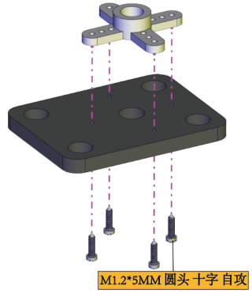
.. |image8| image:: ./media/img-20230428160325.png
.. |image9| image:: ./media/img-20230523113829.png
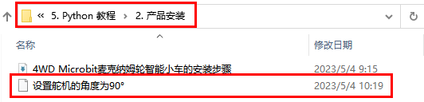
.. |image11| image:: ./media/img-20230428163728.png
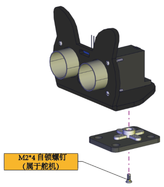
.. |image13| image:: ./media/img-20230428163827.png
.. |image14| image:: ./media/img-20230428163859.png
.. |image15| image:: ./media/img-20230428163917.png
.. |image16| image:: ./media/img-20230428163926.png
.. |image17| image:: ./media/img-20230428164033.png
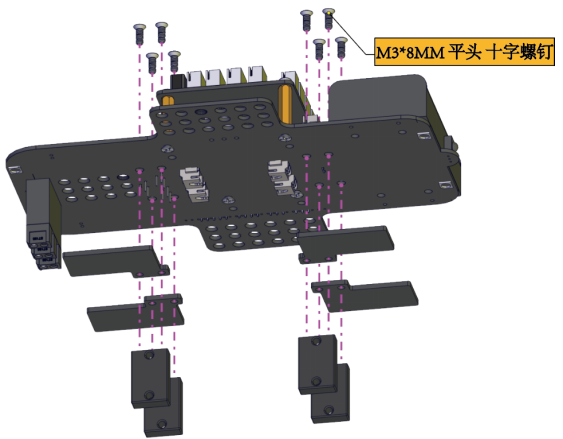
.. |image19| image:: ./media/img-20230428164048.png
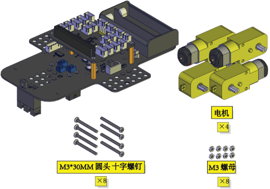
.. |image21| image:: ./media/img-20230428164218.png
.. |image22| image:: ./media/img-20230428164226.png
.. |image23| image:: ./media/img-20230428164353.png
.. |image24| image:: ./media/img-20230428164440.png
.. |image25| image:: ./media/img-20230428164459.png
.. |image26| image:: ./media/img-20230428164516.png
.. |image27| image:: ./media/img-20230428164531.png
.. |image28| image:: ./media/img-20230428164546.png
.. |image29| image:: ./media/img-20230428164604.png
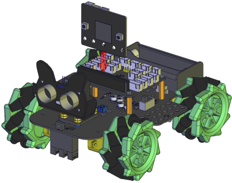
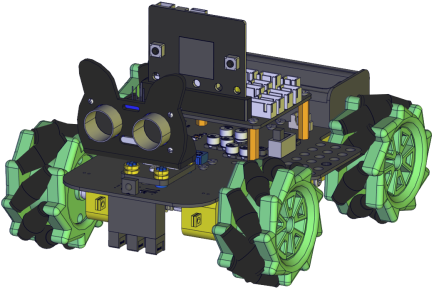
.. |image32| image:: ./media/img-20230523113903.png
.. |image33| image:: ./media/img-20230504084018.png
.. |image34| image:: ./media/img-20230523115314.png
.. |image35| image:: ./media/img-20230504083927.png
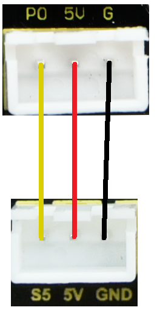
.. |image37| image:: ./media/img-20230504085353.png
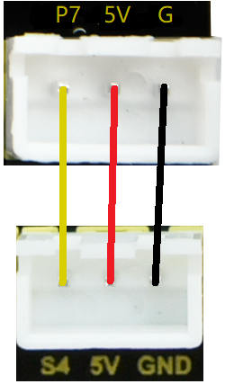
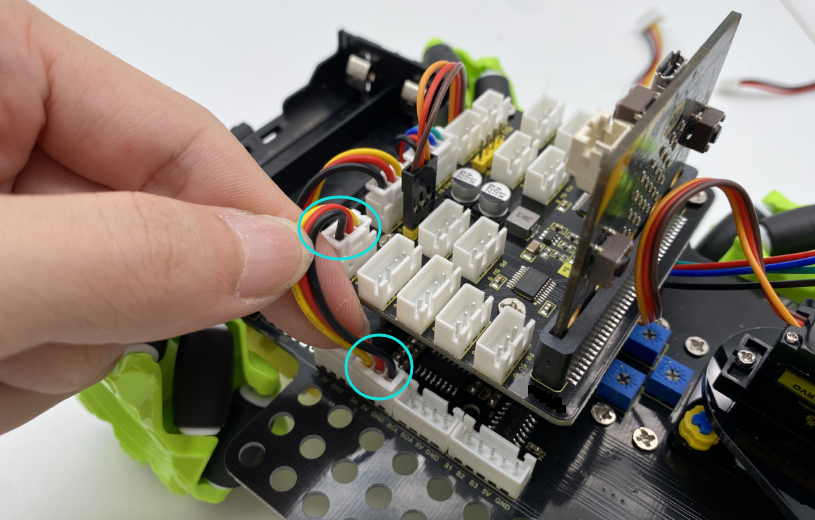
.. |image40| image:: ./media/img-20230523133904.png
.. |image41| image:: ./media/img-20230504085147.png
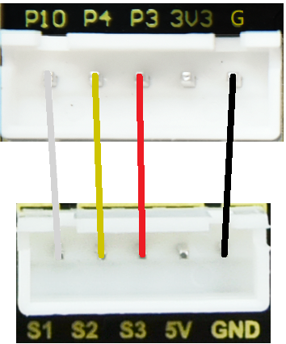
.. |image43| image:: ./media/img-20230504090137.png
.. |image44| image:: ./media/img-20230504091010.png
.. |image45| image:: ./media/img-20230504091336.png
.. |image46| image:: ./media/img-20230504091422.png
