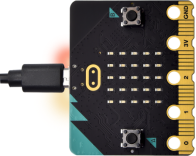
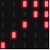

第03课 5×5 LED点阵图案显示
==========================

|Img|

.. _1-实验说明:

1. 实验说明：
-------------

点阵在我们生活中很常见，很多都有用到它，比如LED广告显示屏，电梯显示楼层，公交车报站等等。
Micro：bit主板的LED点阵共由25个发光二极管组成，上一课我们已经讲过通过设置坐标点来实现对LED点阵的25个LED中的某个LED的控制，这样可以通过设置多个坐标点控制多个LED的亮灭使得LED点阵能够显示图案、数字、字符串。我们也可以在特定代码中通过点击
LED点阵的灰白色小正方形点亮
LED点阵对应的LED来实现LED点阵显示图案、数字、字符串。除了上述方法还可以使用自定义图案使LED点阵显示图案。

.. _2-准备:

2. 准备：
---------

（1）通过Micro USB线连接Micro:bit主板和电脑。 |image1|

（2）打开离线版本的Mu软件。

.. _3-课程代码1:

3. 课程代码1：
--------------

可以直接在Mu编译器上传教程中的代码，也可以手动在Mu编译器编写代码。

添加代码到Mu编译器的教程与下载代码的教程请阅读“开发环境设置”文件夹中的文件“Mu
Editor 编译器教程”。

::

   from microbit import *

   val = Image("00900:""00900:""90909:""09990:""00900")

   display.show(val)

.. _4实验结果1:

4.实验结果1：
-------------

按照之前的方式将代码1下载到Micro:bit主板，Micro
USB数据线不要拔下来，利用Micro
USB数据线上电，我们就可以看到Micro:bit主板的5×5
LED点阵显示“向下”图案\ |image2|\ 。

.. _5-课程代码2:

5. 课程代码2：
--------------

可以直接在Mu编译器上传教程中的代码，也可以手动在Mu编译器编写代码。

添加代码到Mu编译器的教程与下载代码的教程请阅读“开发环境设置”文件夹中的文件“Mu
Editor 编译器教程”。

::

   from microbit import *
   val = Image("00900:""00900:""90909:""09990:""00900")
   display.show('1')
   sleep(500)
   display.show('2')
   sleep(500)
   display.show('3')
   sleep(500)
   display.show('4')
   sleep(500)
   display.show('5')
   sleep(500)
   display.show(val)
   sleep(500)
   display.scroll("hello!")
   sleep(200)
   display.show(Image.HEART)
   sleep(500)
   display.show(Image.ARROW_NE)
   sleep(500)
   display.show(Image.ARROW_SE)
   sleep(500)
   display.show(Image.ARROW_SW)
   sleep(500)
   display.show(Image.ARROW_NW)
   sleep(500)
   display.clear()

.. _6实验结果2:

6.实验结果2：
-------------

用同样的方法将代码2下载到Micro:bit主板，Micro
USB数据线不要拔下来，利用Micro
USB数据线上电，我们就可以看到Micro:bit主板的5×5
LED点阵开始显示数字1、2、3、4、5，然后循环显示“向下”图案\ |image3|\ 、字符串“Hello!”、“心”图案\ |image4|\ 、“东北”方向图案\ |image5|\ 、“东南”方向图案\ |image6|\ 、“西南”方向图案\ |image7|\ 和“西北”方向图案\ |image8|\ 。

.. _7-代码解释:

7. 代码解释：
-------------

+----------------------------------+----------------------------------+
| 代码块                           | 解释                             |
+==================================+==================================+
| from microbit import \*          | 导入micro：bit的库文件           |
+----------------------------------+----------------------------------+
| val =                            | 将Image()赋给于变量val           |
| Image("09000:""                  |                                  |
| 00000:""00000:""00000:""00000:") |                                  |
+----------------------------------+----------------------------------+
| display.show(val)                | micro                            |
|                                  | :bit上的LED点阵屏显示向下“→”图案 |
+----------------------------------+----------------------------------+
| display.show('1')                | m                                |
|                                  | icro:bit上的LED点阵屏显示数字“1” |
+----------------------------------+----------------------------------+
| sleep(500)                       | 延时500毫秒                      |
+----------------------------------+----------------------------------+
| display.scroll("hello!")         | micro:bit上的                    |
|                                  | LED点阵屏滚动显示字符串“hello!”  |
+----------------------------------+----------------------------------+
| display.show(Image.HEART)        | m                                |
|                                  | icro:bit上的LED点阵屏显示“❤”图案 |
+----------------------------------+----------------------------------+
| display.show(Image.ARROW_NE)     | micro:bit上的                    |
|                                  | LED点阵屏显示指向“东北”方向图案  |
+----------------------------------+----------------------------------+
| display.clear()                  | micro:bit上的LED点阵屏清屏       |
+----------------------------------+----------------------------------+

.. |Img| image:: ./media/img-20230327160905.png

.. |image2| image:: ./media/img-20230324145654.png
.. |image3| image:: ./media/img-20230324145940.png
.. |image4| image:: ./media/img-20230324145952.png

.. |image6| image:: ./media/img-20230324150004.png
.. |image7| image:: ./media/img-20230324150010.png
.. |image8| image:: ./media/img-20230324150016.png
