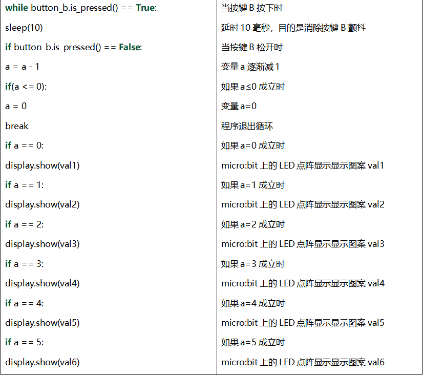

第04课 可编程按键
=================

.. _1实验说明:

1.实验说明：
------------

| |Img|
| 按键可以控制电路的通断，把按键接入电路中，不按下按键的时候电路是断开的，一按下按键电路就通啦，但是松开之后就又断了。可是为什么按下才通电呢？这得从按键的内部构造说起。没按下之前，电流从按键的一端过不去另一端，按键的两端就像两座山，中间隔着一条河，我们在这座山过不去另一座山；按下的时候，按键内部的金属片把两边连接起来让电流通过，就像搭了一座桥，把两座山连接起来。
  按键内部结构如图：\ |image1|\ ，未按下按键之前，1、2就是导通的，3、4也是导通的，但是1、3或1、4或2、3或2、4是断开（不通）的；只有按下按键时，1、3或1、4或2、3或2、4才是导通的。
  Micro:bit主板有三个按键，反面的是复位按钮，正面的是两个可编程按键，通过对两个可编程按键组合可以有三种组合，作为输入元件。我们结合上节课的LED点阵，一起来学习按键吧。我们做一个按键三连，分别按A、B和AB同时按，对应显示屏分别显示A、B和AB。

.. _2-准备:

2. 准备：
---------

（1）通过Micro USB线连接Micro:bit主板和电脑。 |image2|

（2）打开离线版本的Mu软件。

.. _3-课程代码1:

3. 课程代码1：
--------------

按下Micro:bit主板上的按键A，按键B和按键A+B，让Micro:bit上LED点阵显示字符串。

可以直接在Mu编译器上传教程中的代码，也可以手动在Mu编译器编写代码。

添加代码到Mu编译器的教程与下载代码的教程请阅读“开发环境设置”文件夹中的文件“Mu
Editor 编译器教程”。

::

   from microbit import *

   while True:
       if button_a.is_pressed():
           display.show("A")
       elif button_a.is_pressed() and button_b.is_pressed():
           display.scroll("AB")
       elif button_b.is_pressed():
           display.show("B")

.. _4-实验结果1:

4. 实验结果1：
--------------

按照之前的方式将代码1下载到Micro:bit主板，Micro
USB数据线不要拔下来，利用Micro
USB数据线上电。按下Micro:bit主板上正面按键A，我们可以看到5×5
LED点阵显示字符“A”；按下Micro:bit主板上正面按键B，我们可以看到5×5
LED点阵显示字符“B”；同时按下Micro:bit主板上正面按键A和B，我们就可以看到5×5
LED点阵显示字符“AB”。

.. _5-课程代码2:

5. 课程代码2：
--------------

按下Micro:bit主板上按键A和按键B，对应的增加和减少条形图高度，表现为LED点阵亮的行数对应的增加和减少。

可以直接在Mu编译器上传教程中的代码，也可以手动在Mu编译器编写代码。

添加代码到Mu编译器的教程与下载代码的教程请阅读“开发环境设置”文件夹中的文件“Mu
Editor 编译器教程”。

::

   from microbit import *
   a = 0
   b = 0
   val1 = Image("00000:""00000:""00000:""00000:""00900")
   val2 = Image("00000:""00000:""00000:""00900:""99999")
   val3 = Image("00000:""00000:""00900:""99999:""99999")
   val4 = Image("00000:""00900:""99999:""99999:""99999")
   val5 = Image("00900:""99999:""99999:""99999:""99999")
   val6 = Image("99999:""99999:""99999:""99999:""99999")
   display.show(val1)

   while True:
       while button_a.is_pressed() == True:
           sleep(10)
           if button_a.is_pressed() == False:
               a = a + 1
               if(a >= 5):
                   a = 5
               break
       while button_b.is_pressed() == True:
           sleep(10)
           if button_b.is_pressed() == False:
               a = a - 1
               if(a <= 0):
                   a = 0
               break
       if a == 0:
           display.show(val1)
       if a == 1:
           display.show(val2)
       if a == 2:
           display.show(val3)
       if a == 3:
           display.show(val4)
       if a == 4:
           display.show(val5)
       if a == 5:
           display.show(val6)

.. _6实验结果2:

6.实验结果2：
-------------

按照之前的方式将代码2下载到Micro:bit主板，Micro
USB数据线不要拔下来，利用Micro
USB数据线上电。按下Micro:bit主板上正面按键A，条形图高度值增加，表现为LED点阵亮的行数增加；按下正面按键B，减少条形图高度，表现为LED点阵亮的行数减少。

.. _7-代码解释:

7. 代码解释：
-------------

|image3| |image4|

.. |Img| image:: ./media/img-20230324150336.png
.. |image1| image:: ./media/img-20230324150353.png
.. |image2| image:: ./media/img-20230327154148.png
.. |image3| image:: ./media/img-20230327163223.png

