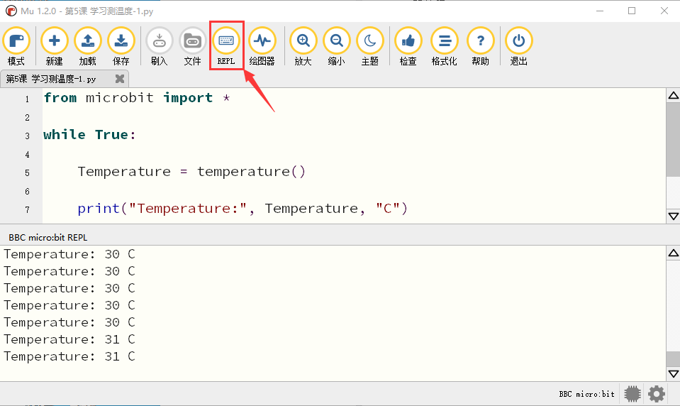
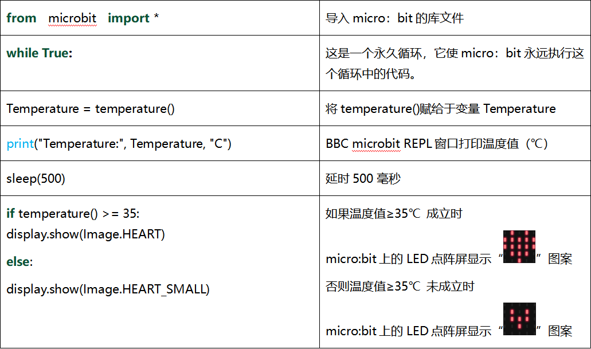

第05课 学习测温度
=================

.. _1实验说明:

1.实验说明：
------------

Micro:bit主板实际上并不带温度传感器，而是采用nRF52833芯片内置的温度传感器进行温度检测，所以检测的温度更接近芯片的温度，可能与周围环境温度存在一定的误差。在这一课程中，我们先利用该传感器测试当前环境中的温度，并将测试结果在显示数据(设备)中显示，再通过设置该传感器检测的温度范围来控制LED点阵显示不同的图案。

注意：Micro:bit主板的温度传感器在这里： |Img|

.. _2-准备:

2. 准备：
---------

（1）通过Micro USB线连接Micro:bit主板和电脑。 |image1|

（2）打开离线版本的Mu软件。

.. _3-课程代码1:

3. 课程代码1：
--------------

Micro:bit检测温度

可以直接在Mu编译器上传教程中的代码，也可以手动在Mu编译器编写代码。

添加代码到Mu编译器的教程与下载代码的教程请阅读“开发环境设置”文件夹中的文件“Mu
Editor 编译器教程”。

::

   from microbit import *

   while True:

       Temperature = temperature()

       print("Temperature:", Temperature, "C")

       sleep(500)

.. _4-实验结果1:

4. 实验结果1：
--------------

按照之前的方式将代码1下载到Micro:bit主板，Micro
USB数据线不要拔下来，利用Micro
USB数据线上电，先点击“REPL”按钮，再按一下Micro:bit后面的复位按钮，这样，BBC
Microbit
REPL窗口打印并显示了Micro:bit的温度传感器检测到当前环境中的温度值，如下图：（这里的字母C表示摄氏温度单位，而摄氏温度单位（℃）会导致乱码）
|image2|

.. _5-课程代码2:

5. 课程代码2：
--------------

可以直接在Mu编译器上传教程中的代码，也可以手动在Mu编译器编写代码。

添加代码到Mu编译器的教程与下载代码的教程请阅读“开发环境设置”文件夹中的文件“Mu
Editor 编译器教程”。

::

   from microbit import *

   while True:

       if temperature() >= 35:
           display.show(Image.HEART)

       else:
           display.show(Image.HEART_SMALL)

.. _6实验结果2:

6.实验结果2：
-------------

按照之前的方式将程序2下载到Micro:bit主板，Micro
USB数据线不要拔下来，利用Micro
USB数据线上电，外界环境中的温度小于35℃时，Micro:bit主板的5×5LED点阵中显示图案\ |image3|\ ，用手按住Micro:bit主板的温度传感器，温度大于等于35℃时，5×5LED点阵中显示图案\ |image4|\ 。

.. _7-代码解释:

7. 代码解释：
-------------

|image5|

.. |Img| image:: ./media/img-20230324151954.png
.. |image1| image:: ./media/img-20230327154148.png

