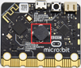
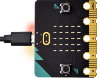

第09课 扬声器
=============

|Img|

.. _1实验说明:

1.实验说明：
------------

Micro:bit主板有内置扬声器，这使得在你的项目中添加声音变得非常容易。通过编程使扬声器发出各种各样的音调，例如编写一首歌曲：《欢乐颂》，让扬声器播放出来。

.. _2-准备:

2. 准备：
---------

（1）通过Micro USB线连接Micro:bit主板和电脑。 |image1|

（2）打开离线版本的Mu软件。

.. _3-课程代码:

3. 课程代码：
-------------

可以直接在Mu编译器上传教程中的代码，也可以手动在Mu编译器编写代码。

添加代码到Mu编译器的教程与下载代码的教程请阅读“开发环境设置”文件夹中的文件“Mu
Editor 编译器教程”。

::

   from microbit import *

   import audio

   display.show(Image.MUSIC_QUAVER)

   while True:
       audio.play(Sound.GIGGLE)
       sleep(1000)
       audio.play(Sound.HAPPY)
       sleep(1000)
       audio.play(Sound.HELLO)
       sleep(1000)
       audio.play(Sound.YAWN)
       sleep(1000)

.. _4-实验结果:

4. 实验结果：
-------------

代码成功下载到Micro:bit主板之后，Micro USB数据线不要拔下来，利用Micro
USB数据线上电，Micro:bit主板上的扬声器发出声音且LED点阵显示音乐标志图案。

.. _5代码说明:

5.代码说明：
------------

+--------------------------+------------------------------------------+
| 代码块                   | 解释                                     |
+==========================+==========================================+
| from microbit import \*  | 导入micro：bit的库文件                   |
+--------------------------+------------------------------------------+
| import audio             | 导入audio库文件                          |
+--------------------------+------------------------------------------+
| while True:              | 这是一个永久循环，                       |
|                          | 它使micro：bit永远执行这个循环中的代码。 |
+--------------------------+------------------------------------------+
| audio.play(Sound.GIGGLE) | 发出giggle的声音                         |
+--------------------------+------------------------------------------+

