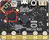

第12课 蓝牙无线通信
===================

|Img|

.. _1-实验说明:

1. 实验说明：
-------------

虽然Micro:bit拥有一个低功耗蓝牙模块，可以进行蓝牙连接发送数据等，但它只有16k的RAM。BLE堆栈占用了12k
RAM，这意味着没有足够的空间来运行MicroPython；也意味着在同一时刻，MicroPython和蓝牙服务只能运行一个。
在将来可能配备32k
RAM的版本就可以支持蓝牙服务了，在此之前，MicroPython还无法支持蓝牙。
https://microbit-micropython.readthedocs.io/en/latest/ble.html

