第13课 七彩灯闪烁
=================

|Img|

.. _1实验说明:

1.实验说明：
------------

这是一个常用的LED，它是一个七彩LED，它采用7彩自动闪烁LED（外观白色，显示七彩）元件。七色LED模块可自动闪烁内置颜色。可以用来制作相当迷人的灯光效果。这个模块与普通LED驱动相同，当我们给它输入高电平时将自动闪烁七种颜色，而输入低电平时将停止闪烁。
我们已经将7彩LED集成到电机驱动底板，在这个项目中，我们用两个最基本的实验代码分别来控制这个七彩LED。LED模块信号端S为高电平时七彩LED开始自动闪烁，S为低电平时七彩LED熄灭不再闪烁。

.. _2-相关知识:

2. 相关知识：
-------------

|image1| |image2|

两个七彩灯分别通过三极管来控制，信号端分别接到了P5.4和P5.5，所以我们只要控制这两个引脚输出高低电平即可控制两个七彩灯。

.. _3实验准备:

3.实验准备：
------------

（1）将micro：bit主板正确插入4WD Micro:bit麦克纳姆轮智能小车。
（2）将电池装入4WD Micro:bit麦克纳姆轮智能小车。
（3）将电机驱动底板上的电源拨码开关拨到ON一端，开启电源。 （4）通过micro
USB线连接micro:bit主板和电脑。 （5）打开离线版本的Mu软件。

.. _4添加库文件:

4.添加库文件：
--------------

特别注意：导入库文件前需要给Micro:bit主板上传一个.py的代码（空代码也是可以的），这里我们是以“\ **第13课：七彩灯闪烁.py**\ ”代码为例。

导入“\ **keyes_mecanum_Car_V2.py**\ ”库文件

.. raw:: html

    

| Mu保存文件的默认目录是“Mu_code”，它位于用户目录的根目录中。参考文献链接：\ https://codewith.mu/en/tutorials/1.0/files
  例如，在Windows系统中，假设您的系统安装在电脑C驱动器上，则用户名为“Administrator”，那么“mu_code”目录的路径是“C:\\Administrator\\mu\_
  code”。在Linux系统上，“mu_code”目录的路径是“~/home/mu_code”
| 进入“mu_code”文件夹。 |image3|
  我们提供的库文件“keyes_mecanum_Car_V2.py”的路径如下： |image4|
  复制粘贴我们提供的库文件“keyes_mecanum_Car_V2.py”到“mu_code”文件夹中。复制成功后，如下图：
  |image5|
  先打开Mu软件并连接Micro:bit主板到电脑，接着点击“\ **刷入**\ ”按钮烧入一个空的程序代码到Micro:bit主板中。
  |image6|
  然后点击“\ **文件**\ ”按钮，就可以在“\ **电脑上的文件**\ ”栏的下面方框中看到对应的库文件，再拖着库文件“keyes_mecanum_Car_V2.py”到Micro:bit主板中。
  |image7| |image8| |image9| |image10|

库文件导入成功后，你点击“\ **加载**\ ”按钮导入Python教程中第13课文件夹中的程序代码“\ **第13课：七彩灯闪烁.py**\ ”,然后单击“\ **检查**\ ”按钮来检查代码是否有错误。如果一行出现光标或下划线，则表明该行的程序有错误。
|image11|

|image12|
但是，单击“\ **检查**\ ”按钮来检查代码是否有错误时，即使代码没有错误时也会出现如下提示语，这提示语只是一些警告语，而不是代码错误提示语。也就是说整个代码是没有错误的。
|image13| |image14| 确定程序代码无误之后，你还需要确定Micro
USB线已经将Micro:bit主板连接到电脑，然后单击“\ **刷入**\ ”按钮将代码下载到Micro:bit主板。
|image15|
如果点击“\ **刷入**\ ”按钮后程序代码错误或实验现象错误，请确认你是否已经导入好我们提供给Micro:bit主板的库文件“keyes_mecanum_Car_V2.py”。

特别注意:
如果您在micro:bit板上下载了其他程序，但库文件“keyes_mecanum_Car_V2.py”程序除外。在使用Micropython编程之前，您需要将库文件导入到Micro:bit主板。
如果您始终使用相同的
Micro:bit主板进行Micropython编程，则无需多次将库文件发送到Micro:bit主板；反之，就需要再次将库文件发送到Micro:bit主板。

.. _5实验代码:

5.实验代码：
------------

库文件“keyes_mecanum_Car_V2.py”添加完后，可以直接在Mu编译器上传教程中的代码，也可以手动在Mu编译器编写代码。（注意！所有英文及符号均须以英文填写，最后一行必须有空格。）

添加代码到Mu编译器的教程与下载代码的教程请阅读“开发环境设置”文件夹中的文件“Mu
Editor 编译器教程”。

::

   from microbit import *
   from keyes_mecanum_Car_V2 import *

   mecanumCar = Mecanum_Car_Driver_V2()

   while True:
       mecanumCar.left_led(1)
       mecanumCar.right_led(1)
       sleep(3000)
       mecanumCar.left_led(0)
       mecanumCar.right_led(0)
       sleep(3000)

.. _6实验结果:

6.实验结果：
------------

确定已经将电机驱动底板上的电源拨码开关拨到ON一端，点击“\ **刷入**\ ”将代码下载到micro：bit主板。这样，麦克纳姆轮智能车电机驱动底板上的七彩灯闪烁3秒，然后停止闪烁3秒，反复循环。
|image16|

.. _7代码说明:

7.代码说明：
------------

+----------------------------------+----------------------------------+
| from microbit import \*          | 导入micro：bit的库文件           |
+==================================+==================================+
| from keyes_mecanum_Car_V2 import | 导入                             |
| \*                               | keyes_mecanum_Car_V2的库文件     |
+----------------------------------+----------------------------------+
| mecanumCar =                     | 实例化一个对象Mec                |
| Mecanum_Car_Driver_V2()          | anum_Car_Driver_V2()为mecanumCar |
+----------------------------------+----------------------------------+
| while True:                      | 这是一个永久循环，它使micr       |
|                                  | o：bit永远执行这个循环中的代码。 |
+----------------------------------+----------------------------------+
| mecanumCar.left_led(1)           | 点亮左                           |
|                                  | 边的七彩灯。（1是点亮，0是熄灭） |
+----------------------------------+----------------------------------+
| mecanumCar.right_led(1)          | 点亮右                           |
|                                  | 边的七彩灯。（1是点亮，0是熄灭） |
+----------------------------------+----------------------------------+
| sleep(3000)                      | 延时3000毫秒，即3秒              |
+----------------------------------+----------------------------------+
| mecanumCar.left_led(0)           | 熄灭左                           |
|                                  | 边的七彩灯。（1是点亮，0是熄灭） |
+----------------------------------+----------------------------------+
| mecanumCar.right_led(0)          | 熄灭右                           |
|                                  | 边的七彩灯。（1是点亮，0是熄灭） |
+----------------------------------+----------------------------------+

.. |Img| image:: ./media/img-20230426135820.png
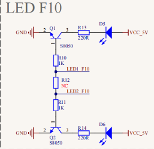
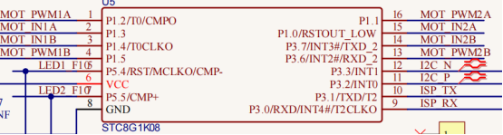
.. |image3| image:: ./media/img-20230327142740.png
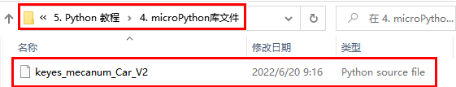
.. |image5| image:: ./media/img-20230427160707.png
.. |image6| image:: ./media/img-20230327143130.png
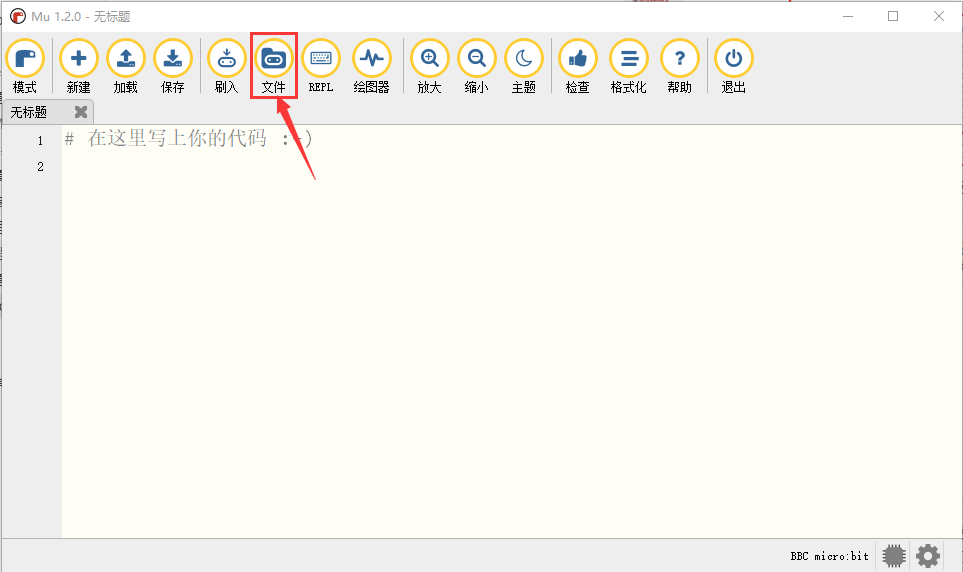
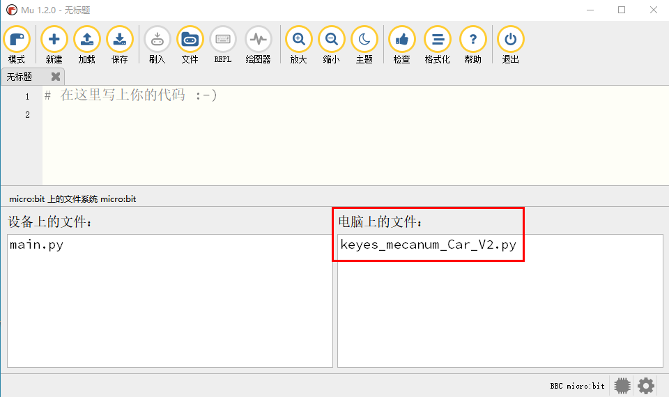
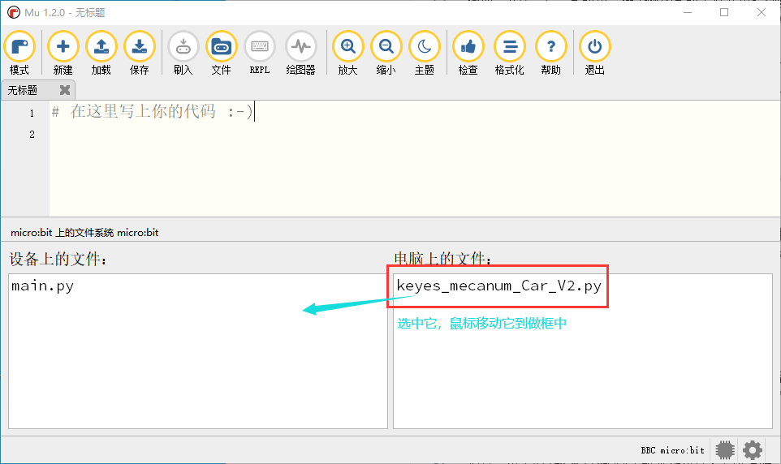
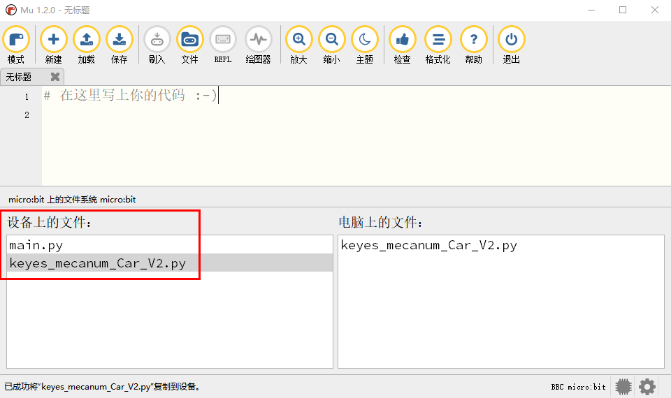
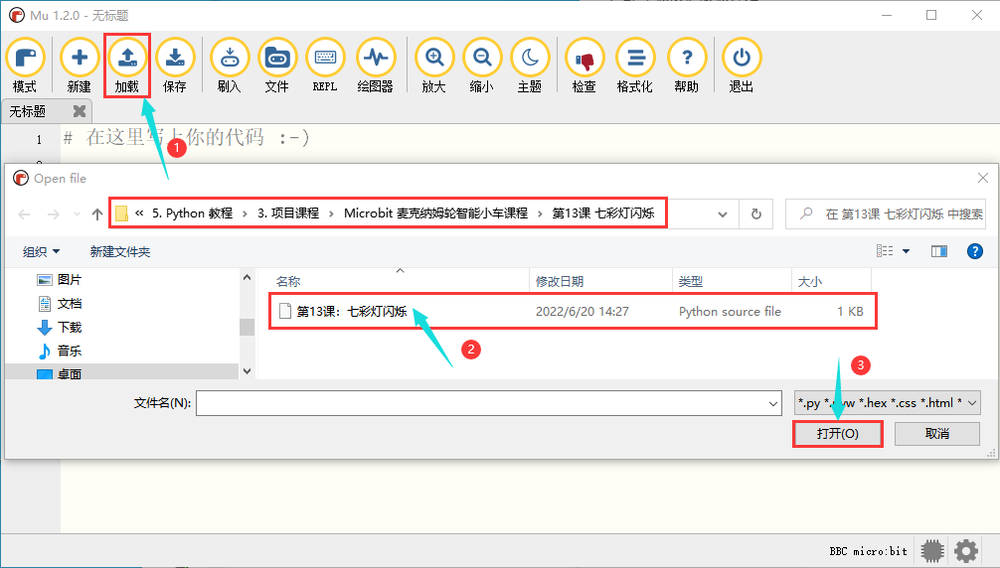
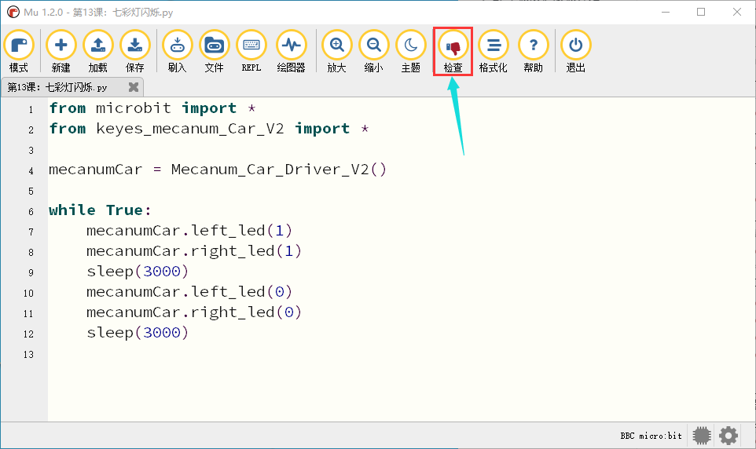
.. |image13| image:: ./media/img-20230427163410.png
.. |image14| image:: ./media/img-20230427163420.png
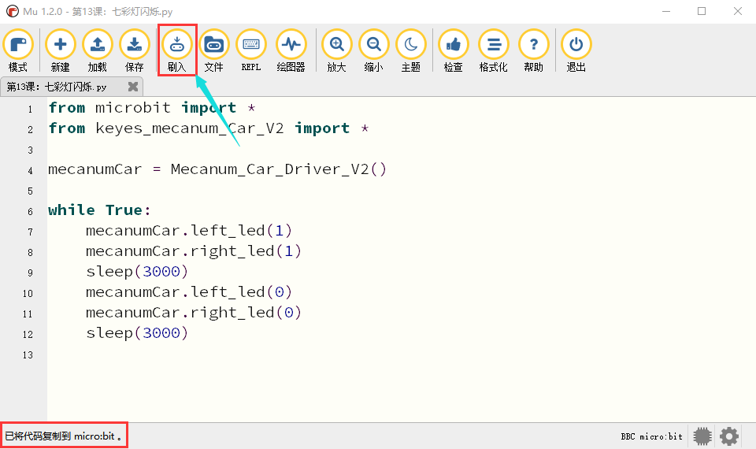
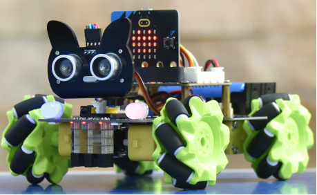
