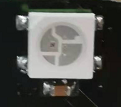
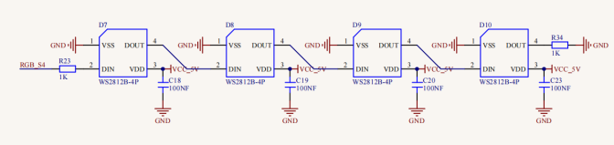

第14课 WS2812RGB
================

|Img|

.. _1实验说明:

1.实验说明：
------------

在前一个项目中，我们详细的介绍了通过代码控制七彩LED闪烁。这节课我们使用WS2812灯珠来显示真正的多彩灯，理论上我们可以通过编程实现我们想要显示的任意的颜色。
但是这个2812 RGB
驱动原理与我们前面学习过的七彩LED不相同，但是也只需要一个引脚就能控制，这是一个集控制电路与发光电路于一体的智能外控LED光源。每个LED原件其外型与一个5050LED灯珠相同，每个元件即为一个像素点，我们这个电机驱动板上有四个灯珠即四个像素。在本项目中我们利用Micro：bit的P7控制端控制4个WS2812
RGB灯显示不同的状态。

.. _2元件知识:

2.元件知识：
------------

|image1|
这四个像素点灯珠都是串联起来的，其实不论多少个，我们都可以用一个引脚（控制引脚为micro
bit的P7）控制任意一个灯，并且让它显示任一种颜色。像素点内部包含了智能数字接口数据锁存信号整形放大驱动电路，还包含有高精度的内部振荡器和12V高压可编程定电流控制部分，有效保证了像素点光的颜色高度一致。数据协议采用单线归零码的通讯方式，像素点在上电复位以后，S端接受从控制器传输过来的数据，首先送过来的24bit数据被第一个像素点提取后，送到像素点内部的数据锁存器。这个2812RGB通讯协议与驱动已经在底层封装好了，我们直接调用函数的接口就可以使用。

.. _3实验准备:

3.实验准备：
------------

（1）将micro：bit主板正确插入4WD Micro:bit麦克纳姆轮智能小车。
（2）将电池装入4WD Micro:bit麦克纳姆轮智能小车。
（3）将电机驱动底板上的电源拨码开关拨到ON一端，开启电源。 （4）通过micro
USB线连接micro:bit主板和电脑。 （5）打开离线版本的Mu软件。

.. _4实验代码1:

4.实验代码1：
-------------

可以直接在Mu编译器上传教程中的代码，也可以手动在Mu编译器编写代码。（注意！所有英文及符号均须以英文填写，最后一行必须有空格。）

添加代码到Mu编译器的教程与下载代码的教程请阅读“开发环境设置”文件夹中的文件“Mu
Editor 编译器教程”。

::

   from microbit import *
   import neopixel
   np = neopixel.NeoPixel(pin7, 4)
   while True:
       for pixel_id1 in range(0, len(np)):
           np[pixel_id1] = (255, 0, 0)
           np.show()
       sleep(1000)
       for pixel_id2 in range(0, len(np)):
           np[pixel_id2] = (255, 165, 0)
           np.show()
       sleep(1000)
       for pixel_id3 in range(0, len(np)):
           np[pixel_id3] = (255, 255, 0)
           np.show()
       sleep(1000)
       for pixel_id4 in range(0, len(np)):
           np[pixel_id4] = (0, 255, 0)
           np.show()
       sleep(1000)
       for pixel_id5 in range(0, len(np)):
           np[pixel_id5] = (0, 0, 255)
           np.show()
       sleep(1000)
       for pixel_id6 in range(0, len(np)):
           np[pixel_id6] = (75, 0, 130)
           np.show()
       sleep(1000)
       for pixel_id7 in range(0, len(np)):
           np[pixel_id7] = (238, 130, 238)
           np.show()
       sleep(1000)
       for pixel_id8 in range(0, len(np)):
           np[pixel_id8] = (160, 32, 240)
           np.show()
       sleep(1000)
       for pixel_id9 in range(0, len(np)):
           np[pixel_id9] = (255, 255, 255)
       sleep(1000)

.. _5实验结果1:

5.实验结果1：
-------------

确定已经将电机驱动底板上的电源拨码开关拨到ON一端，点击“\ **刷入**\ ”将代码1下载到micro：bit主板。这样，micro:bit电机驱动底板上的4个WS2812RGB灯全亮，一种颜色变化，一直循环。
|image2|

.. _6实验代码2:

6.实验代码2：
-------------

可以直接在Mu编译器上传教程中的代码，也可以手动在Mu编译器编写代码。（注意！所有英文及符号均须以英文填写，最后一行必须有空格。）

添加代码到Mu编译器的教程与下载代码的教程请阅读“开发环境设置”文件夹中的文件“Mu
Editor 编译器教程”。

::

   from microbit import *
   import neopixel
   np = neopixel.NeoPixel(pin7, 4)
   while True:
       for index in range(0, 4):
           np.clear()
           np[index] = (255, 0, 0)
           np.show()
           sleep(100)
       for index1 in range(0, 4):
           np.clear()
           np[index1] = (255, 165, 0)
           np.show()
           sleep(100)
       for index2 in range(0, 4):
           np.clear()
           np[index2] = (255, 255, 0)
           np.show()
           sleep(100)
       for index3 in range(0, 4):
           np.clear()
           np[index3] = (0, 255, 0)
           np.show()
           sleep(100)
       for index4 in range(0, 4):
           np.clear()
           np[index4] = (0, 0, 255)
           np.show()
           sleep(100)
       for index5 in range(0, 4):
           np.clear()
           np[index5] = (75, 0, 130)
           np.show()
           sleep(100)
       for index6 in range(0, 4):
           np.clear()
           np[index6] = (238, 130, 238)
           np.show()
           sleep(100)
       for index7 in range(0, 4):
           np.clear()
           np[index7] = (160, 32, 240)
           np.show()
           sleep(100)
       for index8 in range(0, 4):
           np.clear()
           np[index8] = (255, 255, 255)
           np.show()
           sleep(100)

.. _7实验结果2:

7.实验结果2：
-------------

确定已经将电机驱动底板上的电源拨码开关拨到ON一端，点击“\ **刷入**\ ”将代码2下载到micro：bit主板。这样，micro:bit电机驱动底板上的4个WS2812RGB灯以流水灯的形式点亮，一直循环。
|image3|

.. _8实验代码3:

8.实验代码3：
-------------

可以直接在Mu编译器上传教程中的代码，也可以手动在Mu编译器编写代码。（注意！所有英文及符号均须以英文填写，最后一行必须有空格。）

添加代码到Mu编译器的教程与下载代码的教程请阅读“开发环境设置”文件夹中的文件“Mu
Editor 编译器教程”。

::

   from microbit import *
   import neopixel
   np = neopixel.NeoPixel(pin7, 4)
   from random import randint
   R = 0
   G = 0
   B = 0
   while True:
      for index in range(0, 4):
           R = randint(10, 255)
           G = randint(10, 255)
           B = randint(10, 255)
           np.clear()
           np[index] = (R, G, B)
           np.show()
           sleep(500)

.. _9实验结果3:

9.实验结果3：
-------------

确定已经将电机驱动底板上的电源拨码开关拨到ON一端，点击“\ **刷入**\ ”将代码3下载到micro：bit主板。这样，micro:bit电机驱动底板上的4个WS2812RGB灯以流水灯的形式点亮，每个灯亮起都是一种随机颜色，一直循环。

.. _11代码说明:

11.代码说明：
-------------

+----------------------------------+----------------------------------+
| from microbit import \*          | 导入micro：bit的库文件           |
+==================================+==================================+
| import neopixel                  | 导入neopixel 的库文件            |
+----------------------------------+----------------------------------+
| np = neopixel.NeoPixel(pin7, 4)  | 将Ne                             |
|                                  | opixel设为引脚P7初始化灯带4颗LED |
+----------------------------------+----------------------------------+
| np.clear()                       | Neopixel长条上RGB灯都熄灭        |
+----------------------------------+----------------------------------+
| while True:                      | 这是一个永久循环，它使micr       |
|                                  | o：bit永远执行这个循环中的代码。 |
+----------------------------------+----------------------------------+
| for pixel_id1 in range(0,        | 对于（0，len（                   |
| len(np)):                        | np））范围内的RGB像素为pixel_id1 |
+----------------------------------+----------------------------------+
| for index in range(0, 4):        | 对                               |
|                                  | 于（0，4）范围内的RGB像素为index |
+----------------------------------+----------------------------------+
| np.show()                        | 在Neopixel条带上显示当前像素     |
+----------------------------------+----------------------------------+
| np[pixel_id1] = (255, 0, 0)      | 将Neopixel条带                   |
|                                  | 上RGB灯设置像素pixel_id1亮红色灯 |
+----------------------------------+----------------------------------+
| from random import randint       | 从随机变量中导入randint          |
+----------------------------------+----------------------------------+
| np[pixel_id] = (R, G, B)         | 将Neopixel条带                   |
|                                  | 上RGB灯设置像素pixel_id亮彩色灯  |
+----------------------------------+----------------------------------+
| R = 0                            | 设置变量R的初始值为0             |
+----------------------------------+----------------------------------+
| R = randint(10, 255)             | 设置R=randint(10, 255)           |
+----------------------------------+----------------------------------+

.. |image2| image:: ./media/img-20230504103911.png
.. |image3| image:: ./media/img-20230504103911.png
