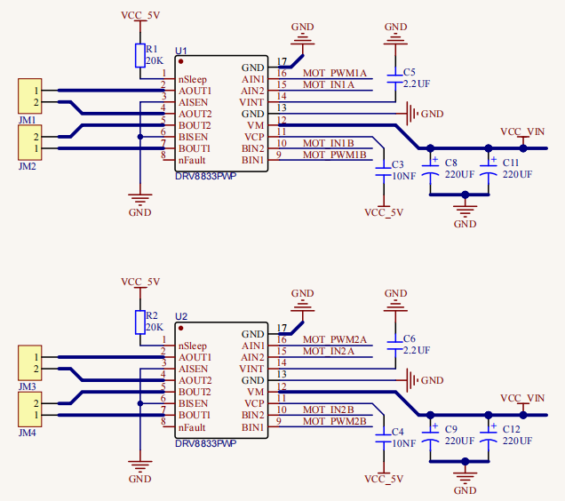

第16课 电机控制
===============

|Img|

.. _1实验说明:

1.实验说明：
------------

要想让小车跑起来那必须要有电机，然后搭配车轮就可以了。我们这个套件上配有4个直流减速电机，即齿轮减速电机，是在普通直流电机的基础上，加上配套齿轮减速箱。齿轮减速箱的作用是，提供较低的转速，较大的力矩。同时，齿轮箱不同的减速比可以提供不同的转速和力矩。这大大提高了直流电机在自动化行业中的使用率，减速电机是指减速机和电机（马达）的集成体，这种集成体通常也可称为齿轮马达或齿轮电机。减速电机广泛应用于钢铁行业、机械行业等。使用减速电机的优点是简化设计、节省空间。
电机的驱动不比LED，它要求的电流比较大，如果我们使用IO口强制驱动电机，要么电机不转动，要么烧坏单片机，所以我们需要一个电机驱动芯片。在电机驱动底板板上已经包含了DRV8833电机驱动芯片，用来控制4个直流减速电机的转动方向和转动速度。下面也有电机驱动底板两个芯片的电路原理图。

.. _2相关知识:

2.相关知识：
------------

|image1| |image2| |image3| |image4|
每个芯片控制4个引脚，每两个引脚控制一个电机，这样就使用了8个引脚控制了4个电机了。我们可以看到电机驱动与STC的接线图，我们驱动电机的时候使用IIC协议往STC这个芯片对应的寄存器地址写入脉宽值就可以输出pwm信号给电机驱动芯片了，我们已经写好了电机驱动的库文件，使用的时候只需要调用API函数就可以让小车走了，非常简单。

.. _3实验准备:

3.实验准备：
------------

（1）将micro：bit主板正确插入4WD Micro:bit麦克纳姆轮智能小车。
（2）将电池装入4WD Micro:bit麦克纳姆轮智能小车。
（3）将电机驱动底板上的电源拨码开关拨到ON一端，开启电源。 （4）通过micro
USB线连接micro:bit主板和电脑。 （5）打开离线版本的Mu软件。

.. _4添加库文件:

4.添加库文件：
--------------

添加库文件的方法请参照Python教程中第13课的文件“第13课：七彩灯闪烁.py”，也可以参照“开发环境设置”文件夹中的文件“Mu
Editor 编译器教程”。

.. _5实验代码1:

5.实验代码1：
-------------

**智能小车行走**

库文件“keyes_mecanum_Car_V2.py”添加完后，可以直接在Mu编译器上传教程中的代码，也可以手动在Mu编译器编写代码。（注意！所有英文及符号均须以英文填写，最后一行必须有空格。）

添加代码到Mu编译器的教程与下载代码的教程请阅读“开发环境设置”文件夹中的文件“Mu
Editor 编译器教程”。

::

   from microbit import *
   from keyes_mecanum_Car_V2 import *
   mecanumCar = Mecanum_Car_Driver_V2()
   while True:
       display.show(Image.ARROW_S)
       mecanumCar.Motor_Upper_L(1, 100)
       mecanumCar.Motor_Lower_L(1, 100)
       mecanumCar.Motor_Upper_R(1, 100)
       mecanumCar.Motor_Lower_R(1, 100)
       sleep(1000)
       display.show(Image.ARROW_N)
       mecanumCar.Motor_Upper_L(0, 100)
       mecanumCar.Motor_Lower_L(0, 100)
       mecanumCar.Motor_Upper_R(0, 100)
       mecanumCar.Motor_Lower_R(0, 100)
       sleep(1000)
       display.show(Image.ARROW_E)
       mecanumCar.Motor_Upper_L(0, 100)
       mecanumCar.Motor_Lower_L(0, 100)
       mecanumCar.Motor_Upper_R(1, 100)
       mecanumCar.Motor_Lower_R(1, 100)
       sleep(1000)
       display.show(Image.ARROW_W)
       mecanumCar.Motor_Upper_L(1, 100)
       mecanumCar.Motor_Lower_L(1, 100)
       mecanumCar.Motor_Upper_R(0, 100)
       mecanumCar.Motor_Lower_R(0, 100)
       sleep(1000)
       display.show(Image("00900:""09990:""99999:""99999:""09090"))
       mecanumCar.Motor_Upper_L(0, 0)
       mecanumCar.Motor_Lower_L(0, 0)
       mecanumCar.Motor_Upper_R(0, 0)
       mecanumCar.Motor_Lower_R(0, 0)
       sleep(1000)

.. _6实验结果1:

6.实验结果1：
-------------

确定已经将电机驱动底板上的电源拨码开关拨到ON一端，点击“\ **刷入**\ ”将代码1下载到micro：bit主板。这样，我们可以看到麦克纳姆轮智能车将前进1s，后退1s，左转1s，右转1s，原地左旋1s，原地左旋1s，停止1s，并且每种运动状态下LED点阵显示对应图案。一直循环。

.. _7实验代码2:

7.实验代码2：
-------------

**智能小车按路线图行走**

库文件“keyes_mecanum_Car_V2.py”添加完后，可以直接在Mu编译器上传教程中的代码，也可以手动在Mu编译器编写代码。（注意！所有英文及符号均须以英文填写，最后一行必须有空格。）

添加代码到Mu编译器的教程与下载代码的教程请阅读“开发环境设置”文件夹中的文件“Mu
Editor 编译器教程”。

::

   from microbit import button_a, button_b, display, Image, sleep
   from keyes_mecanum_Car_V2 import *
   mecanumCar = Mecanum_Car_Driver_V2()

   show_L = Image("90000:""90000:""90000:""90000:""99999")
   show_O = Image("09990:""90009:""90009:""90009:""09990")
   a = 0
   b = 0
   def run_L():
       global b
       sleep(1000)
       mecanumCar.Motor_Upper_L(1, 100)
       mecanumCar.Motor_Lower_L(1, 100)
       mecanumCar.Motor_Upper_R(1, 100)
       mecanumCar.Motor_Lower_R(1, 100)
       sleep(1000)
       mecanumCar.Motor_Upper_L(0, 100)
       mecanumCar.Motor_Lower_L(0, 100)
       mecanumCar.Motor_Upper_R(1, 100)
       mecanumCar.Motor_Lower_R(1, 100)
       sleep(250)
       mecanumCar.Motor_Upper_L(1, 100)
       mecanumCar.Motor_Lower_L(1, 100)
       mecanumCar.Motor_Upper_R(1, 100)
       mecanumCar.Motor_Lower_R(1, 100)
       sleep(1000)
       mecanumCar.Motor_Upper_L(0, 0)
       mecanumCar.Motor_Lower_L(0, 0)
       mecanumCar.Motor_Upper_R(0, 0)
       mecanumCar.Motor_Lower_R(0, 0)
       b = 0
   def run_O():
       global b
       sleep(1000)
       mecanumCar.Motor_Upper_L(1, 100)
       mecanumCar.Motor_Lower_L(1, 100)
       mecanumCar.Motor_Upper_R(1, 100)
       mecanumCar.Motor_Lower_R(1, 100)
       sleep(1000)
       mecanumCar.Motor_Upper_L(0, 100)
       mecanumCar.Motor_Lower_L(0, 100)
       mecanumCar.Motor_Upper_R(1, 100)
       mecanumCar.Motor_Lower_R(1, 100)
       sleep(250)
       mecanumCar.Motor_Upper_L(1, 100)
       mecanumCar.Motor_Lower_L(1, 100)
       mecanumCar.Motor_Upper_R(1, 100)
       mecanumCar.Motor_Lower_R(1, 100)
       sleep(1000)
       mecanumCar.Motor_Upper_L(0, 100)
       mecanumCar.Motor_Lower_L(0, 100)
       mecanumCar.Motor_Upper_R(1, 100)
       mecanumCar.Motor_Lower_R(1, 100)
       sleep(250)
       mecanumCar.Motor_Upper_L(1, 100)
       mecanumCar.Motor_Lower_L(1, 100)
       mecanumCar.Motor_Upper_R(1, 100)
       mecanumCar.Motor_Lower_R(1, 100)
       sleep(1000)
       mecanumCar.Motor_Upper_L(0, 100)
       mecanumCar.Motor_Lower_L(0, 100)
       mecanumCar.Motor_Upper_R(1, 100)
       mecanumCar.Motor_Lower_R(1, 100)
       sleep(250)
       mecanumCar.Motor_Upper_L(1, 100)
       mecanumCar.Motor_Lower_L(1, 100)
       mecanumCar.Motor_Upper_R(1, 100)
       mecanumCar.Motor_Lower_R(1, 100)
       sleep(1000)
       mecanumCar.Motor_Upper_L(0, 0)
       mecanumCar.Motor_Lower_L(0, 0)
       mecanumCar.Motor_Upper_R(0, 0)
       mecanumCar.Motor_Lower_R(0, 0)
       b = 0
   while True:
       if button_a.was_pressed():
           a = a + 1
           if a >= 3:
               a = 0
       if button_b.was_pressed():
           b = 1
       if (a == 1):
           display.show(show_L)
           if b == 1:
               run_L()
       elif a == 2:
           display.show(show_O)
           if b == 1:
               run_O()

.. _8实验结果2:

8.实验结果2：
-------------

确定已经将电机驱动底板上的电源拨码开关拨到ON一端，点击“\ **刷入**\ ”将代码2下载到micro：bit主板。这样，当我们第一次按A键时，LED点阵会显示“L”图案，再按B键，可以看到麦克纳姆轮智能车前进的Route是“L”；当我们第二次按A键时，LED点阵会显示“口”图案，再按B键，可以看到麦克纳姆轮智能车前进的Route是“口”；当我们第三次按A键时，LED点阵会显示“L”，再按B键，可以看到麦克纳姆轮智能车前进的Route是“L”；
........；保持循环处于这种状态。

.. _9代码说明:

9.代码说明：
------------

+----------------------------------+----------------------------------+
| from microbit import button_a,   | 导                               |
| button_b, display, Image, sleep  | 入micro：bit库文件中的button_a,  |
|                                  | button_b, display, Image, sleep  |
+==================================+==================================+
| from keyes_mecanum_Car_V2 import | 导入keyes_mecanum_Car_V2的库文件 |
| \*                               |                                  |
+----------------------------------+----------------------------------+
| mecanumCar                       | 实例化一个对象Mec                |
| =Mecanum_Car_Driver_V2()         | anum_Car_Driver_V2()为mecanumCar |
+----------------------------------+----------------------------------+
| while True:                      | 这是一个永久循环，它使micr       |
|                                  | o：bit永远执行这个循环中的代码。 |
+----------------------------------+----------------------------------+
| display.show(Image.ARROW_S)      | micro:bit上                      |
|                                  | 的LED点阵屏显示指向“南”方向图案  |
+----------------------------------+----------------------------------+
| display.show(Image("00900:""     | m                                |
| 09990:""99999:""99999:""09090")) | icro:bit上的LED点阵屏显示“❤”图案 |
+----------------------------------+----------------------------------+
| mecanumCar.Motor_Upper_L(1, 100) | 智能车的左前方电机以PWM100的速度 |
|                                  | 正转（1表示正转，0表示反转；PWM  |
|                                  | 100是速度（0~255）），当PWM值为0 |
|                                  | 时停止转动。                     |
+----------------------------------+----------------------------------+
| mecanumCar.Motor_Upper_R(0, 100) | 智能                             |
|                                  | 车的右前方电机以PWM100的速度反转 |
+----------------------------------+----------------------------------+
| sleep(1000)                      | 延时1000毫秒                     |
+----------------------------------+----------------------------------+
| a = 0                            | 设置变量a初始值为0               |
+----------------------------------+----------------------------------+
| b = 0                            | 设置变量b初始值为02              |
+----------------------------------+----------------------------------+
| def run_L():                     | 定义子函数run_L()                |
+----------------------------------+----------------------------------+
| def run_O():                     | 定义子函数run_O()                |
+----------------------------------+----------------------------------+
| show_L =                         | 将Image()赋给于变量show_L        |
| Image("90000:"                   |                                  |
| "90000:""90000:""90000:""99999") |                                  |
+----------------------------------+----------------------------------+
| if button_a.was_pressed():       | 如果microbit上的按键A按下时      |
+----------------------------------+----------------------------------+
| a = a + 1                        | 变量a加1                         |
+----------------------------------+----------------------------------+
| if a >= 3:                       | 如果变量a≥3成立时                |
+----------------------------------+----------------------------------+
| a = 0                            | 变量a=0                          |
+----------------------------------+----------------------------------+
| if button_b.was_pressed():       | 如果microbit上的按键B按下时      |
+----------------------------------+----------------------------------+
| b = 1                            | 变量b=1                          |
+----------------------------------+----------------------------------+
| if (a == 1):                     | 如果a=1成立时                    |
+----------------------------------+----------------------------------+
| display.show(show_L)             | micro:bit上的LED点阵显示“L”图案  |
+----------------------------------+----------------------------------+
| if b == 1:                       | 如果b=1成立时                    |
+----------------------------------+----------------------------------+
| run_L()                          | 智能车走“L”型路线                |
+----------------------------------+----------------------------------+
| elif a == 2:                     | 否则如果a=2成立时                |
+----------------------------------+----------------------------------+
| display.show(show_O)             | micro:bit上的LED点阵显示“O”图案  |
+----------------------------------+----------------------------------+
| if b == 1:                       | 如果b=1成立时                    |
+----------------------------------+----------------------------------+
| run_O()                          | 智能车走“O”型路线                |
+----------------------------------+----------------------------------+

.. |Img| image:: ./media/img-20230426164441.png
.. |image1| image:: ./media/img-20230426160942.png
.. |image2| image:: ./media/img-20230426160947.png

.. |image4| image:: ./media/img-20230426160709.png
