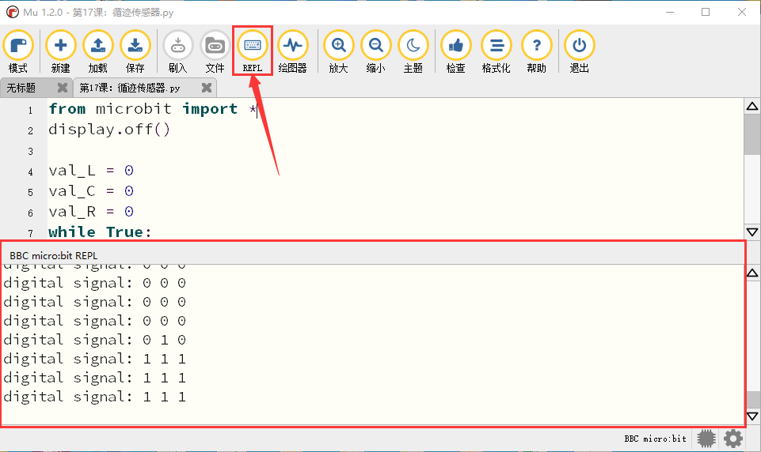

第17课 循迹传感器
=================

|Img|

.. _1实验说明:

1.实验说明：
------------

循迹传感器实际上是红外传感器。
在小车驱动底板的前面有3路巡线，此处使用的组件是TCRT5000红外灯管。
其工作原理是利用红外光对颜色的不同反射率，然后将反射信号的强度转换为电流信号。
在检测过程中，黑色在高电平时处于活动状态，而白色在低电平时处于活动状态，即检测到黑色时或者近距离没有检测到物体时输出高电平，检测到白色或者光滑易反射光的物体时输出低电平。
检测高度为0-3厘米。
底板上方还有3个蓝色旋转电位器，通过旋转这些电位器，可以调节传感器的检测灵敏度。

.. _2相关知识:

2.相关知识：
------------

- 工作电压: 3.3-5V (DC)
- 接口: 5PIN接口(我们接到了16,17,18)
- 输出信号: 数字信号
- 检测高度: 0-3 cm

**红外循迹传感器：**
红外循迹传感器的红外对管分为两部分，一部分是红外发射端，另一部分是红外接收端。
|image1|
黑线或黑色物体对红外线有很好的吸收效果。当红外循迹发射端向黑线发射时，发射的红外线被吸收而未形成反射信号，红外循迹接收端未接收到信号，这样红外循迹输出高电平(1);白线或白色物体对红外线没有吸收作用，红外循迹发射端的红外信号会反射回接收端，这样红外循迹输出低电平(0)。

下表给出了小车底板上的红外循迹传感器检测不同颜色物体的所有情况下的数值。其中检测到黑线、黑色物体或无物体代表1，检测到白线或白色物体代表0。
|image2|

================ ================== ================ ============
左红外循迹传感器 中间红外循迹传感器 右红外循迹传感器 值（二进制）
================ ================== ================ ============
0                0                  0                000
0                0                  1                001
0                1                  0                010
0                1                  1                011
1                0                  0                100
1                0                  1                101
1                1                  0                110
1                1                  1                111
================ ================== ================ ============

警告：反射式光学传感器(包括红外循迹)应避免在阳光等有红外干扰的环境中使用。阳光中含有许多不可见光，如红外线和紫外线。在强光环境下，反射式光学传感器不能正常工作。

.. _3实验准备:

3.实验准备：
------------

（1）将micro：bit主板正确插入4WD Micro:bit麦克纳姆轮智能小车。
（2）将电池装入4WD Micro:bit麦克纳姆轮智能小车。
（3）将电机驱动底板上的POWER拨码开关拨到ON一端，开启电源。
（4）通过micro USB线连接micro:bit主板和电脑。
（5）打开离线版本的Mu软件。

.. _4实验代码:

4.实验代码：
------------

可以直接在Mu编译器上传教程中的代码，也可以手动在Mu编译器编写代码。（注意！所有英文及符号均须以英文填写，最后一行必须有空格。）

添加代码到Mu编译器的教程与下载代码的教程请阅读“开发环境设置”文件夹中的文件“Mu
Editor 编译器教程”。

::

   from microbit import *
   display.off()

   val_L = 0
   val_C = 0
   val_R = 0
   while True:
       val_L = pin3.read_digital()
       val_C = pin4.read_digital()
       val_R = pin10.read_digital()
       print("digital signal:", end = ' ')
       print(val_L, end = ' ')
       print(val_C, end = ' ')
       print(val_R)
       sleep(200)

.. _5实验结果:

5.实验结果：
------------

确定已经将电机驱动底板上的电源拨码开关拨到ON一端，点击“\ **刷入**\ ”将将代码下载到micro：bit主板，Micro
USB数据线不要拔下来，利用Micro USB数据线上电。

**先点击“REPL”按钮，再按一下micro:bit后面的复位按钮**\ ，这样，BBC
microbit
REPL窗口打印并显示了micro:bit迷你智能麦克纳姆轮智能车上3路循迹传感器的左边TCRT5000红外对管检测到的数字信号，当TCRT5000红外对管检测到白色物体时，串口监视器窗口显示低电平（0），同时传感器模块对应的指示灯亮起；当TCRT5000红外对管检测到黑色物体或未检测到物体时，串口监视器窗口显示高电平（1），同时传感器模块对应的指示灯不亮，如下图：
|image3|

.. _6代码说明:

6.代码说明：
------------

+----------------------------------+----------------------------------+
| from microbit import \*          | 导入micro：bit的库               |
+==================================+==================================+
| val_L = 0                        | 设置变量初始值为0                |
+----------------------------------+----------------------------------+
| while True:                      | 这是一个永久循环，它使mi         |
|                                  | cro：bit永远执行这个循环中的代码 |
+----------------------------------+----------------------------------+
| val_L = pin3.read_digital()      | 将接在P3控制口的TCRT5000红外对   |
|                                  | 管读取的数字信号赋给于变量val_L  |
+----------------------------------+----------------------------------+
| print("digital signal:", end = ' | 不换行打印”digital signal”       |
| ')                               |                                  |
+----------------------------------+----------------------------------+
| print(val_L, end = ' ')          | 不换行打印信号值val_L            |
+----------------------------------+----------------------------------+
| print(val_R)                     | 换行打印信号值val_R              |
+----------------------------------+----------------------------------+
| sleep(200)                       | 延时200ms                        |
+----------------------------------+----------------------------------+

.. |Img| image:: ./media/img-20230426164533.png
.. |image1| image:: ./media/img-20230522172021.png
.. |image2| image:: ./media/img-20230523170452.png

