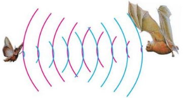
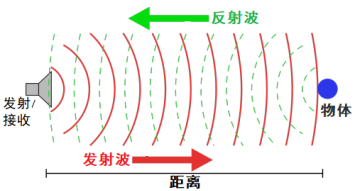
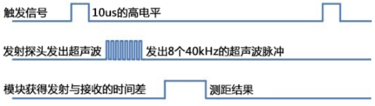
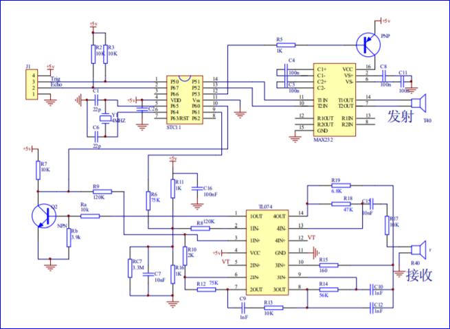
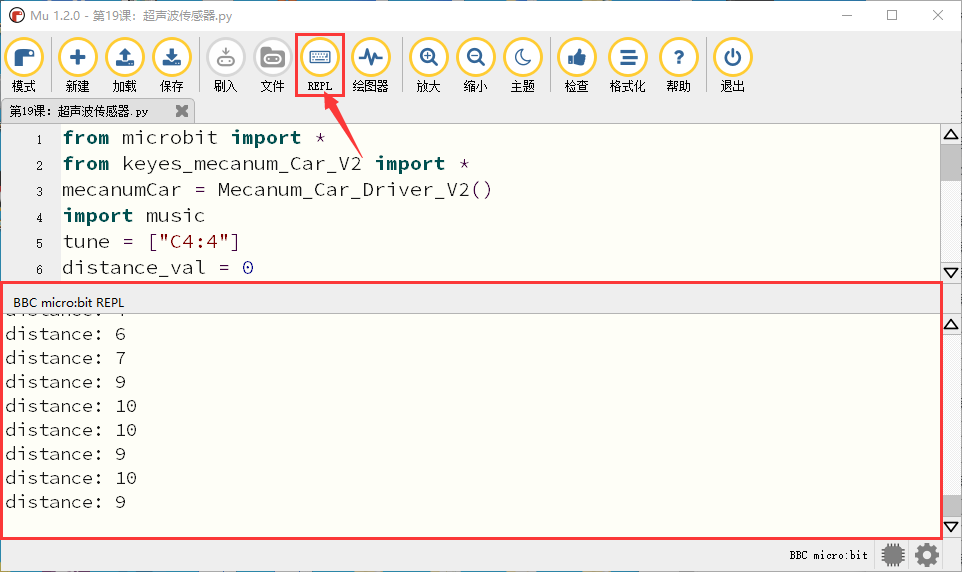

第19课 超声波传感器
===================

.. _1-实验说明:

1. 实验说明：
-------------

小车上有个超声波传感器，超声波传感器是一种非常实惠的距离传感器，它可以检测前方是否存在障碍物，并且检测出传感器与障碍物的详细距离。
|Img|
它的原理和蝙蝠飞行的原理一样，就是超声波传感器发送出一种频率很高的超声波信号，通常正常人耳朵的听力的声波范围是20Hz~20kHz，人类无法听到。这些超声波的信号若是碰到障碍物，就会立刻反射回来，在接收到返回的信息之后，通过判断发射信号和接收信号的时间差，计算出传感器和障碍物的距离。超声波传感器主要用于各种机器人项目中的物体躲避和测距，也常被用于水位传感，甚至作为一个停车传感器。
在本实验中，我们使用超声波传感器来测量距离，并将数据打印在串口监视器上。根据前面的接线图可知，超声波传感器模块集成端口是接在电机驱动底板上5V
G P15
P16集合端口，Trig（T）引脚对应的是micro:bit的P15控制的；Echo（E）引脚对应的是micro:bit的P16控制的。

.. _2元件知识:

2.元件知识：
------------

**HC-SR04超声波传感器：**
像蝙蝠一样使用声纳来确定与物体的距离，它提供了精准的非接触范围检测，高精度和稳定的读数。它的操作不受阳光或黑色材料的影响，就像精密的照相机(在声学上像布料这样比较软的材料很难被探测到)。它带有超声波信号发射端和信号接收端。

| 我们看下超声波传感器模块的图片，两个像眼睛一样的东西，一个就是信号发射端（TRIG），一个就是信号接收端（ECHO）。
| |image1|

**参数：**

- 工作电压:+5V DC
- 静态电流: <2mA
- 工作电流: 15mA
- 有效角度: <15°
- 距离范围: 2cm – 400 cm
- 精度: 0.3 cm
- 测量角度: 30 degree
- 触发输入脉宽: 10us

**原理：**

最常用的超声测距的方法是回声探测法，如图： |image2|
超声波发射器向某一方向发射超声波，在发射时刻的同时计数器开始计时，超声波在空气中传播，途中碰到障碍物面阻挡就立即反射回来，超声波接收器收到反射回的超声波就立即停止计时。超声波也是一种声波，其声速V与温度有关。一般情况下超声波在空气中的传播速度为340m/s，根据计时器记录的时间t，就可以计算出发射点距障碍物面的距离s，即：s=340t/2：
(1)采用IO口TRIG触发测距，给至少10us的高电平信号;
(2)模块自动发送8个40khz的方波，自动检测是否有信号返回；
(3)有信号返回，通过ECHO输出一个高电平，单片机读取到高电平持续的时间就是超声波从发射到返回的时间。
|image3| 超声波模块的电路图： |image4|

.. _3实验准备:

3.实验准备：
------------

（1）将micro：bit主板正确插入4WD Micro:bit麦克纳姆轮智能小车。
（2）将电池装入4WD Micro:bit麦克纳姆轮智能小车。
（3）将电机驱动底板上的电源拨码开关拨到ON一端，开启电源。 （4）通过micro
USB线连接micro:bit主板和电脑。 （5）打开离线版本的Mu软件。

.. _4添加库文件:

4.添加库文件：
--------------

添加库文件的方法请参照Python教程中第13课的文件“第13课：七彩灯闪烁.py”，也可以参照“开发环境设置”文件夹中的文件“Mu
Editor 编译器教程”。

.. _5实验代码:

5.实验代码：
------------

库文件“keyes_mecanum_Car_V2.py”添加完后，可以直接在Mu编译器上传教程中的代码，也可以手动在Mu编译器编写代码。（注意！所有英文及符号均须以英文填写，最后一行必须有空格。）

添加代码到Mu编译器的教程与下载代码的教程请阅读“开发环境设置”文件夹中的文件“Mu
Editor 编译器教程”。

::

   from microbit import *
   from keyes_mecanum_Car_V2 import *
   mecanumCar = Mecanum_Car_Driver_V2()
   import music
   tune = ["C4:4"]
   distance_val = 0

   while True:
       i = 0
       distance_val = mecanumCar.get_distance()
       print("distance:", distance_val)
       if distance_val < 10:
           while i < 1:
               music.play(tune)
               sleep(200)
               music.play(tune)
               sleep(200)
               i += 1

.. _6实验结果:

6.实验结果：
------------

确定已经将电机驱动底板上的电源拨码开关拨到ON一端，点击“\ **刷入**\ ”将代码下载到micro：bit主板，micro
USB数据线不能从micro：bit上拔下来，利用Micro USB数据线上电。

**然后先点击“REPL”按钮，再按一下micro:bit后面的复位按钮**\ ，这样，BBC
microbit
REPL窗口打印并显示了智能车上的超声波传感器模块与障碍物之间的距离（如下图），并且当障碍物与超声波传感器模块的距离小于10cm时，小车控制板上无源蜂鸣器响起声音。
|image5|

.. _7代码说明:

7.代码说明：
------------

+----------------------------------+----------------------------------+
| from microbit import button_a,   | 导                               |
| button_b, display, Image, sleep  | 入micro：bit库文件中的button_a,  |
|                                  | button_b, display, Image,        |
|                                  | sleep等必要的部分                |
+==================================+==================================+
| from keyes_mecanum_Car_V2 import | 导入keyes_mecanum_Car_V2的库文件 |
| \*                               |                                  |
+----------------------------------+----------------------------------+
| mecanumCar                       | 实例化一个对象Mec                |
| =Mecanum_Car_Driver_V2()         | anum_Car_Driver_V2()为mecanumCar |
+----------------------------------+----------------------------------+
| import music                     | 导入音乐的库文件                 |
+----------------------------------+----------------------------------+
| tune = ["C4:4"]                  | 创建变量tune来存储音符。         |
+----------------------------------+----------------------------------+
| while True:                      | 这是一个永久循环，它使mi         |
|                                  | cro：bit永远执行这个循环中的代码 |
+----------------------------------+----------------------------------+
| i = 0                            | 设置变量i=0                      |
+----------------------------------+----------------------------------+
| distance_val =                   | 将mecanumCar.get_                |
| mecanumCar.get_distance()        | distance()赋给于变量distance_val |
+----------------------------------+----------------------------------+
| print("distance:", distance_val) | BBC microbit                     |
|                                  | REPL窗口打印超声                 |
|                                  | 波传感器检测到离障碍物之间的距离 |
+----------------------------------+----------------------------------+
| if distance < 10:                | 如果距离小于10cm成立时           |
+----------------------------------+----------------------------------+
| while i < 1:                     | 当变量i＜1成立时                 |
+----------------------------------+----------------------------------+
| music.play(tune)                 | 无源蜂鸣器发出声音               |
+----------------------------------+----------------------------------+
| i += 1                           | 变量i逐渐加1                     |
+----------------------------------+----------------------------------+
| sleep(200)                       | 延时200毫秒                      |
+----------------------------------+----------------------------------+

.. |image1| image:: ./media/img-20230426105612.png

