Python 教程
===========

Mu Editor 编译器教程
--------------------

**1. 安装 IDE**

**Mu**

Mu的官方网站：\ https://codewith.mu/

Mu是一个面向初学者程序员的Python代码编辑器，它基于教师和学生。获得Mu最简单和最容易的方法是通过Windows或Mac
OSX的官方安装程序(Mu不再支持32位Windows)。目前推荐的版本是Mu
1.2.0。建议你们通过每个支持的操作系统的链接更新到这个版本.

**步骤1-确定版本并且下载Mu安装程序：**

先了解您的计算机是Windows系统还是Mac
OSX系统；再打开资源管理器，鼠标右键点击”此电脑”，并选择属性，了解您的Windows系统是32位还是64位。

|Img|

查看系统类别，类型将显示在操作系统下，64位系统或者32位系统：

|image1|

打开链接：\ https://codewith.mu/en/download 下载对应的Mu软件版本。

|image2|

**步骤2-运行安装程序：**

找到你刚刚下载的安装程序（它可能在你的下载文件夹中），双击打开安装程序文件。

|image3|

这里我们概述了在Windows 系统上安装Mu所需的步骤。

Mac
OSX系统安装Mu方法对应链接：\ https://codewith.mu/en/howto/1.1/install_macos
。

**步骤3-许可协议**

检查许可证，选择复选框并单击“Install”。

|image4|

**步骤4-安装**

当Mu在你的电脑上安装时，需要几秒钟。

|image5|

**第5步-完成**

安装已成功完成，请单击“\ **Finish**\ ”关闭安装程序。

|image6|

**第6步-启动Mu**

你可以点击开始菜单中的图标启动Mu，也可以在搜索框中输入Mu(下面两种方法都有显示)。在第一次开始时，这可能需要一些时间。

|image7|

Mu的主界面如下图所示：

|image8|

**2. 开发板驱动安装**

Micro:bit是可以免安装USB驱动的。如果你的电脑识别不了Micro:bit主板，则需要安装一下Micro:bit驱动，我们提供有Micro:bit
驱动文件\ |image9|\ ，你可以进入以下路径中中找到。

|image10|

如果你的电脑已经安装过micro:bit
驱动，就不需要再次安装micro:bit驱动。假如你是首次使用micro:bit主板，则你的电脑需要安装micro:bit驱动。

下面给出Micro:bit主板安装驱动的步骤：

首先将Micro:bit主板用Micro
USB数据线连接到电脑上，然后鼠标左键双击驱动文件，出现如下页面再点击“\ **下一页**\ ”。

|image11|

先点击“\ **安装**\ ”，几秒种后，安装完成，再点击“\ **完成**\ ”。这样，驱动安装完成。

|image12|

|image13|

安装完成后，点击“\ **我的电脑**\ ” —>“\ **属性**\ ”—>
“\ **设备管理器**\ ”, 我们可以看到下图。

|image14|

**3. 编译器设置和工具栏介绍**

第一次使用时需要设置“模式”为BBC micro:bit。

打开Mu软件，点击菜单栏中的“模式”按钮并在弹出对话框中选择“BBC
micro：bit”之后，单击“OK”。

|image15|

Mu的操作页面请参考官方的介绍：\ https://codewith.mu/en/tutorials/1.1/start

更多有关使用Mu的教程，请参阅：\ https://codewith.mu/en/tutorials/

**4. 库文件安装**

特别注意：导入库文件前需要给Micro:bit主板上传一个.py的代码（空代码也是可以的），这里我们是以一个空代码为例。

导入 “\ **keyes_mecanum_Car_V2.py**\ ” 库文件

Mu保存文件的默认目录是“Mu_code”，它位于用户目录的根目录中。参考文献链接：\ https://codewith.mu/en/tutorials/1.0/files

例如，在Windows系统中，假设您的系统安装在电脑C驱动器上，则用户名为“Administrator”，那么“mu_code”目录的路径是“C:\\Administrator\\mu\_
code”。在Linux系统上，“mu_code”目录的路径是“~/home/mu_code”

进入“mu_code”文件夹。

|image16|

我们提供的库文件“keyes_mecanum_Car_V2.py”的路径如下：

|image17|

复制粘贴我们提供的库文件“keyes_mecanum_Car_V2.py”到“mu_code”文件夹中。复制成功后，如下图：

|image18|

先打开Mu软件并连接Micro:bit主板到电脑，接着点击“\ **刷入**\ ”按钮烧入一个空的程序代码到Micro:bit主板中。

|image19|

然后点击“\ **文件**\ ”按钮，就可以在“\ **电脑上的文件**\ ”栏的下面方框中看到对应的库文件，再拖着库文件“keyes_mecanum_Car_V2.py”到Micro:bit主板中。

|image20|

|image21|

|image22|

|image23|

库文件导入成功后，你点击“\ **加载**\ ”按钮导入Python教程中第13课文件夹中的程序代码“\ **第13课：七彩灯闪烁.py**\ ”,然后单击“\ **检查**\ ”按钮来检查代码是否有错误。如果一行出现光标或下划线，则表明该行的程序有错误。

|image24|

|image25|

但是，单击“\ **检查**\ ”按钮来检查代码是否有错误时，即使代码没有错误时也会出现如下提示语，这提示语只是一些警告语，而不是代码错误提示语。也就是说整个代码是没有错误的。

|image26|

|image27|

确定程序代码无误之后，你还需要确定Micro
USB线已经将Micro:bit主板连接到电脑，然后单击“\ **刷入**\ ”按钮将代码下载到Micro:bit主板。

|image28|

如果点击“\ **刷入**\ ”按钮后程序代码错误或实验现象错误，请确认你是否已经导入好我们提供给Micro:bit主板的库文件“keyes_mecanum_Car_V2.py”。

特别注意:
如果您在micro:bit板上下载了其他程序，但库文件“keyes_mecanum_Car_V2.py”程序除外。在使用Micropython编程之前，您需要将库文件导入到Micro:bit主板。
如果您始终使用相同的
Micro:bit主板进行Micropython编程，则无需多次将库文件发送到Micro:bit主板；反之，就需要再次将库文件发送到Micro:bit主板。

**5. 添加代码到编译器**

这里我们以基础教程的“\ **第1课
心跳.py**\ ”为例，打开Python教程第1课的文件夹内的程序代码文件“\ **第1课
心跳.py**\ ”。

|image29|

|image30|

除了上述Mu软件加载（导入）代码方法之外，还有一种更简单的加载代码方法：先打开Mu软件，然后选中“\ **第1课
心跳.py**\ ”文件，并继续按下鼠标左键，将选中的文件拖动到Mu软件中。如下图所示：

|image31|

成功加载如下所示。你也可以自己在编辑窗口输入代码。（注意！所有英文及符号均须以英文填写，最后一行必须有空格。）

|image32|

**6.下载代码到Micro:bit主板**

通过Micro
USB线连接Micro:bit主板和电脑，点击“\ **刷入**\ ”按钮将代码下载到Micro:bit主板。

|image33|

|image34|

|image35|

如果代码有错误，也可以将代码成功下载到Micro:bit主板，但无法正常工作。如果sleep写为sleeps，点击“\ **刷入**\ ”按钮，代码也会被下载到Micro:bit主板。

|image36|

但是，下载完成后，Micro:bit主板正面的led点阵提示一些错误信息，以及错误的行号。点击“\ **REPL**\ ”按钮之后，再按下Micro:bit主板的重置按钮（背面的复位按钮，不是A、B按键），错误信息将显示在REPL框中，如下所示：

|image37|

再次单击“\ **REPL**\ ”按钮，将关闭REPL模式，然后你就可以刷新新代码了。为了确保代码正确，完成代码后，单击“\ **检查**\ ”按钮检查代码是否有错误。如下图所示，点击“\ **检查**\ ”按钮，然后Mu将指示代码的错误。

|image38|

根据错误提示，正确修改代码。然后再点击“\ **检查**\ ”按钮，Mu在下面的栏上显示没有问题。

|image39|

有关使用Mu的更多教程，请参阅：\ https://codewith.mu/en/tutorials/

**7.相关资料链接**

BBC microbit MicroPython的官方说明链接：
https://microbit-micropython.readthedocs.io/en/latest/tutorials/introduction.html

MicroPython 语言的官方链接： https://docs.openmv.io/reference/index.html

ustruct 库链接： https://docs.openmv.io/library/ustruct.html

math 库链接： https://docs.openmv.io/library/math.html

.. _4wd-microbit麦克纳姆轮智能小车的安装步骤:

4WD Microbit麦克纳姆轮智能小车的安装步骤
----------------------------------------

**安装1**

安装所需零件:

|image40|

安装:

|image41|

完成:

|image42|

**安装2**

安装所需零件:

|image43|

安装:

|image44|

完成:

|image45|

**安装3**

安装所需零件：

|image46|

安装：

|image47|

完成：

|image48|

**安装4**

**舵机初始化：**

安装前需要先设置舵机角度为90°。设置舵机角度时，将舵机连接在Microbit扩展板的G、V、P14，在Microbit主控板上上传对应代码，外接电源供电后，按下Microbit主控板上的复位按键，舵机就转到90°的位置。

==== ==============
舵机 Microbit扩展板
==== ==============
棕线 G
红线 V
橙线 P14
==== ==============

|image49|

::

   from microbit import *

   class Servo:
       def __init__(self, pin, freq=50, min_us=600, max_us=2400, angle=180):
           self.min_us = min_us
           self.max_us = max_us
           self.us = 0
           self.freq = freq
           self.angle = angle
           self.analog_period = 0
           self.pin = pin
           analog_period = round((1/self.freq) * 1000)  # hertz to miliseconds
           self.pin.set_analog_period(analog_period)

       def write_us(self, us):
           us = min(self.max_us, max(self.min_us, us))
           duty = round(us * 1024 * self.freq // 1000000)
           self.pin.write_analog(duty)
           sleep(100)
           self.pin.write_analog(0)

       def write_angle(self, degrees=None):
           if degrees is None:
               degrees = math.degrees(radians)
           degrees = degrees % 360
           total_range = self.max_us - self.min_us
           us = self.min_us + total_range * degrees // self.angle
           self.write_us(us)

   Servo(pin14).write_angle(90)
   sleep(1000)
   display.show(Image.HAPPY)

   while True:
           Servo(pin14).write_angle(90)
           sleep(1000)

我们提供的舵机初始化角度的代码位置如下图：

|image50|

安装所需零件：

|image51|

安装：

(注意安装方向)

|image52|

完成：

|image53|

**安装5**

安装所需零件：

|image54|

安装：

|image55|

完成：

|image56|

**安装6**

安装所需零件：

|image57|

安装：

|image58|

完成：

|image59|

**安装7**

安装所需零件：

|image60|

安装：

（注意电机安装方向，线材方向朝内）

|image61|

完成：

|image62|

**安装8**

安装所需零件：

|image63|

安装：

|image64|

完成：

|image65|

**安装9**

安装所需零件：

|image66|

安装：

|image67|

完成：

|image68|

**安装10**

安装准备零件：

|image69|

安装：

|image70|

完成：

|image71|

**接线**

舵机接线：

==== ==============
舵机 Microbit扩展板
==== ==============
棕线 G
红线 V
橙线 P14
==== ==============

|image72|

|image73|

超声波模块接线：

========== ==============
超声波模块 Microbit扩展板
========== ==============
Vcc        5V
Trig       P15
Echo       P16
Gnd        G
========== ==============

|image74|

|image75|

控制红外模块接线：

====== ==============
驱动板 Microbit扩展板
====== ==============
GND    G
5V     5V
S5     P0
====== ==============

|image76|

|image77|

控制WS2812RGB接线：

====== ==============
驱动板 Microbit扩展板
====== ==============
GND    G
5V     5V
S4     P7
====== ==============

|image78|

|image79|

控制电机和七彩灯接线:

====== ==============
驱动板 Microbit扩展板
====== ==============
SCL    P19
SDA    P20
5V     5V
GND    G
====== ==============

|image80|

|image81|

控制三路循迹模块接线:

====== ==============
驱动板 Microbit扩展板
====== ==============
S1     P10
S2     P4
S3     P3
\      
GND    G
====== ==============

|image82|

|image83|

电源接线:

|image84|

电机接到对应的接口上:

|image85|

电池安装示范:

|image86|

项目课程
--------

Microbit 基础课程
~~~~~~~~~~~~~~~~~

第01课 心跳
^^^^^^^^^^^

Micro:bit 基础课程是使用Micro:bit主板自带的传感器模块和LED点阵。

1.实验说明：

首先先来练习一个不需要其他辅助元件，只需要一块Micro:bit主板，一根Micro
USB数据线与一台计算机的简单实验，让Micro:bit主板上的点阵显示“心跳”，这是一个让Micro:bit主板和计算机通信的实验，这也是一个入门实验，希望可以带领大家进入Micro:bit的魔幻世界。

2.准备：

（1）通过Micro USB线连接Micro:bit主板和电脑。

|image87|

（2）打开离线版本的Mu软件。

3.课程代码：

可以直接在Mu编译器上传教程中的代码，也可以手动在Mu编译器编写代码。

添加代码到Mu编译器的教程与下载代码的教程请阅读“开发环境设置”文件夹中的文件“Mu
Editor 编译器教程”。

::

   from microbit import *

   while True:
       display.show(Image.HEART)
       sleep(500)
       display.show(Image.HEART_SMALL)
       sleep(500)

4.代码解释：

+---------------------------------+-----------------------------------+
| 代码块                          | 解释                              |
+=================================+===================================+
| from microbit import \*         | 导入micro：bit的库文件            |
+---------------------------------+-----------------------------------+
| while True:                     | 这是一个永久循环，它使mic         |
|                                 | ro：bit永远执行这个循环中的代码。 |
+---------------------------------+-----------------------------------+
| display.show(Image.HEART)       | micro：bit上                      |
|                                 | 的LED点阵显示“\ |image92|\ ”图案  |
+---------------------------------+-----------------------------------+
| sleep(500)                      | 延时500毫秒                       |
+---------------------------------+-----------------------------------+
| display.show(Image.HEART_SMALL) | micro：bit上                      |
|                                 | 的LED点阵显示“\ |image93|\ ”图案  |
+---------------------------------+-----------------------------------+

5.实验结果：

按照之前的方式将代码下载到micro：bit主板，micro
USB数据线不要拔下来，利用micro
USB数据线上电，micro:bit主板上的LED点阵屏切换显示“\ |image94|\ ”图案和“\ |image95|\ ”图案，循环进行。

如果存在下载问题，请断开micro
USB线和Micro：bit，然后重新连接它们并重新打开编译器，尝试再次下载。

|image96|

|image97|

6.扩展小知识：

可以看到“Image.HEART”等于\ |image98|\ ；“Image.HEART_SMALL”等于\ |image99|

这其实是microbit里面写好的了，直接使用就即可。

以下是内置图像的列表，如果感兴趣，可以选择以下某个内置图像替换上图代码中的函数show（）里面的“Image.HEART”就行。

• Image.HEART • Image.HEART_SMALL • Image.HAPPY • Image.SMILE •
Image.SAD • Image.CONFUSED • Image.ANGRY • Image.ASLEEP •
Image.SURPRISED • Image.SILLY • Image.FABULOUS • Image.MEH • Image.YES •
Image.NO • Image.CLOCK12, Image.CLOCK11, Image.CLOCK10, Image.CLOCK9,
Image.CLOCK8, Image.CLOCK7, Image.CLOCK6, Image.CLOCK5, Image.CLOCK4,
Image.CLOCK3, Image.CLOCK2,Image.CLOCK1 • Image.ARROW_N, Image.ARROW_NE,
Image.ARROW_E, Image.ARROW_SE, Image.ARROW_S, Image.ARROW_SW,
Image.ARROW_W, Image.ARROW_NW • Image.TRIANGLE • Image.TRIANGLE_LEFT •
Image.CHESSBOARD • Image.DIAMOND • Image.DIAMOND_SMALL • Image.SQUARE •
Image.SQUARE_SMALL • Image.RABBIT • Image.COW • Image.MUSIC_CROTCHET •
Image.MUSIC_QUAVER • Image.MUSIC_QUAVERS • Image.PITCHFORK •
Image.PACMAN • Image.TARGET • Image.TSHIRT • Image.ROLLERSKATE •
Image.DUCK • Image.HOUSE • Image.TORTOISE • Image.BUTTERFLY •
Image.STICKFIGURE • Image.GHOST • Image.SWORD • Image.GIRAFFE •
Image.SKULL • Image.UMBRELLA •
Image.SNAKE，Image.ALL_CLOCKS，Image.ALL_ARROWS

更多的控制，请参考Micro:bit官方的python库：

http://microbit-micropython.readthedocs.io/en/latest/index.html

第02课 LED点阵中单个LED显示
^^^^^^^^^^^^^^^^^^^^^^^^^^^

|image100|

1.实验说明：

Micro:bit主板的LED点阵共由25个发光二极管组成，5个一组，分别对应X和Y方向，形成一个5×5的矩阵，且每个发光二极管是放置在行线（X）和列线（Y）的交叉点上，我们可以通过设置坐标点来实现对25个LED中某一个LED的控制。例如，想要LED点阵中第1行第1个LED点亮，可以设置坐标点为（0，0）；第1行第3个LED点亮，可以设置坐标点为（2，0）；第1列第5个LED点亮，可以设置坐标点为（0，4）；第3列第2个LED点亮，可以设置坐标点为（2，1），依此类推。

|image101|

2.准备：

（1）通过Micro USB线连接Micro:bit主板和电脑。

|image102|

（2）打开离线版本的Mu软件。

3.课程代码：

可以直接在Mu编译器上传教程中的代码，也可以手动在Mu编译器编写代码。

添加代码到Mu编译器的教程与下载代码的教程请阅读“开发环境设置”文件夹中的文件“Mu
Editor 编译器教程”。

::

   from microbit import *

   val1 = Image("09000:""00000:""00000:""00000:""00000:")
   val2 = Image("00000:""00000:""00000:""00000:""00090:")
   val3 = Image("00000:""00000:""00000:""00000:""00000:")

   while True:
       display.show(val1)
       sleep(500)
       display.show(val3)
       sleep(500)
       display.show(val2)
       sleep(500)
       display.show(val3)
       sleep(500)

4.代码解释：

+----------------------------------+----------------------------------+
| 代码块                           | 解释                             |
+==================================+==================================+
| from microbit import \*          | 导入micro：bit的库文件           |
+----------------------------------+----------------------------------+
| val1 =                           | 将I                              |
| Image("09000:""                  | mage()赋给于变量val1(micro:bit上 |
| 00000:""00000:""00000:""00000:") | 的LED点阵中每个LED像素可以设置为 |
|                                  | 十个值的其中一个。如果像素设置为 |
|                                  | 0 (zero)                         |
|                                  | ，表示处于关闭状态，从           |
|                                  | 字面上理解，即为0亮度。而设置为  |
|                                  | 9 ，表示亮度最强。 1 到 8        |
|                                  | 代表关闭状态 (0) 和              |
|                                  | 最强亮度(9)之间的亮度级别.)      |
+----------------------------------+----------------------------------+
| while True:                      | 这是一个永久循环，它使micr       |
|                                  | o：bit永远执行这个循环中的代码。 |
+----------------------------------+----------------------------------+

5.实验结果：

按照之前的方式将代码下载到Micro:bit主板，Micro
USB数据线不要拔下来，利用Micro
USB数据线上电，我们就可以看到切换坐标点(1,0)的LED的亮灭状态，持续0.5s，再次切换坐标点(1,0)的LED的亮灭状态，持续0.5s；点亮坐标点(3,4)的LED，持续0.5s，熄灭坐标点(3,4)的LED，持续0.5s。循环进行。

|image103|

|image104|

第03课 5×5 LED点阵图案显示
^^^^^^^^^^^^^^^^^^^^^^^^^^

|image105|

1.实验说明：

点阵在我们生活中很常见，很多都有用到它，比如LED广告显示屏，电梯显示楼层，公交车报站等等。

Micro：bit主板的LED点阵共由25个发光二极管组成，上一课我们已经讲过通过设置坐标点来实现对LED点阵的25个LED中的某个LED的控制，这样可以通过设置多个坐标点控制多个LED的亮灭使得LED点阵能够显示图案、数字、字符串。我们也可以在特定代码中通过点击
LED点阵的灰白色小正方形点亮
LED点阵对应的LED来实现LED点阵显示图案、数字、字符串。除了上述方法还可以使用自定义图案使LED点阵显示图案。

2.准备：

（1）通过Micro USB线连接Micro:bit主板和电脑。

|image106|

（2）打开离线版本的Mu软件。

3.课程代码1：

可以直接在Mu编译器上传教程中的代码，也可以手动在Mu编译器编写代码。

添加代码到Mu编译器的教程与下载代码的教程请阅读“开发环境设置”文件夹中的文件“Mu
Editor 编译器教程”。

::

   from microbit import *

   val = Image("00900:""00900:""90909:""09990:""00900")

   display.show(val)

4.实验结果1：

按照之前的方式将代码1下载到Micro:bit主板，Micro
USB数据线不要拔下来，利用Micro
USB数据线上电，我们就可以看到Micro:bit主板的5×5
LED点阵显示“向下”图案\ |image107|\ 。

5.课程代码2：

可以直接在Mu编译器上传教程中的代码，也可以手动在Mu编译器编写代码。

添加代码到Mu编译器的教程与下载代码的教程请阅读“开发环境设置”文件夹中的文件“Mu
Editor 编译器教程”。

::

   from microbit import *
   val = Image("00900:""00900:""90909:""09990:""00900")
   display.show('1')
   sleep(500)
   display.show('2')
   sleep(500)
   display.show('3')
   sleep(500)
   display.show('4')
   sleep(500)
   display.show('5')
   sleep(500)
   display.show(val)
   sleep(500)
   display.scroll("hello!")
   sleep(200)
   display.show(Image.HEART)
   sleep(500)
   display.show(Image.ARROW_NE)
   sleep(500)
   display.show(Image.ARROW_SE)
   sleep(500)
   display.show(Image.ARROW_SW)
   sleep(500)
   display.show(Image.ARROW_NW)
   sleep(500)
   display.clear()

6.实验结果2：

用同样的方法将代码2下载到Micro:bit主板，Micro
USB数据线不要拔下来，利用Micro
USB数据线上电，我们就可以看到Micro:bit主板的5×5
LED点阵开始显示数字1、2、3、4、5，然后循环显示“向下”图案\ |image108|\ 、字符串“Hello!”、“心”图案\ |image109|\ 、“东北”方向图案\ |image110|\ 、“东南”方向图案\ |image111|\ 、“西南”方向图案\ |image112|\ 和“西北”方向图案\ |image113|\ 。

7. 代码解释：

+----------------------------------+----------------------------------+
| 代码块                           | 解释                             |
+==================================+==================================+
| from microbit import \*          | 导入micro：bit的库文件           |
+----------------------------------+----------------------------------+
| val =                            | 将Image()赋给于变量val           |
| Image("09000:""                  |                                  |
| 00000:""00000:""00000:""00000:") |                                  |
+----------------------------------+----------------------------------+
| display.show(val)                | micro                            |
|                                  | :bit上的LED点阵屏显示向下“→”图案 |
+----------------------------------+----------------------------------+
| display.show('1')                | m                                |
|                                  | icro:bit上的LED点阵屏显示数字“1” |
+----------------------------------+----------------------------------+
| sleep(500)                       | 延时500毫秒                      |
+----------------------------------+----------------------------------+
| display.scroll("hello!")         | micro:bit上的                    |
|                                  | LED点阵屏滚动显示字符串“hello!”  |
+----------------------------------+----------------------------------+
| display.show(Image.HEART)        | m                                |
|                                  | icro:bit上的LED点阵屏显示“❤”图案 |
+----------------------------------+----------------------------------+
| display.show(Image.ARROW_NE)     | micro:bit上的                    |
|                                  | LED点阵屏显示指向“东北”方向图案  |
+----------------------------------+----------------------------------+
| display.clear()                  | micro:bit上的LED点阵屏清屏       |
+----------------------------------+----------------------------------+

第04课 可编程按键
^^^^^^^^^^^^^^^^^

1.实验说明：

|image114|

按键可以控制电路的通断，把按键接入电路中，不按下按键的时候电路是断开的，一按下按键电路就通啦，但是松开之后就又断了。可是为什么按下才通电呢？这得从按键的内部构造说起。没按下之前，电流从按键的一端过不去另一端，按键的两端就像两座山，中间隔着一条河，我们在这座山过不去另一座山；按下的时候，按键内部的金属片把两边连接起来让电流通过，就像搭了一座桥，把两座山连接起来。

按键内部结构如图：\ |image115|\ ，未按下按键之前，1、2就是导通的，3、4也是导通的，但是1、3或1、4或2、3或2、4是断开（不通）的；只有按下按键时，1、3或1、4或2、3或2、4才是导通的。

Micro:bit主板有三个按键，反面的是复位按钮，正面的是两个可编程按键，通过对两个可编程按键组合可以有三种组合，作为输入元件。我们结合上节课的LED点阵，一起来学习按键吧。我们做一个按键三连，分别按A、B和AB同时按，对应显示屏分别显示A、B和AB。

2.准备：

（1）通过Micro USB线连接Micro:bit主板和电脑。

|image116|

（2）打开离线版本的Mu软件。

3.课程代码1：

按下Micro:bit主板上的按键A，按键B和按键A+B，让Micro:bit上LED点阵显示字符串。

可以直接在Mu编译器上传教程中的代码，也可以手动在Mu编译器编写代码。

添加代码到Mu编译器的教程与下载代码的教程请阅读“开发环境设置”文件夹中的文件“Mu
Editor 编译器教程”。

::

   from microbit import *

   while True:
       if button_a.is_pressed():
           display.show("A")
       elif button_a.is_pressed() and button_b.is_pressed():
           display.scroll("AB")
       elif button_b.is_pressed():
           display.show("B")

4.实验结果1：

按照之前的方式将代码1下载到Micro:bit主板，Micro
USB数据线不要拔下来，利用Micro
USB数据线上电。按下Micro:bit主板上正面按键A，我们可以看到5×5
LED点阵显示字符“A”；按下Micro:bit主板上正面按键B，我们可以看到5×5
LED点阵显示字符“B”；同时按下Micro:bit主板上正面按键A和B，我们就可以看到5×5
LED点阵显示字符“AB”。

5.课程代码2：

按下Micro:bit主板上按键A和按键B，对应的增加和减少条形图高度，表现为LED点阵亮的行数对应的增加和减少。

可以直接在Mu编译器上传教程中的代码，也可以手动在Mu编译器编写代码。

添加代码到Mu编译器的教程与下载代码的教程请阅读“开发环境设置”文件夹中的文件“Mu
Editor 编译器教程”。

::

   from microbit import *
   a = 0
   b = 0
   val1 = Image("00000:""00000:""00000:""00000:""00900")
   val2 = Image("00000:""00000:""00000:""00900:""99999")
   val3 = Image("00000:""00000:""00900:""99999:""99999")
   val4 = Image("00000:""00900:""99999:""99999:""99999")
   val5 = Image("00900:""99999:""99999:""99999:""99999")
   val6 = Image("99999:""99999:""99999:""99999:""99999")
   display.show(val1)

   while True:
       while button_a.is_pressed() == True:
           sleep(10)
           if button_a.is_pressed() == False:
               a = a + 1
               if(a >= 5):
                   a = 5
               break
       while button_b.is_pressed() == True:
           sleep(10)
           if button_b.is_pressed() == False:
               a = a - 1
               if(a <= 0):
                   a = 0
               break
       if a == 0:
           display.show(val1)
       if a == 1:
           display.show(val2)
       if a == 2:
           display.show(val3)
       if a == 3:
           display.show(val4)
       if a == 4:
           display.show(val5)
       if a == 5:
           display.show(val6)

6.实验结果2：

按照之前的方式将代码2下载到Micro:bit主板，Micro
USB数据线不要拔下来，利用Micro
USB数据线上电。按下Micro:bit主板上正面按键A，条形图高度值增加，表现为LED点阵亮的行数增加；按下正面按键B，减少条形图高度，表现为LED点阵亮的行数减少。

7.代码解释：

|image117|

|image118|

第05课 学习测温度
^^^^^^^^^^^^^^^^^

1.实验说明：

Micro:bit主板实际上并不带温度传感器，而是采用nRF52833芯片内置的温度传感器进行温度检测，所以检测的温度更接近芯片的温度，可能与周围环境温度存在一定的误差。在这一课程中，我们先利用该传感器测试当前环境中的温度，并将测试结果在显示数据(设备)中显示，再通过设置该传感器检测的温度范围来控制LED点阵显示不同的图案。

注意：Micro:bit主板的温度传感器在这里： |image119|

2.准备：

（1）通过Micro USB线连接Micro:bit主板和电脑。 |image120|

（2）打开离线版本的Mu软件。

3.课程代码1：

Micro:bit检测温度

可以直接在Mu编译器上传教程中的代码，也可以手动在Mu编译器编写代码。

添加代码到Mu编译器的教程与下载代码的教程请阅读“开发环境设置”文件夹中的文件“Mu
Editor 编译器教程”。

::

   from microbit import *

   while True:

       Temperature = temperature()

       print("Temperature:", Temperature, "C")

       sleep(500)

4.实验结果1：

按照之前的方式将代码1下载到Micro:bit主板，Micro
USB数据线不要拔下来，利用Micro
USB数据线上电，先点击“REPL”按钮，再按一下Micro:bit后面的复位按钮，这样，BBC
Microbit
REPL窗口打印并显示了Micro:bit的温度传感器检测到当前环境中的温度值，如下图：（这里的字母C表示摄氏温度单位，而摄氏温度单位（℃）会导致乱码）

|image121|

5.课程代码2：

可以直接在Mu编译器上传教程中的代码，也可以手动在Mu编译器编写代码。

添加代码到Mu编译器的教程与下载代码的教程请阅读“开发环境设置”文件夹中的文件“Mu
Editor 编译器教程”。

::

   from microbit import *

   while True:

       if temperature() >= 35:
           display.show(Image.HEART)

       else:
           display.show(Image.HEART_SMALL)

6.实验结果2：

按照之前的方式将程序2下载到Micro:bit主板，Micro
USB数据线不要拔下来，利用Micro
USB数据线上电，外界环境中的温度小于35℃时，Micro:bit主板的5×5LED点阵中显示图案\ |image122|\ ，用手按住Micro:bit主板的温度传感器，温度大于等于35℃时，5×5LED点阵中显示图案\ |image123|\ 。

7.代码解释：

|image124|

第06课 地磁传感器
^^^^^^^^^^^^^^^^^

|image125|

1.实验说明：

本实验项目主要介绍Micro:bit地磁传感器的使用，地磁传感器除了检测地磁场强度外，还能当作指南针确定方向，同时也是航姿参考系统(AHRS)的重要组成部分。Micro:bit
V2主板采用的是LSM303AGR 地磁传感器，磁场动态范围为±50 gauss。在micro:bit
V2主板中，磁力检测、指南针积木块均用到了磁力计栏，本实验中，将先介绍指南针，然后查看磁力计原始数据。常见的指南针主要部件是一根磁针，在地磁场的作用下可以转动并指向地磁北极（地磁北极是在地理南极附近），用来辨别方向。

micro:bit内部的一个地磁传感器（磁力计、指南针），我们可以读取这个磁力计的读数来判断方位，得到相对于北磁极的数值。返回值是0到360之间的数值，在磁力计首次开始工作（带到新位置后）时系统会自动要求我们对micro:bit主板校准，正确的校准方式是旋转micro:bit主板。需要注意的是，附近要是有金属物件可能会影响读数和校准准确性。

2.准备：

（1）通过Micro USB线连接Micro:bit主板和电脑。

|image126|

（2）打开离线版本的Mu软件。

3.课程代码1：

按下按键A的时候，可以在屏幕上显示磁力计的读数。

可以直接在Mu编译器上传教程中的代码，也可以手动在Mu编译器编写代码。

添加代码到Mu编译器的教程与下载代码的教程请阅读“开发环境设置”文件夹中的文件“Mu
Editor 编译器教程”。

::

   from microbit import *

   compass.calibrate()

   while True:

       if button_a.is_pressed():
           display.scroll(compass.heading())

程序说明：首先必须对Micro:bit进行校准，因为每个地方地磁场不同，对结果有比较大的的影响，如果是第一次使用指南针，Micro:bit会自动提示需要校准。

4.实验结果1:

按照之前的方式将程序1下载至Micro: bit主板，micro
USB数据线不要拔下来，利用Micro
USB数据线上电，按下Micro:bit主板上正面按键A时，Micro:bit主板首先提示校准，屏幕(LED点阵)提示:“TILT
TO FILL
SCREEN”,然后进入校准界面，校准方式为：旋转Micro:bit主板，使得屏幕(LED点阵)画一个封闭的正方形（25个LED都点亮），如下图所示：

|image127|

当封闭的正方形画好后，会显示一个“笑脸”图案\ |image128|\ ，表示校准完成。

校准完成后，当每次按下按键A的时候，直接在屏幕上显示磁力计读数，北、东、南、西对应0°、90°、180°、270°。

5.课程代码2：

朝不同的方向旋转磁力计，LED点阵显示对应的方向图案。

可以直接在Mu编译器上传教程中的代码，也可以手动在Mu编译器编写代码。

添加代码到Mu编译器的教程与下载代码的教程请阅读“开发环境设置”文件夹中的文件“Mu
Editor 编译器教程”。

::

   from microbit import *
   compass.calibrate()
   x = 0
   while True:
       x = compass.heading()
       if x >= 293 and x < 338:
           display.show(Image("00999:""00099:""00909:""09000:""90000"))
       elif x >= 23 and x < 68:
           display.show(Image("99900:""99000:""90900:""00090:""00009"))
       elif x >= 68 and x < 113:
           display.show(Image("00900:""09000:""99999:""09000:""00900"))
       elif x >= 113 and x < 158:
           display.show(Image("00009:""00090:""90900:""99000:""99900"))
       elif x >= 158 and x < 203:
           display.show(Image("00900:""00900:""90909:""09990:""00900"))
       elif x >= 203 and x < 248:
           display.show(Image("90000:""09000:""00909:""00099:""00999"))
       elif x >= 248 and x < 293:
           display.show(Image("00900:""00090:""99999:""00090:""00900"))
       else:
           display.show(Image("00900:""09990:""90909:""00900:""00900"))

朝不同的方向旋转磁力计，LED点阵显示对应的方向图案。

如图所示，如果读数在292.5和337.5之间，就让显示屏显示一个指向右上方的箭头，由于代码里不能输入0.5，所以取的判断数值是293和338。之后再加入其它逻辑加载完成后，如下图所示：

|image129|

6.实验结果2：

按照之前的方式将程序2下载到Micro:bit主板，Micro
USB数据线不要拔下来，利用Micro
USB数据线上电，提示校准（校准方法请参考:上面程序1部分），校准完成后，旋转移动Micro:bit主板，可以看到Micro:bit主板上LED点阵显示各方向图案。

7.代码解释：

|image130|

|image131|

第07课 加速度传感器
^^^^^^^^^^^^^^^^^^^

|image132|

1.实验说明：

Micro:bit V2主板内置有LSM303AGR
重力加速度传感器（加速度计），其具有8/10/12
bits的分辨率，程序可设置量程为1g、2g、4g,、8g。

我们常使用加速度计来检测机器的姿态。

在本实验项目中，将介绍加速度传感器（加速度计）对几个特殊姿态的检测，之后来查看加速度传感器输出的三轴原始数据。

2.准备：

（1）通过Micro USB线连接Micro:bit主板和电脑。

|image133|

（2）打开离线版本的Mu软件。

3.课程代码1：

对Micro:bit不同的操作，LED点阵显示对应的数字。

可以直接在Mu编译器上传教程中的代码，也可以手动在Mu编译器编写代码。

添加代码到Mu编译器的教程与下载代码的教程请阅读“开发环境设置”文件夹中的文件“Mu
Editor 编译器教程”。

::

   from microbit import *

   while True:
       gesture = accelerometer.current_gesture()

       if gesture == "shake":
           display.show("1")
       if gesture == "up":
           display.show("2")
       if gesture == "down":
           display.show("3")
       if gesture == "face up":
           display.show("4")
       if gesture == "face down":
           display.show("5")
       if gesture == "left":
           display.show("6")
       if gesture == "right":
           display.show("7")
       if gesture == "freefall":
           display.show("8")

4.实验结果1:

按照之前的方式将程序1下载到Micro:bit主板，利用Micro
USB数据线上电，将Micro:bit主板晃动，则可见Micro:bit显示数字1（表明只要有晃动，无论朝哪个方向晃动，该条件都将满足）。

当Micro:bit主板的Logo朝上时，LED点阵显示数字2，Logo朝上示意图如下所示：

|image134|

同理，Micro:bit主板的Logo朝上时，LED点阵显示数字3(倒立的3)，Logo朝下示意图如下所示：

|image135|

当屏幕朝上（指的是LED点阵朝上）时，LED点阵显示数字4。如下图所示：

|image136|

同理，当屏幕朝下（指的是LED点阵朝下）时，LED点阵显示数字5。

当Micro:bit
主板向左倾斜（是指LED点阵先朝上，然后再往左边倾斜）时，LED点阵显示数字6。如下图所示：

|image137|

同理，当Micro:bit主板向右倾斜（是指LED点阵先朝上，然后再往右边倾斜）时，LED点阵显示数字7。如下图所示：

|image138|

当不小心碰到Micro:bit主板使其从桌面掉落，则为做自由落体运动，此时，Micro:bit主板满足自由落体的条件，则LED点阵显示数字8。（注意：此方法操作时，很容易把micro:bit主板摔坏，不建议操作）
注意：（3g、6g、8g，
如果需要满足此条件，则需要达到3倍，6倍，8倍重力加速度甩动Micro:bit主板。如果你们有兴趣的话，这部分程序可以自己添加）

5.实验程序2：

检测加速度在X轴，Y轴，Z轴的不同的值

可以直接在Mu编译器上传教程中的代码，也可以手动在Mu编译器编写代码。

添加代码到Mu编译器的教程与下载代码的教程请阅读“开发环境设置”文件夹中的文件“Mu
Editor 编译器教程”。

::

   from microbit import *

   while True:

       x = accelerometer.get_x()

       y = accelerometer.get_y()

       z = accelerometer.get_z()

       print("x, y, z:", x, y, z)

       sleep(100)

6.实验结果2：

按照之前的方式将代码2成功下载到Micro:bit之后，Micro
USB数据线不要拔下来，利用Micro
USB数据线上电。先点击“REPL”按钮，再按一下Micro:bit后面的复位按钮，这样，BBC
microbit
REPL窗口打印并显示了Micro:bit的加速度在X轴、Y轴、Z轴的分解，可得数据变化如下图：

|image139|

7.代码解释：

|image140|

|image141|

第08课 光照强度检测
^^^^^^^^^^^^^^^^^^^

|image142|

1.实验说明：

本实验将介绍Micro:bit对外界光照强度的检测，由于Micro:bit并不自带光敏传感器，对外界光照强度的检测是通过LED矩阵进行的，LED矩阵被用来感知周围的光，并反复地将LED转换成输入，并采样电压衰减时间。这样检测出来的光照强度是一个相对值。

2. 准备：

（1）通过Micro USB线连接Micro:bit主板和电脑。

|image143|

（2）打开离线版本的Mu软件。

3.课程代码：

可以直接在Mu编译器上传教程中的代码，也可以手动在Mu编译器编写代码。

添加代码到Mu编译器的教程与下载代码的教程请阅读“开发环境设置”文件夹中的文件“Mu
Editor 编译器教程”。

::

   from microbit import *

   while True:
       Lightintensity = display.read_light_level()
       print("Light intensity:", Lightintensity)
       sleep(100)

4.实验结果：

按照之前的方式将代码下载到Micro:bit主板，Micro
USB数据线不要拔下来，利用Micro
USB数据线上电。先点击“REPL”按钮，再按一下micro:bit后面的复位按钮，这样，BBC
Microbit
REPL窗口打印并显示了Micro:bit中光线传感器检测到的环境中光线强度值，如下图所示。当用手全部遮住Micro:bit的LED点阵，亮度级别约为0；然后将Micro:bit的LED点阵放置于光照下，随着环境中的光线强度增强时，亮度级别值也在逐渐增大；反之，亮度级别值在逐渐减少。

|image144|

5.代码说明：

+----------------------------------+----------------------------------+
| 代码块                           | 解释                             |
+==================================+==================================+
| from microbit import \*          | 导入micro：bit的库文件           |
+----------------------------------+----------------------------------+
| while True:                      | 这是一个永久循环，它使micr       |
|                                  | o：bit永远执行这个循环中的代码。 |
+----------------------------------+----------------------------------+
| Lightintensity =                 | 将display.read_light             |
| display.read_light_level()       | _level()赋给于变量Lightintensity |
+----------------------------------+----------------------------------+
| print("Light intensity:",        | BBC microbit                     |
| Lightintensity)                  | REPL窗口打印                     |
|                                  | 光线传感器检测到的光线亮度级别值 |
+----------------------------------+----------------------------------+

第09课 扬声器
^^^^^^^^^^^^^

|image145|

1.实验说明：

Micro:bit主板有内置扬声器，这使得在你的项目中添加声音变得非常容易。通过编程使扬声器发出各种各样的音调，例如编写一首歌曲：《欢乐颂》，让扬声器播放出来。

2.准备：

（1）通过Micro USB线连接Micro:bit主板和电脑。

|image146|

（2）打开离线版本的Mu软件。

3. 课程代码：

可以直接在Mu编译器上传教程中的代码，也可以手动在Mu编译器编写代码。

添加代码到Mu编译器的教程与下载代码的教程请阅读“开发环境设置”文件夹中的文件“Mu
Editor 编译器教程”。

::

   from microbit import *

   import audio

   display.show(Image.MUSIC_QUAVER)

   while True:
       audio.play(Sound.GIGGLE)
       sleep(1000)
       audio.play(Sound.HAPPY)
       sleep(1000)
       audio.play(Sound.HELLO)
       sleep(1000)
       audio.play(Sound.YAWN)
       sleep(1000)

4. 实验结果：

代码成功下载到Micro:bit主板之后，Micro USB数据线不要拔下来，利用Micro
USB数据线上电，Micro:bit主板上的扬声器发出声音且LED点阵显示音乐标志图案。

5.代码说明：

+--------------------------+------------------------------------------+
| 代码块                   | 解释                                     |
+==========================+==========================================+
| from microbit import \*  | 导入micro：bit的库文件                   |
+--------------------------+------------------------------------------+
| import audio             | 导入audio库文件                          |
+--------------------------+------------------------------------------+
| while True:              | 这是一个永久循环，                       |
|                          | 它使micro：bit永远执行这个循环中的代码。 |
+--------------------------+------------------------------------------+
| audio.play(Sound.GIGGLE) | 发出giggle的声音                         |
+--------------------------+------------------------------------------+

第10课 触摸感应logo
^^^^^^^^^^^^^^^^^^^

|image147|

1.实验说明：

如果你有了Micro:bit主板，你可以在你的项目中使用金色的触摸感应logo作为另一个输入，这就像多了一个按钮。触摸感应采用的是电容式触摸传感器，当你手指按下（或触摸）它时，它就能感应到电场的微小变化----就像你的手机或平板电脑屏幕一样。当你触摸它，能控制Micro:bit板实现某个功能。

2. 准备：

（1）通过Micro USB线连接Micro:bit主板和电脑。

|image148|

（2）打开离线版本的Mu软件。

3.课程代码：

可以直接在Mu编译器上传教程中的代码，也可以手动在Mu编译器编写代码。

添加代码到Mu编译器的教程与下载代码的教程请阅读“开发环境设置”文件夹中的文件“Mu
Editor 编译器教程”。

::

   from microbit import *
   time = 0
   start = 0
   running = False

   while True:

       if button_a.was_pressed():
           running = True
           start = running_time()
       if button_b.was_pressed():
           if running:
               time += running_time() - start
           running = False
       if pin_logo.is_touched():
           if not running:
               display.scroll(int(time/1000))

       if running:
           display.show(Image.HEART)
           sleep(300)
           display.show(Image.HEART_SMALL)
           sleep(300)
       else:
           display.show(Image.ASLEEP)

4. 实验结果：

按照之前的方式将代码下载到Micro:bit主板，Micro
USB数据线不要拔下来，利用Micro
USB数据线上电，按下按钮A开始秒表运行。当计时时，LED点阵屏上就会显示一个跳动的心脏。按按钮B停止，你可以随时启动和停止它，它会不断增加时间，就像一个真正的秒表。按下Micro:bit主板前面的金色LOGO标志，以秒为单位显示测量的时间。要将时间重置为零，请按Micro:bit主板背面的reset按钮。

5.代码解释：

（1）Micro:bit以毫秒(数千分一秒)记录它被启动的时间。这被称为运行时间。

（2）当你按下按钮A时，一个名为start的变量被设置为当前运行时间。

（3）当你按下按钮B时，开始时间将从新的运行时间中减去，以计算出从你启动秒表以来已经过去了多少时间。这个差异被加到总时间中，总时间存储在一个名为time的变量中。

（4）如果你按下金色LOGO图标，程序就会在LED显示屏上显示经过的总时间。它通过除以1000将时间从毫秒(千分之一秒)转换为秒。它使用整数除法运算符给出整数(整型)的结果。

（5）该程序还使用一个名为running的布尔变量来控制该程序。布尔变量只能有两个值:true或false。如果“running”为“true”，则表示秒表已经启动。如果“running”为假，则表示秒表未启动或已停止。

（6）如果“running”为真，则跳动的心脏循环显示在LED点阵屏。

（7）如果秒表已经停止，如果“running”为假时，当你按下金色LOGO图标时，它将只显示时间。

（8）如果秒表已经启动，如果“running”为真时，则确保只有按下按钮B时，时间变量才会更改，代码还可防止错误读数。#
第11课 麦克风

第11课 麦克风
^^^^^^^^^^^^^

|image149|

|image150|

1.实验说明：

Micro:bit
主板有一个内置麦克风，可以测量环境的声音程度。你可以使用它作为一个简单的输入---当你鼓掌时，Micro:bit主板上前面内置麦克风LED指示灯会被打开。它还可以测量声音的强度，所以你可以制作一个噪音等级表或与音乐合拍的迪斯科灯光。麦克风是在Micro:bit
主板的背面，而在前面，你会发现一个内置麦克风LED指示灯，还有紧挨着让声音进入麦克风的孔。当你Micro:bit主板在测量声音级别时，它就会亮起来。

2. 准备：

（1）通过Micro USB线连接Micro:bit主板和电脑。

|image151|

（2）打开离线版本的Mu软件。

3. 课程代码1：

可以直接在Mu编译器上传教程中的代码，也可以手动在Mu编译器编写代码。

添加代码到Mu编译器的教程与下载代码的教程请阅读“开发环境设置”文件夹中的文件“Mu
Editor 编译器教程”。

::

   from microbit import *

   while True:
       if microphone.current_event() == SoundEvent.LOUD:
           display.show(Image.HEART)
           sleep(200)
       if microphone.current_event() == SoundEvent.QUIET:
           display.show(Image.HEART_SMALL)

4.实验结果1：

按照之前的方式将代码1下载到Micro：bit主板，Micro
USB数据线不要拔下来，并且利用Micro USB数据线上电。当你鼓掌时，Micro:bit
主板上的LED点阵显示“❤”图案；当外界环境安静时，Micro:bit
主板上的LED点阵显示“\ |image152|\ ”图案。

5.课程代码2：

可以直接在Mu编译器上传教程中的代码，也可以手动在Mu编译器编写代码。

添加代码到Mu编译器的教程与下载代码的教程请阅读“开发环境设置”文件夹中的文件“Mu
Editor 编译器教程”。

::

   from microbit import *
   maxSound = 0
   lights = Image("11111:"
                 "11111:"
                 "11111:"
                 "11111:"
                 "11111")
   ####  ignore first sound level reading
   soundLevel = microphone.sound_level()
   sleep(200)

   while True:
       if button_a.is_pressed():
           display.scroll(maxSound)
       else:
           soundLevel = microphone.sound_level()
           display.show(lights * soundLevel)
           if soundLevel > maxSound:
               maxSound = soundLevel

6.实验结果2：

按照之前的方式将代码2下载到Micro：bit主板，Micro
USB数据线不要拔下来，利用Micro
USB数据线上电，并且，当你按下Micro:bit主板上的A键时，Micro:bit主板上的LED点阵显示检测到的此时环境中最大声音级别值（这里需要注意：通过按Micro:bit背面的重置按钮重置最大值。）；当鼓掌时，测量的声音越大，LED点阵屏的25个LED就越亮。

7.代码解释：

|image153|

|image154|

第12课 蓝牙无线通信
^^^^^^^^^^^^^^^^^^^

|image155|

1.实验说明：

虽然Micro:bit拥有一个低功耗蓝牙模块，可以进行蓝牙连接发送数据等，但它只有16k的RAM。BLE堆栈占用了12k
RAM，这意味着没有足够的空间来运行MicroPython；也意味着在同一时刻，MicroPython和蓝牙服务只能运行一个。
在将来可能配备32k
RAM的版本就可以支持蓝牙服务了，在此之前，MicroPython还无法支持蓝牙。
https://microbit-micropython.readthedocs.io/en/latest/ble.html

Microbit 麦克纳姆轮智能小车课程
~~~~~~~~~~~~~~~~~~~~~~~~~~~~~~~

第13课 七彩灯闪烁
^^^^^^^^^^^^^^^^^

|image156|

1.实验说明：

这是一个常用的LED，它是一个七彩LED，它采用7彩自动闪烁LED（外观白色，显示七彩）元件。七色LED模块可自动闪烁内置颜色。可以用来制作相当迷人的灯光效果。这个模块与普通LED驱动相同，当我们给它输入高电平时将自动闪烁七种颜色，而输入低电平时将停止闪烁。

我们已经将7彩LED集成到电机驱动底板，在这个项目中，我们用两个最基本的实验代码分别来控制这个七彩LED。LED模块信号端S为高电平时七彩LED开始自动闪烁，S为低电平时七彩LED熄灭不再闪烁。

2.相关知识：

|image157|

|image158|

两个七彩灯分别通过三极管来控制，信号端分别接到了P5.4和P5.5，所以我们只要控制这两个引脚输出高低电平即可控制两个七彩灯。

3.实验准备：

（1）将micro：bit主板正确插入4WD Micro:bit麦克纳姆轮智能小车。

（2）将电池装入4WD Micro:bit麦克纳姆轮智能小车。

（3）将电机驱动底板上的电源拨码开关拨到ON一端，开启电源。

（4）通过micro USB线连接micro:bit主板和电脑。

（5）打开离线版本的Mu软件。

4.添加库文件：

特别注意：导入库文件前需要给Micro:bit主板上传一个.py的代码（空代码也是可以的），这里我们是以“\ **第13课：七彩灯闪烁.py**\ ”代码为例。

导入“\ **keyes_mecanum_Car_V2.py**\ ”库文件

Mu保存文件的默认目录是“Mu_code”，它位于用户目录的根目录中。参考文献链接：\ https://codewith.mu/en/tutorials/1.0/files

| 例如，在Windows系统中，假设您的系统安装在电脑C驱动器上，则用户名为“Administrator”，那么“mu_code”目录的路径是“C:\\Administrator\\mu\_
  code”。在Linux系统上，“mu_code”目录的路径是“~/home/mu_code”
| 进入“mu_code”文件夹。

|image159|

我们提供的库文件“keyes_mecanum_Car_V2.py”的路径如下：

|image160|

复制粘贴我们提供的库文件“keyes_mecanum_Car_V2.py”到“mu_code”文件夹中。复制成功后，如下图：

|image161|

先打开Mu软件并连接Micro:bit主板到电脑，接着点击“\ **刷入**\ ”按钮烧入一个空的程序代码到Micro:bit主板中。

|image162|

然后点击“\ **文件**\ ”按钮，就可以在“\ **电脑上的文件**\ ”栏的下面方框中看到对应的库文件，再拖着库文件“keyes_mecanum_Car_V2.py”到Micro:bit主板中。

|image163|

|image164|

|image165|

|image166|

库文件导入成功后，你点击“\ **加载**\ ”按钮导入Python教程中第13课文件夹中的程序代码“\ **第13课：七彩灯闪烁.py**\ ”,然后单击“\ **检查**\ ”按钮来检查代码是否有错误。如果一行出现光标或下划线，则表明该行的程序有错误。

|image167|

|image168|

但是，单击“\ **检查**\ ”按钮来检查代码是否有错误时，即使代码没有错误时也会出现如下提示语，这提示语只是一些警告语，而不是代码错误提示语。也就是说整个代码是没有错误的。

|image169|

|image170|

确定程序代码无误之后，你还需要确定Micro
USB线已经将Micro:bit主板连接到电脑，然后单击“\ **刷入**\ ”按钮将代码下载到Micro:bit主板。

|image171|

如果点击“\ **刷入**\ ”按钮后程序代码错误或实验现象错误，请确认你是否已经导入好我们提供给Micro:bit主板的库文件“keyes_mecanum_Car_V2.py”。

特别注意:
如果您在micro:bit板上下载了其他程序，但库文件“keyes_mecanum_Car_V2.py”程序除外。在使用Micropython编程之前，您需要将库文件导入到Micro:bit主板。
如果您始终使用相同的
Micro:bit主板进行Micropython编程，则无需多次将库文件发送到Micro:bit主板；反之，就需要再次将库文件发送到Micro:bit主板。

5.实验代码：

库文件“keyes_mecanum_Car_V2.py”添加完后，可以直接在Mu编译器上传教程中的代码，也可以手动在Mu编译器编写代码。（注意！所有英文及符号均须以英文填写，最后一行必须有空格。）

添加代码到Mu编译器的教程与下载代码的教程请阅读“开发环境设置”文件夹中的文件“Mu
Editor 编译器教程”。

::

   from microbit import *
   from keyes_mecanum_Car_V2 import *

   mecanumCar = Mecanum_Car_Driver_V2()

   while True:
       mecanumCar.left_led(1)
       mecanumCar.right_led(1)
       sleep(3000)
       mecanumCar.left_led(0)
       mecanumCar.right_led(0)
       sleep(3000)

6.实验结果：

确定已经将电机驱动底板上的电源拨码开关拨到ON一端，点击“\ **刷入**\ ”将代码下载到micro：bit主板。这样，麦克纳姆轮智能车电机驱动底板上的七彩灯闪烁3秒，然后停止闪烁3秒，反复循环。

|image172|

7.代码说明：

+----------------------------------+----------------------------------+
| from microbit import \*          | 导入micro：bit的库文件           |
+==================================+==================================+
| from keyes_mecanum_Car_V2 import | 导入                             |
| \*                               | keyes_mecanum_Car_V2的库文件     |
+----------------------------------+----------------------------------+
| mecanumCar =                     | 实例化一个对象Mec                |
| Mecanum_Car_Driver_V2()          | anum_Car_Driver_V2()为mecanumCar |
+----------------------------------+----------------------------------+
| while True:                      | 这是一个永久循环，它使micr       |
|                                  | o：bit永远执行这个循环中的代码。 |
+----------------------------------+----------------------------------+
| mecanumCar.left_led(1)           | 点亮左                           |
|                                  | 边的七彩灯。（1是点亮，0是熄灭） |
+----------------------------------+----------------------------------+
| mecanumCar.right_led(1)          | 点亮右                           |
|                                  | 边的七彩灯。（1是点亮，0是熄灭） |
+----------------------------------+----------------------------------+
| sleep(3000)                      | 延时3000毫秒，即3秒              |
+----------------------------------+----------------------------------+
| mecanumCar.left_led(0)           | 熄灭左                           |
|                                  | 边的七彩灯。（1是点亮，0是熄灭） |
+----------------------------------+----------------------------------+
| mecanumCar.right_led(0)          | 熄灭右                           |
|                                  | 边的七彩灯。（1是点亮，0是熄灭） |
+----------------------------------+----------------------------------+

第14课 WS2812RGB
^^^^^^^^^^^^^^^^

|image173|

1.实验说明：

在前一个项目中，我们详细的介绍了通过代码控制七彩LED闪烁。这节课我们使用WS2812灯珠来显示真正的多彩灯，理论上我们可以通过编程实现我们想要显示的任意的颜色。
但是这个2812 RGB
驱动原理与我们前面学习过的七彩LED不相同，但是也只需要一个引脚就能控制，这是一个集控制电路与发光电路于一体的智能外控LED光源。每个LED原件其外型与一个5050LED灯珠相同，每个元件即为一个像素点，我们这个电机驱动板上有四个灯珠即四个像素。在本项目中我们利用Micro：bit的P7控制端控制4个WS2812
RGB灯显示不同的状态。

2.元件知识：

|image174|

这四个像素点灯珠都是串联起来的，其实不论多少个，我们都可以用一个引脚（控制引脚为micro
bit的P7）控制任意一个灯，并且让它显示任一种颜色。像素点内部包含了智能数字接口数据锁存信号整形放大驱动电路，还包含有高精度的内部振荡器和12V高压可编程定电流控制部分，有效保证了像素点光的颜色高度一致。数据协议采用单线归零码的通讯方式，像素点在上电复位以后，S端接受从控制器传输过来的数据，首先送过来的24bit数据被第一个像素点提取后，送到像素点内部的数据锁存器。这个2812RGB通讯协议与驱动已经在底层封装好了，我们直接调用函数的接口就可以使用。

3.实验准备：

（1）将micro：bit主板正确插入4WD Micro:bit麦克纳姆轮智能小车。

（2）将电池装入4WD Micro:bit麦克纳姆轮智能小车。

（3）将电机驱动底板上的电源拨码开关拨到ON一端，开启电源。

（4）通过micro USB线连接micro:bit主板和电脑。

（5）打开离线版本的Mu软件。

4.实验代码1：

可以直接在Mu编译器上传教程中的代码，也可以手动在Mu编译器编写代码。（注意！所有英文及符号均须以英文填写，最后一行必须有空格。）

添加代码到Mu编译器的教程与下载代码的教程请阅读“开发环境设置”文件夹中的文件“Mu
Editor 编译器教程”。

::

   from microbit import *
   import neopixel
   np = neopixel.NeoPixel(pin7, 4)
   while True:
       for pixel_id1 in range(0, len(np)):
           np[pixel_id1] = (255, 0, 0)
           np.show()
       sleep(1000)
       for pixel_id2 in range(0, len(np)):
           np[pixel_id2] = (255, 165, 0)
           np.show()
       sleep(1000)
       for pixel_id3 in range(0, len(np)):
           np[pixel_id3] = (255, 255, 0)
           np.show()
       sleep(1000)
       for pixel_id4 in range(0, len(np)):
           np[pixel_id4] = (0, 255, 0)
           np.show()
       sleep(1000)
       for pixel_id5 in range(0, len(np)):
           np[pixel_id5] = (0, 0, 255)
           np.show()
       sleep(1000)
       for pixel_id6 in range(0, len(np)):
           np[pixel_id6] = (75, 0, 130)
           np.show()
       sleep(1000)
       for pixel_id7 in range(0, len(np)):
           np[pixel_id7] = (238, 130, 238)
           np.show()
       sleep(1000)
       for pixel_id8 in range(0, len(np)):
           np[pixel_id8] = (160, 32, 240)
           np.show()
       sleep(1000)
       for pixel_id9 in range(0, len(np)):
           np[pixel_id9] = (255, 255, 255)
       sleep(1000)

5.实验结果1：

确定已经将电机驱动底板上的电源拨码开关拨到ON一端，点击“\ **刷入**\ ”将代码1下载到micro：bit主板。这样，micro:bit电机驱动底板上的4个WS2812RGB灯全亮，一种颜色变化，一直循环。

|image175|

| 6.实验代码2：
| 可以直接在Mu编译器上传教程中的代码，也可以手动在Mu编译器编写代码。（注意！所有英文及符号均须以英文填写，最后一行必须有空格。）

添加代码到Mu编译器的教程与下载代码的教程请阅读“开发环境设置”文件夹中的文件“Mu
Editor 编译器教程”。

::

   from microbit import *
   import neopixel
   np = neopixel.NeoPixel(pin7, 4)
   while True:
       for index in range(0, 4):
           np.clear()
           np[index] = (255, 0, 0)
           np.show()
           sleep(100)
       for index1 in range(0, 4):
           np.clear()
           np[index1] = (255, 165, 0)
           np.show()
           sleep(100)
       for index2 in range(0, 4):
           np.clear()
           np[index2] = (255, 255, 0)
           np.show()
           sleep(100)
       for index3 in range(0, 4):
           np.clear()
           np[index3] = (0, 255, 0)
           np.show()
           sleep(100)
       for index4 in range(0, 4):
           np.clear()
           np[index4] = (0, 0, 255)
           np.show()
           sleep(100)
       for index5 in range(0, 4):
           np.clear()
           np[index5] = (75, 0, 130)
           np.show()
           sleep(100)
       for index6 in range(0, 4):
           np.clear()
           np[index6] = (238, 130, 238)
           np.show()
           sleep(100)
       for index7 in range(0, 4):
           np.clear()
           np[index7] = (160, 32, 240)
           np.show()
           sleep(100)
       for index8 in range(0, 4):
           np.clear()
           np[index8] = (255, 255, 255)
           np.show()
           sleep(100)

7.实验结果2：

确定已经将电机驱动底板上的电源拨码开关拨到ON一端，点击“\ **刷入**\ ”将代码2下载到micro：bit主板。这样，micro:bit电机驱动底板上的4个WS2812RGB灯以流水灯的形式点亮，一直循环。

|image176|

8.实验代码3：

可以直接在Mu编译器上传教程中的代码，也可以手动在Mu编译器编写代码。（注意！所有英文及符号均须以英文填写，最后一行必须有空格。）

添加代码到Mu编译器的教程与下载代码的教程请阅读“开发环境设置”文件夹中的文件“Mu
Editor 编译器教程”。

::

   from microbit import *
   import neopixel
   np = neopixel.NeoPixel(pin7, 4)
   from random import randint
   R = 0
   G = 0
   B = 0
   while True:
      for index in range(0, 4):
           R = randint(10, 255)
           G = randint(10, 255)
           B = randint(10, 255)
           np.clear()
           np[index] = (R, G, B)
           np.show()
           sleep(500)

9.实验结果3：

确定已经将电机驱动底板上的电源拨码开关拨到ON一端，点击“\ **刷入**\ ”将代码3下载到micro：bit主板。这样，micro:bit电机驱动底板上的4个WS2812RGB灯以流水灯的形式点亮，每个灯亮起都是一种随机颜色，一直循环。

10.代码说明：

+----------------------------------+----------------------------------+
| from microbit import \*          | 导入micro：bit的库文件           |
+==================================+==================================+
| import neopixel                  | 导入neopixel 的库文件            |
+----------------------------------+----------------------------------+
| np = neopixel.NeoPixel(pin7, 4)  | 将Ne                             |
|                                  | opixel设为引脚P7初始化灯带4颗LED |
+----------------------------------+----------------------------------+
| np.clear()                       | Neopixel长条上RGB灯都熄灭        |
+----------------------------------+----------------------------------+
| while True:                      | 这是一个永久循环，它使micr       |
|                                  | o：bit永远执行这个循环中的代码。 |
+----------------------------------+----------------------------------+
| for pixel_id1 in range(0,        | 对于（0，len（                   |
| len(np)):                        | np））范围内的RGB像素为pixel_id1 |
+----------------------------------+----------------------------------+
| for index in range(0, 4):        | 对                               |
|                                  | 于（0，4）范围内的RGB像素为index |
+----------------------------------+----------------------------------+
| np.show()                        | 在Neopixel条带上显示当前像素     |
+----------------------------------+----------------------------------+
| np[pixel_id1] = (255, 0, 0)      | 将Neopixel条带                   |
|                                  | 上RGB灯设置像素pixel_id1亮红色灯 |
+----------------------------------+----------------------------------+
| from random import randint       | 从随机变量中导入randint          |
+----------------------------------+----------------------------------+
| np[pixel_id] = (R, G, B)         | 将Neopixel条带                   |
|                                  | 上RGB灯设置像素pixel_id亮彩色灯  |
+----------------------------------+----------------------------------+
| R = 0                            | 设置变量R的初始值为0             |
+----------------------------------+----------------------------------+
| R = randint(10, 255)             | 设置R=randint(10, 255)           |
+----------------------------------+----------------------------------+

第15课 舵机转动
^^^^^^^^^^^^^^^

1.实验说明：

在前面的4WD
Microbit麦克纳姆轮智能小车安装步骤文档中，我们已经设置了舵机角度。舵机是一种可以非常精确地旋转的电机。目前已广泛应用于玩具车、遥控直升机、飞机、机器人等领域。在这个项目中，我们将来学习有关舵机转动。

2.元件知识：

|image177|

**舵机：**
舵机是一种位置伺服的驱动器，主要是由外壳、电路板、无核心马达、齿轮与位置检测器所构成。其工作原理是由接收机或者单片机发出信号给舵机，其内部有一个基准电路，产生周期为20ms，宽度为1.5ms
的基准信号，将获得的直流偏置电压与电位器的电压比较，获得电压差输出。经由电路板上的IC
判断转动方向，再驱动无核心马达开始转动，透过减速齿轮将动力传至摆臂，同时由位置检测器送回信号，判断是否已经到达定位。适用于那些需要角度不断变化并可以保持的控制系统。当电机转速一定时，通过级联减速齿轮带动电位器旋转，使得电压差为0，电机停止转动。

舵机有多种规格，但它们都有三根连接线，分别是棕色、红色、橙色(不同品牌可能有不同的颜色)。棕色为GND，红色为电源正极，橙色为信号线

|image178|

舵机的伺服系统由可变宽度的脉冲来进行控制，橙色的控制线是用来传送脉冲的。一般而言，PWM控制舵机的基准信号周期为20ms（50Hz），理论上脉宽应在1ms到2ms之间，对应控制舵机角度是0°～180°。但是，实际上更多控制舵机的脉宽范围是0.5ms
到2.5ms，具体需要自己实际调试下。

|image179|

经过实测，舵机的脉冲范围为0.65ms~2.5ms。180度舵机，对应的控制关系是这样的：

========== ======== ==========================
高电平时间 舵机角度 基准信号周期时间（20ms）
========== ======== ==========================
0.65ms     0度      0.65ms高电平+19.35ms低电平
1.5ms      90度     1.5ms高电平+18.5ms低电平
2.5ms      180度    2.5ms高电平+17.5ms低电平
========== ======== ==========================

舵机的规格参数：

+------------------+----------------------------------------------------------+
| 工作电压：       | DC 4.8V〜6V                                              |
+==================+==========================================================+
| 可操作角度范围： | 可操作角度范围：                                         |
+------------------+----------------------------------------------------------+
| 脉波宽度范围：   | 500→2500 μsec                                            |
+------------------+----------------------------------------------------------+
| 外观尺寸：       | 22.9\ *12.2*\ 30mm                                       |
+------------------+----------------------------------------------------------+
| 空载转速：       | 0.12±0.01 sec/60度（DC 4.8V） 0.1±0.01 sec/60度（DC 6V） |
+------------------+----------------------------------------------------------+
| 空载电流：       | 200±20mA（DC 4.8V） 220±20mA（DC 6V）                    |
+------------------+----------------------------------------------------------+
| 停止扭力：       | 1.3±0.01kg·cm（DC 4.8V） 1.5±0.1kg·cm（DC 6V）           |
+------------------+----------------------------------------------------------+
| 停止电流：       | ≦850mA（DC 4.8V） ≦1000mA（DC 6V）                       |
+------------------+----------------------------------------------------------+
| 待机电流：       | 3±1mA（DC 4.8V） 4±1mA（DC 6V）                          |
+------------------+----------------------------------------------------------+
| 重量:            | 9±1g (不带舵机轴)                                        |
+------------------+----------------------------------------------------------+
| 使用温度：       | -30℃~60℃                                                 |
+------------------+----------------------------------------------------------+

这里要注意，不要使用电脑和USB数据线供电，因为如果电流需求大于500mA，会有烧坏舵机的可能，推荐使用电池外置供电。

3.实验准备：

（1）将micro：bit主板正确插入4WD Micro:bit麦克纳姆轮智能小车。

（2）将电池装入4WD Micro:bit麦克纳姆轮智能小车。

（3）将电机驱动底板上的电源拨码开关拨到ON一端，开启电源。

（4）通过micro USB线连接micro:bit主板和电脑。

（5）打开离线版本的Mu软件。

4.实验代码：

可以直接在Mu编译器上传教程中的代码，也可以手动在Mu编译器编写代码。（注意！所有英文及符号均须以英文填写，最后一行必须有空格。）

添加代码到Mu编译器的教程与下载代码的教程请阅读“开发环境设置”文件夹中的文件“Mu
Editor 编译器教程”。

::

   from microbit import *

   class Servo:
       def __init__(self, pin, freq=50, min_us=600, max_us=2400, angle=180):
           self.min_us = min_us
           self.max_us = max_us
           self.us = 0
           self.freq = freq
           self.angle = angle
           self.analog_period = 0
           self.pin = pin
           analog_period = round((1/self.freq) * 1000)  # hertz to miliseconds
           self.pin.set_analog_period(analog_period)

       def write_us(self, us):
           us = min(self.max_us, max(self.min_us, us))
           duty = round(us * 1024 * self.freq // 1000000)
           self.pin.write_analog(duty)
           sleep(100)
           self.pin.write_analog(0)

       def write_angle(self, degrees=None):
           if degrees is None:
               degrees = math.degrees(radians)
           degrees = degrees % 360
           total_range = self.max_us - self.min_us
           us = self.min_us + total_range * degrees // self.angle
           self.write_us(us)

   Servo(pin14).write_angle(0)
   sleep(1000)
   display.show(Image.HAPPY)

   while True:
           Servo(pin14).write_angle(0)
           sleep(1000)
           Servo(pin14).write_angle(45)
           sleep(1000)
           Servo(pin14).write_angle(90)
           sleep(1000)
           Servo(pin14).write_angle(135)
           sleep(1000)
           Servo(pin14).write_angle(180)
           sleep(1000)

5.实验结果：

确定已经将电机驱动底板上的电源拨码开关拨到ON一端，点击“\ **刷入**\ ”将代码下载到micro：bit主板。microbit主板上的LED点阵显示“笑脸”图案，并且舵机从0°~
45°~ 90°~ 135°~ 180°~ 0°，循环进行。

第16课 电机控制
^^^^^^^^^^^^^^^

|image180|

1.实验说明：

要想让小车跑起来那必须要有电机，然后搭配车轮就可以了。我们这个套件上配有4个直流减速电机，即齿轮减速电机，是在普通直流电机的基础上，加上配套齿轮减速箱。齿轮减速箱的作用是，提供较低的转速，较大的力矩。同时，齿轮箱不同的减速比可以提供不同的转速和力矩。这大大提高了直流电机在自动化行业中的使用率，减速电机是指减速机和电机（马达）的集成体，这种集成体通常也可称为齿轮马达或齿轮电机。减速电机广泛应用于钢铁行业、机械行业等。使用减速电机的优点是简化设计、节省空间。

电机的驱动不比LED，它要求的电流比较大，如果我们使用IO口强制驱动电机，要么电机不转动，要么烧坏单片机，所以我们需要一个电机驱动芯片。在电机驱动底板板上已经包含了DRV8833电机驱动芯片，用来控制4个直流减速电机的转动方向和转动速度。下面也有电机驱动底板两个芯片的电路原理图。

2.相关知识：

|image181|

|image182|

|image183|

|image184|

每个芯片控制4个引脚，每两个引脚控制一个电机，这样就使用了8个引脚控制了4个电机了。我们可以看到电机驱动与STC的接线图，我们驱动电机的时候使用IIC协议往STC这个芯片对应的寄存器地址写入脉宽值就可以输出pwm信号给电机驱动芯片了，我们已经写好了电机驱动的库文件，使用的时候只需要调用API函数就可以让小车走了，非常简单。

3.实验准备：

（1）将micro：bit主板正确插入4WD Micro:bit麦克纳姆轮智能小车。

（2）将电池装入4WD Micro:bit麦克纳姆轮智能小车。

（3）将电机驱动底板上的电源拨码开关拨到ON一端，开启电源。

（4）通过micro USB线连接micro:bit主板和电脑。

（5）打开离线版本的Mu软件。

4.添加库文件：

添加库文件的方法请参照Python教程中第13课的文件“第13课：七彩灯闪烁.py”，也可以参照“开发环境设置”文件夹中的文件“Mu
Editor 编译器教程”。

5.实验代码1：

**智能小车行走**

库文件“keyes_mecanum_Car_V2.py”添加完后，可以直接在Mu编译器上传教程中的代码，也可以手动在Mu编译器编写代码。（注意！所有英文及符号均须以英文填写，最后一行必须有空格。）

添加代码到Mu编译器的教程与下载代码的教程请阅读“开发环境设置”文件夹中的文件“Mu
Editor 编译器教程”。

::

   from microbit import *
   from keyes_mecanum_Car_V2 import *
   mecanumCar = Mecanum_Car_Driver_V2()
   while True:
       display.show(Image.ARROW_S)
       mecanumCar.Motor_Upper_L(1, 100)
       mecanumCar.Motor_Lower_L(1, 100)
       mecanumCar.Motor_Upper_R(1, 100)
       mecanumCar.Motor_Lower_R(1, 100)
       sleep(1000)
       display.show(Image.ARROW_N)
       mecanumCar.Motor_Upper_L(0, 100)
       mecanumCar.Motor_Lower_L(0, 100)
       mecanumCar.Motor_Upper_R(0, 100)
       mecanumCar.Motor_Lower_R(0, 100)
       sleep(1000)
       display.show(Image.ARROW_E)
       mecanumCar.Motor_Upper_L(0, 100)
       mecanumCar.Motor_Lower_L(0, 100)
       mecanumCar.Motor_Upper_R(1, 100)
       mecanumCar.Motor_Lower_R(1, 100)
       sleep(1000)
       display.show(Image.ARROW_W)
       mecanumCar.Motor_Upper_L(1, 100)
       mecanumCar.Motor_Lower_L(1, 100)
       mecanumCar.Motor_Upper_R(0, 100)
       mecanumCar.Motor_Lower_R(0, 100)
       sleep(1000)
       display.show(Image("00900:""09990:""99999:""99999:""09090"))
       mecanumCar.Motor_Upper_L(0, 0)
       mecanumCar.Motor_Lower_L(0, 0)
       mecanumCar.Motor_Upper_R(0, 0)
       mecanumCar.Motor_Lower_R(0, 0)
       sleep(1000)

6.实验结果1：

确定已经将电机驱动底板上的电源拨码开关拨到ON一端，点击“\ **刷入**\ ”将代码1下载到micro：bit主板。这样，我们可以看到麦克纳姆轮智能车将前进1s，后退1s，左转1s，右转1s，原地左旋1s，原地左旋1s，停止1s，并且每种运动状态下LED点阵显示对应图案。一直循环。

7.实验代码2：

**智能小车按路线图行走**

库文件“keyes_mecanum_Car_V2.py”添加完后，可以直接在Mu编译器上传教程中的代码，也可以手动在Mu编译器编写代码。（注意！所有英文及符号均须以英文填写，最后一行必须有空格。）

添加代码到Mu编译器的教程与下载代码的教程请阅读“开发环境设置”文件夹中的文件“Mu
Editor 编译器教程”。

::

   from microbit import button_a, button_b, display, Image, sleep
   from keyes_mecanum_Car_V2 import *
   mecanumCar = Mecanum_Car_Driver_V2()

   show_L = Image("90000:""90000:""90000:""90000:""99999")
   show_O = Image("09990:""90009:""90009:""90009:""09990")
   a = 0
   b = 0
   def run_L():
       global b
       sleep(1000)
       mecanumCar.Motor_Upper_L(1, 100)
       mecanumCar.Motor_Lower_L(1, 100)
       mecanumCar.Motor_Upper_R(1, 100)
       mecanumCar.Motor_Lower_R(1, 100)
       sleep(1000)
       mecanumCar.Motor_Upper_L(0, 100)
       mecanumCar.Motor_Lower_L(0, 100)
       mecanumCar.Motor_Upper_R(1, 100)
       mecanumCar.Motor_Lower_R(1, 100)
       sleep(250)
       mecanumCar.Motor_Upper_L(1, 100)
       mecanumCar.Motor_Lower_L(1, 100)
       mecanumCar.Motor_Upper_R(1, 100)
       mecanumCar.Motor_Lower_R(1, 100)
       sleep(1000)
       mecanumCar.Motor_Upper_L(0, 0)
       mecanumCar.Motor_Lower_L(0, 0)
       mecanumCar.Motor_Upper_R(0, 0)
       mecanumCar.Motor_Lower_R(0, 0)
       b = 0
   def run_O():
       global b
       sleep(1000)
       mecanumCar.Motor_Upper_L(1, 100)
       mecanumCar.Motor_Lower_L(1, 100)
       mecanumCar.Motor_Upper_R(1, 100)
       mecanumCar.Motor_Lower_R(1, 100)
       sleep(1000)
       mecanumCar.Motor_Upper_L(0, 100)
       mecanumCar.Motor_Lower_L(0, 100)
       mecanumCar.Motor_Upper_R(1, 100)
       mecanumCar.Motor_Lower_R(1, 100)
       sleep(250)
       mecanumCar.Motor_Upper_L(1, 100)
       mecanumCar.Motor_Lower_L(1, 100)
       mecanumCar.Motor_Upper_R(1, 100)
       mecanumCar.Motor_Lower_R(1, 100)
       sleep(1000)
       mecanumCar.Motor_Upper_L(0, 100)
       mecanumCar.Motor_Lower_L(0, 100)
       mecanumCar.Motor_Upper_R(1, 100)
       mecanumCar.Motor_Lower_R(1, 100)
       sleep(250)
       mecanumCar.Motor_Upper_L(1, 100)
       mecanumCar.Motor_Lower_L(1, 100)
       mecanumCar.Motor_Upper_R(1, 100)
       mecanumCar.Motor_Lower_R(1, 100)
       sleep(1000)
       mecanumCar.Motor_Upper_L(0, 100)
       mecanumCar.Motor_Lower_L(0, 100)
       mecanumCar.Motor_Upper_R(1, 100)
       mecanumCar.Motor_Lower_R(1, 100)
       sleep(250)
       mecanumCar.Motor_Upper_L(1, 100)
       mecanumCar.Motor_Lower_L(1, 100)
       mecanumCar.Motor_Upper_R(1, 100)
       mecanumCar.Motor_Lower_R(1, 100)
       sleep(1000)
       mecanumCar.Motor_Upper_L(0, 0)
       mecanumCar.Motor_Lower_L(0, 0)
       mecanumCar.Motor_Upper_R(0, 0)
       mecanumCar.Motor_Lower_R(0, 0)
       b = 0
   while True:
       if button_a.was_pressed():
           a = a + 1
           if a >= 3:
               a = 0
       if button_b.was_pressed():
           b = 1
       if (a == 1):
           display.show(show_L)
           if b == 1:
               run_L()
       elif a == 2:
           display.show(show_O)
           if b == 1:
               run_O()

8.实验结果2：

确定已经将电机驱动底板上的电源拨码开关拨到ON一端，点击“\ **刷入**\ ”将代码2下载到micro：bit主板。这样，当我们第一次按A键时，LED点阵会显示“L”图案，再按B键，可以看到麦克纳姆轮智能车前进的Route是“L”；当我们第二次按A键时，LED点阵会显示“口”图案，再按B键，可以看到麦克纳姆轮智能车前进的Route是“口”；当我们第三次按A键时，LED点阵会显示“L”，再按B键，可以看到麦克纳姆轮智能车前进的Route是“L”；
........；保持循环处于这种状态。

9.代码说明：

+----------------------------------+----------------------------------+
| from microbit import button_a,   | 导                               |
| button_b, display, Image, sleep  | 入micro：bit库文件中的button_a,  |
|                                  | button_b, display, Image, sleep  |
+==================================+==================================+
| from keyes_mecanum_Car_V2 import | 导入keyes_mecanum_Car_V2的库文件 |
| \*                               |                                  |
+----------------------------------+----------------------------------+
| mecanumCar                       | 实例化一个对象Mec                |
| =Mecanum_Car_Driver_V2()         | anum_Car_Driver_V2()为mecanumCar |
+----------------------------------+----------------------------------+
| while True:                      | 这是一个永久循环，它使micr       |
|                                  | o：bit永远执行这个循环中的代码。 |
+----------------------------------+----------------------------------+
| display.show(Image.ARROW_S)      | micro:bit上                      |
|                                  | 的LED点阵屏显示指向“南”方向图案  |
+----------------------------------+----------------------------------+
| display.show(Image("00900:""     | m                                |
| 09990:""99999:""99999:""09090")) | icro:bit上的LED点阵屏显示“❤”图案 |
+----------------------------------+----------------------------------+
| mecanumCar.Motor_Upper_L(1, 100) | 智能车的左前方电机以PWM100的速度 |
|                                  | 正转（1表示正转，0表示反转；PWM  |
|                                  | 100是速度（0~255）），当PWM值为0 |
|                                  | 时停止转动。                     |
+----------------------------------+----------------------------------+
| mecanumCar.Motor_Upper_R(0, 100) | 智能                             |
|                                  | 车的右前方电机以PWM100的速度反转 |
+----------------------------------+----------------------------------+
| sleep(1000)                      | 延时1000毫秒                     |
+----------------------------------+----------------------------------+
| a = 0                            | 设置变量a初始值为0               |
+----------------------------------+----------------------------------+
| b = 0                            | 设置变量b初始值为02              |
+----------------------------------+----------------------------------+
| def run_L():                     | 定义子函数run_L()                |
+----------------------------------+----------------------------------+
| def run_O():                     | 定义子函数run_O()                |
+----------------------------------+----------------------------------+
| show_L =                         | 将Image()赋给于变量show_L        |
| Image("90000:"                   |                                  |
| "90000:""90000:""90000:""99999") |                                  |
+----------------------------------+----------------------------------+
| if button_a.was_pressed():       | 如果microbit上的按键A按下时      |
+----------------------------------+----------------------------------+
| a = a + 1                        | 变量a加1                         |
+----------------------------------+----------------------------------+
| if a >= 3:                       | 如果变量a≥3成立时                |
+----------------------------------+----------------------------------+
| a = 0                            | 变量a=0                          |
+----------------------------------+----------------------------------+
| if button_b.was_pressed():       | 如果microbit上的按键B按下时      |
+----------------------------------+----------------------------------+
| b = 1                            | 变量b=1                          |
+----------------------------------+----------------------------------+
| if (a == 1):                     | 如果a=1成立时                    |
+----------------------------------+----------------------------------+
| display.show(show_L)             | micro:bit上的LED点阵显示“L”图案  |
+----------------------------------+----------------------------------+
| if b == 1:                       | 如果b=1成立时                    |
+----------------------------------+----------------------------------+
| run_L()                          | 智能车走“L”型路线                |
+----------------------------------+----------------------------------+
| elif a == 2:                     | 否则如果a=2成立时                |
+----------------------------------+----------------------------------+
| display.show(show_O)             | micro:bit上的LED点阵显示“O”图案  |
+----------------------------------+----------------------------------+
| if b == 1:                       | 如果b=1成立时                    |
+----------------------------------+----------------------------------+
| run_O()                          | 智能车走“O”型路线                |
+----------------------------------+----------------------------------+

第17课 循迹传感器
^^^^^^^^^^^^^^^^^

|image185|

1.实验说明：

循迹传感器实际上是红外传感器。
在小车驱动底板的前面有3路巡线，此处使用的组件是TCRT5000红外灯管。
其工作原理是利用红外光对颜色的不同反射率，然后将反射信号的强度转换为电流信号。
在检测过程中，黑色在高电平时处于活动状态，而白色在低电平时处于活动状态，即检测到黑色时或者近距离没有检测到物体时输出高电平，检测到白色或者光滑易反射光的物体时输出低电平。
检测高度为0-3厘米。
底板上方还有3个蓝色旋转电位器，通过旋转这些电位器，可以调节传感器的检测灵敏度。

2.相关知识：

- 工作电压: 3.3-5V (DC)
- 接口: 5PIN接口(我们接到了16,17,18)
- 输出信号: 数字信号
- 检测高度: 0-3 cm

**红外循迹传感器：**
红外循迹传感器的红外对管分为两部分，一部分是红外发射端，另一部分是红外接收端。

|image186|

黑线或黑色物体对红外线有很好的吸收效果。当红外循迹发射端向黑线发射时，发射的红外线被吸收而未形成反射信号，红外循迹接收端未接收到信号，这样红外循迹输出高电平(1);白线或白色物体对红外线没有吸收作用，红外循迹发射端的红外信号会反射回接收端，这样红外循迹输出低电平(0)。

下表给出了小车底板上的红外循迹传感器检测不同颜色物体的所有情况下的数值。其中检测到黑线、黑色物体或无物体代表1，检测到白线或白色物体代表0。

|image187|

================ ================== ================ ============
左红外循迹传感器 中间红外循迹传感器 右红外循迹传感器 值（二进制）
================ ================== ================ ============
0                0                  0                000
0                0                  1                001
0                1                  0                010
0                1                  1                011
1                0                  0                100
1                0                  1                101
1                1                  0                110
1                1                  1                111
================ ================== ================ ============

警告：反射式光学传感器(包括红外循迹)应避免在阳光等有红外干扰的环境中使用。阳光中含有许多不可见光，如红外线和紫外线。在强光环境下，反射式光学传感器不能正常工作。

3.实验准备：

（1）将micro：bit主板正确插入4WD Micro:bit麦克纳姆轮智能小车。

（2）将电池装入4WD Micro:bit麦克纳姆轮智能小车。

（3）将电机驱动底板上的POWER拨码开关拨到ON一端，开启电源。

（4）通过micro USB线连接micro:bit主板和电脑。

（5）打开离线版本的Mu软件。

4.实验代码：

可以直接在Mu编译器上传教程中的代码，也可以手动在Mu编译器编写代码。（注意！所有英文及符号均须以英文填写，最后一行必须有空格。）

添加代码到Mu编译器的教程与下载代码的教程请阅读“开发环境设置”文件夹中的文件“Mu
Editor 编译器教程”。

::

   from microbit import *
   display.off()

   val_L = 0
   val_C = 0
   val_R = 0
   while True:
       val_L = pin3.read_digital()
       val_C = pin4.read_digital()
       val_R = pin10.read_digital()
       print("digital signal:", end = ' ')
       print(val_L, end = ' ')
       print(val_C, end = ' ')
       print(val_R)
       sleep(200)

5.实验结果：

确定已经将电机驱动底板上的电源拨码开关拨到ON一端，点击“\ **刷入**\ ”将将代码下载到micro：bit主板，Micro
USB数据线不要拔下来，利用Micro USB数据线上电。

**先点击“REPL”按钮，再按一下micro:bit后面的复位按钮**\ ，这样，BBC
microbit
REPL窗口打印并显示了micro:bit迷你智能麦克纳姆轮智能车上3路循迹传感器的左边TCRT5000红外对管检测到的数字信号，当TCRT5000红外对管检测到白色物体时，串口监视器窗口显示低电平（0），同时传感器模块对应的指示灯亮起；当TCRT5000红外对管检测到黑色物体或未检测到物体时，串口监视器窗口显示高电平（1），同时传感器模块对应的指示灯不亮，如下图：

|image188|

6.代码说明：

+----------------------------------+----------------------------------+
| from microbit import \*          | 导入micro：bit的库               |
+==================================+==================================+
| val_L = 0                        | 设置变量初始值为0                |
+----------------------------------+----------------------------------+
| while True:                      | 这是一个永久循环，它使mi         |
|                                  | cro：bit永远执行这个循环中的代码 |
+----------------------------------+----------------------------------+
| val_L = pin3.read_digital()      | 将接在P3控制口的TCRT5000红外对   |
|                                  | 管读取的数字信号赋给于变量val_L  |
+----------------------------------+----------------------------------+
| print("digital signal:", end = ' | 不换行打印”digital signal”       |
| ')                               |                                  |
+----------------------------------+----------------------------------+
| print(val_L, end = ' ')          | 不换行打印信号值val_L            |
+----------------------------------+----------------------------------+
| print(val_R)                     | 换行打印信号值val_R              |
+----------------------------------+----------------------------------+
| sleep(200)                       | 延时200ms                        |
+----------------------------------+----------------------------------+

第18课 循迹智能车
^^^^^^^^^^^^^^^^^

|image189|

1.实验说明：

前面我们学习了循迹传感器和电机驱动的原理和应用，下面我们要结合循迹传感器和电机驱动来做一款循迹小车。

循迹，意思就是循着轨迹，也就是我们经常会看到的走黑线的循迹小车，原理是利用循迹传感器对路面黑色轨迹进行检测，并将路面检测信号反馈给控制主板。控制板对采集到的信号予以分析判断，及时控制驱动电机以调整小车转向，从而使小车能够沿着黑色轨迹自动行驶，实现循迹小车自动寻迹的目的，我们来看看下面的流程图就清晰了：

2.实验原理：

================ ================== ================ ============ ======
左红外循迹传感器 中间红外循迹传感器 右红外循迹传感器 值（二进制） 状态
================ ================== ================ ============ ======
0                0                  0                000          停止
0                0                  1                001          向右转
0                1                  0                010          直走
0                1                  1                011          向右转
1                0                  0                100          向左转
1                0                  1                101          停止
1                1                  0                110          向左转
1                1                  1                111          直走
================ ================== ================ ============ ======

|image190|

3.实验流程图：

|image191|

4.实验准备：

（1）将micro：bit主板正确插入4WD Micro:bit麦克纳姆轮智能小车。

（2）将电池装入4WD Micro:bit麦克纳姆轮智能小车。

（3）将电机驱动底板上的电源拨码开关拨到ON一端，开启电源。

（4）通过micro USB线连接micro:bit主板和电脑。

（5）打开离线版本的Mu软件。

警告：3路循迹传感器应避免在阳光等有红外干扰的环境中使用。阳光中含有大量的不可见光，如红外线和紫外线。在阳光强烈的环境下，3路循迹传感器不能正常工作。

5.添加库文件：

添加库文件的方法请参照Python教程中第13课的文件“第13课：七彩灯闪烁.py”，也可以参照“开发环境设置”文件夹中的文件“Mu
Editor 编译器教程”。

6.实验代码：

库文件“keyes_mecanum_Car_V2.py”添加完后，可以直接在Mu编译器上传教程中的代码，也可以手动在Mu编译器编写代码。（注意！所有英文及符号均须以英文填写，最后一行必须有空格。）

添加代码到Mu编译器的教程与下载代码的教程请阅读“开发环境设置”文件夹中的文件“Mu
Editor 编译器教程”。

::

   from microbit import *
   from keyes_mecanum_Car_V2 import *
   mecanumCar = Mecanum_Car_Driver_V2()
   display.off()

   val_L = 0
   val_C = 0
   val_R = 0
   while True:
       val_L = pin3.read_digital()
       val_C = pin4.read_digital()
       val_R = pin10.read_digital()
       if val_C == 0:
           if val_L == 0 and val_R == 1:
               mecanumCar.Motor_Upper_L(1, 80)
               mecanumCar.Motor_Lower_L(1, 80)
               mecanumCar.Motor_Upper_R(0, 80)
               mecanumCar.Motor_Lower_R(0, 80)
           elif val_L == 1 and val_R == 0:
               mecanumCar.Motor_Upper_L(0, 80)
               mecanumCar.Motor_Lower_L(0, 80)
               mecanumCar.Motor_Upper_R(1, 80)
               mecanumCar.Motor_Lower_R(1, 80)
           else:
               mecanumCar.Motor_Upper_L(0, 0)
               mecanumCar.Motor_Lower_L(0, 0)
               mecanumCar.Motor_Upper_R(0, 0)
               mecanumCar.Motor_Lower_R(0, 0)
       else :
           if val_L == 0 and val_R == 1:
               mecanumCar.Motor_Upper_L(1, 80)
               mecanumCar.Motor_Lower_L(1, 80)
               mecanumCar.Motor_Upper_R(0, 80)
               mecanumCar.Motor_Lower_R(0, 80)
           elif val_L == 1 and val_R == 0:
               mecanumCar.Motor_Upper_L(0, 80)
               mecanumCar.Motor_Lower_L(0, 80)
               mecanumCar.Motor_Upper_R(1, 80)
               mecanumCar.Motor_Lower_R(1, 80)

7.实验结果：

确定已经将电机驱动底板上的电源拨码开关拨到ON一端，点击“\ **刷入**\ ”将将代码下载到micro：bit主板。这样，循迹小车能随着黑色轨迹前行。

特别注意：

（1）小车循迹轨道，黑线的宽度必须大于等于3路循迹传感器模块的宽度，小车速度尽量应调低一些。

（2）测试小车时，不要在阳光明媚的太阳底下测试。测试过程中，如果出现问题，可在暗一点的环境中测试。

8.代码说明：

+----------------------------------+----------------------------------+
| from microbit import \*          | 导入micro：bit的库               |
+==================================+==================================+
| from keyes_mecanum_Car_V2 import | 导入keyes_mecanum_Car_V2的库文件 |
| \*                               |                                  |
+----------------------------------+----------------------------------+
| mecanumCar =                     | 实例化一个对象Mec                |
| Mecanum_Car_Driver_V2()          | anum_Car_Driver_V2()为mecanumCar |
+----------------------------------+----------------------------------+
| display.off()                    | micro:bit上的LED点阵关闭显示     |
+----------------------------------+----------------------------------+
| val_L = 0                        | 设置变量初始值为0                |
+----------------------------------+----------------------------------+
| while True:                      | 这是一个永久循环，它使mi         |
|                                  | cro：bit永远执行这个循环中的代码 |
+----------------------------------+----------------------------------+
| val_L = pin3.read_digital()      | 将接在P3控制口的TCRT5000红外对   |
|                                  | 管读取的数字信号赋给于变量val_L  |
+----------------------------------+----------------------------------+
| if val_C == 0:                   | 如果中间为0时：                  |
+----------------------------------+----------------------------------+
| if val_L == 0 and val_R == 1:    | 如果val_L = 0 且 val_R =1成立时  |
+----------------------------------+----------------------------------+
| elif val_L == 1 and val_R == 0:  | 否则如果val_L = 1 且 val_R       |
|                                  | =0成立时                         |
+----------------------------------+----------------------------------+
| mecanumCar.Motor_Upper_L(1, 80)  | 智能车的左前电机以PWM            |
|                                  | 80的速度正转                     |
+----------------------------------+----------------------------------+
| mecanumCar.Motor_Upper_R(0, 80)  | 智能车的右前电机以PWM            |
|                                  | 80的速度反转                     |
+----------------------------------+----------------------------------+

第19课 超声波传感器
^^^^^^^^^^^^^^^^^^^

1. 实验说明：

小车上有个超声波传感器，超声波传感器是一种非常实惠的距离传感器，它可以检测前方是否存在障碍物，并且检测出传感器与障碍物的详细距离。

|image192|

它的原理和蝙蝠飞行的原理一样，就是超声波传感器发送出一种频率很高的超声波信号，通常正常人耳朵的听力的声波范围是20Hz~20kHz，人类无法听到。这些超声波的信号若是碰到障碍物，就会立刻反射回来，在接收到返回的信息之后，通过判断发射信号和接收信号的时间差，计算出传感器和障碍物的距离。超声波传感器主要用于各种机器人项目中的物体躲避和测距，也常被用于水位传感，甚至作为一个停车传感器。

在本实验中，我们使用超声波传感器来测量距离，并将数据打印在串口监视器上。根据前面的接线图可知，超声波传感器模块集成端口是接在电机驱动底板上5V
G P15
P16集合端口，Trig（T）引脚对应的是micro:bit的P15控制的；Echo（E）引脚对应的是micro:bit的P16控制的。

2.元件知识：

**HC-SR04超声波传感器：**
像蝙蝠一样使用声纳来确定与物体的距离，它提供了精准的非接触范围检测，高精度和稳定的读数。它的操作不受阳光或黑色材料的影响，就像精密的照相机(在声学上像布料这样比较软的材料很难被探测到)。它带有超声波信号发射端和信号接收端。

我们看下超声波传感器模块的图片，两个像眼睛一样的东西，一个就是信号发射端（TRIG），一个就是信号接收端（ECHO）。

|image193|

**参数：**

- 工作电压:+5V DC
- 静态电流: <2mA
- 工作电流: 15mA
- 有效角度: <15°
- 距离范围: 2cm – 400 cm
- 精度: 0.3 cm
- 测量角度: 30 degree
- 触发输入脉宽: 10us

**原理：**

最常用的超声测距的方法是回声探测法，如图：

|image194|

超声波发射器向某一方向发射超声波，在发射时刻的同时计数器开始计时，超声波在空气中传播，途中碰到障碍物面阻挡就立即反射回来，超声波接收器收到反射回的超声波就立即停止计时。超声波也是一种声波，其声速V与温度有关。一般情况下超声波在空气中的传播速度为340m/s，根据计时器记录的时间t，就可以计算出发射点距障碍物面的距离s，即：s=340t/2：

(1)采用IO口TRIG触发测距，给至少10us的高电平信号;

(2)模块自动发送8个40khz的方波，自动检测是否有信号返回；

(3)有信号返回，通过ECHO输出一个高电平，单片机读取到高电平持续的时间就是超声波从发射到返回的时间。

|image195|

超声波模块的电路图：

|image196|

3.实验准备：

（1）将micro：bit主板正确插入4WD Micro:bit麦克纳姆轮智能小车。

（2）将电池装入4WD Micro:bit麦克纳姆轮智能小车。

（3）将电机驱动底板上的电源拨码开关拨到ON一端，开启电源。

（4）通过micro USB线连接micro:bit主板和电脑。

（5）打开离线版本的Mu软件。

4.添加库文件：

添加库文件的方法请参照Python教程中第13课的文件“第13课：七彩灯闪烁.py”，也可以参照“开发环境设置”文件夹中的文件“Mu
Editor 编译器教程”。

5.实验代码：

库文件“keyes_mecanum_Car_V2.py”添加完后，可以直接在Mu编译器上传教程中的代码，也可以手动在Mu编译器编写代码。（注意！所有英文及符号均须以英文填写，最后一行必须有空格。）

添加代码到Mu编译器的教程与下载代码的教程请阅读“开发环境设置”文件夹中的文件“Mu
Editor 编译器教程”。

::

   from microbit import *
   from keyes_mecanum_Car_V2 import *
   mecanumCar = Mecanum_Car_Driver_V2()
   import music
   tune = ["C4:4"]
   distance_val = 0

   while True:
       i = 0
       distance_val = mecanumCar.get_distance()
       print("distance:", distance_val)
       if distance_val < 10:
           while i < 1:
               music.play(tune)
               sleep(200)
               music.play(tune)
               sleep(200)
               i += 1

6.实验结果：

确定已经将电机驱动底板上的电源拨码开关拨到ON一端，点击“\ **刷入**\ ”将代码下载到micro：bit主板，micro
USB数据线不能从micro：bit上拔下来，利用Micro USB数据线上电。

**然后先点击“REPL”按钮，再按一下micro:bit后面的复位按钮**\ ，这样，BBC
microbit
REPL窗口打印并显示了智能车上的超声波传感器模块与障碍物之间的距离（如下图），并且当障碍物与超声波传感器模块的距离小于10cm时，小车控制板上无源蜂鸣器响起声音。

|image197|

7.代码说明：

+----------------------------------+----------------------------------+
| from microbit import button_a,   | 导                               |
| button_b, display, Image, sleep  | 入micro：bit库文件中的button_a,  |
|                                  | button_b, display, Image,        |
|                                  | sleep等必要的部分                |
+==================================+==================================+
| from keyes_mecanum_Car_V2 import | 导入keyes_mecanum_Car_V2的库文件 |
| \*                               |                                  |
+----------------------------------+----------------------------------+
| mecanumCar                       | 实例化一个对象Mec                |
| =Mecanum_Car_Driver_V2()         | anum_Car_Driver_V2()为mecanumCar |
+----------------------------------+----------------------------------+
| import music                     | 导入音乐的库文件                 |
+----------------------------------+----------------------------------+
| tune = ["C4:4"]                  | 创建变量tune来存储音符。         |
+----------------------------------+----------------------------------+
| while True:                      | 这是一个永久循环，它使mi         |
|                                  | cro：bit永远执行这个循环中的代码 |
+----------------------------------+----------------------------------+
| i = 0                            | 设置变量i=0                      |
+----------------------------------+----------------------------------+
| distance_val =                   | 将mecanumCar.get_                |
| mecanumCar.get_distance()        | distance()赋给于变量distance_val |
+----------------------------------+----------------------------------+
| print("distance:", distance_val) | BBC microbit                     |
|                                  | REPL窗口打印超声                 |
|                                  | 波传感器检测到离障碍物之间的距离 |
+----------------------------------+----------------------------------+
| if distance < 10:                | 如果距离小于10cm成立时           |
+----------------------------------+----------------------------------+
| while i < 1:                     | 当变量i＜1成立时                 |
+----------------------------------+----------------------------------+
| music.play(tune)                 | 无源蜂鸣器发出声音               |
+----------------------------------+----------------------------------+
| i += 1                           | 变量i逐渐加1                     |
+----------------------------------+----------------------------------+
| sleep(200)                       | 延时200毫秒                      |
+----------------------------------+----------------------------------+

第20课 超声波跟随智能小车
^^^^^^^^^^^^^^^^^^^^^^^^^

|image198|

1.实验说明：

前面我们学习了使用循迹传感器和电机来制作了一个自动巡线智能小车，这节课我们使用超声波传感器和电机来制作一个自动跟随智能小车，我们通过超声波传感器检测智能车和前方障碍物的距离，然后根据这一个数据控制两个电机的转动，从而控制智能车的运动状态，我们来看看下面的程序流程图就很清晰了：

2.实验流程图：

|image199|

3.实验准备：

（1）将micro：bit主板正确插入4WD Micro:bit麦克纳姆轮智能小车。

（2）将电池装入4WD Micro:bit麦克纳姆轮智能小车。

（3）将电机驱动底板上的电源拨码开关拨到ON一端，开启电源。

（4）通过micro USB线连接micro:bit主板和电脑。

（5）打开离线版本的Mu软件。

4.添加库文件：

添加库文件的方法请参照Python教程中第13课的文件“第13课：七彩灯闪烁.py”，也可以参照“开发环境设置”文件夹中的文件“Mu
Editor 编译器教程”。

5.实验代码：

库文件“keyes_mecanum_Car_V2.py”添加完后，可以直接在Mu编译器上传教程中的代码，也可以手动在Mu编译器编写代码。（注意！所有英文及符号均须以英文填写，最后一行必须有空格。）

添加代码到Mu编译器的教程与下载代码的教程请阅读“开发环境设置”文件夹中的文件“Mu
Editor 编译器教程”。

::

   from microbit import *
   from keyes_mecanum_Car_V2 import *
   import neopixel
   display.off()

   mecanumCar = Mecanum_Car_Driver_V2()
   np = neopixel.NeoPixel(pin7, 4)

   class Servo:
       def __init__(self, pin, freq=50, min_us=600, max_us=2400, angle=180):
           self.min_us = min_us
           self.max_us = max_us
           self.us = 0
           self.freq = freq
           self.angle = angle
           self.analog_period = 0
           self.pin = pin
           analog_period = round((1/self.freq) * 1000)  # hertz to miliseconds
           self.pin.set_analog_period(analog_period)

       def write_us(self, us):
           us = min(self.max_us, max(self.min_us, us))
           duty = round(us * 1024 * self.freq // 1000000)
           self.pin.write_analog(duty)
           sleep(100)
           self.pin.write_analog(0)

       def write_angle(self, degrees=None):
           if degrees is None:
               degrees = math.degrees(radians)
           degrees = degrees % 360
           total_range = self.max_us - self.min_us
           us = self.min_us + total_range * degrees // self.angle
           self.write_us(us)

   Servo(pin14).write_angle(90)

   while True:
       distance_val = 0
       distance_val = mecanumCar.get_distance()
       if distance_val >= 20 and distance_val <= 40:
           mecanumCar.Motor_Upper_L(1, 80)
           mecanumCar.Motor_Lower_L(1, 80)
           mecanumCar.Motor_Upper_R(1, 80)
           mecanumCar.Motor_Lower_R(1, 80)
           for pixel_id1 in range(0, len(np)):
               np[pixel_id1] = (255, 0, 0)
               np.show()
       if distance_val <= 10:
           mecanumCar.Motor_Upper_L(0, 80)
           mecanumCar.Motor_Lower_L(0, 80)
           mecanumCar.Motor_Upper_R(0, 80)
           mecanumCar.Motor_Lower_R(0, 80)
           for pixel_id1 in range(0, len(np)):
               np[pixel_id1] = (255, 255, 0)
               np.show()
       if distance_val > 10 and distance_val < 20 or distance_val > 40:
           mecanumCar.Motor_Upper_L(0, 0)
           mecanumCar.Motor_Lower_L(0, 0)
           mecanumCar.Motor_Upper_R(0, 0)
           mecanumCar.Motor_Lower_R(0, 0)
           for pixel_id1 in range(0, len(np)):
               np[pixel_id1] = (255, 255, 255)
               np.show()

6.实验结果：

确定已经将电机驱动底板上的电源拨码开关拨到ON一端，点击“\ **刷入**\ ”将代码下载到micro：bit主板。这样，小车可以跟随前方障碍物的移动而移动。麦克纳姆轮智能车不同的运动状态，4个WS2812
RGB灯亮起不同的颜色。

注意：障碍物只能在小车的正前方移动，不能拐弯。

+----------------------------------+----------------------------------+
| from microbit import \*          | 导入microbit的库文件             |
+==================================+==================================+
| from keyes_mecanum_Car_V2 import | 导入keyes_mecanum_Car_V2的库文件 |
| \*                               |                                  |
+----------------------------------+----------------------------------+
| mecanumCar =                     | 实例化一个对象Mec                |
| Mecanum_Car_Driver_V2()          | anum_Car_Driver_V2()为mecanumCar |
+----------------------------------+----------------------------------+
| import neopixel                  | 导入neopixel的库文件             |
+----------------------------------+----------------------------------+
| display.off()                    | 关闭点阵                         |
+----------------------------------+----------------------------------+
| np = neopixel.NeoPixel(pin7, 4)  | 将Ne                             |
|                                  | opixel设为引脚P7初始化灯带4颗LED |
+----------------------------------+----------------------------------+
| Servo(pin14).write_angle(90)     | P14脚连接的舵机转动到90度        |
+----------------------------------+----------------------------------+
| while True:                      | 这是一个永久循环，它使mi         |
|                                  | cro：bit永远执行这个循环中的代码 |
+----------------------------------+----------------------------------+
| distance_val = 0                 | 设置变量distance_val初始值为0    |
+----------------------------------+----------------------------------+
| distance_val =                   | 将mecanumCar.get_                |
| mecanumCar.get_distance()        | distance()赋给于变量distance_val |
+----------------------------------+----------------------------------+
| if distance_val >= 20 and        | 如果distance_val                 |
| distance_val <= 40:              | ≥20且distance_val ≤ 40成立时     |
+----------------------------------+----------------------------------+
| for pixel_id1 in range(0,        | 对于（0，len（                   |
| len(np)):                        | np））范围内的RGB像素为pixel_id1 |
+----------------------------------+----------------------------------+
| np[pixel_id1] = (255, 0, 0)      | 设置pixel_id1亮红色灯            |
+----------------------------------+----------------------------------+
| np.show()                        | 在Neopixel条带上显示像素         |
+----------------------------------+----------------------------------+
| mecanumCar.Motor_Upper_L(1, 100) | 智能车的左前方电机以PWM100的速度 |
|                                  | 正转（1表示正转，0表示反转；PWM  |
|                                  | 100是速度（0~255）），当PWM值为0 |
|                                  | 时停止转动。                     |
+----------------------------------+----------------------------------+
| mecanumCar.Motor_Upper_R(0, 100) | 智能                             |
|                                  | 车的右前方电机以PWM100的速度反转 |
+----------------------------------+----------------------------------+

第21课 超声波避障智能小车
^^^^^^^^^^^^^^^^^^^^^^^^^

|image200|

1.实验说明：

在上个项目中，我们制作了一个超声波跟随智能车。实际上，利用同样的硬件，同样的接线方法，我们只需要更改一个测试代码就可以将跟随智能车变为避障智能车。超声波避障智能车，就是通过超声波传感器检测前方障碍物的距离，然后舵机云台转动检测到左右两边的距离，然后根据这一个数据控制四个电机的转动，从而控制智能车的运动状态，从而实现避障。
我们来看看下面的程序流程图就很清晰了：

2.实验流程图：

|image201|

3.实验准备：

（1）将micro：bit主板正确插入4WD Micro:bit麦克纳姆轮智能小车。

（2）将电池装入4WD Micro:bit麦克纳姆轮智能小车。

（3）将电机驱动底板上的电源拨码开关拨到ON一端，开启电源。

（4）通过micro USB线连接micro:bit主板和电脑。

（5）打开离线版本的Mu软件。

4.添加库文件：

添加库文件的方法请参照Python教程中第13课的文件“第13课：七彩灯闪烁.py”，也可以参照“开发环境设置”文件夹中的文件“Mu
Editor 编译器教程”。

5.实验代码：

库文件“keyes_mecanum_Car_V2.py”添加完后，可以直接在Mu编译器上传教程中的代码，也可以手动在Mu编译器编写代码。（注意！所有英文及符号均须以英文填写，最后一行必须有空格。）

添加代码到Mu编译器的教程与下载代码的教程请阅读“开发环境设置”文件夹中的文件“Mu
Editor 编译器教程”。

::

   from microbit import *
   from keyes_mecanum_Car_V2 import *
   mecanumCar = Mecanum_Car_Driver_V2()
   distance_val = 0
   distance_l = 0
   distance_r = 0
   class Servo:
       def __init__(self, pin, freq=50, min_us=600, max_us=2400, angle=180):
           self.min_us = min_us
           self.max_us = max_us
           self.us = 0
           self.freq = freq
           self.angle = angle
           self.analog_period = 0
           self.pin = pin
           analog_period = round((1/self.freq) * 1000)  # hertz to miliseconds
           self.pin.set_analog_period(analog_period)

       def write_us(self, us):
           us = min(self.max_us, max(self.min_us, us))
           duty = round(us * 1024 * self.freq // 1000000)
           self.pin.write_analog(duty)
           sleep(100)
           self.pin.write_analog(0)

       def write_angle(self, degrees=None):
           if degrees is None:
               degrees = math.degrees(radians)
           degrees = degrees % 360
           total_range = self.max_us - self.min_us
           us = self.min_us + total_range * degrees // self.angle
           self.write_us(us)

   Servo(pin14).write_angle(90)

   while True:

       distance_val = mecanumCar.get_distance()

       if distance_val < 20:
           mecanumCar.Motor_Upper_L(0, 0)
           mecanumCar.Motor_Lower_L(0, 0)
           mecanumCar.Motor_Upper_R(0, 0)
           mecanumCar.Motor_Lower_R(0, 0)
           sleep(500)
           Servo(pin14).write_angle(180)
           sleep(500)
           distance_l = mecanumCar.get_distance()
           sleep(500)

           Servo(pin14).write_angle(0)
           sleep(500)
           distance_r = mecanumCar.get_distance()
           sleep(500)

           if distance_l > distance_r:
               mecanumCar.Motor_Upper_L(0, 100)
               mecanumCar.Motor_Lower_L(0, 100)
               mecanumCar.Motor_Upper_R(1, 100)
               mecanumCar.Motor_Lower_R(1, 100)
               Servo(pin14).write_angle(90)
               sleep(300)
           else:
               mecanumCar.Motor_Upper_L(1, 100)
               mecanumCar.Motor_Lower_L(1, 100)
               mecanumCar.Motor_Upper_R(0, 100)
               mecanumCar.Motor_Lower_R(0, 100)
               Servo(pin14).write_angle(90)
               sleep(300)

       else:
           mecanumCar.Motor_Upper_L(1, 100)
           mecanumCar.Motor_Lower_L(1, 100)
           mecanumCar.Motor_Upper_R(1, 100)
           mecanumCar.Motor_Lower_R(1, 100)

6.实验结果：

确定已经将电机驱动底板上的电源拨码开关拨到ON一端，点击“\ **刷入**\ ”将代码下载到micro：bit主板。这样，麦克纳姆轮智能车在离前方障碍物的距离大于20cm时，麦克纳姆轮智能车向前走，反之，麦克纳姆轮智能车上搭载超声波的舵机云台，将向左转，检测左边的距离，再向右转，检测右边的距离，然后判断左右两边的距离，哪边距离大就往哪边走。

7.代码说明：

+----------------------------------+----------------------------------+
| from microbit import \*          | 导入microbit的库文件             |
+==================================+==================================+
| from keyes_mecanum_Car_V2 import | 导入keyes_mecanum_Car_V2的库文件 |
| \*                               |                                  |
+----------------------------------+----------------------------------+
| mecanumCar =                     | 实例化一个对象Mec                |
| Mecanum_Car_Driver_V2()          | anum_Car_Driver_V2()为mecanumCar |
+----------------------------------+----------------------------------+
| distance_val = 0                 | 设置变量distance_val初始值为0    |
+----------------------------------+----------------------------------+
| distance_l = 0                   | 设置变量distance_l初始值为0      |
+----------------------------------+----------------------------------+
| distance_r = 0                   | 设置变量distance_r初始值为0      |
+----------------------------------+----------------------------------+
| Servo(pin14).write_angle(90)     | 舵机连接P14，转动角度为90度      |
+----------------------------------+----------------------------------+
| while True:                      | 这是一个永久循环，它使mi         |
|                                  | cro：bit永远执行这个循环中的代码 |
+----------------------------------+----------------------------------+
| if distance_val < 20:            | 如果distance_val <20成立时       |
+----------------------------------+----------------------------------+
| mecanumCar.Motor_Upper_L(0, 0)   | 智能车的左前电机停止转动         |
+----------------------------------+----------------------------------+
| distance_val =                   | 将mecanumCar.get_                |
| mecanumCar.get_distance()        | distance()赋给于变量distance_val |
+----------------------------------+----------------------------------+
| if distance_l > distance_r:      | 如果distance_l > distance_r      |
|                                  | 条件成立                         |
+----------------------------------+----------------------------------+
| mecanumCar.Motor_Upper_L(1, 100) | 智能车的左前电机以PWM100正转     |
+----------------------------------+----------------------------------+
| mecanumCar.Motor_Lower_R(0, 100) | 智能车的右后电机以PWM100反转     |
+----------------------------------+----------------------------------+

.. |image1| image:: ./media/img-20230327135404.png
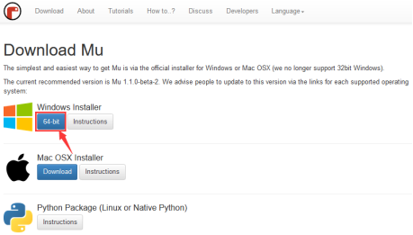
.. |image3| image:: ./media/img-20230327141819.png
.. |image4| image:: ./media/img-20230509135634.png
.. |image5| image:: ./media/img-20230509135714.png
.. |image6| image:: ./media/img-20230509135757.png
.. |image7| image:: ./media/img-20230327141438.png
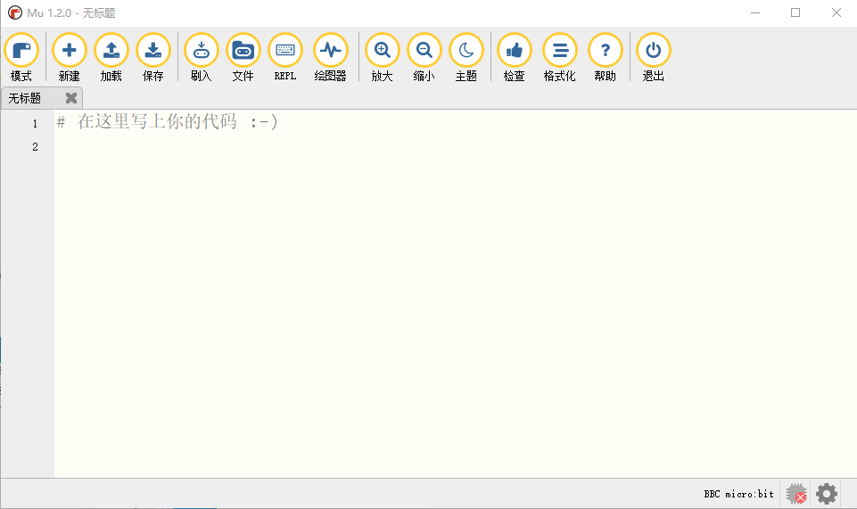
.. |image9| image:: ./media/img-20230324085252.png
.. |image10| image:: ./media/img-20250407095630.png
.. |image11| image:: ./media/img-20230417120359.png
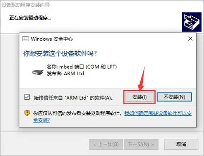
.. |image13| image:: ./media/img-20230324081642.png
.. |image14| image:: ./media/img-20230324082110.png
.. |image15| image:: ./media/img-20230327142416.png

.. |image18| image:: ./media/img-20230427160707.png

.. |image20| image:: ./media/img-20230327143959.png
.. |image21| image:: ./media/img-20230427161059.png

.. |image23| image:: ./media/img-20230427162013.png

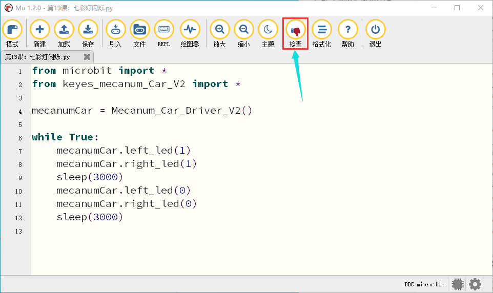

.. |image27| image:: ./media/img-20230427163420.png
.. |image28| image:: ./media/img-20230427163544.png
.. |image29| image:: ./media/img-20230327151608.png

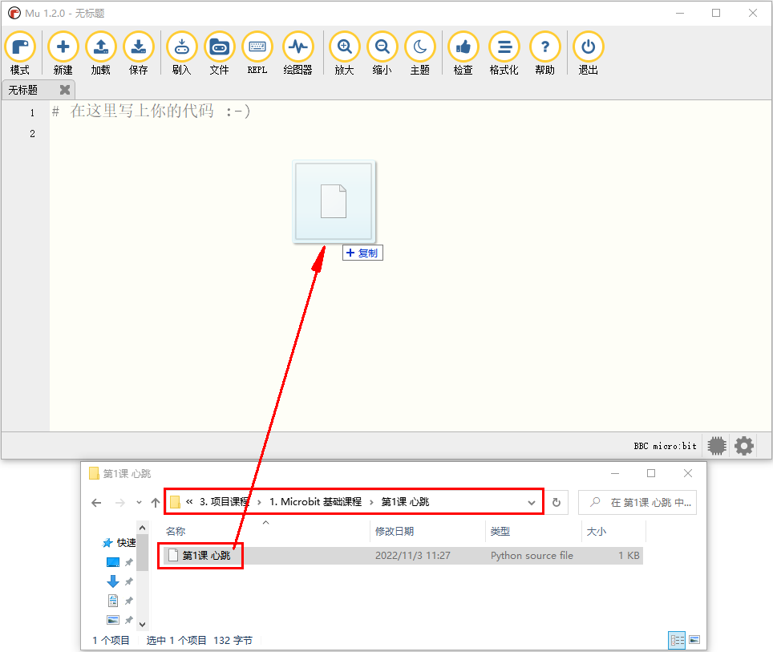

.. |image33| image:: ./media/img-20230327152358.png
.. |image34| image:: ./media/img-20230327152402.png
.. |image35| image:: ./media/img-20230327152507.png
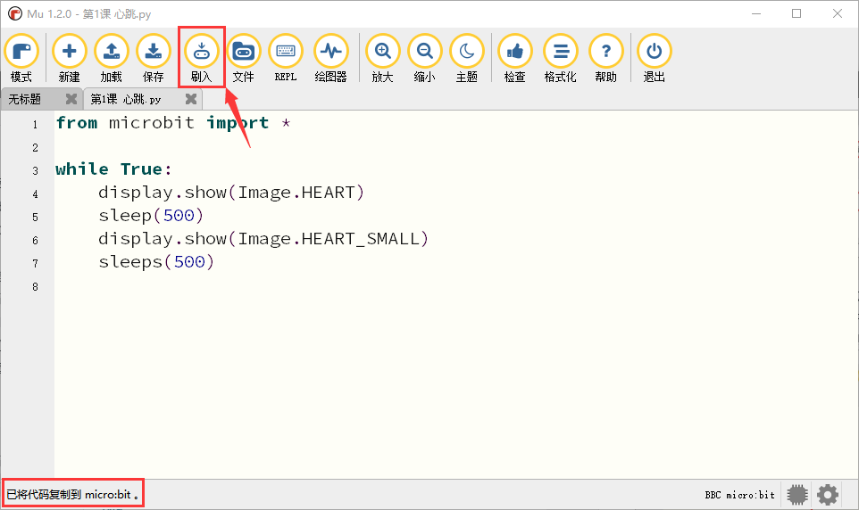
.. |image37| image:: ./media/img-20230327152837.png
.. |image38| image:: ./media/img-20230327153005.png

.. |image40| image:: ./media/img-20230428160048.png
.. |image41| image:: ./media/img-20230428160108.png
.. |image42| image:: ./media/img-20230428160119.png

.. |image45| image:: ./media/img-20230428160221.png
.. |image46| image:: ./media/img-20230428160244.png
.. |image47| image:: ./media/img-20230428160254.png
.. |image48| image:: ./media/img-20230428160325.png
.. |image49| image:: ./media/img-20230523113829.png

.. |image51| image:: ./media/img-20230428163728.png
.. |image52| image:: ./media/img-20230428163800.png
.. |image53| image:: ./media/img-20230428163827.png
.. |image54| image:: ./media/img-20230428163859.png

.. |image56| image:: ./media/img-20230428163926.png

.. |image58| image:: ./media/img-20230428164040.png
.. |image59| image:: ./media/img-20230428164048.png
.. |image60| image:: ./media/img-20230428164114.png
.. |image61| image:: ./media/img-20230428164218.png

.. |image63| image:: ./media/img-20230428164353.png
.. |image64| image:: ./media/img-20230428164440.png
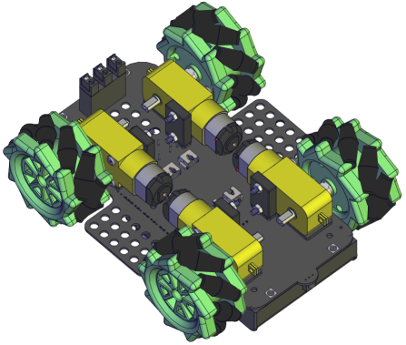
.. |image66| image:: ./media/img-20230428164516.png
.. |image67| image:: ./media/img-20230428164531.png
.. |image68| image:: ./media/img-20230428164546.png

.. |image70| image:: ./media/img-20230428164612.png
.. |image71| image:: ./media/img-20230428164627.png
.. |image72| image:: ./media/img-20230523113903.png
.. |image73| image:: ./media/img-20230504084018.png

.. |image75| image:: ./media/img-20230504083927.png
.. |image76| image:: ./media/img-20230523132234.png
.. |image77| image:: ./media/img-20230504085353.png
.. |image78| image:: ./media/img-20230523133024.png
.. |image79| image:: ./media/img-20230504085601.png

.. |image81| image:: ./media/img-20230504085147.png
.. |image82| image:: ./media/img-20230523134552.png
.. |image83| image:: ./media/img-20230504090137.png
.. |image84| image:: ./media/img-20230504091010.png
.. |image85| image:: ./media/img-20230504091336.png
.. |image86| image:: ./media/img-20230504091422.png
.. |image87| image:: ./media/img-20230327154148.png
.. |image88| image:: ./media/img-20230327155005.png
.. |image89| image:: ./media/img-20230327155035.png
.. |image90| image:: ./media/img-20230327155005.png
.. |image91| image:: ./media/img-20230327155035.png
.. |image92| image:: ./media/img-20230327155005.png
.. |image93| image:: ./media/img-20230327155035.png
.. |image94| image:: ./media/img-20230327154538.png
.. |image95| image:: ./media/img-20230327154544.png
.. |image96| image:: ./media/img-20230327154603.png

.. |image98| image:: ./media/img-20230327155122.png

.. |image100| image:: ./media/img-20230327155838.png

.. |image102| image:: ./media/img-20230327154148.png
.. |image103| image:: ./media/img-20230327160717.png
.. |image104| image:: ./media/img-20230327160721.png
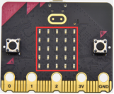
.. |image106| image:: ./media/img-20230327154148.png
.. |image107| image:: ./media/img-20230324145654.png
.. |image108| image:: ./media/img-20230324145940.png
.. |image109| image:: ./media/img-20230324145952.png
.. |image110| image:: ./media/img-20230324145958.png
.. |image111| image:: ./media/img-20230324150004.png
.. |image112| image:: ./media/img-20230324150010.png
.. |image113| image:: ./media/img-20230324150016.png
.. |image114| image:: ./media/img-20230324150336.png
.. |image115| image:: ./media/img-20230324150353.png
.. |image116| image:: ./media/img-20230327154148.png

.. |image118| image:: ./media/img-20230327163306.png
.. |image119| image:: ./media/img-20230324151954.png
.. |image120| image:: ./media/img-20230327154148.png
.. |image121| image:: ./media/img-20230327163813.png

.. |image123| image:: ./media/img-20230324153316.png
.. |image124| image:: ./media/img-20230327164120.png
.. |image125| image:: ./media/img-20230324153506.png
.. |image126| image:: ./media/img-20230327154148.png
.. |image127| image:: ./media/img-20230324154743.png
.. |image128| image:: ./media/img-20230324154807.png
.. |image129| image:: ./media/img-20230324155123.png
.. |image130| image:: ./media/img-20230327165235.png
.. |image131| image:: ./media/img-20230327165338.png
.. |image132| image:: ./media/img-20230324161826.png
.. |image133| image:: ./media/img-20230327154148.png
.. |image134| image:: ./media/img-20230324162218.png
.. |image135| image:: ./media/img-20230324162231.png
.. |image136| image:: ./media/img-20230324162247.png
.. |image137| image:: ./media/img-20230324162345.png
.. |image138| image:: ./media/img-20230324162407.png
.. |image139| image:: ./media/img-20230327170326.png

.. |image141| image:: ./media/img-20230327170549.png
.. |image142| image:: ./media/img-20230324163527.png
.. |image143| image:: ./media/img-20230327154148.png
.. |image144| image:: ./media/img-20230328082148.png
.. |image145| image:: ./media/img-20230324163955.png
.. |image146| image:: ./media/img-20230327154148.png
.. |image147| image:: ./media/img-20230324171739.png
.. |image148| image:: ./media/img-20230327154148.png
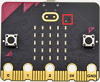
.. |image150| image:: ./media/img-20230324172909.png
.. |image151| image:: ./media/img-20230327154148.png
.. |image152| image:: ./media/img-20230328084104.png

.. |image154| image:: ./media/img-20230328084418.png
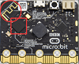
.. |image156| image:: ./media/img-20230426135820.png
.. |image157| image:: ./media/img-20230426143818.png
.. |image158| image:: ./media/img-20230426143829.png

.. |image160| image:: ./media/img-20230427160531.png
.. |image161| image:: ./media/img-20230427160707.png

.. |image163| image:: ./media/img-20230327143959.png
.. |image164| image:: ./media/img-20230427161059.png

.. |image166| image:: ./media/img-20230427162013.png

.. |image170| image:: ./media/img-20230427163420.png
.. |image171| image:: ./media/img-20230427163544.png
.. |image172| image:: ./media/img-20230504104423.png
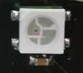
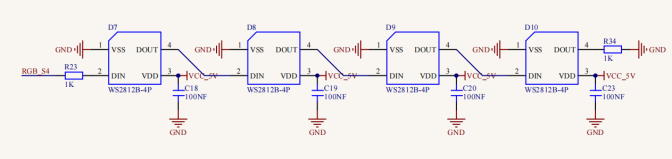
.. |image175| image:: ./media/img-20230504103911.png
.. |image176| image:: ./media/img-20230504103911.png
.. |image177| image:: ./media/img-20230329095649.png
.. |image178| image:: ./media/img-20230324190535.png
.. |image179| image:: ./media/img-20230324190601.png
.. |image180| image:: ./media/img-20230426164441.png
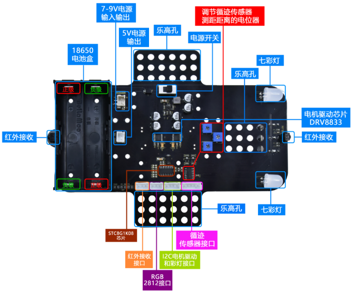
.. |image182| image:: ./media/img-20230426160947.png
.. |image183| image:: ./media/img-20230426160700.png
.. |image184| image:: ./media/img-20230426160709.png
.. |image185| image:: ./media/img-20230426164533.png
.. |image186| image:: ./media/img-20230522172021.png
.. |image187| image:: ./media/img-20230523170452.png

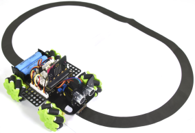
.. |image190| image:: ./media/img-20230523171931.png
.. |image191| image:: ./media/img-20230426171120.png
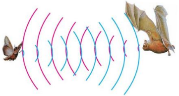
.. |image193| image:: ./media/img-20230426105612.png
.. |image194| image:: ./media/img-20230427084201.png
.. |image195| image:: ./media/img-20230330112930.png
.. |image196| image:: ./media/img-20230330112940.png

.. |image198| image:: ./media/img-20230427085645.png
.. |image199| image:: ./media/img-20230427093155.png
.. |image200| image:: ./media/img-20230427092934.png

