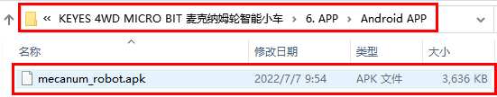
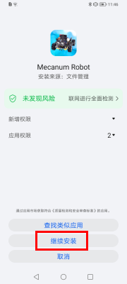
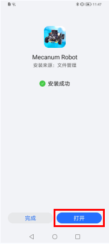
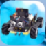
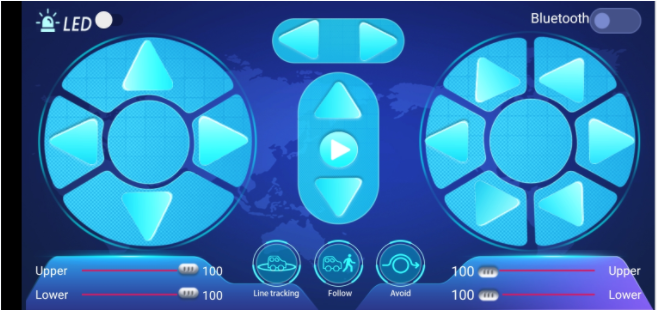
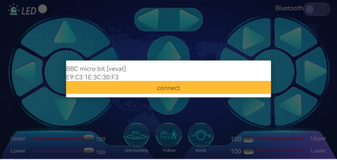
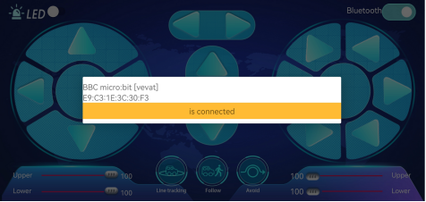

Android 系统APP
===============

**Android系统APP安装步骤：**

1.下载mecanum_robot.apk文件

A. 我们资料包中有提供Android apk安装包，在下图位置：

|Img|

现将文件夹中的keyes arm.apk文件转移到安卓系统手机或平板电脑上。

B.对着二维码扫描识别或者输入网址：\ http://8.210.52.206/mecanum_robot.apk
进行下载，识别成功后就可以进入下载mecanum_robot.apk页面，点击“\ **下载**\ ”下载mecanum_robot应用程序。

|image1|

2.点击“\ **允许**\ ”进入安装界面，点击“\**继续安装”\**就可以安装好mecanum_robot应用程序。

|image2|

|image3|

|image4|

3.点击“\ **打开**\ ”或点击手机桌面上的应用程序mecanum_robot\ |image5|\ 就可以打开APP，界面如下所示：

|image6|

4.先开启手机/平板的蓝牙，再打开App，点击APP界面右上角的\ |image7|\ 按钮（控件）进行蓝牙搜索，在搜索结果中寻找“BCC
micro:bit”对话框，在“BCC
micro:bit”对话框中点击“connect”即可连接蓝牙。当对话框的“connect”变成“is
connected”，说明蓝牙连接成功。

|image8|

|image9|

.. |image1| image:: ./media/img-20230427120307.png
.. |image2| image:: ./media/img-20230427131144.png

.. |image7| image:: ./media/img-20230427132215.png

