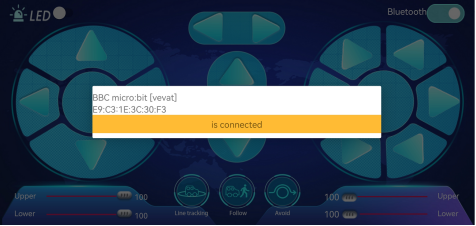

iOS系统APP
==========

**IOS系统APP安装步骤：**

a.打开App Store。

|Img|

b.在搜索框输入“mecanum_robot”，点击搜索，再点击“\ |image1|\ ”，就可以下载mecanum_robot的蓝牙APP。

c.下载安装完APP后，点击“\ **打开**\ ”或点击手机桌面上的应用程序mecanum_robot\ |image2|\ 就可以打开APP，界面如下所示：

|image3|

d.先开启手机/平板的蓝牙，再打开App，点击APP界面右上角的\ |image4|\ 按钮（控件）进行蓝牙搜索，在搜索结果中寻找“BCC
micro:bit”对话框，在“BCC
micro:bit”对话框中点击“connect”即可连接蓝牙。当对话框的“connect”变成“is
connected”，说明蓝牙连接成功。

|image5|

|image6|

.. |Img| image:: ./media/img-20230327112927.png
.. |image1| image:: ./media/img-20230427135000.png
.. |image2| image:: ./media/img-20230427115929.png
.. |image3| image:: ./media/img-20230427115820.png

.. |image5| image:: ./media/img-20230427132531.png

